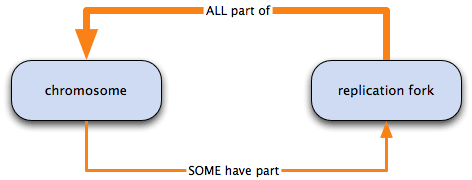
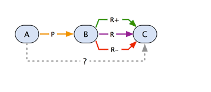

# Ontology Relations

## Overview
The following page documents the relations used in the filtered GO ontology. For information on how relations are represented in OBO format, see the OBO File Format Guide.

## Understanding relations in GO

The ontologies of GO are structured as a graph, with terms as nodes in the graph and the relations (also know as properties) between the terms as edges. Just as each term is defined, so the relations between GO terms are also categorized and defined. This document provides a description of some of the commonly used relationships in GO: is a (is a subtype of); part of; has part; regulates, negatively regulates and positively regulates.
This set is not exhaustive and includes only a subset of relations used in the GO ontologies, logical definitions and annotations. For more technical information about relations and their properties used in GO and other ontologies see the OBO Relations Ontology (RO) and for relationships used in GO annotation extensions, see the GO annotation extension relations file (experimental).

## Conventions used in the documentation

There are a number of ways of referring to and representing logical relations. The GO relations documentation uses the following conventions:
+ in keeping with the graph-based terminology, node is used to refer to GO terms
+ where it is appropriate to talk about a parent-child relationship between nodes, parent refers to the node closer to the root(s) of the graph, and child to that closer to the leaf nodes; the parent would be a broader GO term, and the child would be a more specific term;
+ the arrowhead indicates the direction of the relationship;
+ dotted lines represent an inferred relationship, i.e. one that has not been expressly stated.

This diagram would be interpreted as follows:


+ A is a B
+ B is part of C
+ we can infer that A is part of C

The formal mathematical / logical representation of the inference made in the graph above would be:
```
is a ∘part of → part of
```

## GO Basics
Nodes in the GO graph can have any number and type of relationships to other nodes. Like hierarchies—for example, a family tree or a taxonomy of species—a node may have connections to more than one child (more specific) node, but unlike them, it can also have more than one parent (broader) node, and different relations to its different parents; for example, a node may have a part of relationship to one node, and an is a relationship to another. The following diagram illustrates this point:


+ mitochondrion has two parents: it is an organelle and it is part of the cytoplasm;
+ organelle has two children: mitochondrion is an organelle, and organelle membrane is part of organelle

## The _is_ a relation
The ``is`` a relation forms the basic structure of GO. If we say A is a B, we mean that node A is a subtype of node B. For example, mitotic cell cycle is a cell cycle, or lyase activity is a catalytic activity.
It should be noted that is a does not mean ‘is an instance of’. An ‘instance’, ontologically speaking, is a specific example of something; e.g. a cat is a mammal, but Garfield is an instance of a cat, rather than a subtype of cat. GO, like most ontologies, does not use instances, and the terms in GO represent a class of entities or phenomena, rather than specific manifestations thereof. However, if we know that cat is a mammal, we can say that every instance of cat is a mammal.

## Reasoning over _is_ a
```
is a ∘is a → is a
```

The is a relation is transitive, which means that if A is a B, and B is a C, we can infer that A is a C.


For example:


mitochondrion is an intracellular organelle and intracellular organelle is an organelle therefore mitochondrion is an organelle.

Stated more formally, this would be: ``is a∘ is a → is a``

## The part of relationship
The relation part of is used to represent part-whole relationships in the Gene Ontology. part of has a specific meaning in GO, and a part of relation would only be added between A and B if B is necessarily part of A: wherever B exists, it is as part of A, and the presence of the B implies the presence of A. However, given the occurrence of A, we cannot say for certain that B exists.


i.e. all B are part of A; some A have part B.



For example: Replication fork is necessarily part of chromosome: all replication forks are part of some chromosome, but only some chromosomes have part replication fork.

## Reasoning over part of
```
part of∘ part of → part of
```
Like is a, part of is transitive: if A part of B part of C then A part of C


For example, mitochondrion is part of cytoplasm and cytoplasm is part of cell therefore mitochondrion is part of cell


```
part of∘ is a → part of
```
If a part of relation is followed by an is a relation, it is equivalent to a part of relation; if A is part of B, and B is a C, we can infer that A is part of C.


For example, mitochondrial membrane part of mitochondrion, and mitochondrion is an intracellular organelle therefore mitochondrial membrane is part of intracellular organelle


```
is a ∘part of → part of
```
If the order of the relationships is reversed, the result is the same; if A is a B, and B is part of C, A is part of C.


For example, mitochondrion is a intracellular organelle and intracellular organelle is part of cell therefore mitochondrion is part of cell


The logical rules regarding the part of and is a relations hold no matter how many intervening is a and part of relations there are. In the following diagram, the nodes between mitochondrion and cell are connected by both is a and part of relations; this is equivalent to saying mitochondrion is part of cell.


## The _has part_ relationship
The logical complement to the part of relation is has part, which represents a part-whole relationship from the perspective of the parent. As with part of, the GO relation has part is only used in cases where A always has B as a part, i.e. where A necessarily has part B. If A exists, B will always exist; however, if B exists, we cannot say for certain that A exists. i.e. all A have part B; some B part of A.


For example: Nucleus necessarily has part chromosome: all nuclei contain a chromosome, but only some chromosomes are part of a nucleus.


Note that in the has part relation, the relations go from parent to child, rather than child to parent, as is the case with part of and is a.

## Reasoning over has part
```
has part ∘has part → has part
```
has part is a transitive relation; if A has part B, and B has part C, we can infer that A has part C.


For example: spliceosomal complex has part U4/U6 x U5 tri-snNRP complex and U4/U6 x U5 tri-snNRP complex has part snRNP U5 therefore spliceosomal complex has part snRNP U5


```
has part∘ is a → has part
```
If A has part B, and B is a C, A has part C.


For example: precatalytic spliceosome has part snRNP U5, and snRNP U5 is a small nuclear ribonucleoprotein complex therefore precatalytic spliceosome has part small nuclear ribonucleoprotein complex


```
is a ∘has part → has part
```
If the order of the relationships is reversed, the result is the same; if A is a B, and B has part C, A has part C.


For example: U2-dependent activated spliceosome is a activated spliceosome and activated spliceosome has part snRNP U5 therefore U2-dependent activated spliceosome has part snRNP U5


## The _regulates_ relation
Another common relationship in the Gene Ontology is that where one process directly affects the manifestation of another process or quality, i.e. the former regulates the latter. The target of the regulation may be another process—for example, regulation of a pathway or an enzymatic reaction—or it may be a quality, such as cell size or pH. Analogously to part of, this relation is used specifically to mean necessarily regulates: if both A and B are present, B always regulates A, but A may not always be regulated by B.
i.e. all B regulate A; some A regulated by B.


For example: Whenever a cell cycle checkpoint occurs, it always regulates the cell cycle. However, the cell cycle is not solely regulated by cell cycle checkpoints; there are also other processes that regulate it.


The regulation of a process does not need to be part of the process itself; regulation of transcription describes the processes that modulate the activity of the transcriptional machinery, but those processes are not an integral part of transcription.

The regulates relation has two sub-relations, positively regulates and negatively regulates, to represent these more specific forms of regulation. This means that if A positively regulates X, it is true to say that A regulates X. The following diagram illustrates this relationship:


A positively regulates X, so it also regulates X; B negatively regulates X, so it also regulates X.

The Gene Ontology uses generic "regulation of ..." terms to encompass anything that regulates a process or quality; specific examples of regulation—for example, regulation of skeletal muscle contraction by calcium ion signaling, or activation of innate immune response—have an is a relationship to these generic regulation terms. The following diagram illustrates the relationship between meiotic cell cycle, meiotic recombination checkpoint, which negatively regulates the meiotic cell cycle; the activation of reciprocal meiotic recombination, which positively regulates; and regulation of meiotic cell cycle, representing anything that regulates the meiotic cell cycle.


The two specific terms, meiotic recombination checkpoint and activation of reciprocal meiotic recombination, are linked to meiotic cell cycle through the appropriate form of the regulates relationship. They also have an is a relationship to the generic term regulation of meiotic cell cycle.

Reasoning over regulates
```
is a ∘regulates → regulates
```
If A is a B, and B regulates C, we can infer that A regulates C. This rule is true for positively regulates and negatively regulates.


```
regulates∘ is a → regulates
```
If we switch the relations around, so that A regulates B, and B is a C, we can again infer that A regulates C. This rule also holds true for the positively regulates and negatively regulates relations.


The following diagram uses the negatively regulates relation to demonstrate the inferred relationships:


In the upper pathway in the diagram, negative regulation of M phase is a negative regulation of cell cycle process, which negatively regulates cell cycle processes; therefore negative regulation of M phase negatively regulates cell cycle processes.

The lower pathway demonstrates that the relation is the same, regardless of the ordering of the relations. In this case, negative regulation of M phase negatively regulates M phase, which is a cell cycle process; therefore negative regulation of M phase negatively regulates cell cycle processes.
```
regulates∘ part of → regulates
```
The Gene Ontology uses the rule that if B is part of C, any A that regulates B also regulates C.


The following diagram gives an example of this:


regulation of mitotic spindle organization regulates mitotic spindle organization and mitotic spindle organization is part of the mitotic cell cycle therefore regulation of mitotic spindle organization regulates the mitotic cell cycle

positively regulates part of → regulates and negatively regulates part of → regulates If the relation between A and B is positively or negatively regulates, and B is part of C, we can infer that A regulates C—positively regulates is a sub-relation of the regulates relation, and as previously stated, A regulates B part of C is equivalent to A regulates C—but we cannot be more specific than that.


As an example:


negative regulation of smoothened signaling pathway involved in ventral spinal cord patterning negatively regulates smoothened signaling pathway involved in ventral spinal cord patterning, so it also regulates smoothened signaling pathway involved in ventral spinal cord patterning. regulates followed by part of equals regulates; we can infer that negative regulation of smoothened signaling pathway involved in ventral spinal cord patterning regulates spinal cord dorsal/ventral patterning (in fact, the smoothened signaling pathway must be turned off for spinal cord dorsal/ventral patterning to occur).
```
part of ∘regulates → ???
```
If A is part of B, and B regulates, positively regulates, or negatively regulates C, we cannot make any inferences about the relationship between A and C.



As an example, protein insertion into mitochondrial membrane occurs during (is part of) induction of apoptosis, which regulates apoptosis, but we can make no inferences on the relationship of protein insertion into mitochondrial membrane during induction apoptosis to apoptosis.


```
regulates ∘regulates → ???
```
No inference is possible when a regulates relation is followed by a second regulates relation. This is also true for positively regulates and negatively regulates.


For example, regulation of anti-apoptosis regulates regulation of apoptosis, which, in turn, regulates cell death, but we cannot draw any conclusions from these statements about the relationship between regulation of anti-apoptosis and cell death.


## Relation Reasoning Summary
The following list summarizes the inferred relationship when combining two GO relations. Combinations of relations where no inference is possible have been omitted.
```
is a∘ ...
```

```
part of ∘ ...
```

```
regulates ∘ ...
```

```
positively regulates ∘ ...
```

```
negatively regulates ∘ ...
```

```
has part ∘ ...
```
