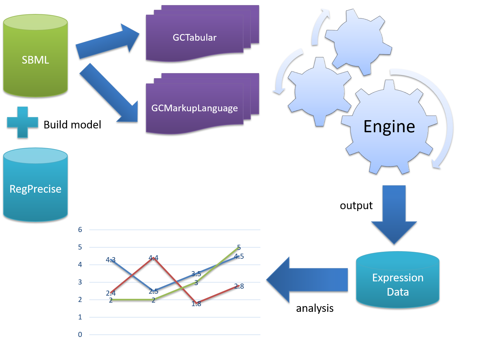

# GCModeller vcell dynamics

The is the GCModeller virtual cell engine, still under the development progress

+ ``GCMarkupLanguage``: Virtual cell model in XML language
+ ``GCTabular``: Virtual cell model in excel table file.

``GCMarkupLanguage`` and ``GCTabular`` just two kinds of file format for GCModeller simulation engine input. They can convert to each other in a very easy way by using GCModeller model utils app.

## vcell Dynamics Model

the GCModeller vcell dynamics is based on the concept of biological reaction channel

## vcell biological model

the biological model of the GCModeller vcell is consists with 3 levels:

### 1. genomics

the biological model in genomics model is consist with one or multiple replicon objects. each replicon object is a model for represents the genome or plasmid DNA. and the genes in a replicon model are group into multiple transcription union unit: operon for co-expression and co-transcription_regulation.

### 2. proteomics
### 3. metabonomics