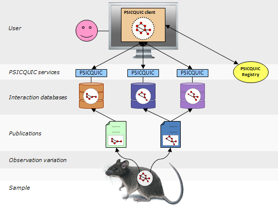

This project hosts the **PSICQUIC Reference Implementation**, an implementation of the [PSICQUIC Specification](https://github.com/maitesin/psicquic/blob/wiki/PsicquicSpecification.md). A publication about PSICQUIC can be found in [Nature Methods](http://www.nature.com/nmeth/journal/v8/n7/full/nmeth.1637.html).

If you find a bug, [report it](https://github.com/maitesin/psicquic/issues). If you need help or have questions, [ask them](http://groups.google.com/group/psicquic).

You can see PSICQUIC in action with the [PSICQUIC View](http://www.ebi.ac.uk/Tools/webservices/psicquic/view/).

#What is PSICQUIC?
PSICQUIC is an effort from the [HUPO Proteomics Standard Initiative](http://www.psidev.info/) (HUPO-PSI) to standardise the access to molecular interaction databases programmatically.

Basically, PSICQUIC specifies:
 + A standard [web service](http://en.wikipedia.org/wiki/Web_service) with a well-defined list of methods, accessible using [SOAP](https://github.com/maitesin/psicquic/blob/wiki/PsicquicSpec_1_3_Soap.md) or [REST](https://github.com/maitesin/psicquic/blob/wiki/PsicquicSpec_1_3_Rest.md).
 + A common query language ([MIQL](https://github.com/maitesin/psicquic/blob/wiki/MiqlDefinition.md)) 

Many interaction databases are already implementing PSICQUIC. You can check the [Registry](http://www.ebi.ac.uk/Tools/webservices/psicquic/registry/registry?action=STATUS) to see the most up to date list of providers and their status.

If you are a user in need of a convenient and standard way to fetch molecular interaction data from different sources, check the following section "Information for Users". If you are a service provider willing to facilitate your data so it can reach more users with very little effort, check the section "Information for Molecular Interaction providers" below.

#Information for Users
PSICQUIC is a web service so it is meant to be use in machine-to-machine communications. However, you can get PSI-MITAB data directly in your browser by using the [REST Access](https://github.com/maitesin/psicquic/blob/wiki/RestAccess.md), like in [this example](http://www.ebi.ac.uk/Tools/webservices/psicquic/intact/webservices/current/search/query/brca2).
 + How to retrieve molecular interactions: using [SOAP](https://github.com/maitesin/psicquic/blob/wiki/PsicquicSpec_1_3_Soap.md) or [REST](https://github.com/maitesin/psicquic/blob/wiki/PsicquicSpec_1_3_Rest.md)
 + [List of PSICQUIC Service Providers](http://www.ebi.ac.uk/Tools/webservices/psicquic/registry/registry?action=STATUS).
 + There are two available JAVA clients for PSICQUIC. If you are a JAVA programmer start using PSICQUIC right away, find the documentations about the clients [here](https://github.com/maitesin/psicquic/blob/wiki/JavaClient.md).
 + A Bioconductor package has also been developped for PSICQUIC. You can find more documentation [here](http://www.bioconductor.org/packages/release/bioc/html/PSICQUIC.html).
 + You can find more examples, including samples in [Java](https://github.com/maitesin/psicquic/blob/wiki/ClientCodeSample.md), [Perl](https://github.com/maitesin/psicquic/blob/wiki/PerlCodeSamples.md) or [Python](https://github.com/maitesin/psicquic/blob/wiki/PythonCodeSamples.md).
 + [The MIQL (Molecular Interaction Query Language) reference](https://github.com/maitesin/psicquic/blob/wiki/MiqlDefinition.md) that can be used to perform more complex queries. 
 + If you want to see a real use case of PSICQUIC, check the [PSICQUIC View application](http://www.ebi.ac.uk/Tools/webservices/psicquic/view/) (then just click on Search). It uses PSICQUIC behind the scenes.
 + You can also find the different PSICQUIC services in [BioCatalogue](http://www.biocatalogue.org/tags/psicquic).
 + You can use PSICQUIC directly from the latest and greatest Cytoscape. Check [this page](https://github.com/maitesin/psicquic/blob/wiki/CytoscapeClient.md) if you want to know how.
 + [Other projects](https://github.com/maitesin/psicquic/blob/wiki/WhoUsesPsicquic.md) are using PSICQUIC too.
 + And, why not, you can have PSICQUIC on the go, with the PSICQUIC client for Android. Search for "psicquic" in the Android Market.
 
#Information for Molecular Interaction providers
Implementing PSICQUIC is relatively simple. If you can generate a PSI-MITAB file (versions 2.5, 2.6 or 2.7), you can start using the Reference Implementation of PSICQUIC right away. For instructions, check these links:
+ [How to install the PSICQUIC Reference Implementation](https://github.com/maitesin/psicquic/blob/wiki/HowToInstallPsicquicSolr.md): step by step guide for molecular interaction providers. 
 
#And More!
Check the [wiki pages](https://github.com/maitesin/psicquic/tree/wiki) for much more detailed information.
 
Or have a quick look to the [slides](http://docs.google.com/present/view?id=ddwp5dfz_40hf2g6shd) of a recent presentation done about the project.
 
#Citing PSICQUIC
To cite PSICQUIC please use:
 
Aranda, B. et al. PSICQUIC and PSISCORE: accessing and scoring molecular interactions. Nat Meth 8, 528-529 (2011).
 
doi:10.1038/nmeth.1637 http://www.nature.com/nmeth/journal/v8/n7/full/nmeth.1637.html