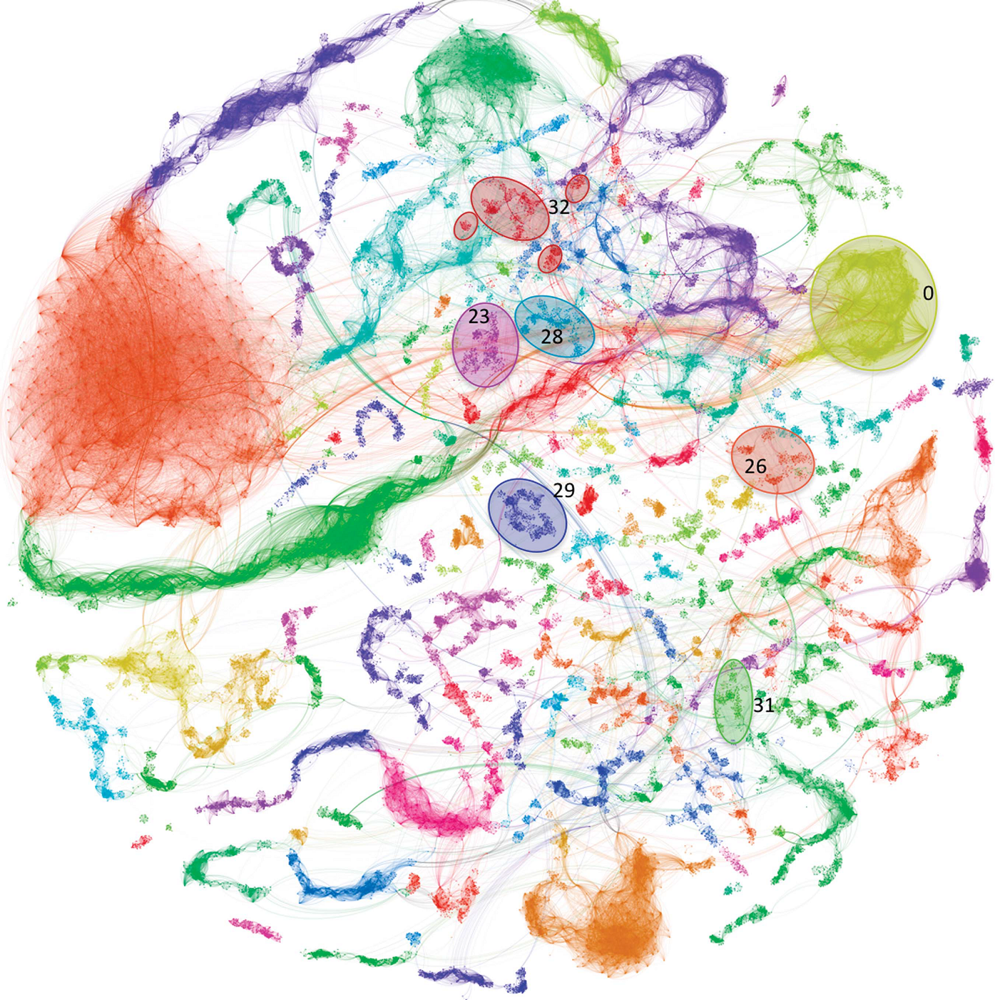

> **Figure 2** Metavirome network. A visualization of the all-verses-all BLAST network. Viral groups are assigned a unique color and were visualized in Gephi. Separation of the viral groups was accomplished using Gephi’s Force Atlas 2 plugin, a force-directed layout algorithm. Ovals highlight viral groups whose members matched against seeded viruses in a parallel network analysis. Despite the large number of seeded viruses (1812), only 26 viruses were assigned to viral groups. All 26 viruses were crenarchaeal viruses. Edge connections are lines connecting members within a viral group and between members of differing viral groups. Care should be taken to not associate distance between viral groups as indicative of sequence similarity. To enhance clarity and distinctions between viral groups, only those containing 50 contigs or more are included in the figure. Viral groups numbering: group 0 = SIRV-1,2; group 23 = ASV-1, SSV-1-2, 4-9; group 26 = ATV; group 28 = AFV-1; group 29 = STIV-1,2; group 31 = AFV2-3, 6-9, SIFV; group 32 = STST-1,2 and ARSV-1, SRV.

### Creates metagenome network using BLAST on 16S/18S sequencing

###### Protocol in Cytoscape CLI tools

```vbnet
<ExportAPI("/BLAST.Metagenome.SSU.Network",
           Info:="> Viral assemblage composition in Yellowstone acidic hot springs assessed by network analysis, DOI: 10.1038/ismej.2015.28",
           Usage:="/BLAST.Metagenome.SSU.Network /net <blastn.self.txt> /tax <ssu-nt.blastnMaps.csv> /x2taxid <x2taxid.dmp/DIR> /taxonomy <ncbi_taxonomy:names,nodes> [/gi2taxid /identities <default:0.3> /coverage <default:0.3> /out <out-net.DIR>]")>
<Group(CLIGrouping.Metagenomics)>
Public Function SSU_MetagenomeNetwork(args As CommandLine) As Integer
    Dim net$ = args("/net")
    Dim tax$ = args("/tax")
    Dim taxonomy$ = args("/taxonomy")
    Dim identities As Double = args.GetValue("/identities", 0.3)
    Dim coverage As Double = args.GetValue("/coverage", 0.3)
    Dim EXPORT$ = args.GetValue("/out", net.TrimSuffix & "-" & tax.BaseName & "-metagenome-network/")
    Dim out As New Value(Of String)
    Dim netdata As v228 = BlastPlus.Parser.ParsingSizeAuto(net)
    Dim taxdata As BlastnMapping() = tax.LoadCsv(Of BlastnMapping)
    Dim gi2taxid As Boolean = args.GetBoolean("/gi2taxid")
    Dim x2taxid As String = args("/x2taxid")
    Dim xid$() = taxdata _
        .Select(Function(x) x.Reference) _
        .ToArray(TaxidMaps.GetParser(gi2taxid))

    Call xid.FlushAllLines(out = EXPORT & "/reference_xid.txt")

    ' subset database
    Dim CLI$

    If gi2taxid Then
        CLI = $"/gi.Match /in {(+out).CLIPath} /gi2taxid {x2taxid.CLIPath} /out {(out = EXPORT & "/gi2taxid.txt").CLIPath}"
    Else
        CLI = $"/accid2taxid.Match /in {(+out).CLIPath} /acc2taxid {x2taxid.CLIPath} /gb_priority /out {(out = EXPORT & "/gi2taxid.txt").CLIPath}"
    End If

    Call New IORedirectFile(Apps.NCBI_tools, CLI).Run()

    ' step1
    Dim notFound As New List(Of String)
    Dim ssuTax As IEnumerable(Of BlastnMapping) = taxdata.TaxonomyMaps(
        x2taxid:=+out,
        is_gi2taxid:=gi2taxid,
        notFound:=notFound,
        taxonomy:=New NcbiTaxonomyTree(taxonomy))

    Call notFound.FlushAllLines(EXPORT & "/taxonomy_notfound.txt")

    ' step2
    Dim matrix As IEnumerable(Of DataSet) =
        netdata.BuildMatrix(identities, coverage)

    ' step3
    Dim network As Network = BuildNetwork(matrix, ssuTax)

    Return network.Save(EXPORT, Encodings.ASCII).CLICode
End Function
```
