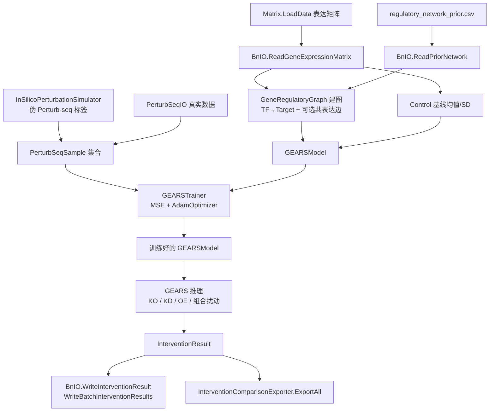

## 产品概述

在 `GEARS.vbproj` 项目中实现一套基于图神经网络（GNN）的基因表达调控网络虚拟扰动算法模块，严格遵循 `GEARS\readme.md` 的五步流程（建图 → 节点特征与扰动编码 → 多层边类型感知消息传递 → Δ表达解码 → 训练与推理），并复用 BNLearn 既有的虚拟扰动类型/参数/结果三件套与先验网络。最终在 `GEARS\test` 测试项目中用 `demo\TestData1` 数据跑通完整 demo，输出虚拟扰动实验结果 CSV。

## 核心功能

- 基因调控图构建：由 `PriorNetwork`（TF→Target，含 activation/repression 类型与置信度）构建 GNN 有向图，并支持按 control 表达相关性追加共表达边（GEARS 双通道设计之一）。
- 节点特征与扰动编码：control 均值 + 可学习基因身份嵌入 + 扰动 multi-hot 标记 + 扰动基因集合 Deep Sets 池化向量（GEARS 双通道设计之二）；扰动基因自身表达按 `InterventionMode` 改写。
- 边类型感知多层消息传递：抑制边传递反向信号，L 层对应 L-hop 间接效应，默认 2 层以避免过平滑。
- 解码与预测：解码器输出 Δ表达，最终表达 = control 均值 + Δ。
- 训练：内置仿真器基于先验网络生成伪 Perturb-seq 标签训练 GNN，同时保留加载真实 Perturb-seq CSV 的接口；MSE 损失 + Adam 优化。
- 推理：单基因敲除（Knockout）/下调（Knockdown）/过表达（Overexpression）/自定义，以及多基因组合扰动，输出 `InterventionResult`。
- 结果导出：每个扰动一份明细 CSV + 批量汇总 CSV（复用 `BnIO`），以及比较矩阵、基因敏感性、扰动相似性、通路汇总等全量导出（复用 `InterventionComparisonExporter`）。

## 技术栈选型

- 语言/框架：VB.NET，.NET 10.0，SDK 风格项目（与 `GEARS.vbproj` 现有配置一致）
- 图神经网络：复用 `Microsoft.VisualBasic.DeepLearning.GNN`（GNN.vbproj）——`Layer` 基类、`Graph`/`Edge`、`GlobalPoolingLayer`（Deep Sets 池化）、`ActivationType`/`Apply`/`Derivative`、`Loss.MeanSquaredError(Gradient)`、`Optimizer`/`AdamOptimizer`
- 张量运算：复用 `Microsoft.VisualBasic.MachineLearning.TensorFlow.Tensor`
- 生物数据模型：复用 `SMRUCC.genomics.Analysis.BNLearn`（`PriorNetwork`/`RegulatoryEdge`/`Effector`/`GeneExpressionData`/`BnIO`/`InterventionSpec`/`InterventionMode`/`InterventionResult`/`InterventionComparisonExporter`）与 `SMRUCC.genomics.Analysis.HTS.DataFrame.Matrix`
- 注意：`GEARS.vbproj` 开启 `GenerateDocumentationFile`，所有 Public 成员必须带 XML 注释

## 实现方案

### 总体策略

自建一个继承 `GNNModel` 的 `GEARSModel`，按 readme 五步编排：稀疏边类型感知卷积层（自建）+ 基因嵌入层（自建）+ Deep Sets 池化层（复用 `GlobalPoolingLayer`）+ 解码器，前向/反向全链路可微，用 `AdamOptimizer` 做参数更新。

### 关键技术决策与取舍

1. **不用 `GATLayer`**：其 `Backward` 直接抛异常，无法训练。改为自建 `GEARSConvLayer` 实现 readme §5.4 的「边类型感知消息传递」——对 activation/inhibition/coexpression 分别维护专属变换矩阵，抑制边乘负号，兼顾异质图语义与可训练性。
2. **不用 `LinearLayer`**：实测其 `_weights` 形状为 `[inFeatures, outFeatures]`（源自 `XavierInit(fanIn, fanOut)`），而 Forward 用 `input.MatMul(_weights.Transpose())`、Backward 用 `gradient.MatMul(_weights)`，二者均要求 `inFeatures == outFeatures`，否则抛「矩阵维度不匹配」。因此自建 `DenseLayer`（权重 `[in,out]`，Forward `X @ W + b`），不修改共享运行时代码，避免影响 GCNModel 等既有调用方。
3. **稀疏聚合优先（性能关键）**：`GCNConvLayer` 用稠密 `A_norm(350×350) @ H(350×d)`，单次前向约 4×10⁶~8×10⁶ 次乘法；40 样本 × 30 epoch 的前向+反向将达 10¹⁰ 量级，不可接受。`GEARSConvLayer` 改用 `Graph.GetInNeighbors(i)` 稀疏入边聚合（先验网络仅约 353 条边、平均入度≈1），复杂度 O(|E|·d + N·d·d)，单次前向约 10⁶ 量级，整体训练约 30 秒内完成。同时提供 `useDense` 开关，稠密模式委托 `GCNConvLayer` 作对照（需满足 in==out）。
4. **训练数据**：内置 `InSilicoPerturbationSimulator`，沿先验网络做带衰减的多跳 BFS 传播生成伪 Perturb-seq 标签（直接效应由 `InterventionSpec.GetInterventionValue` 给出；间接效应按 hop 衰减、按入度归一化、按边类型取符号；组合扰动叠加共享下游的饱和/协同项以产生非加性效应）。同时提供 `PerturbSeqIO` 加载真实 Perturb-seq CSV 覆盖仿真标签。
5. **特征归一化**：control 均值做 Z-score 标准化后再入网，Δ 标签同尺度，避免 Adam 早期震荡；输出时反标准化回原始表达尺度。
6. **默认超参**（全部可配置）：`embeddingDim=16`、`hiddenDim=32`、`numLayers=2`、`epochs=30`、训练样本约 40（24 单基因 + 16 组合）、`learningRate=0.01`、`dropout=0`、`coexpressionTopK=0`（默认关闭共表达边，可选开启）。

### 复杂度与瓶颈

- 单样本前向 ≈ O(L·(|E|·d + N·d²))，反向同阶；N=368、|E|≈353、d=32 时约 10⁶ 量级
- 归一化邻接矩阵（`GetNormalizedAdjacencyMatrix`）仅在稠密开关下使用，且需缓存避免每步重算
- 训练总预算 ≈ 40 样本 × 30 epoch ≈ 1200 次前反向，目标 60 秒内

## 实现要点（执行细节）

- **基因索引一致性**：全模块统一以表达矩阵 `rownames` 顺序建立 `geneName → index` 映射（`OrdinalIgnoreCase`），`PriorNetwork` 中两端基因都不在矩阵里的边直接丢弃，保证 `InterventionResult.GeneNames` 与矩阵行序一致。
- **CSV 边类型解析**：`regulatory_network_prior.csv` 中 `RegulationType` 是字符串 `activation`/`repression`，而 `RegulatoryEdge.RegulationType` 是 `Effector` 枚举；在 GEARS 内自行按行解析并显式映射为 `Effector.Activator`/`Effector.Inhibitor`（不依赖 `LoadCsv` 的隐式枚举转换），再交给 `BnIO.ReadPriorNetwork`。
- **扰动基因自身表达改写**（readme §4.2 关键设计）：先把 `InterventionSpec.GetInterventionValue(mean, sd)` 的结果写入节点特征的表达通道，再走消息传递；组合扰动对每个基因各自计算。
- **Deep Sets 顺序不变性**：`GeneEmbeddingLayer.Forward(p)` 输出 `p_i · E_i`（[N,d]），接 `GlobalPoolingLayer(PoolingType.Mean)` 得 `z_pert`（[1,d]），再广播为 [N,d] 拼接到每个节点特征。
- **反向链路完整性**：解码梯度 → 各卷积层 `Backward` → 拆分 h0 梯度 → z_pert 部分反广播求和 → `GlobalPoolingLayer.Backward` → `GeneEmbeddingLayer.Backward` 累积嵌入梯度。嵌入层必须作为 `Layer` 子类登记进 `GNNModel._layers`，才能被基类 `GetParameters()/GetGradients()` 收集并交给 Adam。
- **优化器使用顺序**：每个样本 `Forward` → `Loss.MeanSquaredErrorGradient` → `Backward` → `optimizer.Step()` → `optimizer.ZeroGrad()`；梯度张量对象需与传给优化器的列表是同一批实例（不可在 Backward 内重新 new，只能原地累加）。
- **显著性判据**：沿用 BNLearn 风格，`|Δ| > 0.1`（表达已标准化时）或 `|Δ| > 0.5 * geneSD`，作为配置项；同时填充 `ZScores = Δ / WildtypeSDs`。
- **数值稳定**：Δ 解码后做 `Tanh` 软夹紧或按 ±3·SD 截断，防止仿真/训练初期输出爆量；`PercentChanges` 分母加 1e-9 保护。
- **日志**：demo 中每 N 个 epoch 打印一次 loss，避免逐样本刷屏；关键阶段（图规模、样本数、耗时）打印摘要。
- **兼容性**：保留 `GEARS` 类对 `InsilicoPerturbationExperiment` 的实现签名不变（`Optional nSamples As Integer = 0`），未找到目标基因时返回 `Undefined=True` 的降级结果（对齐 BNLearn 的 `CreateUndefinedResult` 行为）。

## 架构设计



模块分层：

- **Graph 层**：`GeneRegulatoryGraph` 负责基因索引、边构建、边类型与权重，产出 GNN `Graph`
- **Layers 层**：`GeneEmbeddingLayer`（身份嵌入 + 扰动掩码）、`GEARSConvLayer`（边类型感知稀疏消息传递）、`DenseLayer`（全连接，含解码器）
- **Model 层**：`GEARSModel` 组装 readme Step2-4，实现 `Forward/Backward`
- **Training 层**：`PerturbSeqSample`、`InSilicoPerturbationSimulator`、`GEARSTrainer`
- **Facade 层**：`GEARS` 类实现 `InsilicoPerturbationExperiment`，串联建图 → 训练 → 推理

## 目录结构

```
sub-system/GEARS/
├── GEARS.vbproj                        # [MODIFY] 无需改引用（已含 GNN/TensorFlow/HTS_matrix/BNLearn）
├── GEARSConfig.vb                      # [NEW] 超参与开关配置类：embeddingDim、hiddenDim、numLayers、epochs、
│                                       #        learningRate、nSinglePerturbation、nComboPerturbation、
│                                       #        propagationDecay、useDense、coexpressionTopK、significanceThreshold。
│                                       #        提供默认取值与参数校验（层数建议 2-4、维度为正）。
├── GEARS.vb                            # [MODIFY] 主入口类，实现 InsilicoPerturbationExperiment。
│                                       #         构造：New(exprData As GeneExpressionData, prior As PriorNetwork, Optional config As GEARSConfig)。
│                                       #         职责：BuildGraph() 建图；Train() 合成/装载训练样本并训练；
│                                       #         Predict(spec) / PredictCombination(specs) 推理；
│                                       #         KnockoutGene/KnockDownGene/OverexpressGene 实现接口（nSamples 控制重采样次数）；
│                                       #         SetTrainingSamples() 注入真实 Perturb-seq 数据；
│                                       #         组装 InterventionResult（WildtypeMeans/SDs、MutantMeans、FoldChanges、
│                                       #         PercentChanges、ZScores、IsSignificant、GeneNames）。
├── Graph/
│   ├── EdgeRelationType.vb             # [NEW] 边关系类型枚举：Activation / Repression / CoExpression / SelfLoop，
│   │                                   #       并定义各自的消息符号（+1 / -1 / +1 / +1）。
│   └── GeneRegulatoryGraph.vb          # [NEW] 由 PriorNetwork + 基因名列表构建 GNN Graph：
│                                       #       建 name→index 映射；按 TF→Target 加有向边（weight=Confidence，类型取
│                                       #       Effector.Activator/Inhibitor）；可选按 control 表达 Pearson 相关 Top-K
│                                       #       加无向共表达边；按入边分组预缓存稀疏邻接（源索引数组 + 类型数组 + 权重数组）
│                                       #       供 GEARSConvLayer 聚合；暴露 GeneNames / NumGenes / Graph / EdgeSigns。
├── Layers/
│   ├── DenseLayer.vb                   # [NEW] 继承 Layer 的正确维度全连接层：权重 [in,out]、偏置 [1,out]；
│   │                                   #       Forward = X @ W + b；Backward 计算 dW = Xᵀ @ G、db = ΣG、dX = G @ Wᵀ；
│   │                                   #       GetParameters/GetGradients 返回同一批张量实例（供 Adam 原地更新）。
│   │                                   #       规避 GNN.LinearLayer 在 in≠out 时的维度不匹配缺陷。
│   ├── GeneEmbeddingLayer.vb           # [NEW] 基因身份嵌入层：持有可学习嵌入 E [N,d]（XavierInit）与梯度 [N,d]；
│   │                                   #       Forward(pertFlag) 返回 p_i·E_i（[N,d]）；Forward 另提供全量嵌入输出 [N,d]；
│   │                                   #       Backward(grad) 累积 _embGrad；参数进 _layers 供基类收集。
│   └── GEARSConvLayer.vb               # [NEW] 边类型感知稀疏消息传递层（readme §5.4）：
│   │                                   #       按边类型索引选择专属变换 Wr，抑制边乘 -1；
│   │                                   #       H' = σ( H @ W_self + Σ_{j∈N_in(i)} sign(r_ji)·w_ji·(H_j @ W_r) )；
│   │                                   #       缓存 _lastInput/_transformed 供 Backward；完整实现 Backward 回传 dX、dW；
│   │                                   #       useDense=True 时委托 GCNConvLayer（稠密对照路径）。
├── Model/
│   └── GEARSModel.vb                   # [NEW] 继承 GNNModel，编排 readme Step2-4：
│                                       #       BuildNodeFeatures(controlExpr, pertFlag) → h0 = [x̄ ‖ E ‖ p ‖ z_pert]；
│                                       #       Forward(nodeFeatures, graph) 依次过 L 层 GEARSConvLayer，最后过解码器
│                                       #       DenseLayer(hidden→1) 输出 Δ [N,1]；
│                                       #       Backward(gradient, graph) 反序回传并把 z_pert 梯度经
│                                       #       GlobalPoolingLayer.Backward 传回 GeneEmbeddingLayer；
│                                       #       复用基类 GetParameters/GetGradients 汇总所有层参数。
├── Training/
│   ├── PerturbSeqSample.vb             # [NEW] 训练样本：PerturbedGeneIndices()、PerturbedGeneNames()、
│   │                                   #       ControlExpression([N])、PerturbedExpression([N])、Label 描述。
│   ├── InSilicoPerturbationSimulator.vb# [NEW] 伪 Perturb-seq 标签仿真器：由 InterventionSpec 计算直接效应；
│   │                                   #       沿先验网络做带衰减 BFS 多跳传播（Δj += decay^hop · Σ sign·conf·Δi / |reg(j)|）；
│   │                                   #       组合扰动叠加共享下游饱和项产生非加性效应；支持随机种子固定以保证可复现。
│   └── GEARSTrainer.vb                 # [NEW] 训练循环：Forward → Loss.MeanSquaredErrorGradient → Backward →
│                                       #       AdamOptimizer.Step → ZeroGrad；记录 LossCurve；支持 epochs、
│                                       #       printEvery、可选 L2 正则与训练/验证划分。
├── IO/
│   └── PerturbSeqIO.vb                 # [NEW] 真实 Perturb-seq 数据加载：宽表 CSV（行=基因、列=扰动样本、
│   │                                   #       列名为扰动基因组合，用 + 分隔）→ IEnumerable(Of PerturbSeqSample)；
│   │                                   #       同时提供 ControlProfile（两列 gene,expression）读取。
└── test/
    ├── test.vbproj                     # [MODIFY] 补 ProjectReference：..\..\BNLearn\BNLearn.vbproj、
    │                                   #       ..\..\..\..\runtime\sciBASIC#\Data\DataFrame\dataframework-netcore5.vbproj
    │                                   #       （LoadCsv/LoadJsonFile 扩展）、..\..\..\core\Bio.Assembly\biocore-netcore5.vbproj
    │                                   #       （MetabolicPathway，用于通路级导出）。
    ├── GEARSDemo.vb                    # [NEW] demo 主体：①Matrix.LoadData 读表达矩阵 → BnIO.ReadGeneExpressionMatrix；
    │                                   #       ②解析 regulatory_network_prior.csv → BnIO.ReadPriorNetwork；
    │                                   #       ③构建 GEARS 并 Train；④单基因 codY/terR/luxR 的 KO/KD/OE
    │                                   #       + 组合扰动（如 codY+luxR）；⑤打印 Top 变化基因与耗时。
    └── Program.vb                      # [MODIFY] Main 入口调用 GEARSDemo.Run()，并接管异常输出到控制台。
```

结果导出（在 `GEARSDemo.vb` 内完成，输出到 `App.HOME & "/output/"`）：

- `BnIO.WriteInterventionResult` → 每个扰动一份 `gears_{gene}_{mode}.csv`
- `BnIO.WriteBatchInterventionResults` → `gears_batch_summary.csv`
- `New InterventionComparisonExporter(全部结果).ExportAll(outputDir, pathways)` → `foldchange_matrix.csv`、`percentchange_matrix.csv`、`significance_matrix.csv`、`zscore_matrix.csv`、`wildtype_means_matrix.csv`、`mutant_means_matrix.csv`、`comprehensive_comparison.csv`、`condition_similarity.csv`、`gene_sensitivity.csv`、`intervention_ranking.csv`、`pathway_summary.csv`、`cross_impact_matrix.csv`