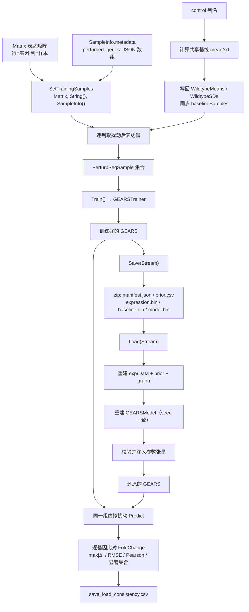

## 产品概述

在已跑通 GNN 虚拟扰动主流程的 `GEARS.vb` 基础上，补齐三个尚未实现的成员：①直接从表达矩阵 `Matrix` 对象 + `SampleInfo` 元数据设置 Perturb-seq 训练样本；②把训练好的 GEARS 实例全量持久化到 zip 包；③从 zip 包还原 GEARS 实例。随后在 `GEARSDemo.vb` 中验证矩阵版训练样本接口，并量化对比「直接训练好的对象」与「zip 加载出来的对象」在相同虚拟扰动实验下的结果差异，以差异不显著来证明 Save/Load 实现正确。

## 核心功能

- **矩阵版训练样本导入**：传入表达矩阵、control 样本名列表、perturbed 样本信息对象数组。control 列合并计算共享野生型基线的 mean/sd 并写回；每个 perturbed 样本从 `SampleInfo.metadata` 的 `perturbed_genes` 键读取 JSON 字符串数组得到被扰动基因集合，从矩阵对应列取扰动后表达谱，组装为 `PerturbSeqSample`。
- **全量持久化**：把配置、先验网络、完整表达矩阵、图结构（可重建）、模型参数、基线统计、损失曲线全部写入一个 zip 包；加载后对象可继续训练、可重新估计基线、推理结果与保存前一致。
- **一致性验证**：demo 中对同一组虚拟扰动，分别用原对象与 zip 加载对象预测，逐基因比对 FoldChange，输出最大绝对差、RMSE、相关系数、显著集合一致性，并导出对比 CSV。

## 技术栈选型

- 语言与框架：VB.NET，.NET 10.0，SDK 风格项目（沿用 `GEARS.vbproj` 现有配置）
- zip 打包：`System.IO.Compression.ZipArchive` / `ZipArchiveEntry`（BCL 内置，无需新增包引用；比仓库内 `Microsoft.VisualBasic.ApplicationServices.Zip.ZipStream` 虚拟文件系统依赖更少、行为更可预测）
- 表达矩阵二进制读写：复用 `SMRUCC.genomics.Analysis.HTS.DataFrame.BinaryMatrix`（`Save(mat, stream)` / `LoadStream(stream)`，网络字节序，含 magic 头校验）
- 元数据载体：复用 `SMRUCC.genomics.GCModeller.Workbench.ExperimentDesigner.SampleInfo`（`ID` + `metadata As Dictionary(Of String, String)`）
- 序列化：JSON 复用 sciBASIC 既有 `GetJson` / `LoadJSON`；数值块用 `BinaryWriter` / `BinaryReader`
- 约束：`GEARS.vbproj` 开启 `GenerateDocumentationFile=True`，所有 Public 成员必须有 XML 注释，且 `<returns>` 不可用于 `Const`

## 实现方案

### 总体策略

新增 `IO\GEARSStorage.vb` 封装 zip 条目的读写细节，`GEARS.vb` 只负责编排。zip 内分五个条目：`manifest.json`（元信息与配置）、`prior.csv`（先验网络，文本可读）、`expression.bin`（表达矩阵，复用 `BinaryMatrix`）、`baseline.bin`（基线均值/标准差）、`model.bin`（全部可训练参数张量）。图结构不单独落盘——`GeneRegulatoryGraph` 在给定「基因名列表 + 先验网络 + 表达矩阵 + 共表达配置」时构建结果完全确定，加载时按同样入参重建即可，既省空间又不会出现图与数据不同步的问题。

### 关键技术决策与取舍

1. **`SetTrainingSamples` 采用共享基线语义**：control 列合并求 mean/sd 作为共享野生型基线并写回 `WildtypeMeans` / `WildtypeSDs`（这是用户明确选定的语义）。因此必须把这两个属性从 `ReadOnly` 改为可写；`baselineSamples` 字段也需去掉 `ReadOnly`（VB 中 `ReadOnly` 字段只能在构造函数赋值）。
2. **扰动基因集合优先取元数据，列名解析作为回退**：`SampleInfo.metadata(metadata_perturbed_genes)` 存的是 JSON 字符串数组（如 `["codY","luxR"]`）。当元数据缺失时，回退到从 `SampleInfo.ID` 解析（复用 `PerturbSeqIO` 现有的 `codY` / `codY+luxR` / `codY_Knockout` 列命名规则），为此需把 `PerturbSeqIO.ParseMode` 从 `Private` 提升为 `Public`。两级回退都用不了时跳过该样本并累计警告。
3. **输入侧表达谱的构造口径与既有代码保持一致**：`ControlExpression` = 野生型均值副本，被扰动基因位置替换为该列观测到的实际值；标签侧 `PerturbedExpression` = 该列。这与 `PerturbSeqIO.LoadPerturbSeq` 的既有约定一致，保证 Δ = 扰动后 − 输入，训练目标不变。
4. **模型参数按索引严格对齐恢复**：`GEARSModel` 的层注册顺序固定（嵌入层 → 池化层（无参数）→ N 个卷积层 → 解码器），给定超参后 `GetParameters()` 的张量个数与形状完全确定。恢复前逐个校验个数与 shape，全部匹配才逐元素写入，任一不匹配立即抛 `InvalidDataException` 并指明条目与期望/实际值——避免静默错位导致「看起来能跑但结果全错」。
5. **`BinaryMatrix.Save` / `LoadStream` 内部会 dispose 传入的流**，这与 zip entry 的写入语义正好吻合（entry stream 必须关闭才会落盘），但意味着一个 entry 只能写一次，实现时不得在同一 entry 上追加写。
6. **`Save` 使用 `leaveOpen:=True`**，不接管调用方传入的 `Stream` 生命周期。
7. **`randf` 是全局单例 RNG**，`Load` 时构造新实例会调用 `randf.SetSeed(config.Seed)` 重置全局状态。但 `Predict` 路径完全确定、不使用 RNG，因此不影响一致性对比；实现时无需也不应试图序列化 RNG 状态。

### 复杂度与瓶颈

- `SetTrainingSamples`：O(G×C + P×G)，G=基因数、C=control 列数、P=扰动样本数。实测规模（367 基因、3 control 列、约 8 个扰动样本）约 4×10³ 次运算，可忽略。
- `Save`：表达矩阵 367×180 = 66,060 个 double（约 527 KB 原始字节），模型参数约 10,200 个 double（约 82 KB）；Deflate 压缩后整个 zip 预期远小于 1 MB，耗时 < 1 秒。瓶颈在矩阵二进制编码与压缩，均为一次性顺序写。
- `Load`：同阶读盘 + 解压 + 建图 O(G+E) + 模型初始化 O(参数量)，预期 < 1 秒。
- demo 中矩阵版训练样本只做接口验证（可选 5 个 epoch 试跑），不重复完整 50 轮训练，总时长增加 < 10 秒。

## 实现要点（执行细节）

- **基因行映射要做名字查找而非按下标**：传入矩阵的 rownames 顺序可能与 GEARS 的 `GeneNames` 不一致，必须先建 `基因名 → 矩阵行索引` 映射（OrdinalIgnoreCase），再按 `GeneNames` 顺序重排取值。GEARS 中缺失的基因要抛友好异常并列出前若干个缺失基因名；矩阵中多余的基因行直接忽略。
- **control 至少两列**：只有一列时 sd 恒为 0，会导致后续归一化除零。入口处校验 `control.Length >= 2`，否则抛 `ArgumentException`。
- **`baselineSamples` 的同步**：若 control 列名同时存在于主表达矩阵的 `sampleID`，则把 `baselineSamples` 更新为这些列在主矩阵中的索引，保证后续 `RecomputeBaseline` 与 `PredictWithBaseline` 口径一致；若不存在则保持不变并通过 `Console.WriteLine` 提示。
- **干扰模式元数据键**：新增 `Public Const metadata_intervention_mode As String = "intervention_mode"`，取值优先于列名后缀解析，缺省 `Knockout`。
- **zip 版本号**：manifest 中写入 `formatVersion`（当前 `1`），`Load` 时校验，版本不符直接抛异常，便于将来格式演进。
- **日志**：demo 中打印矩阵版样本解析结果（样本数、每个样本的扰动基因与模式、跳过的样本数及原因），以及 Save/Load 的文件大小与耗时，便于人工核对。
- **兼容性**：不改动用户已重构的接口（构造函数无 `autoTrain`、`Train()` 无参、两套 `SetTrainingSamples` 均返回 `Me`）；不修改 GNN、TensorFlow、BNLearn 等共享运行时代码。
- **向后兼容**：`GEARSStorage` 为新增模块，`PriorNetworkIO` 与 `PerturbSeqIO` 只做「新增重载」和「提升可见性」，不改既有签名。

## 架构设计



分层关系：`GEARS.vb`（门面，负责编排与校验）→ `IO\GEARSStorage.vb`（zip 与二进制编解码细节）→ 复用 `BinaryMatrix` / `PriorNetworkIO` / `PerturbSeqIO` / `GEARSModel` / `GEARSTrainer`。

## 目录结构

```
sub-system/GEARS/
├── GEARS.vb                        # [MODIFY] 门面类，三处实现 + 两处可见性放开
│                                   #   1) WildtypeMeans / WildtypeSDs：ReadOnly Property → 可写 Property
│                                   #   2) baselineSamples 字段：去掉 ReadOnly，允许 SetTrainingSamples / Load 覆盖
│                                   #   3) 新增 Public Const metadata_intervention_mode As String = "intervention_mode"
│                                   #   4) 实现 SetTrainingSamples(samples As Matrix, control As String(),
│                                   #        perturbed As SampleInfo()) As GEARS：
│                                   #        - 校验入参非空、control 至少 2 列
│                                   #        - 建「基因名 → 矩阵行索引」映射，缺失基因抛友好异常
│                                   #        - control 列合并算 mean/sd 写回，并同步 baselineSamples
│                                   #        - 遍历 perturbed：ID 取列 → metadata[metadata_perturbed_genes] 解析 JSON 基因数组
│                                   #          （缺失回退列名解析）→ metadata[metadata_intervention_mode] 或列名后缀定模式
│                                   #          → 组装 PerturbSeqSample（输入侧被扰动基因替换为观测值）
│                                   #        - 全部样本解析失败时抛异常，部分失败则累计警告计数
│                                   #   5) 实现 Public Sub Save(file As Stream)：ZipArchiveMode.Create + leaveOpen:=True，
│                                   #        依次写 manifest.json / prior.csv / expression.bin / baseline.bin / model.bin
│                                   #   6) 实现 Public Shared Function Load(file As Stream) As GEARS：
│                                   #        读 manifest 校验版本 → 读 prior → 读 matrix → New GEARS(...) 重建图与模型
│                                   #        → 覆盖基线/损失曲线/baselineSamples → 校验并注入模型参数 → 返回实例
├── IO/
│   ├── GEARSStorage.vb             # [NEW] zip 持久化编解码模块（Friend 为主，避免污染公开 API）：
│   │                               #   - 条目名常量：manifest.json / prior.csv / expression.bin / baseline.bin / model.bin
│   │                               #   - FormatVersion 常量与 Manifest 数据结构
│   │                               #   - WriteManifest / ReadManifest（JSON）
│   │                               #   - WritePrior / ReadPrior（CSV 文本，列 TF,TargetGene,RegulationType,Confidence,Evidence）
│   │                               #   - WriteExpression / ReadExpression（委托 BinaryMatrix.Save / LoadStream）
│   │                               #   - WriteVector / ReadVector（Double() 二进制，用于基线均值与标准差）
│   │                               #   - WriteTensors / ReadTensors（张量个数 + 逐个 rank/shape/data，读时做形状校验）
│   │                               #   - EnsureEntry(zip, name) 辅助：创建条目并打开流，保证每个条目只写一次
│   ├── PriorNetworkIO.vb           # [MODIFY] 新增 Public Function ParseRegulatoryEdges(lines As String()) 重载，
│   │                               #        让 Load 可以直接从 zip 内读出的文本行解析先验网络，无需落临时文件
│   └── PerturbSeqIO.vb             # [MODIFY] Private Function ParseMode → Public Function ParseMode，
│                                   #        供 SetTrainingSamples 在元数据缺失时按列名回退解析扰动基因与干预模式
└── test/
    └── GEARSDemo.vb                # [MODIFY] 新增两个步骤：
                                    #   [2.5] 矩阵版训练样本接口测试：用 InSilicoPerturbationSimulator 现场合成
                                    #        Perturb-seq 风格矩阵（列：WT_Rep1..3 + codY_Knockout / codY+luxR_Knockout /
                                    #        spo0A_Overexpression 等），配套构造 SampleInfo（metadata 内写
                                    #        perturbed_genes 的 JSON 数组），调用 SetTrainingSamples(Matrix, ...)，
                                    #        打印解析结果并可选跑 5 个 epoch 验证可直接喂给 Trainer
                                    #   [4.5] Save/Load 一致性对比：把主 gears 存为 gears_model.zip，再 Load 回来，
                                    #        对同一组扰动分别 Predict，统计样本对数、max|Δ|、RMSE、Pearson 相关系数、
                                    #        显著基因集合差集大小，判定并打印结论，导出 save_load_consistency.csv
```

## 关键代码结构

```
' GEARS\IO\GEARSStorage.vb —— zip 条目读写契约（GEARS.vb 只依赖这一层）
Friend Module GEARSStorage

    Friend Const FormatVersion As Integer = 1
    Friend Const EntryManifest As String = "manifest.json"
    Friend Const EntryPrior As String = "prior.csv"
    Friend Const EntryExpression As String = "expression.bin"
    Friend Const EntryBaseline As String = "baseline.bin"
    Friend Const EntryModel As String = "model.bin"

    ' 条目读写（每个条目只能写一次：BinaryMatrix.Save / BinaryWriter 会关闭 entry 流）
    Friend Sub WriteManifest(zip As ZipArchive, config As GEARSConfig, model As GEARSModel,
                             lossCurve As Double(), baselineSamples As Integer(), nGene As Integer)
    Friend Sub ReadManifest(zip As ZipArchive, ByRef config As GEARSConfig,
                            ByRef lossCurve As Double(), ByRef baselineSamples As Integer(),
                            ByRef dims As (embed As Integer, hidden As Integer, layers As Integer))
    Friend Sub WritePrior(zip As ZipArchive, prior As PriorNetwork)
    Friend Function ReadPrior(zip As ZipArchive) As PriorNetwork
    Friend Sub WriteExpression(zip As ZipArchive, expr As Matrix)
    Friend Function ReadExpression(zip As ZipArchive) As Matrix
    Friend Sub WriteVector(zip As ZipArchive, entry As String, x As Double())
    Friend Function ReadVector(zip As ZipArchive, entry As String) As Double()
    Friend Sub WriteTensors(zip As ZipArchive, params As List(Of Tensor))
    Friend Sub ReadTensors(zip As ZipArchive, params As List(Of Tensor))  ' 形状不匹配时抛 InvalidDataException
End Module
```

```
' GEARS\GEARS.vb —— 三个待实现成员的对外形态（签名以文件现状为准，不得改动）
Public Const metadata_perturbed_genes As String = "perturbed_genes"
Public Const metadata_intervention_mode As String = "intervention_mode"

Public Function SetTrainingSamples(samples As Matrix,
                                   control As String(),
                                   perturbed As SampleInfo()) As GEARS

Public Sub Save(file As Stream)

Public Shared Function Load(file As Stream) As GEARS
```