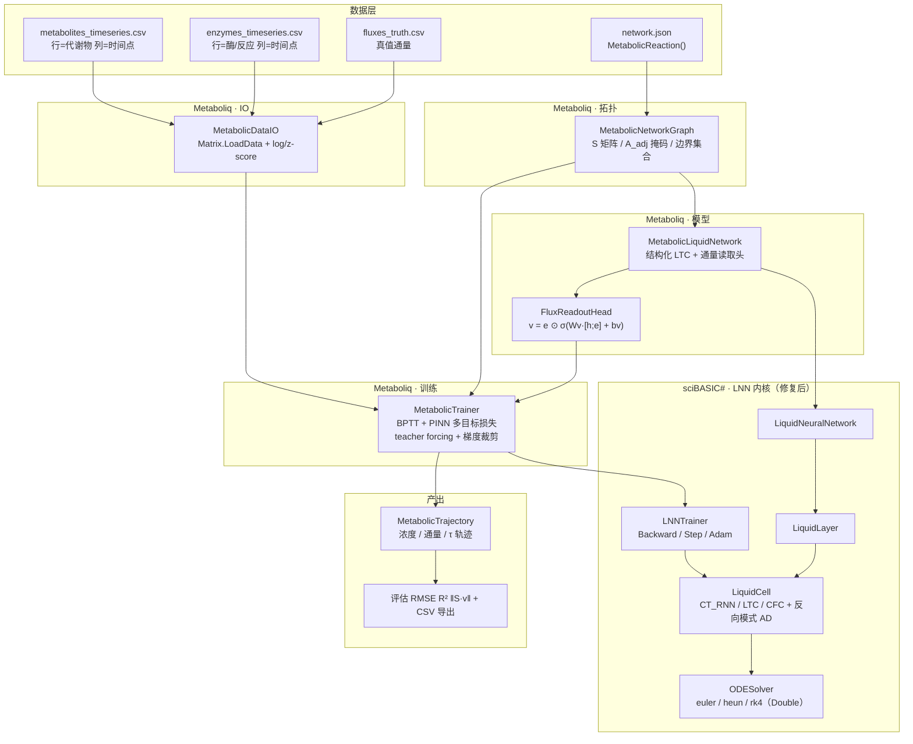

## 产品概述

在 `Metaboliq` 项目（VB.NET / net10.0）中新增一个"基于液态神经网络（LNN/LTC/CfC）的代谢网络动力学模拟"算法模块。该模块以 `Metaboliq\readme.md` 描述的算法原理为依据，复用已有的 LNN 液态神经网络、Tensor 张量计算、`MetabolicReaction` 代谢反应模型与 `Matrix` 分子表达矩阵四类基础模块，构建"结构化 LTC + 独立通量读取头 + PINN 风格约束损失"的代谢网络代理模型，并用自生成的 TCA 循环 + 糖酵解 + 有氧呼吸链 + 无氧呼吸链整合网络的模拟数据做端到端验证。

## 核心功能

1. **LNN 库深度修复与增强**（`sciBASIC#\MachineLearning\LNN`）

- 让 `LiquidCell` 具备真正的"液态"时间常数：τ 依赖隐藏状态与外部输入（τ^sys = τ/(1+τ·f)），并新增 CfC 闭式解前向（无需 ODE 数值积分）
- 实现真实的时间反向传播（BPTT / 伴随式反向模式 AD），使 τ、输入权重、循环权重、偏置均可被梯度更新
- 修复 Adam 优化器状态键冲突、伪造梯度、层归一化空引用、状态历史被逐步清空、Single 精度损失等缺陷

2. **代谢网络结构化建模**（Metaboliq 新增）

- 从 `MetabolicReaction()` 自动构建化学计量矩阵 S（代谢物×反应）、代谢物邻接掩码 A_adj、反应-代谢物参与掩码、边界代谢物集合
- 用邻接掩码约束 LTC 的循环权重与输入权重，使学习到的动力学符合生化拓扑

3. **结构化 LTC 代谢动力学模型**

- 隐藏状态 = 代谢物浓度向量；外部输入 = 酶/基因表达量 + 边界底物浓度
- 反应通量由独立读取头输出：v = e ⊙ σ(Wv·[h;e] + bv)
- 支持不规则时间采样、初始状态设定、酶敲除/扰动（把对应酶输入置 0）

4. **PINN 风格多目标训练**

- 损失 = 浓度拟合项 + λ1·质量守恒项 ‖S·v̂‖² + λ2·热力学方向性项 + λ3·通量监督项
- Adam + 学习率预热 + 梯度裁剪 + teacher forcing 概率调度

5. **模拟与产出**

- 输出代谢物浓度轨迹、逐反应通量分布、液态时间常数 τ 轨迹（可解释性）
- 稳态/扰动响应外推（如敲除呼吸链反应后观察有氧→无氧代谢重编程）
- RMSE/MAE/R² 与稳态违反度评估，结果导出 CSV

6. **Demo 数据与使用示例**

- 自动生成 TCA + 糖酵解 + 有氧呼吸链（ETC/氧化磷酸化）+ 无氧呼吸（乳酸/乙醇发酵）整合网络的 `network.json` 与时序 CSV（代谢物浓度、酶表达量、真值通量）落盘 `Metaboliq\test\data\`
- 在 `Metaboliq\test\Program.vb` 中编写分阶段、带中文注释的全链路演示：加载数据 → 建图 → 归一化 → 建模 → 训练 → 模拟 → 敲除外推 → 评估导出

## 技术栈

- 语言/框架：VB.NET，`net10.0`（本机 SDK 10.0.400 已验证）
- 现有依赖（全部复用，不引入新第三方包）：
- `Microsoft.VisualBasic.DeepLearning.LNN`（`sciBASIC#\Data_science\MachineLearning\LNN\LNN.vbproj`）— LiquidCell / LiquidLayer / LiquidNeuralNetwork / LNNTrainer / ODESolver / ActivationFunctions
- `Microsoft.VisualBasic.MachineLearning.TensorFlow.Tensor`（`TensorFlow.vbproj`）— 张量计算
- `SMRUCC.genomics.MetabolicModel.MetabolicReaction`（`Bio.Assembly`）— 代谢反应模型
- `SMRUCC.genomics.Analysis.HTS.DataFrame.Matrix`（`analysis\HTS_matrix`，已列入 `Metaboliq.slnx`）— CSV 表达矩阵载入
- `Microsoft.VisualBasic.Serialization.JSON`（Core）— 网络 JSON 存取
- 构建/运行：`dotnet build Metaboliq.slnx`、`dotnet run --project Metaboliq\test`

## 实现方案

### 一、总体策略

采用"**先修复通用 LNN 内核，再在其上叠加代谢领域结构**"的两层策略：

1. LNN 层作为纯粹、可复用的连续时间递归内核，负责 LTC/CfC 前向与精确反向模式 AD（领域无关）；
2. Metaboliq 层只负责"生化结构化"——拓扑掩码、通量读取头、化学计量守恒损失、数据 IO 与评估。

这样避免把代谢领域逻辑污染进 LNN，也避免 Metaboliq 里重复实现 ODE/AD 基础设施，符合 SoC 与 DRY。

### 二、LNN 内核：统一动力学语义

把 `LiquidCell` 的动力学统一为（三种模式共用一套参数化）：

```
A  = σ(W·h + U·u + b)            ' 目标状态（读 readme 中的 A）
f  = σ(Wf·h + Uf·u + bf)         ' 门控（液态调制项）
τsys = τ / (1 + τ·f)             ' 液态时间常数
dh/dt = (A - h) / τsys  =  (1/τ + f) ⊙ (A - h)
```

- **CT_RNN 模式**（默认，向后兼容）：`f ≡ 0` → `dh/dt = (A - h)/τ`。旧代码语义为 `-h/τ + σ(z)`，等价于 `A_old = τ·σ(z)`，因此只要在构造时把 `A` 的头按 τ 缩放即可完全复现旧行为，保证已有调用方不回归。
- **LTC 模式**：`f` 生效，τ 随 (h, u) 自适应——这正是 readme 强调的"快反应/慢重编程共存"的数学根基。用 `ODESolver` 的 euler/heun/rk4 积分。
- **CFC 模式**：闭式解 `h(t+dt) = A + (h - A) ⊙ exp(-(1/τ + f)·dt)`，单步前向、无 ODE 求解器，推理开销比 RK4 低一个数量级（RK4 需 4 次 f 求值，CfC 只需 1 次）。

**关键取舍**：CfC 的闭式解假设 (1/τ+f) 与 A 在步长内恒定（以步首的 h、u 求值），对 stiff 代谢系统在较大 dt 下精度低于 RK4。因此默认演示用 LTC+RK4 保证动力学可解释性，另提供 CfC 做速度对比——与 readme 第 4 节建议一致。

### 三、LNN 内核：反向模式 AD（核心修复）

现有 `LNNTrainer.UpdateLiquidLayerGradients` 是**硬编码的伪梯度**（仅最后一个 cell 的 W_rec/bias 乘 0.1），导致 τ 与输入权重梯度恒为 0，Adam 下永不更新——这是"训练不收敛"的根本原因。改为精确 BPTT：

**前向记录**：每步只存 `{x0, u, dt, solver, s1..s4}`（RK4 的四个求值点；Euler/CfC 只存 x0；Heun 存 x0 与预测点 p）。**不存** z/a/f/τ_eff，反向时按需重算——内存从 O(4×参数级中间量) 降到 O(5 个向量/步)。

**反向重算 + 伴随传播**：定义公共子过程 `BackwardThroughF(s, u, adj_out) → adj_s`（内部重算 z/a/f/τ_eff，累加 dW/dU/db/dWf/dUf/dbf/dτ，返回 dL/ds），各求解器只需按各自的图结构连线：

```
RK4:  adj_x0 = adj_x1
      adj_k1 = (dt/6)·adj_x1 ; adj_k2 = (dt/3)·adj_x1
      adj_k3 = (dt/3)·adj_x1 ; adj_k4 = (dt/6)·adj_x1
      i=4: adj_s4 = adj_k4 → BackwardThroughF → adj_x0 += ; adj_k3 += dt·adj_s4
      i=3: adj_s3 = adj_k3 → BackwardThroughF → adj_x0 += ; adj_k2 += (dt/2)·adj_s3
      i=2: adj_s2 = adj_k2 → BackwardThroughF → adj_x0 += ; adj_k1 += (dt/2)·adj_s2
      i=1: adj_s1 = adj_k1 → BackwardThroughF → adj_x0 += adj_s1
Euler: adj_k1 = dt·adj_x1 ; adj_s1 = adj_k1 → BackwardThroughF → adj_x0 = adj_x1 + adj_s1
Heun : 预测点 p = x0 + dt·k1；先过 p 的 f（adj_p = (dt/2)adj_x1 → adj_x0 += ; adj_k1 += dt·adj_p），再过 x0 的 f
CfC  : h1 = A + (h0-A)⊙e, e = exp(-(1/τ+f)·dt)
      adj_h0 = adj_h1⊙e ; adj_A = adj_h1⊙(1-e) ; adj_e = adj_h1⊙(h0-A)
      adj_(1/τ+f) = adj_e⊙(-dt·e) → 分解到 f 与 τ
```

**τ 参数化链式法则**（`GetEffectiveTau` 已有两种）：

- bounded sigmoid：`dτ_eff/dτ_param = σ·(1-σ)·(TauMax - TauMin)`
- softplus：`dτ_eff/dτ_param = σ(τ_param)`

复杂度：单步反向 = 4 次 f 重算 + O(m²+m·n) 的梯度累加，与前向同阶，无额外渐近开销。

**其他缺陷修复**：

- Adam 状态键冲突：`UpdateParamAdam` 用裸键 `"tau"`，多层时所有 cell 共用动量 → 改为 `layer{i}_tau` 等唯一键，与 `GetParameters()` 的键体系对齐。
- 层归一化空引用：`UseLayerNorm` 只能在构造后设置但参数在构造时初始化 → 改为惰性初始化 + `EnableLayerNorm()` 显式开关。
- 状态历史：`LiquidNeuralNetwork.Forward` 每步 `StateHistory.Clear()` 导致 `ProcessSequence` 只剩最后一步 → 历史清空只保留在 `ResetState()` 与序列起点。
- 精度：`ODESolver` 用 `CSng(dt)` 且 `Tensor * Single` 运算符把状态压成单精度 → 统一走 Double（Tensor 侧补 `Operator *(t, scalar As Double)`，或 ODESolver 内部用 `Apply` 逐元素缩放），避免长序列累积误差。

### 四、Metaboliq 层：结构化 LTC + 通量读取头

**状态映射**（已与用户确认）：

- 隐藏状态 `h ∈ R^m` = 代谢物浓度（log + z-score 归一化后的值，m = 代谢物数）
- 外部输入 `u ∈ R^(r+n)`= 各反应的酶/基因表达量（r = 反应数）+ 边界底物（Glc_ext、O2、CO2 等）浓度
- 循环权重 `W (m×m)` 用代谢物邻接掩码 `A_adj` 掩码：`W[i,j]=0` 当代谢物 i 与 j 未被任何反应关联
- 输入权重 `U (m×(r+n))` 用参与掩码掩码：代谢物 i 只接收其参与反应的酶输入
- **通量读取头**（Tensors 自持参数，独立于 LNN）：`v = e ⊙ σ(Wv·[h;e] + bv)`，`v ∈ R^r`
- 浓度读出：`ĉ = W_out·h + b_out`（即 LNN 自带输出层）

**掩码维护**：`ApplyStructuralMasks()` 在每次优化器 step 之后调用，同时置零被掩码的权重元素与对应梯度槽位，保证结构约束在训练全程成立（否则梯度会把权重"推回"非零）。

**扰动/敲除**：`KnockOut(reactionId)` 通过把该反应的酶输入通道恒置 0 实现；`SetBoundary(id, value)` 修改边界底物浓度。二者都不修改模型参数，因此可在同一训练好的模型上做多次外推。

### 五、训练：PINN 风格多目标损失与 BPTT

```
L = ‖ĉ(t_k) - c(t_k)‖²                        ' 数据拟合（仅在观测点 k 上计算，天然支持不规则采样）
  + λ1·‖S·v̂‖²                                ' 质量守恒/稳态软约束
  + λ2·Σ_j max(0, -v_j)²                       ' 热力学方向性（不可逆反应通量非负）
  + λ3·‖v̂ - v_MFA‖²                           ' 通量监督（有真值通量时启用）
```

- 训练循环：整段序列前向并缓存每一步的 StepRecord → 在观测时间点累加损失 → 反向逐步回传 adjoint → 梯度裁剪 → Adam 更新 LNN 参数（复用 `LNNTrainer.Step()`）+ 自持 Adam 更新通量头参数 → `ApplyStructuralMasks()`
- teacher forcing：早期以概率 p 用真实浓度 `c(t_k)` 覆盖 `h`，后期线性衰减到 0（自由运行），提升长程稳定性
- 梯度裁剪：全局 L2 范数裁剪（现有 `LNNTrainer` 已有 `GradientClipValue`，改为对全部参数张量统一计算范数后再裁剪）

### 六、性能要点

- 每次 `Forward`/`Backward` 中的矩阵乘法走 `Tensor.MatMul`（O(n³) 朴素实现）。本 demo 规模 m≈30、r≈40、T≈60、epoch≈200，单步代价 ~10⁴ 浮点运算，全程 <10⁷，秒级完成，**不需要**优化 MatMul。
- 避免热路径上的重复分配：StepRecord 预分配为定长数组；`GetEffectiveTau()` 在 RK4 的 4 次求值中被重复调用（每次都做 `Apply` 分配新张量），改为在 `ComputeDerivative` 内一次算好并复用。
- `Tensor.Apply` 的 `Func(Of Single, Single)` 与 `Func(Of Double, Double)` 重载并存，**lambda 一律显式声明 `As Double`**，避免误走单精度重载。
- `Tensor * Tensor` 运算符是**矩阵乘**、不是逐元素乘；逐元素乘必须用 `ElementwiseMultiply`——这是本项目最容易踩的坑。

## 实现注意事项（执行细节）

- **向后兼容优先**：`LiquidCell` 默认 `LiquidMode.CT_RNN`，行为与现状一致；新增参数（Wf/Uf/bf）仅在该模式需要时才初始化，避免无谓的参数量与内存增长。
- **梯度清零语义**：`LNNTrainer` 拆成 `Backward(adjHidden)`（仅累积梯度，Public）与 `Step()`（优化器更新 + 清零）。Metaboliq 训练器需要先回传通量头对 h 的 adjoint、再回传浓度读出头的 adjoint，**两者相加后**才能调用 `Backward`，最后统一 `Step()`——顺序不能颠倒。
- **NaN/爆炸防护**：τ_eff 有下界（TauMin=0.1），但 `1/τ + f` 在 CfC 的 `exp(-(...)·dt)` 中可能溢出；指数参数需 clamp（如 `Math.Max(-50, ...)`）。
- **归一化**：代谢物浓度跨数量级，按 readme 建议先 `log1p` 再 z-score；酶表达量用 MinMax 到 [0,1]（因为通量头里 `v = e ⊙ σ(·)` 直接以 e 作为上限缩放）。评估指标在**反归一化后**计算，才具有物理意义。
- **blast radius**：LNN 位于工作区之外（`src\runtime\sciBASIC#`），改动面仅限 `LiquidCell / LiquidLayer / LiquidNeuralNetwork / LNNTrainer / ODESolver` 五个文件，且全部保持现有公开 API 签名（纯新增 + 缺陷修复），不触碰 `Tensor`、`MetabolicReaction`、`Matrix`。
- **构建验证顺序**：先单独 `dotnet build LNN.vbproj` 确认内核编译通过，再 `dotnet build Metaboliq.slnx`，最后 `dotnet run --project Metaboliq\test`。

## 架构设计



数据流：`network.json → MetabolicNetworkGraph → (S, A_adj)` 用于掩码与守恒损失；`CSV → Matrix.LoadData → 归一化 Tensor 序列` 作为监督信号与驱动输入；训练时前向产出 (ĉ, v̂)，四路损失合并后经 BPTT 同时更新 LNN 参数与通量头参数；推理时可自由设定初始状态、酶输入与边界条件做轨迹外推与敲除模拟。

## 目录结构

```
g:\GCModeller\src\runtime\sciBASIC#\Data_science\MachineLearning\LNN\
├── LiquidCell.vb           # [MODIFY] 核心。新增 LiquidMode 枚举(CT_RNN/LTC/CFC)与门控参数 Wf/Uf/bf；
│                           #          统一动力学 dh/dt=(1/τ+f)⊙(A-h)，CfC 走闭式解；
│                           #          新增 StepRecord 前向记录(仅存 s1..s4/x0/u/dt)与 BackwardThroughF 反向重算；
│                           #          新增 Backward(adjHidden) 累加 τ/U/W/b/Wf/Uf/bf 梯度并返回 adj_x0；
│                           #          修复 GetEffectiveTau 在 RK4 内被重复调用、_last* 死代码、τ 链式法则
├── ODESolver.vb            # [MODIFY] 步长与状态缩放改为 Double 精度(替换 CSng(dt) 与 Single 运算符)；
│                           #          AdaptiveRK45Step 的递归拒绝分支加最大重试上限防止栈溢出
├── LiquidLayer.vb          # [MODIFY] 层归一化参数惰性初始化 + EnableLayerNorm()；Forward 透传 solver/mode；
│                           #         新增 Backward(adjOut) 按 layer 逆序回传并拼接各 cell 梯度
├── LiquidNeuralNetwork.vb  # [MODIFY] 新增 Public Backward(adjHidden)、Step-就绪的梯度聚合；
│                           #         修复 Forward 每步清空 StateHistory(改为 ResetState/序列起点清空)；
│                           #         新增 ForwardSequence(times) 支持不规则 dt(每步传入真实 Δt)
└── LNNTrainer.vb           # [MODIFY] 删除伪造的 UpdateLiquidLayerGradients；Backward 改为调用真实 AD；
                            #          Adam 状态键改为 per-cell 唯一键(layer{i}_tau 等)；
                            #          拆分为 Public Backward(adjHidden) / Public Step()；全局 L2 梯度裁剪

g:\GCModeller\src\GCModeller\sub-system\Metaboliq\
├── Metaboliq.vbproj        # [MODIFY] 新增 ProjectReference 指向 ..\..\analysis\HTS_matrix\HTS_matrix-netcore5.vbproj
├── MetabolicNetworkGraph.vb   # [NEW] 由 MetabolicReaction() 构建：代谢物/反应索引、化学计量矩阵 S(m×r, Tensor)、
│                              #       代谢物邻接掩码 A_adj(m×m)、反应-代谢物参与掩码 P(m×r)、边界代谢物集合；
│                              #       LoadJson/SaveJson；SteadyStateResidual(v) = S·v；GetReactionIndex/IsBoundary
├── MetabolicLiquidNetwork.vb  # [NEW] 结构化 LTC 主体。包装 LiquidNeuralNetwork(hidden=m, input=r+n)；
│                              #       BuildMasks/ApplyStructuralMasks 用 A_adj、P 掩码 W 与 U(权重与梯度同步置零)；
│                              #       通量读取头 v = e ⊙ σ(Wv·[h;e] + bv)(自持 Tensor 参数, XavierInit)；
│                              #       Simulate(h0, enzymeSeries, times) → MetabolicTrajectory(含 τ 轨迹读出)；
│                              #       KnockOut(reactionId)/SetEnzyme/SetBoundary 做扰动外推；GetParameters/GetGradients
├── MetabolicTrainer.vb        # [NEW] BPTT 训练器。四路损失(数据/守恒/热力学/通量)与 λ1..λ3 权重；
│                              #       缓存整段 StepRecord 后逆序回传；teacher forcing 概率线性衰减；
│                              #       全局梯度裁剪；复用 LNNTrainer.Step() 更新 LNN 参数，自持 Adam 更新通量头；
│                              #       Fit(...) 返回逐轮 loss 分解明细用于控制台打印
├── MetabolicDataIO.vb         # [NEW] LoadTimeSeries(csv) 通过 Matrix.LoadData 读取(行=分子,列=时间点),
│                              #       解析列名时间为 Double；log1p + z-score 归一化与反归一化；
│                              #       LoadEnzymeSeries / LoadFluxTruth；SaveTrajectoryCsv
└── MetabolicTrajectory.vb     # [NEW] 轨迹容器: times()、concentrations(T×m Tensor)、fluxes(T×r)、tau(T×m)；
                               #       RMSE/MAE/R² 评估与 SteadyStateViolation=‖S·v‖；ToCsv 导出

g:\GCModeller\src\GCModeller\sub-system\Metaboliq\test\
├── test.vbproj             # [MODIFY] 新增 HTS_matrix 项目引用；确保 data\** 不被 Compile 排除(CSV/JSON 以 None+CopyToOutputDirectory 处理)
├── DemoData.vb             # [NEW] Demo 数据生成器。以 mass-action / Michaelis-Menten 真值动力学 + RK4 积分，
│                           #       生成 TCA 循环 + 糖酵解 + 有氧呼吸链(ETC/氧化磷酸化) + 无氧呼吸(乳酸/乙醇发酵)
│                           #       整合网络(约 30 个代谢物、35 个反应),输出:
│                           #         data\network.json            (MetabolicReaction() 序列化)
│                           #         data\metabolites_timeseries.csv (行=代谢物,列=时间点)
│                           #         data\enzymes_timeseries.csv    (行=酶/反应 id,列=时间点)
│                           #         data\fluxes_truth.csv          (真值通量,用于 λ3 监督与验证)
│                           #       Generate(force As Boolean) 幂等:文件已存在则跳过
├── Program.vb              # [MODIFY] 分阶段全链路演示(逐段中文注释 + 控制台输出):
│                           #       1 生成/加载 demo 数据  2 构建 MetabolicNetworkGraph 并打印规模
│                           #       3 Matrix.LoadData 载入时序 + 归一化  4 构建模型(LTC 与 CfC 对比)
│                           #       5 训练(打印 loss 四项分解)  6 模拟输出浓度/通量/τ 轨迹
│                           #       7 敲除呼吸链反应做有氧→无氧代谢重编程外推  8 评估 RMSE/R²/‖S·v‖ 并导出 CSV
└── data\                   # [NEW] 落盘的 demo 数据(network.json + 3 个 CSV),纳入仓库
```

## 关键代码结构

```
' LNN\LiquidCell.vb —— 模式与反向 AD 契约（接口级定义，不含实现体）
Public Enum LiquidMode
    CT_RNN = 0   ' 向后兼容：f ≡ 0，dh/dt = (A - h)/τ
    LTC    = 1   ' 液态时间常数：dh/dt = (1/τ + f) ⊙ (A - h)，τ^sys = τ/(1 + τ·f)
    CFC    = 2   ' 闭式解：h(t+dt) = A + (h - A) ⊙ exp(-(1/τ + f)·dt)
End Enum

' 前向每一步的记录（RK4 用满 4 个点，Euler/CfC 只用 s1，Heun 用 s1、s2）
Public Structure StepRecord
    Public x0 As Tensor      ' 步首状态
    Public u As Tensor       ' 步内恒定输入
    Public dt As Double      ' 真实时间步长（支持不规则采样）
    Public s1, s2, s3, s4 As Tensor   ' f 的求值点
    Public solver As String
End Structure

Partial Public Class LiquidCell
    ' 前向：按 Mode 选择闭式解或 ODE 积分；Training=True 时登记 StepRecord
    Public Function Forward(input As Tensor, dt As Double,
                            Optional solverType As String = "rk4") As Tensor

    ' 反向：按 StepRecord 逆序回放，累加本 cell 的全部参数梯度，返回 dL/dx0
    Public Function Backward(adjOut As Tensor) As Tensor

    ' 内部公共子过程：在求值点 s 重算 z/a/f/τ_eff，累加梯度并返回 dL/ds
    Private Function BackwardThroughF(s As Tensor, u As Tensor, adjOut As Tensor) As Tensor
End Class
```

```
' Metaboliq\MetabolicLiquidNetwork.vb —— 结构化 LTC 代谢模型契约
Public Class MetabolicLiquidNetwork
    Public ReadOnly Property Graph As MetabolicNetworkGraph
    Public ReadOnly Property Liquid As LiquidNeuralNetwork   ' 复用 LNN 内核

    ' 由拓扑构造掩码并初始化（hiddenSize = m，inputSize = r + n_boundary）
    Public Sub New(graph As MetabolicNetworkGraph,
                   Optional mode As LiquidMode = LiquidMode.LTC,
                   Optional solver As String = "rk4",
                   Optional seed As Integer? = Nothing)

    ' 通量读取头：v = e ⊙ σ(Wv·[h;e] + bv)
    Public Function ComputeFlux(h As Tensor, e As Tensor) As Tensor

    ' 自由运行模拟（可指定不规则时间网格）
    Public Function Simulate(h0 As Tensor, enzymeSeries As Tensor,
                             times As Double()) As MetabolicTrajectory

    ' 扰动：酶敲除 / 边界底物设定（不改参数，可重复外推）
    Public Function KnockOut(reactionId As String) As MetabolicLiquidNetwork
    Public Sub SetBoundary(metaboliteId As String, value As Double)

    ' 每次优化器 step 后调用：把被掩码的权重与梯度同步置零
    Public Sub ApplyStructuralMasks()
End Class
```

```
' Metaboliq\MetabolicTrainer.vb —— PINN 风格损失权重与训练契约
Public Class MetabolicTrainerConfig
    Public Property LambdaMass As Double = 1.0      ' λ1 · ‖S·v̂‖²
    Public Property LambdaThermo As Double = 0.5    ' λ2 · Σ max(0, -v_j)²
    Public Property LambdaFlux As Double = 0.1      ' λ3 · ‖v̂ - v_MFA‖²
    Public Property LearningRate As Double = 0.005
    Public Property Epochs As Integer = 300
    Public Property WarmupEpochs As Integer = 20
    Public Property GradientClip As Double = 5.0
    Public Property TeacherForcingStart As Double = 0.9
    Public Property TeacherForcingEnd As Double = 0.0
End Class
```