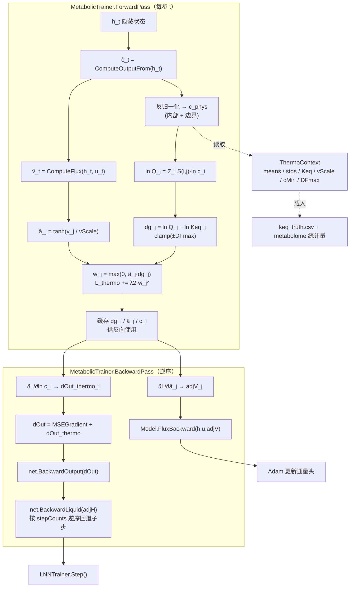

## 产品概述

把 `Metaboliq` 代谢网络 LNN 模型中恒为 0 的 λ2 损失项（"不可逆反应通量非负"惩罚）替换为**真正的热力学可行性项**。原项之所以恒为 0，是因为通量读取头对不可逆反应取 `v_j = e_j·σ(·)`（`e_j ≥ 0`）使 `v_j ≥ 0` 在结构上不可能违反——约束是"被参数化硬保证"的，而非"被学习"的，因此 λ2 是一个死项，无法在损失分解中体现约束满足过程。

本次改造在**保留该硬约束**（不改动读取头的符号行为）的前提下，把 λ2 换成基于反应推动力 ΔG 的方向性约束：净通量必须沿浓度梯度方向流动。该项由模型自身预测的浓度驱动，因此**总是活跃**，并可用真值通量做正确性佐证。

## 核心功能

1. **热力学可行性损失项（λ2）**

- 由模型预测的归一化浓度反归一化得到物理浓度 `c`，计算反应商 `ln Q_j = Σ_i S(i,j)·ln c_i`
- 推动力 `dg_j = ln Q_j − ln Keq_j`（即 `ΔG_j/RT`，无量纲）
- 活跃度门控 `â_j = tanh(v_j / vScale)`，使无通量反应不受约束（物理正确：热力学只约束有通量的反应）
- 罚 `Σ_j max(0, â_j · dg_j)²`，含义：有通量的反应不得逆着浓度梯度运行

2. **梯度完整回传**

- 经 `dOut` 注入浓度读出层 → LNN 输出层 → 液态层（走既有 `BackwardOutput → BackwardLiquid` 通路，**不改动 LNN 内核**）
- 经 `adjV` 注入通量读取头

3. **Keq 热力学先验**

- 新增 `test/data/keq_truth.csv`（reaction_id, Keq）：可逆反应写真值，不可逆写真值速率律隐含的"有效大值"
- `ThermoContext.Keq` 缺省全 1.0，使无热力学数据时该项退化为"净通量须沿浓度梯度方向"

4. **硬约束的可观测性**

- 删除旧的"负通量计罚"分支，改为**只读诊断计数器**（不进损失），验证不可逆反应确实从未出现负通量

5. **demo 网络生物学增补**

- 新增 `FRD`（富马酸还原酶，`fum + q8h2 → succ + q8`，E. coli frdABCD，厌氧诱导）与 `SUCT`（琥珀酸外排 `succ → succ_e`），使厌氧下的还原型 TCA 分支与琥珀酸分泌真实化，并消除此前 succ 无谓累积的问题
- 配套新增只读诊断 `min(v_SDH, v_FRD)`，让"SDH/FRD 同时活跃"这一无效循环现象在演示中可见

6. **数值防护**

- 物理浓度下限截断、`ln c` 与链式因子 `(c+1)/c` 的钳制、推动力 `clamp(±DFmax)`，并由既有全局 L2 梯度裁剪兜底

## 验收标准

- `dotnet build Metaboliq.slnx` 0 error
- `thermo` 在第 0 轮**非零**，并随训练下降
- 阶段 5 梯度自检仍通过（最差相对误差 &lt; 5%）——新项会向通量头与 LNN 输出层注入梯度，必须校验
- **正确性佐证**：用真值浓度 + 真值通量计算的 ΔG 违反度应 ≈ 0
- 自由运行浓度 R² 不显著回退（增补 FRD/SUCT 会重算真值，需重新确认基线）
- 不可逆反应负通量诊断计数 = 0

## 技术栈

- 语言/框架：VB.NET，`net10.0`（本机 SDK 10.0.400）
- 全部复用现有依赖，**不引入任何第三方包**：
- `Microsoft.VisualBasic.DeepLearning.LNN`（LiquidCell / LiquidLayer / LiquidNeuralNetwork / LNNTrainer / ODESolver）
- `Microsoft.VisualBasic.MachineLearning.TensorFlow.Tensor`
- `SMRUCC.genomics.MetabolicModel.MetabolicReaction`（Bio.Assembly）
- `SMRUCC.genomics.Analysis.HTS.DataFrame.Matrix`（HTS_matrix，经 `MetabolicDataIO` 间接使用）
- 构建/运行：`dotnet build Metaboliq.slnx`、`dotnet run --project Metaboliq\test`

## 实现方案

### 一、总体策略：把领域物理放在 Metaboliq，内核零改动

新损失项只通过两条既有通路注入梯度：

- 对**浓度**的依赖 → 累加进 `dOut`，走 `net.BackwardOutput(dOut) → net.BackwardLiquid(adjH)`
- 对**通量**的依赖 → 累加进 `adjV`，走 `Model.FluxBackward(h, u, adjV)`

因此**完全不需要改动 LNN 内核**，blast radius 限制在 Metaboliq 的 3 个文件 + test 的 2 个文件。

### 二、数学定义

```
反归一化（log1p+zscore 逆变换）:
    c_i(t) = exp( σ_i · ĉ_i(t) + m_i ) − 1

反应商:
    ln Q_j(t) = Σ_i  S(i,j) · ln c_i(t)          ' i 遍历全部代谢物（含边界）

推动力（无量纲 ΔG/RT）:
    dg_j(t) = ln Q_j(t) − ln Keq_j

活跃度门控:
    â_j(t) = tanh( v_j(t) / vScale )              ' ∈ (−1,1)；|v|≫vScale 时 ≈ ±1，v≈0 时 ≈ 0

违反量:
    w_j(t) = max( 0, â_j(t) · clamp(dg_j(t), −DFmax, +DFmax) )

损失:
    L_thermo = λ2 · Σ_t Σ_j  w_j(t)² / (T · r)
```

`â_j` 的门控是关键：**无通量的反应不贡献任何惩罚**，因为热力学方向性只约束"实际在流的"反应。这也顺带规避了痕量代谢物（`c → 1e-6`）带来的数值噪声。

### 三、梯度推导（实现时逐条对应）

记 `s = 2λ2 / (T·r)`，仅当 `â_j·dg_j > 0` 时该项激活：

```
∂L/∂dg_j = s · w_j · â_j
∂L/∂â_j  = s · w_j · dg_j
    → adjV_j += ∂L/∂â_j · (1 − â_j²) / vScale
    （clamp 触顶时 ∂dg/∂(·) 按 straight-through 置 0）

∂L/∂ln c_i = Σ_j  ∂L/∂dg_j · S(i,j)
    → 只取内部代谢物分量，回传到归一化空间：
      dOut_i = ∂L/∂ln c_{internal(i)} · σ_i · (c_i + 1) / c_i
```

`dOut_thermo` 与 `MSEGradient` 相加后再统一走 `BackwardOutput`，顺序不可颠倒。

### 四、为什么这一项不会退化成死项

- **μ（化学势）不可自由学习**：本方案中 `dg` 完全由**模型预测的浓度**与**固定的 Keq 先验**决定，没有可学习的潜变量，因此不存在"调整 μ 去解释一切"的退化路径。
- **Keq = 1 也不是平凡解**：此时 `dg_j = ln Q_j`，约束退化为"净通量须沿质量作用比梯度方向"，仍然非平凡（真值系统里可逆反应的 `Q` 与 `Keq` 并不相等）。
- **零空间投影方案已被排除**：以 SDH/FRD 为例，`col_FRD = −col_SDH`（内部行），零空间向量为 `c = (1,1)`，投影 `Nᵀv = 0` 会强迫 `v_SDH + v_FRD = 0`，即连"只跑 SDH"（`v=(1,0)`，明明可行）也被判为不可行——**过度约束**，故不采用。

### 五、数值风险与缓解（必须实现）

| 风险 | 缓解 |
| --- | --- |
| `c → 0` 时 `ln c → −∞` | 物理浓度下限截到 `cMin`（默认 `1e-6`），`ln c ≥ −13.8` |
| `(c+1)/c → ∞` 导致梯度爆炸 | 链式因子钳到 `1/cMin` |
| `dg_j` 可达数十，平方后主导损失 | `clamp(±DFmax)`（默认 20），截断处梯度置 0 |
| 反归一化后浓度上溢 | 沿用现有 `Clamp` 思路，对指数参数做上界保护 |
| 长程训练不稳定 | 复用既有全局 L2 梯度裁剪（`GradientClip = 5.0`）兜底 |


### 六、性能

每步新增开销：

- 反归一化：约 `mAll = 38` 次 `exp`
- `lnQ` 前向与 `dLnC` 反向：各 `mAll × r ≈ 38 × 35 ≈ 1330` 次乘加

合计约 5 kFLOP/步，相对现有约 40 kFLOP/步**增加约 12%**，600 轮训练耗时从约 38 s 增至约 42 s，可接受。

### 七、诚实边界（须写进演示输出）

`FRD` 与 `SUCT` 均声明为**不可逆**反应，不可逆反应在结构上 `v ≥ 0` 且有效 Keq 取大值，因此**SDH/FRD 这一对不会直接产生 thermo 惩罚**。B1 的可观测性来自**全部反应上的浓度梯度**，而非这一对。FRD/SUCT 的实际价值是：

1. 让厌氧下的还原型 TCA 分支与琥珀酸分泌在生物学上成立（真实 E. coli 行为），并消除此前 succ 无谓累积到 0.85 的问题；
2. 通过只读诊断 `min(v_SDH, v_FRD)` 让"无效循环"现象在演示中仍然可见。

## 实现注意事项（执行细节）

- **VB 不区分大小写**：会话中已两次踩坑（`Dim T = times.Length` 与循环变量 `t` 同名，一次导致损失变号、一次导致 ODE 完全不推进）。新代码**禁止**再出现与循环变量同名的标量，建议统一用 `steps`、`nRxn`、`nAll` 等命名，并在关键处保留注释。
- **`TimeSeriesMatrix.Reorder` 只返回数据张量，不同步 `RowMeans`/`RowStds`**：`ThermoContext` 需自行按 id 从原始 `metabolome` 查统计量。若 `FeatureIds` 不是 Public，则在 `MetabolicDataIO` 补一个 `Public Function RowIndex(id As String) As Integer`。
- **边界浓度同样来自代谢组 CSV（log1p+zscore）**，不是 min-max，反归一化路径与内部代谢物一致；但边界浓度是**给定值**，不参与梯度回传。
- **梯度自检必须覆盖新项**：自检用的 6 步切片会把 `dOut_thermo` 与 `adjV_thermo` 一并纳入，最差相对误差应仍在 5% 以内。
- **`MetabolicTrainer.Evaluate` 也要算 thermo**，否则"训练前/训练后 loss"不含该项，无法观察其下降。
- **`ForwardTrace` 需额外缓存每步的 `dOutThermo`**（一个长度 m 的 Tensor/步），否则反向时无法取得。
- **数据重建**：增补 FRD/SUCT/succ_e 后必须删除 `test/data` 重新生成，并**重新检查真值时序稳定性**（succ/fum/q8/q8h2 池会重排），确认不再出现累积或失稳后再进入训练阶段。
- **重跑基线**：网络变动会改变真值动力学，需重新确认浓度 R² 与有氧/无氧重编程结论是否仍然成立。

## 架构设计

新增热力学项在既有训练回路中的位置（只标注新增/改动部分）：



数据流要点：`ThermoContext` 在演示启动时一次性构建（含反归一化参数与 Keq 先验），训练/评估/预测全程共享；热力学项的前向产物（`dg`、`â`、物理浓度）缓存在 `ForwardTrace` 中，反向时按同一份缓存求 adjoint，避免重复的反归一化与对数运算。

## 目录结构

```
Metaboliq\
├── ThermoFeasibility.vb        # [NEW] 热力学可行性项的完整封装：
│                               #   - ThermoConfig：RT / FluxScale(vScale) / MinConcentration(cMin) / MaxDrivingForce(DFmax)
│                               #     / KeqIrreversible（不可逆反应的有效大值，默认 1000）
│                               #   - ThermoContext：内部+边界代谢物的反归一化 means/stds、Keq 向量、内部→全代谢物索引映射；
│                               #     Shared FromMetabolome(metabolome, graph, keqCsv) 工厂
│                               #   - ThermoFeasibility：ToPhysical()/LogQuotient()/Evaluate()/Backward()
│                               #   - ThermoResult：Penalty / DrivingForce / ActiveCount / NegativeFluxCount
├── MetabolicTrainer.vb         # [MODIFY] 1) MetabolicTrainerConfig 新增 Thermo As ThermoConfig、LambdaThermo 语义改为
│                               #            "ΔG 方向性"；2) Fit/TrainEpoch/Evaluate/Predict 增加 Optional thermo 参数并透传；
│                               #          3) ForwardPass 删除旧的 `Not Reversible(j) AndAlso v(j) < 0` 分支，改为调用
│                               #            ThermoFeasibility.Evaluate；4) BackwardPass 把 dOut_thermo 并入 dOut、
│                               #            把 ∂L/∂â 并入 adjV；5) ForwardTrace 增加 dOutThermo 缓存字段；
│                               #          6) 新增只读诊断：不可逆反应负通量计数
├── MetabolicTrajectory.vb      # [MODIFY] 新增 ThermoViolation(graph, thermo) As Double（整条轨迹平均违反度）
├── MetabolicDataIO.vb          # [MODIFY] 视需要补 Public Function RowIndex(id As String) As Integer
└── test\
    ├── DemoData.vb             # [MODIFY] 1) 新增 FRD(fum + q8h2 -> succ + q8，不可逆)、SUCT(succ -> succ_e，不可逆)
    │                           #           与边界代谢物 succ_e（边界数 7 → 8），并补 VmaxTable / EnzymeProgram 条目；
    │                           #          2) KeqOf 改 Public Shared；3) 导出 keq_truth.csv（可逆写真值、不可逆写 1000）；
    │                           #          4) 重新校验"每个内部代谢物既有产生也有消耗"
    ├── Program.vb              # [MODIFY] 1) 载入 keq_truth.csv 并构建 ThermoContext，传给 Evaluate/Fit/Predict；
    │                           #          2) 阶段 6 输出 thermo 分量；3) 评估区改写"热力学方向性项"那行，
    │                           #            输出 ΔG 违反度、活跃反应数、不可逆反应负通量计数；
    │                           #          4) 增加真值 (真值浓度 + 真值通量) 的 ΔG 违反度作为正确性佐证；
    │                           #          5) 增加 min(v_SDH, v_FRD) 只读诊断；6) 说明"不可逆反应由结构硬保证 v ≥ 0"
    └── data\                   # [REGEN] network.json / metabolites_timeseries.csv / enzymes_timeseries.csv
                                #         / fluxes_truth.csv / keq_truth.csv
```

## 关键代码结构

```
' Metaboliq\ThermoFeasibility.vb —— 热力学上下文与可行性项（接口级定义）

Public Class ThermoConfig
    ''' <summary>气体常数×温度，用于把 ΔG 归一到无量纲；demo 中浓度与通量同为归一化量，取 1.0 即可</summary>
    Public Property RT As Double = 1.0
    ''' <summary>活跃度门控尺度：â = tanh(v / FluxScale)，越小则"有通量"的判定越敏感</summary>
    Public Property FluxScale As Double = 0.05
    ''' <summary>物理浓度下限，防止 ln c → −∞ 与 (c+1)/c → ∞</summary>
    Public Property MinConcentration As Double = 0.000001
    ''' <summary>推动力钳制范围，防止痕量代谢物把 dg 放大到主导损失</summary>
    Public Property MaxDrivingForce As Double = 20.0
    ''' <summary>不可逆反应的有效平衡常数（真值速率律无反向项 ⇒ Keq 视为 ∞，取有限大值使 ΔG 可计算）</summary>
    Public Property KeqIrreversible As Double = 1000.0
End Class

Public Class ThermoContext
    Public ReadOnly Property Config As ThermoConfig
    ''' <summary>按 graph.InternalIds 顺序的反归一化均值/标准差</summary>
    Public ReadOnly Property InternalMeans As Double()
    Public ReadOnly Property InternalStds As Double()
    ''' <summary>按 graph.BoundaryIds 顺序（边界浓度是给定值，不回传梯度）</summary>
    Public ReadOnly Property BoundaryMeans As Double()
    Public ReadOnly Property BoundaryStds As Double()
    ''' <summary>按 graph.ReactionIds 顺序的平衡常数</summary>
    Public ReadOnly Property Keq As Double()

    ''' <summary>由代谢组时序矩阵与网络图构建；keqById 为 Nothing 时 Keq 全取 1.0</summary>
    Public Shared Function FromMetabolome(metabolome As TimeSeriesMatrix,
                                          graph As MetabolicNetworkGraph,
                                          Optional keqById As Dictionary(Of String, Double) = Nothing,
                                          Optional config As ThermoConfig = Nothing) As ThermoContext
End Class

Public Class ThermoFeasibility
    ''' <summary>把归一化浓度还原为物理浓度：c = exp(σ·x + m) − 1，并施加 MinConcentration 下限</summary>
    Public Function ToPhysical(normalized As Double(), means As Double(), stds As Double()) As Double()

    ''' <summary>ln Q_j = Σ_i S(i,j)·ln c_i</summary>
    Public Function LogQuotient(cAll As Double()) As Double()

    ''' <summary>前向：返回本步惩罚值与缓存（dg / â / 物理浓度），供反向复用</summary>
    Public Function Evaluate(cInternal As Double(), v As Tensor) As ThermoStep

    ''' <summary>反向：产出 dOutThermo（对归一化浓度的 adjoint）与 adjV（对通量的 adjoint）</summary>
    Public Function Backward(cache As ThermoStep, v As Tensor, steps As Integer) As (dOut As Tensor, adjV As Tensor)
End Class
```

```
' Metaboliq\MetabolicTrainer.vb —— 训练器接口的新增/改动点（签名级）

Partial Public Class MetabolicTrainer
    ' Fit / TrainEpoch / Evaluate / Predict 统一增加 Optional thermo 参数并向下透传
    Public Overloads Function Fit(times As Double(), observed As Tensor, enzymeSeries As Tensor,
                                  boundarySeries As Tensor, Optional observedFlux As Tensor = Nothing,
                                  Optional thermo As ThermoContext = Nothing) As List(Of EpochLoss)

    ' ForwardTrace 增加每步的 dOutThermo 缓存
    Private Class ForwardTrace
        Public dOutThermo As Tensor()
    End Class
End Class
```

```
' test\DemoData.vb —— 网络增补要点（不可逆反应，厌氧诱导）

' FRD  富马酸还原酶（E. coli frdABCD，EC 1.3.5.4）
Call Rxn("FRD", "fumarate reductase", {"fum", "q8h2"}, {"succ", "q8"})
' SUCT 琥珀酸外排（厌氧发酵产物分泌，防止 succ 在胞内无谓累积）
Call Rxn("SUCT", "succinate exporter", {"succ"}, {"succ_e"})
' 新增边界代谢物：succ_e（初值 1e-6，自然累积）
' VmaxTable 增补：FRD / SUCT
' EnzymeProgram 增补：FRD 与 SUCT 厌氧诱导（与 SDH 好氧高表达形成互补调控）
```