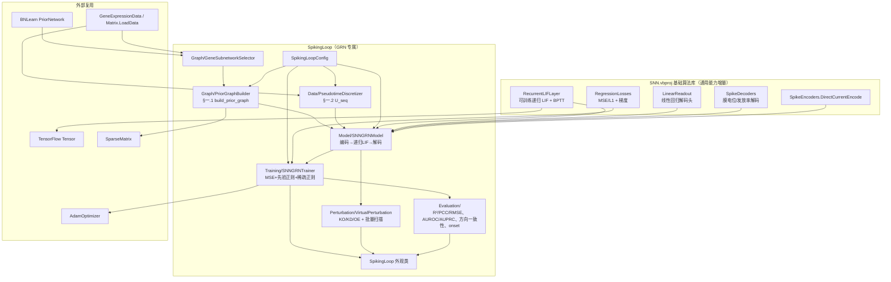

## Product Overview

在 SpikingLoop 项目中，用脉冲神经网络（SNN）实现基因表达调控网络的建模与虚拟扰动实验：以「基因为 LIF 脉冲神经元、TF→靶基因调控关系为有向突触」构成网络，用先验调控网络与共表达权重约束突触拓扑，用伪时间离散化的表达谱作为训练轨迹，以代理梯度 + BPTT 拟合突触参数，最终通过在输入层注入/移除电流实现基因的敲除、敲低、过表达虚拟扰动，输出扰动后的时空表达轨迹与评估报告。同时把与基因调控无关的通用 SNN 算法能力沉淀到基础 SNN 算法库中。

## Core Features

- **先验图构建**：TF-Target 有向边作骨架；共表达权重仅用于补充双向弱连接与结构正则；输出邻接矩阵、初始权重与可训练掩码，并按突触前归一化。共表达权重以统一的数据输入接口接收（不承担其文件读取与计算）。
- **数据准备**：支持外部伪时间输入，未提供时回退使用样本自带时间点标签；沿伪时间排序、等分时间窗取均值、沿时间平滑、归一化，得到 T×N 表达轨迹；支持按先验网络度数与离散度筛选核心子网络基因。
- **SNN-GRN 模型**：每个基因一个 LIF 神经元，按膜电位累积→阈值发放→离散脉冲→复位递归演化，突触权重可训练且受掩码约束；提供连续表达量到输入电流的直接编码，以及膜电位读取、发放率两种输出解码。
- **训练**：代理梯度 + 时间反向传播（BPTT），损失 = 表达预测误差 + 先验结构正则 + 稀疏正则，Adam 优化，含验证集划分与早停。
- **虚拟扰动**：单基因与多基因组合的敲除/敲低/过表达，输出扰动后 T×N 表达轨迹；支持批量基因扫描与关键调控节点排序。
- **评估**：表达预测精度（R²/PCC/RMSE）、调控关系合理性（AUROC/AUPRC）、扰动方向一致性、扰动传播时序合理性。
- **演示**：可运行的控制台端到端演示，打印表达轨迹与脉冲栅格、训练损失曲线、扰动排名，并导出 CSV 结果文件。
- **基础算法库增强**：可训练递归脉冲层、回归损失与线性解码头、直接电流编码与脉冲解码等通用能力。

## Visual Effect

无图形界面；输出为控制台文本报告（数据规模、分箱统计、表达轨迹/脉冲栅格字符图、损失曲线、指标数值、扰动能排名）与导出的 CSV 结果表。

## Tech Stack

- 语言/运行时：VB.NET，`net10.0`（沿用现有工程约定：`Platforms=AnyCPU;x64`、`OptionStrict=Off`、XML 文档注释、中文注释、`Imports std = System.Math`）。
- 复用现有基础库（不改动其公开行为）：
- `runtime/sciBASIC#/Data_science/MachineLearning/SNN/SNN.vbproj`（`Microsoft.VisualBasic.DeepLearning.SpikingNeuralNetwork`）：`LIFLayer`、`SparseLIFLayer`、`SparseMatrix`、`Encoder`、`Surrogate`、`AdamOptimizer`、`Network`。
- `TensorFlow.vbproj` 的 `Tensor`（`Shape/Data/Rank/Version/MarkHostModified`、`MatMul/Transpose/ElementwiseMultiply/Apply/Sum`、运算符 `+ - * /`）。
- `BNLearn.vbproj`：`Core.PriorNetwork` / `RegulatoryEdge` / `Effector`、`Intervention.InterventionMode`、`BnIO.ReadGeneExpressionMatrix`、`Core.GeneExpressionData`（`TimePoints` / `GetSubMatrix`）。
- `HTS_matrix` 的 `Matrix.LoadData(path)` 读取 CSV 表达矩阵。
- 目标工程：`SpikingLoop.vbproj`（`SMRUCC.genomics.Analysis.SpikingLoop`），已引用 SNN / TensorFlow / Math.NET5 / Core / BNLearn / HTS_matrix / ExperimentDesigner / biocore，**无需新增工程引用**。
- 参考同类项目 `GEARS`（组织方式：`Graph/ IO/ Model/ Training/ test/` + 根级 facade 类 + config 类 + `test/GEARSDemo.vb`）与其 `PriorNetworkIO` CSV 解析（表头 `TF,TargetGene,RegulationType,Confidence,Evidence`）。

## Implementation Approach

**总体策略：增量扩展基础库 + 分层实现 GRN 流水线，不破坏既有接口。**

1. **基础库只做「通用 SNN 能力」补充，全部为新增文件/新增成员，不改动既有类的现有方法签名与语义**，确保 `SNN/test` 下 `test1..test4`、`self_test` 继续通过。
2. **GRN 专属逻辑集中在 SpikingLoop**，按 `Config / Graph / Data / Model / Training / Perturbation / Evaluation / IO` 分层，与 GEARS 保持一致的目录与命名风格，降低维护成本。

**关键算法决策与取舍：**

- **递归突触拓扑的表示**：新增 `RecurrentLIFLayer`，采用**稠密 `Weight As Tensor[N,N]` + `Mask As Tensor[N,N]`**（掩码就地冻结非先验位置），而非复用 `SparseLIFLayer`（后者明确「仅前向、不可训练」）。理由：BPTT 需要 `W·S[t-1]` 与 `Wᵀ·dI[t]` 双向乘法及 `Sprevᵀ·dI` 的梯度累积，稠密实现可直接复用 `Tensor.MatMul` 的 SIMD 内核，代码量低、可读性高；CSR 版本需额外维护转置 CSR 与显存缓存失效契约，收益在 N≤500 的子网络场景下不明显。**复杂度**：单步 `O(N²·batch)`，一个窗口 `O(T_local·3N²·batch)`；内存 `O(N²)`（权重+梯度）。据此在配置中限制/告警 `N ≤ 1000`，并把全部时间窗作为 batch 一次性前向以摊薄开销；CSR 前向能力保留在 `SparseLIFLayer` 中供超大规模场景使用（本次不接入）。
- **损失与前向函数选择**：MSE 而非交叉熵（回归任务）；前向用真实 Heaviside 保证脉冲二值稀疏，反向用替代导数（`FastSigmoid/ATan/STE` 已有）；`β`（λ）与阈值按 readme 作为超参数固定，仅对 `Alpha` 支持按轮次退火以缓解梯度不匹配。
- **结构正则**：`loss_prior = mean(((W − W_init) ⊙ mask)² ⊙ confidence)`、`loss_sparse = |W|` 的 L1；两者梯度在调用 Adam 前并入 `WeightGrad`，不新增优化器类型（复用 `AdamOptimizer` 含 `ClipNorm` 梯度裁剪）。
- **WGCNA 边界**：`PriorGraphBuilder` 仅暴露 `wgcnaAdj As Double(,)`（对称、[0,1]）与 `topKWgcna/threshold` 参数接口，按 `wgcnaAdj` 权重排序取 Top-K 作为「共表达排名」；**不实现其结果计算与文件 IO**。演示工程通过传入 `Nothing`（仅 TF-Target）与一份手写小矩阵（演示补充边分支）两条路径来验证接口。
- **伪时间回退**：优先外部伪时间；否则用 `GeneExpressionData.TimePoints`；若时间点全为 0（如 test 数据未传 `SampleInfo`），回退解析样本名中的时间标签（`T1.2h_Rep1` → `1.2`、`t12` → `12`）。这使 `demo/TestData1` 开箱可用。
- **演示数据**：复用 `demo/TestData1`（`gene_expression_matrix.csv`、`regulatory_network_prior.csv`），用向上回溯目录的方式定位，避免 GEARS 演示中的硬编码盘符。

**性能与可靠性要点**：时间窗全批量前向；正则梯度只在 BPTT 结束后施加一次掩码（避免每步 O(N²)）；`Mask`/`W_init`/`confidence` 常驻复用不重建；所有导出写入走既有 TSV 风格；随机源统一 `Random(seed)` 保证可复现；`U_seq` 全静默/全发放做前置校验并给出诊断。

## Implementation Notes

- **接口兼容**：`LIFLayer`、`SparseLIFLayer`、`SparseMatrix`、`SpikingNetwork`、`Losses.SoftmaxCrossEntropy`、`AdamOptimizer` 的现有方法与语义保持不变；新增内容一律走新文件或纯增量成员（如在 `Encoder.vb` 末尾追加 `DirectCurrentEncode` 函数，不修改已有函数）。
- **替代梯度自检沿用既有技巧**：`LIFLayer` 已有 `SmoothForward`（用替代导数的原函数替换阶跃，使解析梯度与数值差分一致）。`RecurrentLIFLayer` 与 `LinearReadout` 采用同一模式，并在 `SNN/test/test5.vb` 用中心差分核对 `dW`。
- **CSR/设备端缓存契约**：本次不直接改写 `SparseMatrix.Values`；若后续接入 CSR BPTT，必须按既有约定调用 `MarkHostModified()` / `SparseCsr.MarkModified()`。绕过 `Tensor` 索引器就地写 `Data` 后调用 `MarkHostModified()`（参照 `Network.ScatterInput`）。
- **张量运算约束**：`Tensor` 无 `Sqrt/Exp/Log` 逐元素方法，统一用 `Apply(Func(Of Double,Double))`；`+` 的 Rank=2 广播仅在「一维为 1」时触发（是外积语义），**偏置加法不能依赖 `+` 广播**，在 `LinearReadout` 内部按索引累加并手工实现偏置梯度。
- **日志**：沿用项目 `.info/.debug/.warning` 扩展方法风格输出关键节点（数据规模、分箱数、nnz 统计、每 N 轮损失、指标），不输出大批量数值；只打印摘要。
- **爆炸半径控制**：不改动 GEARS/BNLearn；不把 `PriorNetworkIO` 上移到 BNLearn（避免影响 GEARS 构建），改为在 SpikingLoop 内提供等价解析器并在注释中说明与 GEARS 版本的关系。`SpikingLoop.vbproj` 仅追加 `test/**` 排除与打包/文档属性（与 GEARS 对齐），不调整已有 `ProjectReference`。

## Architecture Design



**数据流**：`Matrix.LoadData` → `BnIO.ReadGeneExpressionMatrix` → `GeneSubnetworkSelector`（子网络）→ `PseudotimeDiscretizer`（T×N `U_seq`）→ `PriorGraphBuilder`（A / W_init / mask / confidence）→ `SNNGRNModel`（`U_seq[t]` 编码为电流 + 膜电位初值 → 递归 LIF 演化 → 解码头 → `y_hat`）→ `SNNGRNTrainer`（MSE + 正则 + Adam + BPTT）→ `VirtualPerturbation`（输出 T_sim×N 轨迹）/ `Evaluation`（指标）→ CSV 导出。

## Directory Structure

```
sub-system/
├── SpikingLoop/
│   ├── SpikingLoop.vbproj                  # [MODIFY] 追加 <Compile Remove="test\**" /> 及 EmbeddedResource/None 排除；补 GenerateDocumentationFile、Version/AssemblyVersion、nuget_release 输出路径，与 GEARS 对齐；不改动已有 ProjectReference
│   ├── readme.md                           # [保持] 算法原理文档
│   ├── SpikingLoopConfig.vb                # [NEW] 超参与开关：TopKWgcna/WgcnaThreshold、TimeSteps(T_local)、Horizon(Δt)、T_output 分箱数、Beta(λ)、Threshold、V_reset、ResetMode、SurrogateKind、Alpha 及退火、Epochs、LearningRate、ClipNorm、PriorRegAlpha(α)、SparsityBeta(β)、EncodingMode、ReadoutSource、MembraneInitGain、CurrentGain(I_max)、Normalization、MaxGenes、TrainSplit、FrozenWeights、Seed、PrintEvery。提供 Validate() 越界校验与 ToString() 摘要
│   ├── SpikingLoop.vb                      # [NEW] 外观类（对标 GEARS.vb）：构造 (GeneExpressionData, PriorNetwork, Optional wgcnaAdj, Optional config)；串联 PrepareTrainingData/Train/VirtualPerturbation/BatchPerturbationScan/Evaluate；暴露 U_seq、PriorGraph、LearnedWeights、TrainHistory、LastMetrics
│   ├── Graph/
│   │   ├── GeneSubnetworkSelector.vb       # [NEW] P0 核心子网络筛选：取先验网络两端基因（TF ∪ Target），按 度数/表达方差 排序取前 MaxGenes，复用 GeneExpressionData.GetSubMatrix 生成子矩阵与索引映射；输出未命中基因告警
│   │   ├── PriorGraphBuilder.vb            # [NEW] §一.1 build_prior_graph：三步（TF-Target 有向骨架 → WGCNA 双向弱连接补充 → W_init*mask 后按行/突触前归一化），产出 PriorGraph{Adjacency, WInit, Mask, Confidence, GeneNames, NumPriorEdges, NumWgcnaEdges, NormalizeReport}；wgcnaAdj 为纯输入接口（Nothing 时仅用 TF-Target）；WGCNA Top-K 按 wgcnaAdj 权重排名实现；对自环/越界索引/零和行做防护
│   │   └── PriorGraph.vb                   # [NEW] 先验图结果数据结构（含 ToString 摘要与稀疏统计）
│   ├── Data/
│   │   ├── PseudotimeDiscretizer.vb        # [NEW] §一.2 prepare_training_data：外部伪时间优先 → TimePoints → 样本名时间标签回退（T<num>h / t<num>）；按伪时间排序、分位数分箱取均值、滑动窗口平滑、MinMax 归一到 [0,1]；返回 U_seq[T,N] Tensor + BinEdges + OrderedSampleIndex + per-gene Min/Max（供指标与反变换）
│   │   └── SampleNameTimeParser.vb         # [NEW] 从样本名解析时间标签的正则工具（供上者回退使用），含失败时的诊断计数
│   ├── Model/
│   │   ├── SNNGRNModel.vb                  # [NEW] 组装 RecurrentLIFLayer(N) + LinearReadout(N→N)；ForwardRollout(I_ext 序列, u0) 返回 (S 轨迹, H_last, U_last, y_hat)；PredictNext(expr 向量)；EncodeExpression/DecodeState 依配置；暴露 Synapses/Mask/WInit/Confidence 供训练与评估
│   │   └── ModelOutput.vb                  # [NEW] 前向输出结构（SHistory、HLast、ULast、YHat、SpikeCounts、FiringRates）
│   ├── Training/
│   │   └── SNNGRNTrainer.vb                # [NEW] §三：由 U_seq 切分 (t → t+Δt) 时间窗并整批前向；loss = MSE + α·loss_prior + β·loss_sparse；梯度并入 WeightGrad 后乘 Mask，调用既有 AdamOptimizer；验证集（留出尾部伪时间区间）、早停、Alpha 退火；输出 TrainHistory（每轮 train/val loss、val PCC）
│   ├── Perturbation/
│   │   ├── PerturbationSpec.vb             # [NEW] 扰动规格 { GeneName, GeneIndex, Mode As BNLearn.InterventionMode, Strength }（复用既有枚举），提供 Self-validate 与 ToString
│   │   └── VirtualPerturbation.vb          # [NEW] §四：由基线表达初始化膜电位，仅起始阶段注入扰动（KO→电流置 0；KD→×(1−strength)；OE→+strength·I_max；Custom→直接设值），逐步 roll-out 并解码，返回 T_sim×N 轨迹；BatchPerturbationScan(genes, mode, strength) 返回「扰动基因→最终表达变化向量」并给出下游效应强度与关键节点排名
│   ├── Evaluation/
│   │   ├── RegressionMetrics.vb            # [NEW] R²、Pearson PCC、RMSE、MAE（逐基因与整体两种粒度）
│   │   ├── LinkPredictionMetrics.vb        # [NEW] 以先验 TF-Target 集合为正例，对 learned_W 做 AUROC / AUPRC / 排序前 N 命中率；输出权重恢复质量摘要
│   │   ├── PerturbationConsistency.vb      # [NEW] 扰动有效性（无真实 Perturb-seq 时的等价验证）：对每个 TF 做 KO，按其 Activator/Inhibitor 关系检查靶基因变化方向的一致性比例与显著数
│   │   └── ResponseOnsetAnalysis.vb        # [NEW] §五.4：计算每个基因响应起始时刻（首次超阈 |Δ|），与由先验有向图最短路得到的层级深度做 Spearman 相关与「上游先响应」检查
│   └── IO/
│       ├── PriorNetworkIO.vb               # [NEW] 先验网络 CSV 读取（表头 TF,TargetGene,RegulationType,Confidence,Evidence；分隔符 , / Tab / ;；activation/repression 文本→Effector），内部复用 BnIO.ReadPriorNetwork；注释说明与 GEARS 同名模块的关系（避免其成为工程依赖）
│       ├── ExpressionIO.vb                 # [NEW] 表达矩阵读取（Matrix.LoadData + BnIO.ReadGeneExpressionMatrix）；外部伪时间文件读取（两列：样本/细胞名 → 伪时间值）；可选 SampleInfo 时间标签
│       └── ResultWriter.vb                 # [NEW] 结果导出（TSV/CSV）：U_seq、脉冲栅格/发放率、训练历史、扰动轨迹、批量扰动汇总、评估指标；沿用 BnIO 的写表风格与 Encoding.UTF8
│   └── test/
│       ├── test.vbproj                     # [NEW] Exe、net10.0、RootNamespace=test，引用 Core/Math.NET5/TensorFlow/BNLearn/SNN/SpikingLoop
│       ├── Program.vb                      # [NEW] 演示入口（调用 SpikingLoopDemo.Run）
│       └── SpikingLoopDemo.vb              # [NEW] P0–P5 端到端演示：向上回溯定位 demo/TestData1 → 读数据 → 子网络 → 伪时间分箱 → 先验图（Nothing 与手写小矩阵两条路径）→ 固定权重前向（打印脉冲栅格与发放率诊断）→ 训练（打印损失曲线与 val PCC）→ 虚拟扰动 KO/KD/OE 与批量扫描 → 评估指标 → 导出 CSV 到 App.HOME & "/SpikingLoop_output/"
└── (SNN 基础库，位于 runtime/sciBASIC#/Data_science/MachineLearning/SNN/)
    ├── RecurrentLIFLayer.vb                # [NEW] 通用可训练递归 LIF 层：I[t]=W·S[t−1]+I_ext[t]；U[t]=β·H[t−1]+I[t]；S[t]=Θ(U−θ)；硬/软复位；支持 Mask 冻结、Trainable 开关、SmoothForward 自检；BackwardTime 实现 BPTT（dH=β·dU[t+1]；dS=dS_ext+dH⊙(−U)（硬）/dH⊙(−θ)（软）+Wᵀ·dI[t+1]；dU=dU_ext+dS⊙σ′(U−θ)+dH⊙(1−S)（硬）/dH（软）；dW+=Sprevᵀ·dI；dI=dU）；输出 (WeightGrad, dInputCurrent 序列, dSprev 序列)；含 N 上限与零/全发放诊断
    ├── LinearReadout.vb                    # [NEW] 通用线性回归解码头：y=u·Wout+b（偏置按索引手工累加，不依赖 Tensor 广播）；ForwardStep/BackwardTime（dWout+=uᵀ·dy、db+=Σdy、du=dy·Woutᵀ）；WeightGrad/BiasGrad；HeInit/Xavier 初始化与 Shape 校验
    ├── RegressionLosses.vb                 # [NEW] 回归损失模块：MSE（返回 LossGradient，dL/dy=2(y−ŷ)/n）、MAE/L1（次梯度）、以及 L1Sum/L2Sum 正则标量助手；与既有 Losses.SoftmaxCrossEntropy 并存不冲突
    ├── Decoder.vb                          # [NEW] 脉冲解码器：MembranePotential(H_last/U_last) 与 FiringRate(ΣS/T)；脉冲轨迹（List(Of Tensor)）拼接/统计助手
    ├── Encoder.vb                          # [MODIFY] 纯增量追加 SpikeEncoders.DirectCurrentEncode(x, T, iMax)（连续值 → T 步持续电流）与可选 SpikeEncoding.DirectCurrent 成员；不改动 RateEncode/LatencyEncode
    └── test/
        ├── test5.vb                        # [NEW] 新增算法自检：RecurrentLIFLayer 的 dW/dInput 与中心差分数值梯度对拍（SmoothForward）、LinearReadout 梯度对拍、MSE 梯度对拍、Mask 冻结生效性验证
        └── Program.vb                      # [MODIFY] 在既有演示编排中追加 test5.SelfCheck() 调用（一行）
```

## Key Code Structures

```
' SpikingLoop/Graph/PriorGraph.vb —— 先验图构建结果（SpikingLoop 与 Trainer/Model 共同依赖的契约）
Public Class PriorGraph
    Public Property GeneNames As String()          ' 顺序与表达矩阵行严格一致
    Public Property Adjacency As Tensor            ' A[N,N]：1 = 突触存在（含 WGCNA 补充边）
    Public Property WInit As Tensor                ' W_init[N,N]：先验初始化权重（已按突触前归一化）
    Public Property Mask As Tensor                 ' mask[N,N]：1 = 允许梯度更新
    Public Property Confidence As Tensor           ' confidence[N,N]：结构正则的逐边强度
    Public Property NumPriorEdges As Integer       ' TF-Target 骨架边数
    Public Property NumWgcnaEdges As Integer       ' WGCNA 补充双向边数（成对计数）
End Class

' SNN/RecurrentLIFLayer.vb —— BPTT 契约（dS_ext 与 dH_last 由解码头回传）
Public Function BackwardTime(dS_ext As List(Of Tensor),
                             Optional dH_last As Tensor = Nothing) As RecurrentGradients

Public Structure RecurrentGradients
    Public WeightGrad As Tensor                 ' dL/dW[N,N]（未乘 Mask，由上层施加掩码）
    Public InputGrad As List(Of Tensor)         ' dL/dI_ext[t]，长度 = 仿真步数
    Public SpikeGrad As List(Of Tensor)         ' dL/dS[t]，供跨层/上层使用
End Structure
```

## Agent Extensions

### SubAgent

- **code-explorer**
- Purpose: 在实现 `Graph/PriorGraphBuilder.vb`、`Data/PseudotimeDiscretizer.vb`、`IO/` 与 `test/` 演示时，跨目录核实现有可复用 API（`BnIO.ReadGeneExpressionMatrix`、`GeneExpressionData.GetSubMatrix/TimePoints`、`Matrix.LoadData` 与 `SampleInfo`、`Tensor` 算子、`SparseMatrix` 归一化、`AdamOptimizer` 用法，以及 `GEARS/test`、`SNN/test` 的编排与引用写法），避免凭猜测调用不存在的成员。
- Expected outcome: 明确列出每个待写文件实际可调用的类型/方法签名与引用路径，确保新增代码一次编译通过，且演示工程与既有 `test.vbproj` 约定一致。

### Skill

- **lsp-code-analysis**
- Purpose: 在新增 `RecurrentLIFLayer.vb` / `LinearReadout.vb` / `RegressionLosses.vb` / `Decoder.vb` 并对 `Encoder.vb`、`SNN/test/Program.vb` 做增量修改前后，做符号定义与引用检索，确认既有 `LIFLayer`、`SparseLIFLayer`、`SparseMatrix`、`Losses`、`SpikingNetwork`、`AdamOptimizer` 的调用点未被破坏，实现「不破坏既有行为」的爆炸半径控制。
- Expected outcome: 得到受影响的调用点清单与新符号引用核对结果，确保 `SNN/test` 的 `test1..test4`/`self_test` 逻辑路径不受影响，新增能力可被 `SpikingLoop` 正确引用。