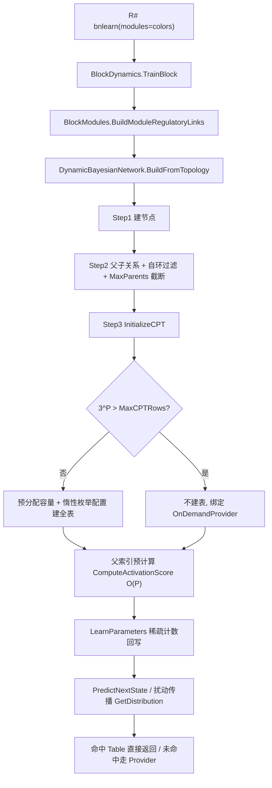

## 用户需求

审查并修复 `g:\GCModeller\src\GCModeller\sub-system\BNLearn\DBN\DynamicBayesianNetwork.vb` 中动态贝叶斯网络初始化流程（`BuildFromTopology` Step 3，263-271 行调用 `InitializeCPT`）存在的两个问题：初始化极慢、内存占用异常高（用户怀疑 `InitializeCPT` 存在内存泄漏）。要求**实际运行完整流程**复现问题、定位根因、实施修复并验证效果。

## 产品概述

这是一个用 VB.NET 实现的基因表达调控网络模拟系统（DBN，2 切片时序贝叶斯网络）。修复工作必须在不改变模型数学语义（拓扑先验 CPT、Dirichlet 后验、预测与扰动传播结果）的前提下，把初始化阶段的时间与内存开销从"不可完成"降到"可完成且可控"。

## 核心功能（本次工作范围）

1. **可复现的性能诊断**：编写内存守护脚本，在 80GB 阈值下自动终止 `R#.exe`，运行 `K:\hsa_grn\bnlearn.R` 全流程，采集基线数据（耗时曲线、峰值内存、卡死位置、父节点规模分布）。
2. **内存治理**：消除 CPT 初始化过程中的组合爆炸与过程峰值，使内存占用与模块规模呈可控关系。
3. **速度治理**：消除初始化热路径中的重复字符串查找与冗余数组拷贝，显著降低 CPU 时间与 GC 压力。
4. **回归验证**：按用户指定流程（编译 `G:\Erica\src\Erica.sln` → 在 `G:\GCModeller\src\R-sharp\App\net10.0` 下运行 `R#.exe K:\hsa_grn\bnlearn.R --attach G:\Erica`）重跑，对比修复前后指标，并确认脚本最终产出（`modular_response` 目录）正常。

## 约束与边界

- 仅修改 BNLearn 项目内代码（`DBN\`、`ModularNetwork\`），不动 R# 层与 Erica 代码。
- 保持 `ConditionalProbabilityTable.Table` 的公开类型 `Dictionary(Of String, Double())` 与 CPT 文本序列化格式不变，避免影响外部调用方。
- 守护脚本为长期资产，落在工作区 `tools\` 下并保留；中间诊断日志在收尾时清理。

## 技术栈

- 语言/框架：VB.NET，目标 `net10.0`（`BNLearn.vbproj`，`OptionStrict Off` / `OptionInfer On`）
- 宿主运行时：R# 解释器（`G:\GCModeller\src\R-sharp\App\net10.0\R#.exe`，`--attach G:\Erica` 动态加载 `G:\Erica\assembly\net10.0` 下的程序集）
- 构建：`dotnet build G:\Erica\src\Erica.sln`（该解决方案第 134 行包含 BNLearn 项目；`Erica.vbproj` 的 `OutputPath = ../../assembly/`，产物落到 `G:\Erica\assembly\net10.0\SMRUCC.genomics.Analysis.BNLearn.dll`，编译后须核对时间戳）
- 调试/守护：PowerShell 7 脚本轮询 `System.Diagnostics.Process.PrivateMemorySize64`

## 根因诊断（已通过代码阅读与调用链追踪确认）

调用链：`R# bnlearn()`（`G:\GCModeller\src\workbench\R#\biosystem\bnlearn.vb:151`，传 `modules` 走模块化分支，195 行 `TrainBlocks`）→ `ModularNetwork\BlockDynamics.vb:57 TrainBlock` → `BuildModuleRegulatoryLinks`（`BlockModules.vb:64`，把模块内先验边逐条转成 `RegulatoryLink`，**无入边数上限、无自环过滤**）→ `DynamicBayesianNetwork.BuildFromTopology`（182 行）→ `InitializeCPT`（286 行）。

1. **内存暴涨不是泄漏，是指数级组合爆炸**：每个节点的 CPT 行数 = 3^P（P = 父节点数，`DBNNode.vb:75` 每父节点 3 态）。模块化路径**完全不经过** `StructureLearning`，因此 `StructureLearningParams.MaxParents = 5` 不生效，hub 基因 P 可达数十；P=20 即 35 亿行，按每行（string key + `Double(3)` 数组 + Dictionary entry）约 150-200 字节估算可达数百 GB。
2. **过程峰值放大**：`ConditionalProbabilityTable.GetAllParentConfigurations`（126-147 行）把 3^P 个配置**一次性 materialize** 成 `List(Of List(Of String))`，其对象开销与最终 Table 同量级；`SetDistribution` 每配置再 `Clone()` 一份数组（调用方 `ComputeDefaultDistribution` 返回的已是全新数组，clone 纯属浪费）；`Table` 未预分配容量，Dictionary rehash 时新旧桶并存进一步放大峰值。
3. **耗时来源**：`ComputeActivationScore`（377-458 行）在每个配置内做 `node.ParentIds.IndexOf(tfId)` / `IndexOf(effId)` 的 O(P) 字符串查找，共 O(P) 次 → 总复杂度 O(3^P · P²)；`StateToScore` 逐次字符串比较；海量临时对象引发频繁 GC。

## 实现方案

三管齐下：**降规模**（治本）+ **去存储**（消除不必要驻留）+ **提速**（降 CPU 与 GC）。

1. **降规模 —— 父节点数上限**
`DBNConfig` 新增 `MaxParents`（默认 8）与 `MaxCPTRows`（默认 200000）。`BuildFromTopology` 中：

- 过滤自环（`link.TF_id = link.target_operon` 的边不建父子关系，避免节点成为自身父节点）；
- Step 2 之后按 `MaxParents` 截断父节点，并保持 `ParentIds` / `RegulatorTFs` / `TFEffectors` 三者一致；截断顺序采用确定性策略（按父节点在本模块拓扑内的调控出度升序，同度按 id 序数排序），保证可复现且不偏向高连接度 hub；
- 输出诊断日志：节点总数、父节点数分布（max / P95）、CPT 预估总行数与预估内存。

2. **去存储 —— 惰性 + 稀疏 CPT**

- `GetAllParentConfigurations` 改为惰性 `IEnumerable(Of List(Of String))`（`Iterator`），并提供复用缓冲区的内部枚举版本；新增配置总数计算（返回 `Long`，防溢出）用于容量预分配；
- `ConditionalProbabilityTable` 增加按需计算委托（如 `OnDemandProvider As Func(Of List(Of String), Double())`）：`GetDistribution` 查表未命中时先走 Provider，无 Provider 才回退 uniform；
- `InitializeCPT`：预分配 `Table` 容量；当 3^P 超过 `MaxCPTRows` 时**不建全表**，仅绑定 Provider（因为 `ComputeDefaultDistribution` 是纯函数，按需计算与全表展开**数学等价**）；
- `LearnParameters` 稀疏化：只对数据中实际出现的父配置计数并回写，不再全量枚举 3^P；对未观测配置，原实现后验 = (0 + α·prior)/(0 + α) = prior，是恒等变换，因此稀疏化与原实现**数学等价**；
- `GetMarginalDistribution`：惰性节点改走 Provider + 有限采样估计，避免二次爆炸；`LoadFromFile` 后重新绑定 Provider；`SaveToFile` 格式不变（仅写实际条目）。

3. **提速 —— 预计算索引与消除冗余拷贝**

- 为每个节点构建"父索引绑定"（TF 的父下标数组、每个 TF 对应 effector 的父下标数组、effector 类型数组、状态→数值映射），把 `ComputeActivationScore` 从 O(3^P · P²) 字符串操作降为 O(3^P · P) 纯数值运算；
- `SetDistribution(state, dist, Optional copy As Boolean = True)` 与 `GetDistribution(state, Optional copy As Boolean = True)`：初始化与学习热路径传 `copy:=False`；仅 `UpdateParametersOnline` 等原地修改场景保留拷贝语义。

## 架构设计



## 目录结构

```
g:\GCModeller\src\GCModeller\sub-system\BNLearn\
├── tools\
│   └── watch-memory.ps1                # [NEW] R#.exe 内存守护脚本。启动 R# 子进程（工作目录 G:\GCModeller\src\R-sharp\App\net10.0，
│                                        #       命令行 R#.exe K:\hsa_grn\bnlearn.R --attach G:\Erica），按间隔采样 PrivateMemorySize64，
│                                        #       写 memory CSV 与 stdout/stderr 日志；达到 -ThresholdGB（默认 80）立即 Stop-Process -Force，
│                                        #       并在结束时输出峰值内存、运行时长与 exit code；支持 -TimeoutMinutes 兜底。
├── DBN\
│   ├── DBNConfig.vb                    # [MODIFY] 新增 MaxParents(默认 8)、MaxCPTRows(默认 200000) 两个可配置上限及 XML 注释。
│   ├── ConditionalProbabilityTable.vb  # [MODIFY] GetAllParentConfigurations 改惰性 IEnumerable + 缓冲区枚举版 + 配置总数(Long)；
│   │                                   #           Set/GetDistribution 增加 Optional copy 参数；新增 OnDemandProvider 委托与容量预分配支持。
│   └── DynamicBayesianNetwork.vb       # [MODIFY] Step2 自环过滤与 MaxParents 截断；父索引预计算；InitializeCPT 预分配与惰性 CPT；
│                                        #           LearnParameters 稀疏化；GetMarginalDistribution 采样估计；LoadFromFile 重绑 Provider；诊断日志。
└── ModularNetwork\
    └── BlockModules.vb                 # [MODIFY]（按需）BuildModuleRegulatoryLinks 过滤自环边，避免无意义的 self-parent。
```

## 关键代码结构

```
' DBN\ConditionalProbabilityTable.vb —— 对外类型与序列化格式保持不变，仅扩展行为
Public Class ConditionalProbabilityTable
    Public Property Table As Dictionary(Of String, Double())      ' 类型不变
    Public Property OnDemandProvider As Func(Of List(Of String), Double())  ' 惰性节点：缺 key 时按需计算
    Public Function GetAllParentConfigurations(parentStatesMap As Dictionary(Of String, List(Of String))) As IEnumerable(Of List(Of String))
    Public Function GetConfigurationCount(parentStatesMap As Dictionary(Of String, List(Of String))) As Long
    Public Function GetDistribution(parentStates As List(Of String), Optional copy As Boolean = True) As Double()
    Public Sub SetDistribution(parentStates As List(Of String), distribution As Double(), Optional copy As Boolean = True)
End Class

' DBN\DBNConfig.vb —— 新增规模上限配置
Public Property MaxParents As Integer = 8        ' 单节点最大父节点数
Public Property MaxCPTRows As Integer = 200000   ' 单节点 CPT 行数上限，超出走按需计算
```

## 实施注意事项（防回归）

- **等价性优先**：初始化按需计算、学习稀疏化均已在数学上证明与原实现等价（`count=0` 时后验 = prior），不得改变任何数值结果；若验证阶段发现预测/扰动输出与原实现不一致，立即回退该子项。
- **接口兼容**：`Table` 属性类型、`GetKey` 的 "|" 拼接规则、`SaveToFile` / `LoadFromFile` 的文本格式必须保持原样，避免影响 R# 层（biosystem / Erica）与其它调用方。
- **热路径**：修改后 `InitializeCPT` 单节点复杂度为 O(min(3^P, MaxCPTRows) · P)，惰性节点查询为 O(P)；避免在查询路径中新增字符串分配。
- **日志**：复用现有 `.debug` / `.info` 日志扩展，输出父节点数分布与 CPT 规模统计，避免逐配置打日志造成 I/O 抖动。
- **影响面控制**：改动集中在 BNLearn 项目内；编译后必须核对 `G:\Erica\assembly\net10.0\SMRUCC.genomics.Analysis.BNLearn.dll` 时间戳已更新，确认修复进入运行时。
- **安全网**：基线复现与验证运行一律通过 `tools\watch-memory.ps1` 启动，禁止无守护地直接运行长流程，避免系统内存耗尽。

## Agent Extensions

### SubAgent

- **code-explorer**
- 用途：在修改 `ConditionalProbabilityTable` / `DynamicBayesianNetwork` 后，跨 `G:\GCModeller\src` 与 `G:\Erica\src` 检索 `Table`、`GetDistribution`、`SetDistribution`、`GetAllParentConfigurations` 的全部调用点，做 API 兼容性与影响面回归核查。
- 预期结果：输出完整调用点清单（文件路径 + 行号），确认无外部调用方因签名/语义变更而受影响。