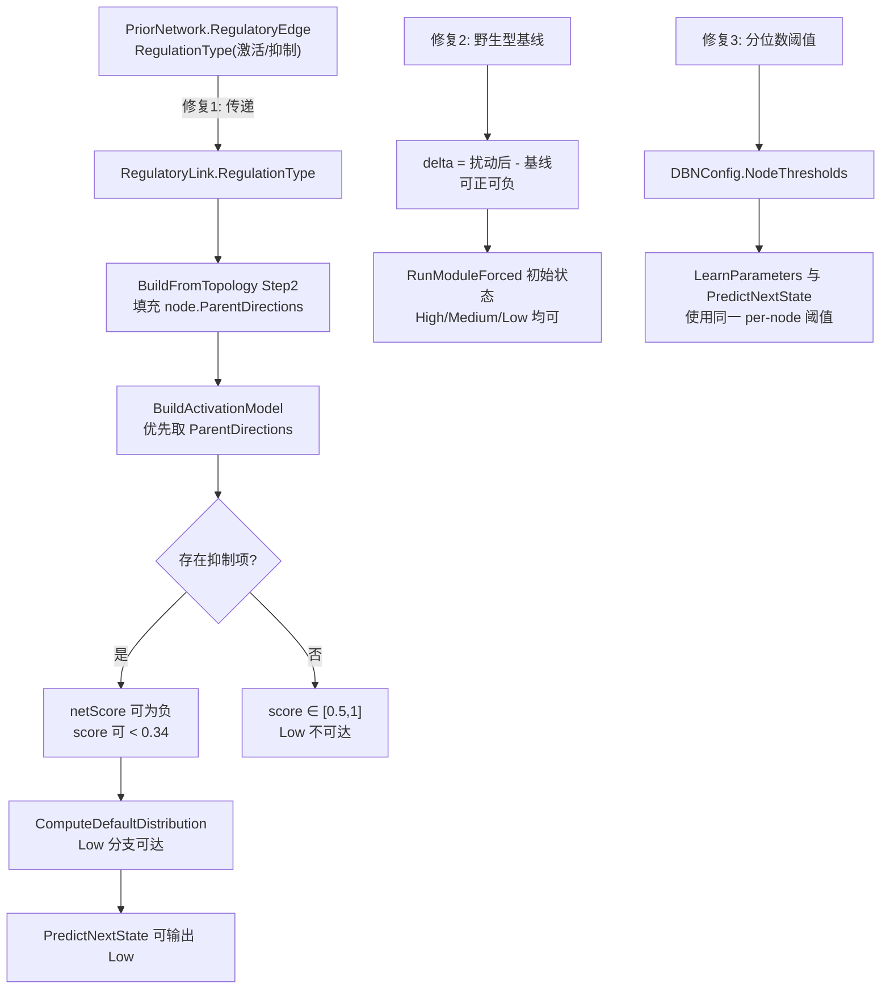

## 用户需求

用户运行流程测试后发现：虚拟扰动结果目录 `K:\hsa_grn\modular_response` 中的结果值几乎全是 1 或 2，几乎不出现 0，怀疑不正常。要求：

1. 审查 `ModularNetwork\BlockBayesianNetwork.vb` 相关的动态贝叶斯网络算法代码
2. **明确判定该现象是算法代码引起的，还是测试数据引起的**
3. 若审查发现算法实现问题，则进行代码修复
4. 修复后用 `dotnet build G:\Erica\src\Erica.sln -c Rsharp_app_release -p:Platform=x64` 编译，再运行 `"G:\GCModeller\src\R-sharp\App\net10.0\R#.exe" K:\hsa_grn\bnlearn.R --attach G:\Erica` 测试

## 产品概述

这是基因表达调控网络模拟系统的"模块化级联虚拟扰动"功能：对每个扰动基因，在其所属模块内固定为 Low 并多步推演基因状态轨迹，再沿模块关联图 BFS 逐级注入下游模块，最终汇总为全局响应向量（Low=0 / Medium=1 / High=2）。该结果用于刻画基因敲降后的全局表达响应，是下游生物学解读的直接输入。

## 核心功能（本次工作范围）

1. **问题定位**：确认扰动响应几乎全为 High 的根因，分清算法缺陷与数据缺陷各自的责任与权重。
2. **恢复调控方向**：让网络能够表达抑制性调控，使"下调"在模型语义上可达。
3. **修正级联传播语义**：把传播量由"绝对转录速率"改为"相对野生型基线的变化量"，消除恒为正导致的单向正反馈放大。
4. **修正离散化阈值**：使阈值与时间序列实际值域匹配，让 Low/Medium/High 三态在数据侧得到合理比例。
5. **可观测性**：输出调控方向统计与三态占比日志，便于验证修复效果。
6. **端到端验证**：编译后重跑全流程，用修复前后的三态分布对比作为验收指标。

## 约束与边界

- 主要改动集中在 BNLearn 项目（`DBN\`、`ModularNetwork\`）；`G:\Erica` 下的 `VelocityNetwork.BuildVelocityPrior` 硬编码 `Effector.Activator` 属于测试数据侧缺陷，只报告不擅自修改。
- 保持上一轮已完成的模型序列化（SaveModel/LoadModel）与惰性 CPT 机制继续可用，且不破坏 round-trip 保真性。
- 沿用既定编译配置 `Rsharp_app_release | x64` 与运行方式，并在 80GB 内存守护下运行长流程。

## 技术栈

- 语言/框架：VB.NET，目标 `net10.0`（`BNLearn.vbproj`，`OptionStrict Off` / `OptionInfer On`）
- 宿主运行时：R# 解释器（`R#.exe K:\hsa_grn\bnlearn.R --attach G:\Erica`）
- 构建：`dotnet build G:\Erica\src\Erica.sln -c Rsharp_app_release -p:Platform=x64`（产物落到 `G:\Erica\assembly\net10.0\SMRUCC.genomics.Analysis.BNLearn.dll`）
- 守护：`tools\watch-memory.ps1`（80GB 阈值，已验证可用）

## 现象实测（已统计，非推测）

`modular_global_perturbation_responses.tsv` 全部 44100 个取值：

| 取值 | 含义 | 个数 | 占比 |
| --- | --- | --- | --- |
| 0 | Low | 59 | 0.13% |
| 1 | Medium | 8224 | 18.6% |
| 2 | High | 35817 | **81.2%** |


单个扰动文件 `modular_pert_ENSG00000004809.tsv`（列结构 `gene | final_effect | peak_effect`）：2914 个 2、23 个 1、3 个 0（99% 为 High）。

## 判定结论：算法缺陷为主、数据/配置缺陷为辅，两者叠加

### A1【算法缺陷，最根本】调控方向在拓扑构建时被丢弃，网络中没有任何抑制边

`ModularNetwork\BlockModules.vb:59-80`：

```
''' 调控方向沿用 prior 的 RegulationType；      ← 注释声明
For Each e As RegulatoryEdge In prior.Edges
    If inModule.Contains(e.TF) AndAlso inModule.Contains(e.TargetGene) Then
        links.Add(New RegulatoryLink With {
            .TF_id = e.TF,
            .target_operon = e.TargetGene,
            .regulate_genes = {e.TargetGene},
            .effector = Nothing                  ← 实际完全没用 e.RegulationType
        })
```

而方向信息**确实存在且被正确赋值**：`RegulatoryEdge.RegulationType As Effector`（`Core\PriorNetwork.vb:77-101`），由 `CellPhenotype\GeneRegulatoryNetwork.vb:87-93` 的 `InferEffector(weight)`（`weight >= 0 → Activator`，`weight < 0 → Inhibitor`）在 :136-150 的 `prior.AddEdge(a, b, InferEffector(e.value), ...)` 处赋值。

因 `effector = Nothing`，`ComputeActivationScore` 走"无 effector"分支改用 `_nodes(tfId).DefaultRegulatoryDirection`，该字段在 `DBN\DBNNode.vb:98` 默认为 `Effector.Activator` 且**全项目从未被赋过其它值**。

**后果：Low 分支在数学上不可达**

- `hasActivator=True, hasInhibitor=False` → `netScore = activationScore ∈ [0,1]` → `score = 0.5 + 0.5*netScore ∈ [0.5, 1]`
- `ComputeDefaultDistribution` 的 `score < 0.34 → (0.1, 0.2, 0.7)` 分支**永远不可达**
- 叠加 `PredictNextState` 默认 `UseMultinomialSampling=False`（argmax）→ 预测只能是 High 或 Medium

附加事实：DBN 层只有 **per-TF** 的 `DefaultRegulatoryDirection`，无法表达 **per-edge（TF→gene）** 方向；而 `RegulationType` 是 per-edge 的，同一 TF 可对基因 A 激活、对基因 B 抑制。

### A2【算法缺陷】级联传播把"绝对速率"当作"上游变化量"，恒为正形成单向正反馈

`BlockBayesianNetwork.vb` `CascadeIntervene`：

```
Dim m0Rates = RunModuleSteps(m0, moduleStates(m0.ModuleColor), knockGene, steps, tfSet, moduleTraj(m0.ModuleColor))
Dim delta0 = If(m0Rates.Count > 0, m0Rates.Values.Average(), 0.0)
```

`RunModuleForced`：

```
Dim initState As String = If(upstreamDelta > 0.1, "High", If(upstreamDelta < -0.1, "Low", "Medium"))
For Each g In m.Genes : geneStates(g) = initState : Next
```

`RNAAbundanceChanges` = `ComputeExpectedRNARate` 的结果 `P(High)*1.0 + P(Medium)*0.5 + P(Low)*0.0`，取值恒 ∈ [0,1] 且通常远大于 0.1 —— 它是"绝对转录速率水平"而非"相对基线的变化量"。因此 `upstreamDelta > 0.1` 恒成立，**所有下游模块全部基因被强制初始化为 High**，多步推演形成正反馈把下游锁定在 High（这是 81% High 的主要放大源）。

### A3【健壮性】`RunModuleSteps` 的 traj 参数无空值保护

`traj(gene_id)(t) = StateToValue(...)` 未判空。修复 A2 需要跑一次不记录轨迹的野生型基线，必须先加保护。

### B1【数据/配置缺陷】时间序列值域与离散化阈值严重不匹配

- `DBNSampleProcessing.vb:172-175` 的离散化是**可选**的，`DBNSampleOptions.discretize` 默认 **False**（`DBNSampleOptions.vb:19`）
- R 脚本 `bnlearn.R:29` 未传 `discretize`，故 `binMatrix` 是**原始 log1p 表达值**（量级 0~10+，未归一化）
- DBN 阈值固定 `LowThreshold=0.33 / HighThreshold=0.66`（`DBN\DBNConfig.vb`），是按"已归一化到 [0,1]"设计的；log1p(x)=0.66 仅对应原始 count ≈ 0.94，**单细胞数据中几乎任何有表达的基因都会被判为 High**
- 该阈值同时用于 `LearnParameters`（学习时离散化序列）与 `PredictNextState`（推理时离散化证据），两侧一致地偏向 High

补充事实：由于数据稀疏性（每父配置平均样本数 ≈ 299/3^P，P=10 时约 0.005），**大量父配置学习后仍保持拓扑先验**，因此 A1 的修复（让先验的 Low 分支可达）对最终结果影响很大。

## 实现方案

### 修复 1（核心）：打通 per-edge 调控方向

- `DBN\RegulatoryLink.vb`：新增 `Public Property RegulationType As Effector = Effector.Activator`（默认值保持现有行为，向后兼容）
- `DBN\DBNNode.vb`：新增 `Public Property ParentDirections As New Dictionary(Of String, Effector)`（父节点 ID → 该父对本节点的调控方向）
- `DBN\DynamicBayesianNetwork.vb`：
- `BuildFromTopology` Step 2：用 `link.RegulationType` 填充 `geneNode.ParentDirections(link.TF_id)`（同一 (TF, gene) 多条边时以 `Confidence` 高者为准；`RegulatoryLink` 需能携带该信息，不可用则用后写覆盖并保证确定性）
- `BuildActivationModel`：方向优先取 `node.ParentDirections(tfId)`，取不到再回退 `DefaultRegulatoryDirection`
- `ModularNetwork\BlockModules.vb`：`BuildModuleRegulatoryLinks` 传 `.RegulationType = e.RegulationType`
- 预期：网络出现抑制边 → `netScore` 可为负 → `score` 可 < 0.34 → Low 分支可达

### 修复 2：级联传播量改为"相对野生型基线的变化量"

- `CascadeIntervene` 中先跑一次不做任何固定的野生型基线推演得到 `baselineRates`，再计算 `delta = 扰动后速率均值 - 基线速率均值`（可正可负）
- `RunModuleSteps` 增加 traj 空值保护，供基线推演复用
- 预期：下游模块初始状态不再恒为 High，负向扰动可传播为 Low

### 修复 3：自适应离散化阈值（学习侧与推理侧保持一致）

- `DBN\DBNConfig.vb`：新增 `Public Property NodeThresholds As New Dictionary(Of String, Tuple(Of Double, Double))`（per-node 离散化阈值）
- `DBN\DynamicBayesianNetwork.vb`：`GetThresholds` 优先级改为 `customThresholds` → `_config.NodeThresholds` → 默认 (0.33, 0.66)
- `ModularNetwork\BlockDynamics.vb` `TrainBlock`：对模块子矩阵按基因计算 33%/66% 分位数，写入 `net.Config.NodeThresholds` 后再调用 `net.LearnParameters(ts)`
- 因 `PredictNextState` 内部走 `GetThresholds(kv.Key, Nothing)`，会自动命中 `_config.NodeThresholds`，学习侧与推理侧天然一致
- `ModularNetwork\BlockBayesianNetwork.vb`：SaveModel 增加 `modules/xxxx/thresholds.tsv`（gene, low, high），LoadModel 读回并写入 `net.Config.NodeThresholds`，维持 round-trip 保真性

### 修复 4（可观测性）

- `BuildModuleRegulatoryLinks` / `BuildFromTopology`：输出激活边、抑制边、Unknown 边的数量统计
- `TrainBlock` / `LearnParameters`：输出离散化后 Low/Medium/High 三态占比
- `CascadeIntervene`：输出扰动前后的速率均值与 delta，便于确认传播方向

## 架构设计



## 目录结构

```
g:\GCModeller\src\GCModeller\sub-system\BNLearn\
├── DBN\
│   ├── RegulatoryLink.vb              # [MODIFY] 新增 Public Property RegulationType As Effector = Effector.Activator
│   │                                  #   默认值保持既有行为，向后兼容所有现有构造点
│   ├── DBNNode.vb                     # [MODIFY] 新增 Public Property ParentDirections As New Dictionary(Of String, Effector)
│   │                                  #   表达 per-edge（父→本节点）的调控方向
│   ├── DBNConfig.vb                   # [MODIFY] 新增 Public Property NodeThresholds（per-node 离散化阈值）
│   └── DynamicBayesianNetwork.vb      # [MODIFY] ① BuildFromTopology Step2 用 link.RegulationType 填 ParentDirections
│                                      #            ② BuildActivationModel 优先用 ParentDirections，回退 DefaultRegulatoryDirection
│                                      #            ③ GetThresholds 支持 _config.NodeThresholds
│                                      #            ④ 离散化三态占比诊断日志
├── ModularNetwork\
│   ├── BlockModules.vb                # [MODIFY] BuildModuleRegulatoryLinks 传 .RegulationType = e.RegulationType
│   │                                  #            并输出激活/抑制边数量统计
│   ├── BlockDynamics.vb               # [MODIFY] TrainBlock 按分位数计算 per-gene 阈值写入 net.Config.NodeThresholds
│   └── BlockBayesianNetwork.vb        # [MODIFY] ① CascadeIntervene 增加野生型基线推演与相对 delta
│                                      #            ② RunModuleSteps traj 空值保护
│                                      #            ③ SaveModel/LoadModel 持久化 thresholds.tsv
└── tools\
    └── watch-memory.ps1               # [已有] 80GB 阈值守护脚本，本轮验证继续使用
```

## 关键代码结构

```
' DBN\RegulatoryLink.vb —— 新增字段（默认保持既有行为）
Public Property RegulationType As Effector = Effector.Activator

' DBN\DBNNode.vb —— 新增 per-parent 方向映射
Public Property ParentDirections As New Dictionary(Of String, Effector)

' DBN\DBNConfig.vb —— 新增 per-node 离散化阈值
Public Property NodeThresholds As New Dictionary(Of String, Tuple(Of Double, Double))

' DBN\DynamicBayesianNetwork.vb —— 方向解析优先级（BuildActivationModel 内）
'   1) node.ParentDirections(tfId)      优先：per-edge 方向
'   2) _nodes(tfId).DefaultRegulatoryDirection   回退：per-TF 默认方向
```

## 实施注意事项（防回归）

- **向后兼容**：`RegulationType` 默认 `Effector.Activator`，`ParentDirections` 为空时回退原逻辑；未传该字段的既有构造点行为完全不变。
- **序列化兼容**：`NodeThresholds` 属于新增运行时状态，需随模型 zip 持久化（`thresholds.tsv`），否则加载后推理侧阈值回退为 0.33/0.66，会破坏上一轮已验证的 round-trip 保真性。修复后须重跑保真性对比。
- **惰性 CPT 协同**：`BuildActivationModel` 的改动会改变激活得分，进而改变惰性节点 `OnDemandProvider` 现场计算出的先验分布；这是预期行为（正是修复目标），但需确认不会触发新的规模/性能退化（父节点数与 CPT 行数不变）。
- **确定性**：同一 (TF, gene) 若存在多条 `RegulationType` 冲突的边，必须以确定性规则取值（优先 Confidence 高者，相同则按稳定顺序），保证结果可复现。
- **性能**：野生型基线推演使每个扰动基因的计算量约翻倍（steps × 模块基因数），当前全流程约 0.67 分钟，翻倍后仍远小于修改前的不可完成状态；基线推演不写轨迹，额外内存开销可忽略。
- **日志**：方向统计与三态占比按模块汇总输出，禁止逐基因/逐配置打日志造成 I/O 抖动。
- **影响面控制**：改动集中在 BNLearn 项目；`G:\Erica` 下的 `VelocityNetwork.BuildVelocityPrior:50` 硬编码 `Effector.Activator` 属于数据侧缺陷，只报告不修改（其影响的边数约 200 条，占比较小）。

## 验证要求

1. `dotnet build G:\Erica\src\Erica.sln -c Rsharp_app_release -p:Platform=x64`，0 error，并核对 `G:\Erica\assembly\net10.0\SMRUCC.genomics.Analysis.BNLearn.dll` 时间戳更新。
2. 在 `tools\watch-memory.ps1`（80GB 阈值守护）下运行 `R#.exe K:\hsa_grn\bnlearn.R --attach G:\Erica`。
3. **核心验收指标**：重新统计 `K:\hsa_grn\modular_response\modular_global_perturbation_responses.tsv` 的 0/1/2 分布。修复前基线为 **0:0.13% / 1:18.6% / 2:81.2%**；修复后 Low(0) 占比应显著上升、High(2) 占比显著下降，三态分布趋于合理。
4. 确认全程无异常日志、退出码 0、`modular_response` 正常产出、`bnlearn_model.zip` 正常生成。
5. 重跑 round-trip 保真性对比（保存前后扰动结果文件逐字节一致），确认序列化未被破坏。

## Agent Extensions

### SubAgent

- **code-explorer**
- 用途：在改动 `RegulatoryLink` / `DBNNode` / `DBNConfig` / `DynamicBayesianNetwork` / `BlockModules` / `BlockDynamics` 之后，跨 `G:\GCModeller\src` 与 `G:\Erica\src` 检索 `RegulationType`、`ParentDirections`、`NodeThresholds`、`DefaultRegulatoryDirection`、`BuildActivationModel`、`GetThresholds` 的全部引用点，确认无遗漏的构造点会导致"方向信息仍然丢失"，并核对是否存在其它构造 `RegulatoryLink` 的调用方需要同步设置 `RegulationType`。
- 预期结果：输出完整调用点清单（文件路径 + 行号），确认所有 `RegulatoryLink` 构造点都已正确传递方向信息，无遗漏、无冲突。