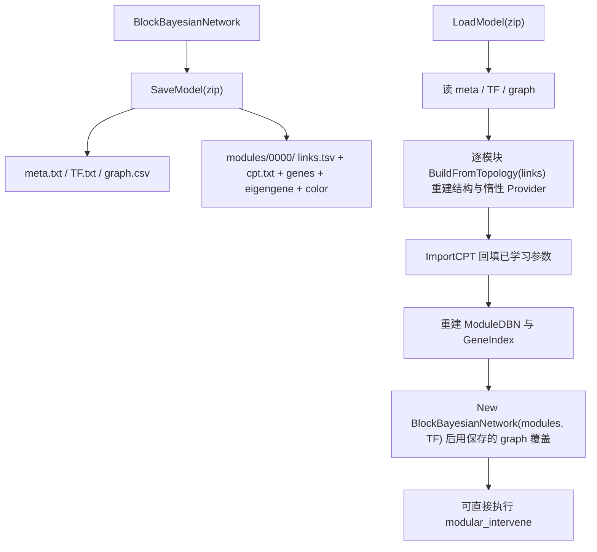

## 用户需求

为动态贝叶斯网络模型补上模型持久化能力：实现 `BlockBayesianNetwork.vb:244-259` 中的两个空函数 `SaveModel(file As Stream)` 与 `Shared LoadModel(file As Stream) As BlockBayesianNetwork`，把训练好的 `BlockBayesianNetwork` 对象保存为 zip 压缩包，并能从 zip 压缩包还原出可用对象实例。

## 产品概述

这是基因表达调控网络模拟系统（DBN）的模块化网络模型持久化功能。训练一次模块化 DBN 需要完整跑通单细胞表达矩阵 → Monocle3 伪时间 → 分箱时间序列 → 逐模块参数学习，代价较高；持久化后可直接复用已训练模型进行虚拟扰动推演。

## 核心功能

1. **模型导出**：把 `BlockBayesianNetwork`（模块子网络数组、模块间关联图、TF 列表）完整写入 zip 压缩包，落盘为 `K:\hsa_grn\bnlearn_model.zip`。
2. **模型导入**：从 zip 压缩包还原 `BlockBayesianNetwork` 实例，还原后的对象必须能直接用于 `modular_intervene` 级联虚拟扰动并产出响应结果。
3. **保真性**：round-trip 前后模型行为一致——包括上一轮优化引入的"惰性 CPT"节点，其在未缓存配置上必须仍按拓扑先验现场计算，而不是退化成均匀分布或 basal 分布。
4. **端到端验证**：按用户指定流程编译解决方案并运行 `bnlearn.R`，确认 `writeBin` / `readBin` 链路打通、后续扰动与结果导出正常、无异常日志。

## 约束与边界

- 仅新增成员与实现既有空函数，不改动 `SaveToFile` / `LoadFromFile` 等既有 API 的语义。
- 必须修正 R# 层 `writeBin` 的 generic 注册类型错误（否则 `writeBin` 必然分派失败）。
- 沿用上一轮确定的编译配置 `Rsharp_app_release | x64` 与运行方式，并在内存守护下运行长流程。

## 技术栈

- 语言/框架：VB.NET，目标 `net10.0`（`BNLearn.vbproj`，`OptionStrict Off` / `OptionInfer On`）
- 压缩包：.NET 内置 `System.IO.Compression.ZipArchive`（net10.0 共享框架自带，无需新增包引用）
- 宿主运行时：R# 解释器（`R#.exe K:\hsa_grn\bnlearn.R --attach G:\Erica`），通过 generic 分派调用 `SaveModel` / `LoadModel`
- 构建：`dotnet build G:\Erica\src\Erica.sln -c Rsharp_app_release -p:Platform=x64`
- 守护：`tools\watch-memory.ps1`（已就绪，80GB 阈值）

## 已核实的调用链与关键事实

写入：`writeBin` → `generic.get("writeBin", 对象运行时类型)` → `bnlearn.vb:110 SaveModelZip` → `model.SaveModel(con)`。
读取：`readBin(what="modular_bayesian")` → `readBinOverloads` → `generic.get("readBin.modular_bayesian", GetType(Stream))` → `bnlearn.vb:117 LoadModelZip` → `BlockBayesianNetwork.LoadModel(s)`。

关键约束（代码证据 `G:\GCModeller\src\R-sharp\R#\Runtime\Internal\generic.vb:110-116`）：

```
Public Function [get](name As String, type As Type) As GenericFunction
    If Not generics.ContainsKey(name) Then Return Nothing
    Return generics(name).TryGetValue(type)   ' 严格精确匹配，无 BaseType / 接口回退
End Function
```

因此 `bnlearn.vb:106` 注册为 `GetType(NumericMatrix)` 但运行期按 `GetType(BlockBayesianNetwork)` 查询，必然返回 `Nothing`；且与 `Rlapack\RMatrix.vb:121` 的同名注册互相覆盖（`generic.add` 用索引器赋值）。**必须改为 `GetType(BlockBayesianNetwork)`。**

## 实现方案：保存拓扑 + 回填 CPT

直接用 `DynamicBayesianNetwork.SaveToFile` / `LoadFromFile` 会导致行为退化：它们只保存 `NodeId/Type/States/ParentIds` 与 CPT 条目，**不保存 `RegulatorTFs` / `TFEffectors` / `EffectorMetabolites`**，加载后激活得分恒为 0.5，惰性 CPT 的 `OnDemandProvider` 对未缓存配置只能给出 basal 分布 `(0.25/0.5/0.25)`，与训练后模型的拓扑先验不一致。

因此采用"保存拓扑 → 用 `BuildFromTopology` 重建 → 回填 CPT"：

1. 每个模块落盘 `_topologyLinks`（`RegulatoryLink()`）；
2. 加载时 `New DynamicBayesianNetwork().BuildFromTopology(links)` 自动恢复 `ParentIds`、`RegulatorTFs`、`TFEffectors`、`EffectorMetabolites`、`_activationModels` 以及惰性节点的 `OnDemandProvider`（含自环过滤与 `MaxParents` 兜底，与训练时语义完全一致）；
3. 再把保存的 CPT 条目回填覆盖（`LearnParameters` 学到的后验参数），惰性节点未覆盖的配置仍走 `OnDemandProvider`。

该方案复用既有构建逻辑，不重复实现一套结构恢复代码。



## 目录结构

```
g:\GCModeller\src\GCModeller\sub-system\BNLearn\
├── DBN\
│   └── DynamicBayesianNetwork.vb        # [MODIFY] 新增三个成员（纯新增，不改既有语义）：
│                                        #   - Public ReadOnly Property TopologyLinks As RegulatoryLink()
│                                        #     暴露私有 _topologyLinks，供模型序列化落盘
│                                        #   - Public Sub ExportCPT(writer As TextWriter)
│                                        #     按既有 "CPT|nodeId|key|p1,p2,p3" 文本格式流式导出全部 CPT 条目
│                                        #   - Public Sub ImportCPT(reader As TextReader)
│                                        #     合并式导入 CPT 条目（只覆盖已存在节点的条目，不重建 _nodes，
│                                        #     与 LoadFromFile 的清空重建语义区分开）
├── ModularNetwork\
│   └── BlockBayesianNetwork.vb          # [MODIFY] 实现 SaveModel / LoadModel，并新增私有序列化辅助：
│                                        #   - zip 布局读写（meta / TF / graph / 模块目录）
│                                        #   - RegulatoryLink 与文本行的双向转换
│                                        #   - ModuleDBN 组装（含 GeneIndex 重建）
│                                        #   顶部追加 Imports System.IO.Compression
└── tools\
    └── watch-memory.ps1                 # [已有] 内存守护脚本，本轮验证继续使用

G:\GCModeller\src\workbench\R#\biosystem\
└── bnlearn.vb                           # [MODIFY] L106 注册类型 NumericMatrix -> BlockBayesianNetwork
```

## 关键代码结构

```
' ModularNetwork\BlockBayesianNetwork.vb —— 待实现的两个函数（签名保持既有不变）
Public Sub SaveModel(file As Stream)
Public Shared Function LoadModel(file As Stream) As BlockBayesianNetwork

' DBN\DynamicBayesianNetwork.vb —— 新增支撑成员
Public ReadOnly Property TopologyLinks As RegulatoryLink()
Public Sub ExportCPT(writer As TextWriter)
Public Sub ImportCPT(reader As TextReader)
```

## zip 布局

```
bnlearn_model.zip
├── meta.txt              # version=1 / blocks=N / tf_count=M（版本校验用）
├── TF.txt                # 每行一个 TF id
├── graph.csv             # from,to,weight（double 用 InvariantCulture）
└── modules/0000/
    ├── color.txt         # 模块颜色
    ├── genes.txt         # 每行一个基因
    ├── eigengene.txt     # 每行一个 double（InvariantCulture）
    ├── links.tsv         # TF_id / TF_family / TFBS_id / target_operon / regulate_genes(;分隔) / effectors(id:type;...)
    └── cpt.txt           # CPT|<nodeId>|<key>|<p1,p2,p3>
```

模块目录用**序号命名**（`modules/0000/`），避免模块颜色（如 `turquoise_blue`）中的特殊字符影响 entry 名，颜色值写入 `color.txt`。

## 实现注意事项（防回归）

- **ZipArchive 生命周期**：`SaveModel` 必须用 `Using zip As New ZipArchive(file, ZipArchiveMode.Create, leaveOpen:=True)` —— 不 Dispose 则 zip 中央目录不落盘、文件损坏；`leaveOpen:=True` 是因为 `writeBin` 之后会自行 Dispose 底层流（且 `SaveModelZip` 里还会 `con.Flush()`）。`LoadModel` 同理用 `ZipArchiveMode.Read, leaveOpen:=True`（`readBin` 会在 `is_path` 时 Dispose 流）。
- **graph 覆盖**：`BlockBayesianNetwork` 只有带参构造函数，构造时会用恢复的 `Eigengene` 重算 `graph`；加载后需**用保存的 graph 直接覆盖** `graph` 属性，避免依赖阈值一致性（构造函数默认 0.3）。
- **GeneIndex 重建**：由 `Genes` 按索引重建，保持 `StringComparer.OrdinalIgnoreCase`。
- **流式读写**：CPT 条目可能达百万级（943 个惰性节点 × 每节点缓存 ≤2000 条），必须用 `StreamWriter`/`StreamReader` 逐行流式处理，禁止先拼大字符串再写。
- **数值格式**：所有 double 一律 `InvariantCulture` 读写，避免区域小数点导致解析失败。
- **文本字段分隔**：基因 id 不含分号，用 `;` 分隔列表项、`:` 分隔 effector 的 `id:type`；`effector` 为 `Nothing` 或 `regulate_genes` 为空时写空串并在读取时还原为 `Nothing`/空数组。
- **entry 名兼容**：读取时按 `FullName` 标准化（统一 `/` 分隔符）匹配，避免不同 zip 工具产生的分隔符差异。
- **惰性 CPT 协同**：`ImportCPT` 只写 `node.CPT.Table(key)`，**不得重置** `OnDemandProvider` / `MaxCacheRows`，否则惰性节点会退化为均匀分布。
- **版本校验**：`meta.txt` 写入 `version=1`，加载时校验，不匹配则抛出信息明确的异常。
- **影响面控制**：新增成员均为纯新增；`bnlearn.vb` 只改一个类型参数，不影响 `NumericMatrix` 的既有注册（改后不再与之冲突）。

## 性能与规模

- 保存/加载复杂度为 O(拓扑边数 + CPT 条目数)，与内存中的模型规模线性相关；启用 `CompressionLevel.Optimal`（默认 Deflate）以压缩文本条目。
- 全流程内存基线为上一轮优化后的 3.61 GB，序列化阶段新增开销仅为流式缓冲，不会显著抬高峰值。

## Agent Extensions

### SubAgent

- **code-explorer**
- 用途：在完成 `DynamicBayesianNetwork` 新增成员与 `BlockBayesianNetwork` 序列化实现后，跨 `G:\GCModeller\src` 与 `G:\Erica\src` 检索 `TopologyLinks`、`ExportCPT`、`ImportCPT`、`SaveModel`、`LoadModel` 的调用点，确认无外部调用方受影响，并复核 `RegulatoryLink` / `ModuleDBN` 字段有无遗漏持久化项。
- 预期结果：输出调用点清单（文件路径 + 行号）与"字段持久化完整性"结论，确认无遗漏、无冲突。