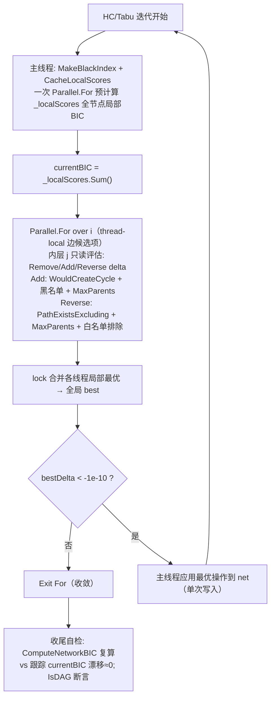

## 产品概述

对 GCModeller 贝叶斯网络结构学习模块（BnStructureLearner）执行已评审确认的性能重构与缺陷修复，并用现有测试工程验证结果正确性与加速效果。

## 用户需求

1. **按既定方案实施并行化优化**：

- 取消 `ComputeNetworkBIC` 在热路径（每次操作评估）中的调用与内部细粒度 `Parallel.For`；
- 将 `HillClimbingSearch` 中 StructureLearning.vb:362 最外层 `For i` 循环并行化；
- 采用 delta 局部性评分：加/删边只影响目标节点局部分，反转只影响两端节点，配合每迭代一次的并行预缓存，消除“试改-恢复”共享网络变异模式。

2. **修复代码审查发现的 5 项缺陷**：

- ComputeNodeBIC 奇异矩阵分支用均值当索引的越界 bug；
- Reverse 操作缺少对源节点 i 的 MaxParents 约束；
- 白名单正向边可被误删除/反转；
- TabuSearch 同样改为高效 delta 骨架；
- PrecomputeStatistics 相关矩阵 O(nG²·nS) 串行计算并行化。

3. **运行 test\Program.vb 测试验证并行化准确性**：不得修改该测试文件；通过运行验证流程跑通、最终 BIC 无漂移、网络保持合法 DAG、观察耗时改善。

## 视觉/效果预期

功能无界面变化；训练阶段 CPU 利用率显著提升（多核打满），结构学习耗时数量级缩短，控制台日志中可看到各阶段耗时与"BIC 漂移≈0"的一致性自检输出。

## 技术栈

- 语言/运行时：VB.NET，SDK 风格工程（test.vbproj 目标 net10.0，x64/AnyCPU）
- 并行原语：System.Threading.Tasks.Parallel（顶层一次性 fork/join + thread-local 归约）；禁止嵌套细粒度并行
- 回归求解：沿用 Microsoft.VisualBasic.Data.Bootstrapping.Multivariate.NormalEquation.LinearRegression（X'X 求逆，nP≤5 小矩阵）

## 实施思路（关键决策）

1. **去变异化**：循环体不再修改 net，仅基于“假想父集合”调用新纯函数 `ScoreNodeWithParents(nodeIdx, parents)` 计算单节点局部 BIC，从根本上消除线程竞争（Adjacency/Parens List/WouldCreateCycle 读脏数据）。
2. **delta 评分 + 每迭代预缓存**：迭代开始时一次 `Parallel.For` 预计算全部节点当前局部 BIC 缓存 `_localScores`，`currentBIC = Σ缓存`（天然消除浮点累计漂移）；每个 (i,j) 操作评估只需重算 1~2 个节点，单次评估成本从 O(nG·cost) 降至 O(cost)。
3. **外层并行归约**：`Parallel.For(Of EdgeCandidate)` 对 i 循环分区，thread-local 局部最优 + 锁合并取严格最小 delta（并列 tie 不保证串行字典序，属已知可接受非确定性）。
4. **只读无环检测**：Add 复用 `net.WouldCreateCycle`（纯只读 BFS）；Reverse 新增 `PathExistsExcluding(from,to,禁排直接边)` BFS（排除被删正向边后判定 i⇒j 路径是否存在），等价于原“先删再加”语义且不触碰共享状态。
5. **黑名单/候选集保护语义保持**：MakeBlackIndex 在主线程每迭代重建 HashSet，worker 只读；candidateEdges 过滤顺序与原逻辑一致。
6. **自检埋点**：搜索结束时用 `ComputeNetworkBIC(net)` 复算并与内部跟踪 currentBIC 比对（预期差值≈1e-9 内），作为并行记账正确性的直接证据；`net.IsDAG()` 断言。
7. **性能与可靠性**：表达向量在 Learn 开头一次性物化为 `_geneExpr(g)` 列数组，消除 GetGeneExpression 热路径每次 new 数组的 GC 压力；PrecomputeStatistics 相关矩阵采用并行填上三角 + 串行镜像两遍法避免同格竞写；ComputeNetworkBIC 公共签名不变，内部委托同一套缓存实现（全网级一次 fork/join，供终点校验复用）；MMPCPhase 补充目标节点粒度并行（ConcurrentBag 收集后合并），因为测试默认算法为 MMHC，否则长尾串行 MMPC 掩盖整体收益。

## 架构设计



## 目录结构（仅涉及修改的文件）

```
sub-system/BNLearn/
├── StructureLearning/
│   └── StructureLearning.vb        # [MODIFY] 唯一被实质修改的源文件（详见下方注记）
└── test/
    ├── test.vbproj                 # [不改] net10.0 控制台工程，用于编译运行
    └── Program.vb                  # [不改] 用户验收测试入口，按要求原样运行
```

### StructureLearning.vb 注记

- 新增私有字段：`_geneExpr As Double()()`（基因表达列物化）、`_localScores As Double()`（局部BIC缓存）
- 新增方法：`MaterializeColumns`、`ScoreNodeWithParents`、`CacheLocalScores`、`RootlessScore`（无父公式共用）、`PathExistsExcluding`、`EvaluateOpsForIJ`（HC/Tabu 共用的合法性+delta 三操作评估器）、私有类型 `EdgeCandidate`
- 改造方法：`HillClimbingSearch`（delta + 外层并行归约 + 白名单保护 + Reverse 上限检查 + 收尾自检）、`TabuSearch`（切至同一骨架，保留禁忌表语义）、`ComputeNodeBIC`（修复奇异分支，退化为无父模型评分并消除越界索引）、`PrecomputeStatistics`（相关矩阵上三角并行 + 镜像回填）、`ComputeNetworkBIC`（公共 API 不变，内部改为调用并行缓存的 Sum）、`MMPCPhase`（target 层 Parallel.ForEach/For + ConcurrentBag 合并候选边，白名单注入逻辑不变）、`Learn`（开头调用 MaterializeColumns）