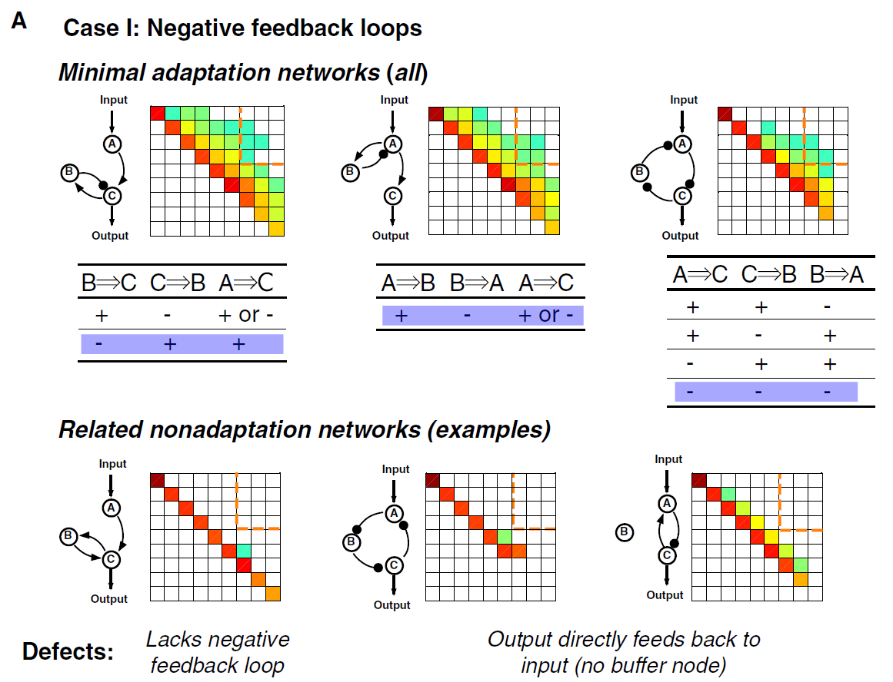

###### Figure 2. Minimal Networks (%3 Links) Capable of Adaptation
+ (A) Adaptive networks composed of negative feedback loops. Three examples of adaptation networks are shown in the upper panel. Each is one member(shaded) of a group of similar adaptation networks, whose signs of regulations are listed underneath. For comparison, three examples of nonadaptive networks are shown in the low panel, with their ‘‘defects’’ for adaptation function listed underneath.
+ (B) Adaptive networks composed of incoherent feedforward loops. The only two minimal adaptation networks in this case are shown in the upper panel. Examples of nonadaptive networks are shown in the lower panel.