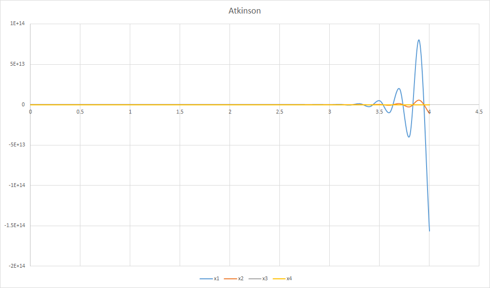

# PLAS.NET
Biosystem analysis tool based on SSystem, and this is the re-implementation of the PLAS software in VB.NET language.

PLAS download:

http://www.dqb.fc.ul.pt/docentes/aferreira/plasdownm.html

+ Yun Lee, Po-Wei Chen, Eberhard O. Voit, Analysis of operating principles with S-system models, Mathematical Biosciences, Volume 231, Issue 1, May 2011, Pages 49-60, ISSN 0025-5564, http://dx.doi.org/10.1016/j.mbs.2011.03.001.
(http://www.sciencedirect.com/science/article/pii/S0025556411000319)

+ Eberhard O. Voit, Symmetries of S-systems, Mathematical Biosciences, Volume 109, Issue 1, 1992, Pages 19-37, ISSN 0025-5564, http://dx.doi.org/10.1016/0025-5564(92)90050-7.
(http://www.sciencedirect.com/science/article/pii/0025556492900507)

+ Eberhard O. Voit, Recasting nonlinear models as S-systems, Mathematical and Computer Modelling, Volume 11, 1988, Pages 140-145, ISSN 0895-7177, http://dx.doi.org/10.1016/0895-7177(88)90469-4.
(http://www.sciencedirect.com/science/article/pii/0895717788904694)


### Script syntax

##### Decalre a Reaction Dynamics

```bash
RXN <var>=<S-Equation>
```

##### Declare variable and constant

```bash
# For declare a constant
CONST <constant> <value>

# For declare a variable
INIT <var>=<init_value>
```

##### Time Stops

```bash
FINALTIME <float_value>
```

##### Comments

```bash
/* S-Equations */
// Example comment 1
# Another comment style
COMMENT NO COMMENT
```

##### Mics

```bash
# Script title
TITLE <title text>
# variable alias
NAMED <var> <alias>
```


### Example

##### Hull system

Script:
```bash
RXN z1=2.5*(z1-z1*z2)
RXN z2=-1.6*(z2-z1*z2)

INIT z1=2
INIT z2=3

FINALTIME 50
```

Open terminal, and then run this script using PLAS.NET:

```bash
PLAS Run run -i "./Hull.txt" -f script
```


##### Atkinson system

```
RXN x1=beta1*(lamda1*(1+alpha1*(x4^n1)/(1+x4^n1))-x1)
RXN x2=x1-x2
RXN x3=beta3*(lamda3*(1+alpha2*((x4/a)^n2)/(1+(x4/a)^n2))*(1/(1+x2^n3))-x3)
RXN x4=beta4*(x3-x4)

CONST beta1 30
CONST beta3 30
CONST beta4 1
CONST lamda1 2
CONST lamda3 2
CONST alpha1 20
CONST alpha2 20
CONST alpha3 1
CONST a 1
CONST n1 4
CONST n2 5
CONST n3 1

INIT x1=-100
INIT x2=-100000
INIT x3=0
INIT x4=10

FINALTIME 4.5
```

