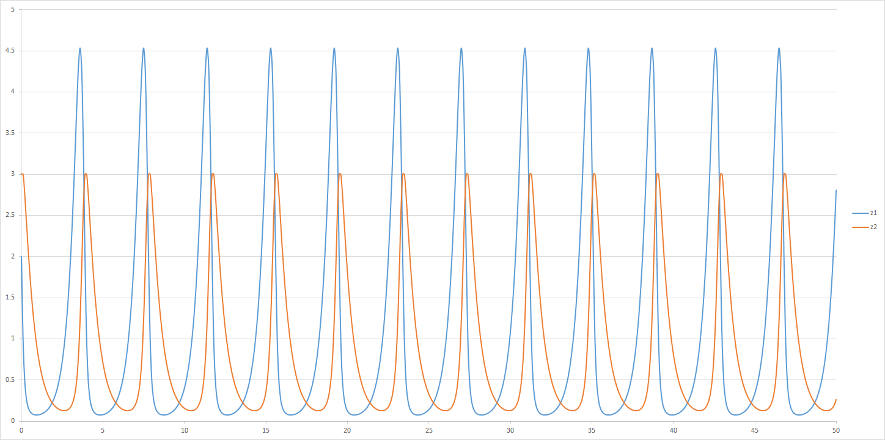

# PLAS.NET
Biosystem analysis tool based on SSystem

### Script syntax

##### Decalre a Reaction Dynamics

```bash
RXN <var>=<S-Equation>
```

##### Declare variable and constant

```bash
# For declare a constant
CONST <constant> <value>

# For declare a variable
INIT <var>=<init_value>
```

##### Time Stops

```bash
FINALTIME <float_value>
```

##### Comments

```bash
/* S-Equations */
// Example comment 1
# Another comment style
COMMENT NO COMMENT
```

##### Mics

```bash
# Script title
TITLE <title text>
# variable alias
NAMED <var> <alias>
```


### Example

##### Hull system

Script:
```bash
RXN z1=2.5*(z1-z1*z2)
RXN z2=-1.6*(z2-z1*z2)

INIT z1=2
INIT z2=3

FINALTIME 50
```

Open terminal, and then run this script using PLAS.NET:

```bash
PLAS Run run -i "./Hull.txt" -f script
```

