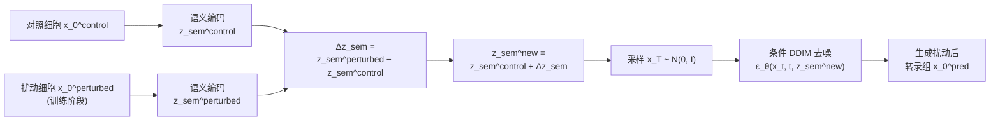

SquiDiff（Single-cell QUantitative Inference of stimuli responses by DIFFusion models）是一个**基于条件 DDIM（Denoising Diffusion Implicit Model）与扩散自编码器架构的生成式框架**：它先用一个 VAE 语义编码器把细胞表达谱与扰动信息压缩为低维语义隐变量 $z_{sem}$，再由一个以 $z_{sem}$ 为条件的 DDIM 去噪网络从高斯噪声逐步"雕刻"出目标转录组，扰动效应则通过在 $z_{sem}$ 空间中做向量加法或线性插值来编码。下面分层拆解其原理。
---
## 一、为何将扩散模型引入单细胞扰动预测
传统扰动预测模型各有局限：scGen 基于 VAE + 隐空间线性向量算术，假设扰动在隐空间中是线性可加的；CellOT 用最优传输，需要在扰动前后分布之间显式对齐；GEARS 用图神经网络，主要针对基因扰动的组合外推。这些方法在预测高度瞬态（transient）的细胞状态、跨细胞类型迁移、以及非可加性基因扰动时表现不佳，因为它们难以建模转录组数据分布的高维非线性结构。
扩散模型的优势恰好在于：**通过迭代去噪过程学习比 VAE 更丰富、更复杂的数据分布**，且与 VAE 结合后能在隐空间中实现平滑的语义插值。SquiDiff 正是利用这两点，把"扰动预测"重构为"在条件扩散模型隐空间中沿语义方向采样"的问题。
---
## 二、前向扩散过程：逐步加噪
设单细胞基因表达向量为 $x_0$（论文中对数归一化后取 top 500 高变基因）。前向过程是一个固定参数的马尔可夫链，在 $T$ 个时间步内逐步向数据注入高斯噪声：
$$
q(x_t \mid x_{t-1}) = \mathcal{N}\big(x_t;\ \sqrt{1-\beta_t}\, x_{t-1},\ \beta_t \mathbf{I}\big)
$$
其中 $\beta_t$ 是噪声调度超参数，SquiDiff 中在 $[0.001, 0.01]$ 上线性取值。利用重参数化技巧，任意时刻的 $x_t$ 可以一步直接从 $x_0$ 采样：
$$
x_t = \sqrt{\bar{\alpha}_t}\, x_0 + \sqrt{1-\bar{\alpha}_t}\, \epsilon,\quad \epsilon \sim \mathcal{N}(0, \mathbf{I})
$$
其中 $\bar{\alpha}_t = \prod_{s=1}^{t} (1-\beta_s)$ 是累积乘积。当 $t \to T$ 时，$\bar{\alpha}_T \to 0$，$x_T$ 近似为标准高斯噪声——这为反向生成提供了任意起点。论文的可视化也印证了这一点：随着扩散步数增加（0→100→…→499），原本分属不同细胞类型的聚类逐渐弥散为一个统一分布。
---
## 三、反向去噪过程：DDIM 与噪声预测网络
反向过程的目标是学习 $p_\theta(x_{t-1} \mid x_t, z_{sem})$。与标准 DDPM 不同，Squiiff 采用 **DDIM 的确定性生成轨迹**：
$$
x_{t-1} = \sqrt{\bar{\alpha}_{t-1}}\, \hat{x}_0 + \sqrt{1-\bar{\alpha}_{t-1}}\, \epsilon_\theta(x_t, t, z_{sem})
$$
其中 $\hat{x}_0$ 是由当前噪声估计反推的"干净数据"预测：
$$
\hat{x}_0 = \frac{x_t - \sqrt{1-\bar{\alpha}_t}\, \epsilon_\theta(x_t, t, z_{sem})}{\sqrt{\bar{\alpha}_t}}
$$
$\epsilon_\theta(\cdot)$ 是去噪神经网络，在 SquiDiff 中实现为**带残差连接与条件批归一化（Conditional Batch Normalization）的多层感知机（MLP）**，用于预测被注入的噪声 $\epsilon$。时间步 $t$ 通过**正弦位置编码**注入网络，无需额外可学习参数即可表达尺度不变的时间信息。
DDIM 的确定性有两个关键收益：一是采样路径固定，减少了随机性带来的方差；二是**该确定性过程可被反向运行**——给定 $x_0$，可以逐步"编码"得到对应的随机子码 $x_T$，这正是扩散自编码器的"编码"一半。
---
## 四、条件机制：语义编码器 + 随机子码的双隐变量设计
单纯的 DDIM 编码得到的 $x_T$ 只携带低层的随机细节，缺乏高层语义——直接对两个 $x_T$ 做插值不会产生语义平滑的变化。为解决此问题，Squiiff 借鉴扩散自编码器的设计，引入第二个隐变量：
| 隐变量 | 编码来源 | 携带信息 | 作用 |
|---|---|---|---|
| $z_{sem}$ | VAE 语义编码器 $\text{Enc}(x_0)$（MLP） | 细胞类型、状态、扰动等高层语义 | 条件化去噪网络，决定生成的"内容" |
| $x_T$ | 确定性 DDIM 反向编码 | 低层随机细节（如基因表达噪声） | 提供生成的"细节纹理" |
解码时，条件 DDIM 以联合隐变量 $z = (z_{sem}, x_T)$ 为输入，整个反向过程写作：
$$
x_{t-1} = f_\theta(x_t, t, z_{sem}) = \sqrt{\bar{\alpha}_{t-1}}\, \hat{x}_0 + \sqrt{1-\bar{\alpha}_{t-1}}\, \epsilon_\theta(x_t, t, z_{sem})
$$
语义编码器是一个 MLP，采用条件批归一化 + 残差连接结构，把 $x_0$ 映射为 $z_{sem} = \text{Enc}(x_0)$。这种"语义条件化"机制与无分类器引导不同：Squiiff 不需要在采样时混合条件与无条件得分，而是直接把 $z_{sem}$ 作为网络的显式输入，通过条件批归一化层注入。
---
## 五、训练目标
训练采用标准的简化噪声预测损失（去噪得分匹配形式）：
$$
\mathcal{L}_{\text{simple}} = \mathbb{E}_{t, x_0, \epsilon}\Big[ \big\| \epsilon - \epsilon_\theta(x_t, t, z_{sem}) \big\|^2 \Big]
$$
即随机采样时间步 $t$，对 $x_0$ 加噪得到 $x_t$，让网络在 $z_{sem}$ 条件下预测所加的噪声。优化器为 Adam，学习率 $10^{-3}$，训练在单块 80 GB H100 上完成。
---
## 六、扰动预测：隐空间操作与条件生成
这是 Squiiff 框架最核心的一步。预测扰动后转录组的流程如下：

具体有两种隐变量操作方式：
1. **向量加法**：$\Delta z_{sem} = z_{sem}^{perturbed} - z_{sem}^{control}$，代表扰动在隐空间中的"方向向量"；将 $\Delta z_{sem}$ 加到新的对照细胞隐变量上，再用条件 DDIM 解码，即得该细胞受同一扰动后的预测转录组。这适用于基因敲除、药物处理等离散条件。
2. **线性插值**：$\text{Lerp}(z_A, z_B, t) = (1-t) z_A + t z_B$，用于生成两个状态之间的连续过渡态（如分化过程中的中间态），$t \in [0,1]$ 控制插值位置。这适用于时间序列分化、发育轨迹重建。
注意 $z_{sem}$ 代表的是一段扰动/分化的**平均方向**，而非精确的瞬时动态——论文指出 day 2/3 的真实隐变量与插值结果有偏差，因为每天施加的生长因子不同。
---
## 七、与 scGen、GEARS、CPA 的核心差异
| 模型 | 生成机制 | 隐空间操作 | 局限 |
|---|---|---|---|
| scGen | VAE 解码 | 隐空间线性向量算术 | 假设线性，隐空间分布表达能力有限 |
| GEARS | GNN 前向预测 | 无显式隐空间 | 主要面向基因扰动，对连续状态过渡弱 |
| SquiDiff | **条件 DDIM 迭代去噪** | **语义隐空间 + 扩散子码联合解码** | 训练慢、计算开销大 |
Squiiff 的优势本质上来自扩散模型对数据分布的更强表达能力：DDIM 的迭代去噪可以拟合 VAE 难以建模的复杂多模态分布，而 $z_{sem}$ 的语义条件化保留了可解释、可操作的隐空间结构，$\Delta z_{sem}$ 的向量算术继承了 scGen 的直观性，但解码端由扩散模型完成，能生成高分辨率、非线性的转录组景观。
---
## 八、方法小结
Squiiff 的创新不在扩散模型本身（前向加噪、DDIM 去噪、噪声预测损失均为标准组件），而在于**将扩散自编码器架构适配到单细胞转录组，并以 $z_{sem}$ 作为可操作的条件接口**：前向扩散把转录组打散为噪声，反向去噪在 $z_{sem}$ 条件下重建；扰动被视为隐空间中的一个方向向量，通过向量加法或插值注入；解码端用 DDIM 而非 VAE 解码器，从而在保留语义可操纵性的同时，获得对复杂转录组分布的高保真生成能力。这种设计使其能够捕捉瞬态细胞状态、预测非可加性基因扰动，并进行跨细胞类型的药物响应外推。
