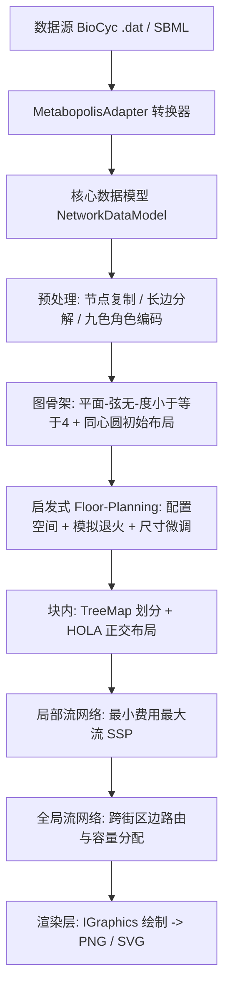

## Product Overview

在 Metabopolis 项目中新增一套面向大型代谢网络的自动化布局与可视化能力：把代谢网络的"反应-代谢物"关系，按功能类别划分为若干矩形"街区"，在街区内进一步划分建筑块并做正交布局，再通过网格道路把跨街区的连接路由出来，最终自动生成一幅类似城市规划地图的代谢通路图。项目同时提供数据源适配层，可从 BioCyc 数据库与 SBML 文件读取原始网络数据。

## Core Features

- 数据源适配：从 BioCyc PGDB（.dat 文件）与 SBML 文件解析出统一代谢网络模型；BioCyc 按通路（IN-PATHWAY）作为类别，SBML 按 compartment 作为类别。
- 网络预处理：对水分子等重要度低或高连接度的代谢物做节点复制，降低图密度；把长有向边分解为有向段与可捆绑的无向段；对类别间代谢物角色做九种颜色编码。
- 图骨架构建：基于类别间共享代谢物频次生成生成树并贪心扩展，保证骨架为平面图、弦无图且最大度数不超过 4；按拓扑距离把类别放置在同心圆上生成无交叉初始布局。
- 约束式区块排布：按论文的贴附、无重叠、相对位置、重心保持等约束，配合紧凑、期望长宽比、共享边界等美学目标，启发式求解出无重叠的街区布局，并做第二轮尺寸微调以提升屏幕利用率。
- 分层路由：街区内用树状空间填充划分出建筑块并对子网络做正交布局；重要代谢物落在街区边界作枢纽；用最小费用最大流生成车道，再用全局流网络完成跨街区边路由与容量控制。
- 可视化输出：基于 GDI+ 绘制街区、道路网格、反应边、枢纽代谢物、类别标题与颜色图例，并同时支持位图（PNG）与矢量（SVG）两种输出。

## Visual Effect

输出图像呈"城市规划地图"风格：不同功能类别对应不同底色的大矩形街区，街区之间留有正交网格状道路；街区内是灰度的建筑块与紧凑排布的反应子图；跨街区的代谢物连接以带方向的彩色线束沿道路与街区边界走线，颜色区分底物/产物/双向等角色组合；重要代谢物以枢纽节点标注在街区边界；整体配色分区明确、线条横平竖直、层次分明，既能看到类别级的全局结构，也能看到街区内的反应细节。

## Tech Stack

- 语言/框架：VB.NET，`net10.0`（Metabopolis、MetabopolisAdapter）/ `net10.0-windows`（test），沿用仓库现有 VB 语法风格（XML 文档注释、`Public Class`/`Module`）。
- 图与布局：复用 `Microsoft.VisualBasic.Data.visualize.Network.Graph`（`NetworkGraph`/`Node`/`Edge`/`NodeData`/`EdgeData`、`FDGVector2`）；块内正交布局复用 `Microsoft.VisualBasic.Data.visualize.Network.Layouts.Hola.HOLA`。
- 绘图：复用 `Microsoft.VisualBasic.Imaging.IGraphics` + `Microsoft.VisualBasic.Imaging.Drawing2D.g.GraphicsPlots` + `Microsoft.VisualBasic.Imaging.Driver.Drivers`，同一份绘制代码切换 GDI 位图与 SVG。
- 几何与算法：复用 `Drawing2D.Math2D.ConvexHull.GrahamScan`、`Layouts.Cola.Geom`（`polysOverlap`/`isPointInsidePoly`/`intersects`）、`GraphTheory` 的 `DijkstraRouter`/`Kruskal`/`PQTree`。
- 数据源：`SMRUCC.genomics.Data.BioCyc.Workspace`、`SMRUCC.genomics.Model.SBML.Level3.XmlFile`；统一目标模型复用 `SMRUCC.genomics.MetabolicModel.{MetabolicCompound, MetabolicReaction}` 与 `CompoundSpecieReference`。
- 零新增 NuGet 依赖：不使用 OR-Tools/Gurobi/CPLEX。

## Implementation Approach

采用论文的五步流水线，并用自研启发式求解器替代论文的 MIP 求解：

1. **数据建模**：定义 Metabopolis 自有的 `NetworkDataModel`（代谢物、反应、类别、类别连接图）与 `NetworkLayout`（街区几何、建筑块、路由折线、枢纽点）。类别图与代谢物二部关系作为后续所有阶段的输入。
2. **预处理**：节点复制把无关键/高连接度代谢物在每个参与类别中复制一份；长有向路径分解为有向段与可捆绑无向段；对两类别间代谢物角色组合做九色编码。产物是"类别内子图 + 类别间复制节点"。
3. **图骨架**：以类别间共享代谢物频次为边权，先取最大权生成树，再按权降序贪心加边，每加一条边都校验平面性（用 `PQTree` 归约）、弦无性与度数 ≤ 4；得到骨架后按到测地中心的拓扑距离排序放在同心圆上，得到无交叉初始布局。
4. **启发式 Floor-Planning**：这是替代 MIP 的核心。对每个矩形街区维护 `(x_i, y_i, p_i, q_i)`，把论文的约束翻译成可增量求值的代价函数：CH1/CH2 用 Minkowski 和（矩形情形退化为 4 条线段的配置空间，O(1) 计算）给出贴附合法位置与重叠惩罚；CH3 用单位法向量内积的有符号距离判定"是否仍在原侧"；CH4 判定环重心是否落在环内。目标函数按论文权重加权（`w_compact=1000`、`w_ratio=1`（R=4/3）、`w_overlay=10`）。求解用模拟退火 + 迭代松弛：邻域算子为"沿骨架边贴附平移""与相邻块交换方位""局部扰动"，重叠用空间哈希/扫描线增量检测。收敛后再做第二轮尺寸微调（FH1 最小宽高、FH2 已接触边距离归零、FS1 面积最大化 `w_area=1000`、FS2 区块长宽比 `w_blockratio=100`）。
5. **分层路由**：每个街区用自实现的 TreeMap 空间填充划分成建筑块并在块内调用 HOLA 做正交布局；把跨类别的重要代谢物放到街区边界作为枢纽。块内构造局部流网络 `G_M`，用自实现的最小费用最大流（successive shortest path）为"反应→边界候选位置"找到最优流，边权按 `w(e)=p|v_a-v_b|+q·Σ(|e·l_h|/(‖e‖‖l_h‖)+1)` 惩罚长度与交叉，每条中间边容量 1 防止流量堆积。块间构造全局流网络 `G_N`，沿建筑块边界建网格双向边，按论文容量公式（源/汇边用反应容量、边界边用 `MAX_CAPACITY - u(e)`、其余 ∞）分配容量后求解，得到跨街区边路由。
6. **渲染**：定义 `MapTheme`（街区调色板、道路线宽、字号、边色九色表），用 `g.GraphicsPlots` 分图层绘制背景与街区、道路网格、反应边（含方向箭头与折线）、枢纽节点、街区标题与图例，通过 `Drivers.SVG` 或 `Drivers.GDI` 输出 SVG/PNG。

**关键决策与理由**

- 用启发式替代 MIP：仓库仅有连续 LP 单纯形、无任何整数规划求解器，引入外部求解器会带来联网还原包与部署负担；论文本身也说明 CH2 是瓶颈并采用 lazy constraints，启发式在其搜索空间（平面+弦无+度≤4 骨架已大幅收窄）上可以稳定得到无重叠且美观的解。
- 复用 `NetworkGraph` 体系而非另起图模型：与现有布局库、渲染库同构，便于后续把布局结果接入既有可视化工作流。
- 自实现最小费用最大流：现有 `GraphTheory.EMD.MinCostFlow` 是 `Friend`，不可跨程序集复用，且其面向 EMD 语义；在 Metabopolis 内实现更贴合论文的容量/权重语义，避免改动基础库。

**性能与可靠性**

- 规模：BioCyc E. coli 约 3000 反应、SBML 4948 反应、数千代谢物。
- 复杂度控制：Minkowski/配置空间为矩形常数时间；重叠检测用空间哈希使单次邻域评估近 O(1)；模拟退火总代价约 O(迭代数 × 类别数)；流网络按采样步长控制节点数，最短路用堆优化的 Dijkstra，整体近似 O(E log V) 每单位流。
- 瓶颈与缓解：街区数量大时邻域评估是热点，采用"仅重算受影响街区及其邻域"的增量代价；大数据集默认下采样道路网格步长。
- 健壮性：转换器对脏数据逐条 try/catch 跳过并计数；布局各阶段提供中间结果快照，便于定位失败阶段。

## Implementation Notes

- 类别归属：一条反应可属多条通路，规则为"归入主通路（优先级：IN-PATHWAY 首个 / 由配置指定）"，其跨类别的代谢物通过节点复制分布到各参与街区，保证街区之间反应不重叠。
- BioCyc 方向：必须使用 `reactions.equation`（已按 REACTION-DIRECTION 归正）取 Reactants/Products，不要直接读 `left/right`。
- SBML：本文件是 Level 3，用 `Level3.XmlFile(Of Reaction).LoadDocument`；species id 带 compartment 后缀（如 `LYS_c`），需用 compartment 后缀拆分得到类别；反应 `name` 为 MetaCyc UniqueId 可作标签。
- 复用而非重造：块内正交布局调用 `HOLA.DoLayout`；凸包用 `GrahamScan`；多边形重叠判定优先用 `Cola.Geom.polysOverlap`；绘图只用 `IGraphics` 抽象以保证 PNG/SVG 双输出。
- 日志：统一用 `Console.WriteLine`/`Console.Error.WriteLine` 输出阶段进度与耗时（与仓库 Demo 习惯一致），不打印大体量对象；转换阶段的脏数据只打印前若干条原因并汇总计数。
- 影响面控制：仅新增 Metabopolis/MetabopolisAdapter/test 目录下的文件，清理空 `Class1.vb`；不改动基础库公共 API（如确需修复基础库缺陷，将在实现时单独说明并最小化改动范围）。
- 中间产物：布局结果提供 JSON 快照（复用 `System.Text.Json`），便于比对与回归测试，不写入基础库。

## Architecture Design

分层流水线：数据源适配层 → 核心数据模型层 → 预处理层 → 骨架层 → Floor-Planning 层 → 分层路由层 → 渲染层；层间仅通过数据模型与布局结果对象通信。



## Directory Structure

```
visualize/
├── Metabopolis/
│   ├── Model/
│   │   ├── NetworkDataModel.vb      # [NEW] 核心数据模型。定义 Metabolite/Reaction/Category/MetabolicNetworkModel，
│   │   │                            #   含类别图（共享代谢物频次边权）、二部关系索引与统计属性；提供构建与校验方法。
│   │   └── LayoutResult.vb          # [NEW] 布局结果模型。定义 Rect(街区几何)、BuildingBlock、RoutePolyline(折线路由)、
│   │   │                            #   Junction(边界枢纽)、NetworkLayout（含 PNG/SVG 输出入口与 JSON 快照方法）。
│   ├── Preprocess/
│   │   └── NetworkPreprocessor.vb   # [NEW] 网络预处理。实现节点复制（无关键/高连接度代谢物按类别复制）、
│   │   │                            #   长有向边分解为有向+无向段、两类别间角色组合的九色编码。
│   ├── Skeleton/
│   │   └── GraphSkeletonBuilder.vb  # [NEW] 图骨架。最大权生成树 + 按权降序贪心加边（平面性用 PQTree 归约校验、
│   │   │                            #   弦无性、度数<=4）；按测地中心拓扑距离在同心圆上生成无交叉初始布局。
│   ├── Floorplan/
│   │   ├── ConfigSpace.vb           # [NEW] 矩形配置空间。实现沿参考点反射 + Minkowski 和 + 凸包，分解为 4 条线段；
│   │   │                            #   提供"参考点是否落在合法线段上"与贴附位置计算。
│   │   └── HeuristicFloorplanner.vb # [NEW] 启发式 Floor-Planning。CH1-CH4 约束求值、CS1-CS3 加权目标（1000/1/10）、
│   │   │                            #   模拟退火+迭代松弛邻域搜索（空间哈希增量重叠检测）、第二轮尺寸微调（FH1/FH2/FS1/FS2）。
│   ├── Routing/
│   │   ├── MinCostFlow.vb           # [NEW] 最小费用最大流。successive shortest path（堆优化 Dijkstra），
│   │   │                            #   支持源/汇/供给/需求/道路点与逐边容量，供局部与全局流网络复用。
│   │   ├── TreeMapPartition.vb      # [NEW] TreeMap 空间填充划分。把街区按权重递归切分为建筑块网格（基础库无实现）。
│   │   ├── IntraBlockRouter.vb      # [NEW] 块内布局与车道生成。调用 HOLA 做子网络正交布局，边界枢纽化，
│   │   │                            #   构造局部流网络 G_M 并按论文边权函数求解车道。
│   │   └── InterBlockRouter.vb      # [NEW] 块间边路由。沿建筑块边界建网格双向边，按论文容量公式分配容量，
│   │                                #   构造全局流网络 G_N 求解跨街区连接。
│   ├── Rendering/
│   │   ├── MapTheme.vb              # [NEW] 地图主题。街区调色板（ColorBrewer/Material 系）、九色角色边色、道路线宽、
│   │   │                            #   标签字体与图例样式。
│   │   └── MetabopolisRenderer.vb   # [NEW] 渲染主入口。基于 IGraphics 分层绘制背景/街区/道路网格/反应边（方向箭头）/
│   │                                #   枢纽节点/标题/图例；通过 Drivers 输出 PNG 与 SVG。
│   ├── MetabopolisLayout.vb         # [NEW] 顶层流水线编排。串联预处理→骨架→Floorplan→路由→渲染，
│   │                                #   暴露 Pipeline.Run(network, options) 与分阶段可插拔 API。
│   ├── Class1.vb                    # [MODIFY] 删除（空占位类）。
│   └── test/
│       └── Program.vb               # [MODIFY] 端到端 Demo。BioCyc 与 SBML 两条链路：加载→转换→布局→输出 PNG/SVG，
│                                    #   打印图规模、各阶段耗时与输出路径。
├── MetabopolisAdapter/
│   ├── BioCycDataAdapter.vb         # [NEW] BioCyc 转换器。Workspace.Open 读取 reactions/compounds/pathways，
│   │                                #   用 reactions.equation 归正方向，按 IN-PATHWAY 生成类别，转为 NetworkDataModel。
│   ├── SBMLDataAdapter.vb           # [NEW] SBML 转换器。Level3.XmlFile.LoadDocument 读取 model，
│   │                                #   按 species 的 compartment 后缀生成类别，转为 NetworkDataModel。
│   └── Class1.vb                    # [MODIFY] 删除（空占位类）。
└── (Metabopolis.vbproj / MetabopolisAdapter.vbproj / test.vbproj 无需改引用)
```

## Key Code Structures

```
Namespace Metabopolis.Model

    Public Class Category
        Public Property Id As String
        Public Property Name As String
        Public Property Weight As Double            ' 由类别内反应/代谢物数量决定的最小面积权重
        Public Property Metabolites As String()
        Public Property Reactions As String()
    End Class

    Public Class MetabolicNetworkModel
        Public Property Metabolites As Metabolite()
        Public Property Reactions As Reaction()
        Public Property Categories As Category()
        ' CategoryId(i) -> CategoryId(j) 的共享代谢物频次，作为骨架边权
        Public Function CategoryEdgeWeight(i As String, j As String) As Integer
        Public Function Verify() As String()        ' 返回结构性问题列表，便于测试断言
    End Class
End Namespace

Namespace Metabopolis.Model

    Public Class Rect
        Public Property X As Double, Y As Double            ' 左下参考点
        Public Property P As Double, Q As Double            ' 右上参考点
        Public ReadOnly Property Width As Double            ' P - X
        Public ReadOnly Property Height As Double           ' Q - Y
        Public ReadOnly Property Center As PointF
    End Class

    Public Class NetworkLayout
        Public Property Blocks As Dictionary(Of String, Rect)
        Public Property Buildings As BuildingBlock()
        Public Property Routes As RoutePolyline()           ' 含 bends 折线与方向
        Public Property Junctions As Junction()
        Public Function ToJson(path As String) As NetworkLayout
        Public Shared Function LoadJson(path As String) As NetworkLayout
    End Class
End Namespace
```

## Agent Extensions

### SubAgent

- **code-explorer**
- Purpose: 在编码前精确核实被引用基础库的 API 签名与用法（`NetworkGraph`/`NodeData`/`FDGVector2`、`HOLA.DoLayout`、`IGraphics` 与 `g.GraphicsPlots`、`PQTree` 平面性归约、`Cola.Geom`、BioCyc `Workspace` 与 SBML `Level3.XmlFile`），避免凭记忆写出不存在的成员。
- Expected outcome: 产出可直接照抄的关键方法签名与最小调用示例清单，使数据模型与各算法模块一次编译通过。

### Skill

- **lsp-code-analysis**
- Purpose: 在实现转换器与流水线接线时做符号定位与影响分析（查找现有 `MetabolicReaction`/`CompoundSpecieReference` 的定义与引用、`BioCycMetabolicConvertor` 范式、以及新增类型在全仓库的被引用点）。
- Expected outcome: 确认继承/类型关系与调用点，保证复用既有代谢模型与转换范式，避免类型不匹配与漏改调用方。