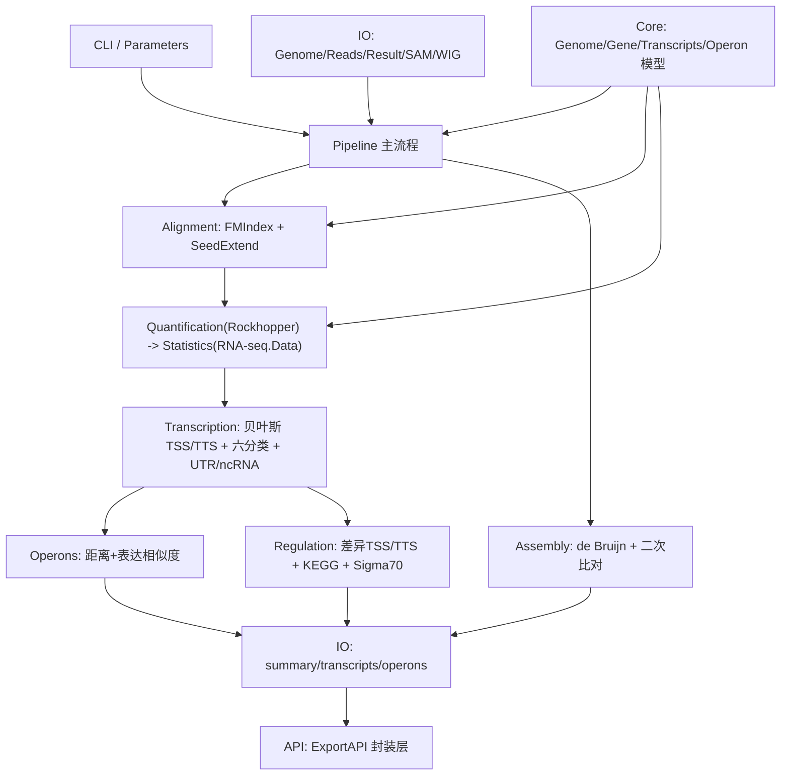

## Product Overview

对现有的 `Rockhopper.vbproj`（原 Java 版细菌 RNA-seq 分析工具 Rockhopper 的 VB.NET 转写项目）进行重写。由于框架 API 长期演进，项目中大量旧符号（`Oracle.Java.*`、`LANS.SystemsBiology.*`、`Microsoft.VisualBasic.DocumentFormat.Csv` 等）已不复存在，导致项目完全无法编译。重写后应恢复为一个可编译、算法自洽、原生 VB.NET 实现的细菌转录组分析库。

**附加约束（用户要求）**：与 RNA-seq 数据处理相关的数学/统计算法（lowess、负二项分布、上四分位归一化、改良 RPKM、BH 校正、均值-方差估计、平滑分布等）尽量下沉到 `RNA-seq.Data\RNA-seq.Data.NET5.vbproj` 项目中，以便后续跨流程复用；Rockhopper 仅通过项目引用调用，不重复实现。

## Core Features

- **读段比对**：基于 BWT/FM-index 的全文索引，先精确匹配，失败则"种子-延伸"，使用质量感知打分的动态规划允许错配/缺口；支持单端/双端与链特异性设置。
- **表达定量与差异分析**：按基因区段统计读段数，采用上四分分位归一化与改良 RPKM；用局部回归（lowess）估计均值-方差依赖，负二项分布检验差异显著性，并经 BH 校正得到 q 值（默认阈值 0.01）。
- **TSS/TTS 预测**：结合基因注释，用贝叶斯方法依据读段覆盖分布推断转录起始/终止位点，识别 5'/3' UTR、反义转录本与基因间小 RNA，并对 TSS 做六分类（mTSS/lmTSS/ULmTSS/pmTSS/asTSS/seTSS）。
- **operon 预测**：综合相邻同链基因的基因间距离与跨样本表达谱相似度，用贝叶斯框架输出共转录概率并合并为多基因操纵子。
- **调控关系预测**：比较不同条件间的 TSS/TTS 变化，关联调控基因与操纵子启动子，结合 -35 区/启动子序列与 KEGG 通路进行分析。
- **de novo 组装**：无需参考基因组时，读段打散为 k-mer 构建 de Bruijn 图，按种子/延伸计数阈值遍历候选转录本，再建立 BWT 索引将原始读段二次比对回候选，剔除低支持度片段。
- **命令行与结果输出**：保留原 Rockhopper 的命令行参数与默认值，输出 `summary.txt`、`*_transcripts.txt`、`*_operons.txt`（及可选 SAM、基因组浏览器 WIG 文件）。

## Tech Stack

- 语言/框架：VB.NET，`net10.0`（沿用现有 `Rockhopper.vbproj`）
- 命名空间根：`SMRUCC.genomics.SequenceModel.RNA_Seq.Rockhopper`
- 复用现有工程引用：`Biological.Assembly (SMRUCC.genomics.Core)`、`SequenceAlignment`、`DataFrame`、`DynamicProgramming`、`graph`、`Math`、`network_graph`、`Microsoft.VisualBasic.Core`、`RNA-seq.Data`
- 序列/注释模型：`SMRUCC.genomics.SequenceModel.FASTA`（FastaSeq/FastaFile）、`SMRUCC.genomics.SequenceModel.NucleotideModels`（SegmentReader）、`SMRUCC.genomics.SequenceModel.FQ`（FastQ）、`SMRUCC.genomics.SequenceModel.SAM`（含 featureCount）、`SMRUCC.genomics.ComponentModel.Loci`（NucleotideLocation、SegmentRelationships、Strands）、`SMRUCC.genomics.Assembly.NCBI.GenBank.TabularFormat`（PTT、GeneBrief）、`SMRUCC.genomics.Assembly.DOOR`、`SMRUCC.genomics.Assembly.KEGG.DBGET`
- 表格/序列化：`Microsoft.VisualBasic.Data.Framework`、`.IO`、`.StorageProvider.Reflection`（Column/Collection、SaveTo/LoadCsv）
- 图结构：`Microsoft.VisualBasic.Data.visualize.Network.Graph`（复用于 de Bruijn 图）
- **数学/统计工具归属**：`RNA-seq.Data` 项目（`RootNamespace = SMRUCC.genomics.SequenceModel`），建议命名空间 `SMRUCC.genomics.SequenceModel.RNA_Seq.Statistics`

## Implementation Approach

**总体策略**：以"聚焦重写核心模块"为主线——保留 `API/` 公开分析接口与四个核心算法模块，彻底删除 `Oracle.Java` Java 模拟层，用 .NET BCL 与 `SMRUCC.genomics.*` 现代数据结构重建；所有算法严格按 `readme.md` 与三篇论文（`gkt444.pdf`、`13059_2014_Article_572.pdf`、`nihms-1526227.pdf`）复刻，不做静默占位；外部 `rockhopper.jar` 命令行调用全部移除，改为原生实现。

**关键决策与理由**：

1. **自实现 FM-index（后缀数组 SA-IS + BWT + Occ 表）**：论文要求以 BWT 全文索引支撑精确匹配与种子-延伸，现有框架无等价可比对器，故按论文自实现；构建一次缓存复用，内存 O(n)。
2. **复用 `RNA-seq.Data` 的 de Bruijn 图谱实现**（`Graph/Builder.vb`、`Graph/DeBruijnGraph.vb`、`Slicer.KSeq.KmerSpans`）而非另起炉灶，符合"优先复用现有模式、避免技术债"；在其上补齐种子/延伸计数阈值与二次比对精修。
3. **复用 `SMRUCC.genomics` 的注释与定位模型**（PTT/GeneBrief/NucleotideLocation/SegmentRelationships/SegmentReader/DOOR），避免重新定义 `TSSAR.*` 等已消失符号。
4. **数学/统计函数下沉到 `RNA-seq.Data`**（用户明确要求）：`Lowess`、`NegativeBinomial`、`SmoothDistribution`、上四分位归一化、改良 RPKM、均值-方差估计、BH 校正统一放在 `RNA-seq.Data\Statistics\` 下，命名空间 `SMRUCC.genomics.SequenceModel.RNA_Seq.Statistics`，Rockhopper 通过已有的 `RNA-seq.Data` 项目引用直接调用，便于其它 RNA-seq 流程复用。
5. **保持输出格式兼容**：沿用 `*_transcripts.txt`/`*_operons.txt` 的列约定（含 `Expression ` 表头等），使 `API/TSSsAnalysis.LoadResult`、`LoadOperonResult` 可回读。
6. **保留 CLI 接口不变**：`-g/-c/-ff/fr/rf/rr/-d/-a/-p/-e/-s/-L/-o/-v/-SAM/-TIME/-m/-l/-y/-t/-z/-k/-j/-n/-b/-u/-w/-x` 及默认值（k=25、minRead=35、minReadsMapping=20、minSeedExpression=50、minExpression=5、minTranscriptLength=2k、transcriptSensitivity=0.5、percentMismatches=0.15、percentSeedLength=0.33）。

**性能与可靠性**：

- 比对：索引构建 O(n)（n 为基因组长度）；单读搜索 O(m)（m 为读长）；读段级并行（`Environment.ProcessorCount`，>4 时按原逻辑取 0.75 倍），避免 JDK 线程导致的伪并行。
- 定量/差异：lowess 平滑 O(G·k·iter)，按条件对循环；BH 校正 O(G log G)；避免重复遍历覆盖数组。
- de novo：k-mer 计数用哈希表，容量按 `2^n`（默认 2^25）限定；流式处理读段，避免全量读段驻留内存。
- 输出：`StreamWriter` 使用 `Using` 确保句柄释放；异常写入 `summary.txt` 并给出可定位信息（文件路径 + 阶段名），不泄露大数据载荷。

**迁移映射（旧 → 新）**：

- `Oracle.Java.IO.File/PrintWriter/Scanner` → `System.IO.File/Directory/StreamWriter/StreamReader`
- `Oracle.Java.System.Runtime.Runtime.availableProcessors()` → `Environment.ProcessorCount`；`CurrentTimeMillis()` → `Stopwatch`
- `LANS.SystemsBiology.SequenceModel.NucleotideModels.SegmentReader` → `SMRUCC.genomics.SequenceModel.NucleotideModels.SegmentReader`
- `LANS.SystemsBiology.ComponentModel.Loci.NucleotideLocation`、`SegmentRelationships`、`Strands` → `SMRUCC.genomics.ComponentModel.Loci`
- `LANS.SystemsBiology.SequenceModel.FASTA.*` → `SMRUCC.genomics.SequenceModel.FASTA.*`
- `LANS.SystemsBiology.Assembly.NCBI.GenBank.TabularFormat.PTT/GeneBrief` → `SMRUCC.genomics.Assembly.NCBI.GenBank.TabularFormat[.ComponentModels]`
- `LANS.SystemsBiology.Assembly.DOOR.DOOR` → `SMRUCC.genomics.Assembly.DOOR.DOOR`
- `LANS.SystemsBiology.Assembly.KEGG.DBGET.bGetObject.Pathway` → `SMRUCC.genomics.Assembly.KEGG.DBGET.bGetObject.Pathway`
- `Microsoft.VisualBasic.DocumentFormat.Csv.*` → `Microsoft.VisualBasic.Data.Framework[.IO/.StorageProvider.Reflection/.Extensions]`

## Architecture Design



- 分层：`Core`（数据模型）→ `Alignment`/`Assembly`（算法内核）→ `Quantification`/`Transcription`/`Operons`/`Regulation`（分析模块，统计计算调用 `RNA-seq.Data.Statistics`）→ `IO`/`Pipeline`/`CLI`（编排与持久化）→ `API`（对外 ExportAPI，签名保持稳定）。
- 数据流：读段文件 + 基因组目录 → 比对 → 覆盖/计数 → 归一化与差异检验 → TSS/TTS → operon/调控 → 结果文件与可选 SAM/WIG。

## Directory Structure

```
Rockhopper/
├── Rockhopper.vbproj                 # [MODIFY] 校正 ProjectReference 与 Compile 项，移除失效引用
├── CLI.vb                            # [NEW] 命令行入口与参数解析（替代 Java/Rockhopper/CLI_API.vb），同参数与默认值
├── Parameters.vb                     # [MODIFY] 参数模型与持久化，去除 Scanner/Oracle.Java.IO.File
├── Pipeline.vb                       # [NEW] 主流程编排（替代 Java/Rockhopper/Rockhopper.vb：比对→定量→差异→TSS→operon→输出）
├── Core/
│   ├── Genome.vb                     # [MODIFY] 基因组模型（fna 长度/正负链注释/基因遍历），去除 Oracle.Java.IO.File.list()
│   ├── Gene.vb                       # [MODIFY] 基因模型（start/stop、startT/stopT、strand、first/last、minQvalue、setRawCount/normalized/RPKM/variance）
│   ├── Replicon.vb                   # [MODIFY] 复制子模型
│   ├── Condition.vb / Replicate.vb   # [MODIFY] 条件/重复模型（upperQuartile、avgReads、getReadsInRange、partner）
│   ├── Transcripts.vb                # [MODIFY] 转录本模型与边界识别入口（identifyUTRs/identifyRNAs）
│   ├── Operons.vb                    # [MODIFY] 操纵子模型（getNumOperonGenePairs/outputMergedOperons）
│   └── RNA.vb                        # [MODIFY] RNA 类型定义
├── Alignment/
│   ├── SuffixArray.vb                # [NEW] SA-IS 后缀数组构建
│   ├── FMIndex.vb                    # [NEW] BWT + Occ 表 + 反向搜索（精确匹配）
│   ├── SeedExtend.vb                 # [NEW] 种子-延伸 + 质量感知打分动态规划（允许错配/缺口）
│   └── Aligner.vb                    # [MODIFY] 比对器（替代 Peregrine.vb + Operations/Alignment.vb），含双端方向/链特异性/多线程/SAM 输出
├── Assembly/
│   ├── DeNovoAssembler.vb            # [MODIFY] de Bruijn 组装主流程（替代 Operations/Assembler.vb），接入种子/延伸阈值
│   ├── DeNovoIndex.vb                # [MODIFY] 候选转录本 BWT 索引与二次比对
│   ├── DeNovoTranscript.vb           # [MODIFY] de novo 转录本模型
│   └── DeNovoTranscripts.vb          # [MODIFY] 候选集合与去冗余
├── Quantification/
│   └── Quantification.vb             # [NEW] 读段计数/覆盖 -> 调用 RNA-seq.Data.Statistics 完成归一化与差异检验
├── Transcription/
│   ├── TSSsInference.vb              # [NEW] 贝叶斯 TSS/TTS 边界推断 + UTR/ncRNA 识别（transcriptSensitivity 控制）
│   └── TSSsCategory.vb               # [MODIFY] 六分类判定（54bp/0–300/300–500/IGR/链方向）
├── Operons/
│   └── OperonPrediction.vb           # [MODIFY] 基因间距 + 表达相似度贝叶斯整合与 operons.txt 输出
├── Regulation/
│   ├── TSSsDifferent.vb              # [MODIFY] 条件间差异 TSS/TTS（|Δ|>10bp）模型与判定
│   ├── KEGGEnrichment.vb             # [MODIFY] 差异基因 KEGG 通路富集报表（替代 TSSsAnalysis.KEGGDifferent）
│   └── Sigma70Validation.vb          # [MODIFY] 由 TSSsValidation.vb 迁移，去除 NBCR/MEME 外部依赖
├── IO/
│   ├── GenomeReader.vb               # [NEW] .fna/.ptt/.rnt 读取（复用 PTT）
│   ├── ReadsReader.vb                # [MODIFY] FASTQ/QSEQ/FASTA/SAM/BAM 读取（替代 FileOps.vb）
│   ├── SamWriter.vb                  # [MODIFY] SAM 输出（替代 SamOps.vb）
│   ├── WigWriter.vb                  # [MODIFY] 基因组浏览器 WIG 输出（替代 IGV_Ops.vb）
│   └── ResultWriter.vb               # [NEW] summary.txt / *_transcripts.txt / *_operons.txt 写入
├── API/                              # [MODIFY] 全部迁移到 SMRUCC.genomics.* 与 Data.Framework，保持 ExportAPI 签名
│   ├── RockhopperAPI.vb              #   - 移除 Install/CliCommon/RockhopperExternalCli/DE_NOVO_ASSEMBLY 外部 jar 调用
│   ├── DataModels.vb                 #   - Transcripts/Operon 模型与六分类枚举注释（保留 MTU 规范说明）
│   ├── TSSsAnalysis.vb               #   - 结果读写、TSS/TTS/UTR/启动子序列提取、KEGG 差异
│   ├── TSSsCategory.vb               #   - 六分类与 PutativemRNA
│   ├── TSSsDifferent.vb              #   - 差异 TSS/TTS 模型
│   ├── TranscriptView.vb             #   - 转录本视图模型
│   └── DeNovolTranscript.vb          #   - de novo 结果转 FASTA
└── Resources/ (URLs.resx / replicons.txt)、app.config、Rockhopper.ico  # [保留]

RNA-seq.Data/                          # [MODIFY] 新增可复用的数学/统计模块
├── Statistics/
│   ├── Lowess.vb                      # [NEW] 局部回归（lowess）方差估计
│   ├── NegativeBinomial.vb            # [NEW] 负二项分布检验与 p 值
│   ├── SmoothDistribution.vb          # [NEW] 平滑分布/均值-方差趋势拟合
│   └── ExpressionNormalization.vb     # [NEW] 上四分位归一化 + 改良 RPKM + BH 校正
└── (FastQ/ Graph/ Quantification/ SAM/ Simulator/ Soap/ 保持不变)
```

## Key Code Structures

```
' Pipeline.vb：核心分析入口（对外暴露四个核心模块能力）
Public Class RockhopperPipeline
    Public Shared Function Run(OptionalParameters As RockhopperParameters) As AnalysisResult
    ' AnalysisResult: Transcripts() / Operon() / ConditionDifferential() / DeNovoTranscripts() / SummaryStatistics
End Class

' Alignment/FMIndex.vb：FM-index 接口（严格对应论文 BWT/FM-index 章节）
Public Interface IFmIndex
    Function Count(Optional pattern As String) As Integer
    Function Locate(pattern As String, Optional maxHits As Integer = 1) As Integer()
    Function BackSearch(pattern As String) As (left As Integer, right As Integer)
End Interface

' Transcription/TSSsInference.vb：贝叶斯边界推断
Public Module TSSsInference
    ''' 基于读段覆盖分布推断转录起始/终止位点，并识别 UTR 与 ncRNA
    Public Function InferBoundaries(genome As Genome, conditions As Condition(), sensitivity As Double) As Transcripts()
End Module

' RNA-seq.Data/Statistics/ExpressionNormalization.vb：可复用统计工具
Namespace SMRUCC.genomics.SequenceModel.RNA_Seq.Statistics
    Public Module ExpressionNormalization
        Function UpperQuartile(values As Double()) As Double
        Function ModifiedRPKM(counts As Integer(), geneLength As Integer(), normFactor As Double) As Double()
        Function BenjaminiHochberg(pValues As Double()) As Double()
    End Module
End Namespace
```

## Agent Extensions

### Skill

- **pdf**
- Purpose: 提取 `gkt444.pdf`、`13059_2014_Article_572.pdf`、`nihms-1526227.pdf` 中 BWT/FM-index 种子延伸、质量感知打分、贝叶斯 TSS/TTS 推断、上四分位归一化与改良 RPKM、负二项+lowess 方差估计+BH 校正、de Bruijn 图 + 二次比对等算法细节与全部参数默认值。
- Expected outcome: 形成可直接落地到各算法模块的公式、阈值与步骤清单，作为"严格复刻论文算法"的实现依据；同时核对 `readme.md` 与 CLI 参数默认值的一致性。

### Skill

- **lsp-code-analysis**
- Purpose: 在重写过程中对新框架 API 做语义级定位与影响分析（`SMRUCC.genomics.SequenceModel.NucleotideModels.SegmentReader`、`SMRUCC.genomics.ComponentModel.Loci.NucleotideLocation/SegmentRelationships`、`PTT/GeneBrief`、`DOOR`、`Microsoft.VisualBasic.Data.Framework`），确认签名与定义位置，避免猜测导致编译失败。
- Expected outcome: 每个被替换符号都有确认过的新 API 定义与调用点清单，重写后不残留 `Oracle.Java.*`、`LANS.SystemsBiology.*`、`Microsoft.VisualBasic.DocumentFormat.Csv` 引用。