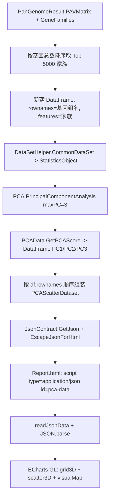

## 产品概述

在现有泛基因组分析 HTML 报告的【PAV 矩阵分析】章节中，除已有的 PAV 热图外，新增一个基于 PAV 矩阵的 **PCA 三维散点图**：以基因组为样本、基因家族为特征做主成分分析，降维到 3 个维度后在页面中用 ECharts 三维散点图展示，点按核心基因占比着色，用于直观观察基因组间的整体分化与聚类关系。

## 核心功能

- **PCA 数据集构建**：按基因家族的基因总数降序排序，取 **Top 5000** 个家族构成 PAV 子矩阵；行为基因组（样本）、列为基因家族（特征），并沿用项目既有的 `CommonDataSet` 方式生成 PCA 输入数据集。
- **降维到 3 维**：调用 `PrincipalComponentAnalysis(maxPC:=3)`，再通过 `GetPCAScore` 取出每个基因组的 PC1、PC2、PC3 得分。
- **三维散点图展示**：在【PAV 矩阵分析】章节的 PAV 热图之后新增图表卡片，用 ECharts 三维散点图渲染；每个点代表一个基因组，鼠标可旋转与缩放，悬浮显示基因组名称、PC1/PC2/PC3 数值、核心基因占比与基因总数。
- **按核心基因占比着色**：散点颜色随核心基因占比变化，并提供可交互的颜色条（visualMap），便于区分核心基因占比高低的基因组。
- **方差贡献率标注**：各坐标轴标题带该主成分的方差贡献率（如 `PC1 (42.5%)`），并在图下注明所用家族数与着色维度。
- **降级与容错**：家族为空、基因组数少于 3 个、缺少 PC3 或数据维度不一致时，页面显示统一的“数据不可用”提示，不影响其他图表。
- **保持既有视觉风格与功能**：沿用深色主题、卡片式图表容器；既有的 9 个图表、固定高度热图、全屏热图模态框、统计表搜索与直方图联动均不得回归。

## 技术栈选择

- 语言/运行时：VB.NET，`net10.0`（`PanGenome.vbproj`）。
- 多元统计：复用仓库既有 ANOVA 工程 `Microsoft.VisualBasic.Math.Statistics.ANOVA`（`ANOVA.vbproj`，`net10.0`），提供 `DataSetHelper.CommonDataSet`、`PCA.PrincipalComponentAnalysis`、`PCAData.GetPCAScore`。
- 数据框：复用既有 `Microsoft.VisualBasic.Data.Framework.DataFrame` / `FeatureVector`（`dataframework-netcore5.vbproj` 已引用）。
- JSON 序列化：沿用既有 `Microsoft.VisualBasic.Serialization.JSON.JsonContract.GetJson`（配合 `EscapeJsonForHtml`）。
- 前端：原生 HTML/CSS/JavaScript + ECharts 5.4.3，新增 **echarts-gl 2.0.9**（三维散点图必需，必须置于 echarts 核心脚本之后）。不引入前端框架。
- 模板分发：`DefaultTemplate.resx` 通过 `ResXFileRef` 引用根目录 `Report.html`，无需改动 resx。

## 实现方案

### 总体策略

1. **补齐编译依赖**：`PanGenome.vbproj` 目前未引用 ANOVA 工程，需新增 `ProjectReference` 指向 `..\..\..\..\runtime\sciBASIC#\Data_science\Mathematica\Math\ANOVA\ANOVA.vbproj`。该工程 `RootNamespace` 为 `Microsoft.VisualBasic.Math.Statistics.Hypothesis.ANOVA`，因此生成器需 `Imports Microsoft.VisualBasic.Math.Statistics.Hypothesis.ANOVA`。
2. **数据集构建（对齐既有范式）**：新建一个**全新**的 `DataFrame`（不复用 `PanGenomeResult.GetPAVMatrix()`，因为 `PrincipalComponentAnalysis` 会原地修改其内部数值数组）：

- `df.rownames = 全部基因组名（升序，确定性）`；
- 对每个入选家族调用 `df.add(familyId, 按 rownames 顺序的拷贝数向量)` → 特征列 = 家族，行 = 基因组；
- `Dim stat As StatisticsObject = df.CommonDataSet()`，此时样本标签默认取 `df.rownames`，即基因组名。

3. **家族筛选**：按 `result.GeneFamilies(familyId).Length` 降序排序取前 `5000` 个；用 `OrderByDescending` + `Take` 得到确定性顺序，仅遍历一次 `GeneFamilies`。
4. **降维与取值**：`Dim pcaResult = stat.PrincipalComponentAnalysis(maxPC:=3)`；`Dim score = pcaResult.GetPCAScore`；用 `score.featureNames` 定位 PC 名称、用 `score("PC1").vector` 取数值向量，并**按输入 DataFrame 的行顺序对齐基因组名**（与 `geneExpression.vb` 的既有写法一致），同时断言 `vector.Length = 基因组数` 做一致性校验。
5. **生成 DTO 并序列化**：构建 `PCAScatterDataset`（含每个点的 `name/pc1/pc2/pc3/coreRatio/geneCount`、三个坐标轴标题、着色维度标题、参与家族数），走既有 `SerializeData` 通道填充 `{$PCA_DATA}`。
6. **前端渲染**：head 中新增 `pca-data` 的 `application/json` 脚本标签与 `echarts-gl`；第四章新增 PCA 卡片；JS 用 `grid3D + scatter3D`，`visualMap` 以 `dimension: 3`（第 4 维 = coreRatio）着色，`tooltip` 展示完整信息，`grid3D.viewControl` 支持旋转缩放，并注册进 `DOMContentLoaded` 的 `charts` 数组以同步 `resize`。

### 关键决策与权衡

- **只用 Top 5000 个家族**：这是本次的核心性能边界。PCA 需要 `N genomes × 5000 families` 的数值矩阵，`PrincipalComponentAnalysis` 还会额外分配同尺寸的 `tpMatrix` 与 `XScaled` 副本，量级约 `O(基因组数 × 5000 × 8B × 3)`；50 个基因组约 6MB，上千个基因组约 120MB 量级，属于可接受范围。若不设上限（十几万家族）则会直接爆内存。
- **复用 `CommonDataSet` 而非手搓 `StatisticsObject`**：与仓库既有 PCA 调用完全一致，自动获得 `XScaled` 标准化与样本标签，避免自造轮子。
- **彻底隔离源数据**：新建 DataFrame 而非复用 `result.GetPAVMatrix()`/`result.PAVMatrix`，防止 PCA 的原地写入污染后续 PAV 表格/热图数据。
- **按输入行顺序对齐**：不依赖 `score.rownames`（其语义经转置后易混淆），改用 `df.rownames` 顺序 + 长度断言，行为可预测且与既有代码一致。
- **维度不足即降级**：`PCA.vb` 在 `rowSize < maxPC` 时会自动下调 `maxPC`，因此基因组数不足时可能只有 PC1/PC2；实现需按实际 `Contributions.Count` 取用，缺 PC3 时给出明确提示而不是画错图。
- **不修改归档格式与公共 API**：`PanGenomeResult`、`pangenome-result/1.0`、`GenerateReport`/`DefaultHtmlReport` 签名均不变，旧归档可直接生成含 PCA 的报告。

### 性能与可靠性

- 家族排序：`O(F log F)`，`F` 为家族总数；矩阵构建 `O(5000 × N)`；PCA 主体为幂迭代，复杂度受 `maxPC` 与 `cutoff` 约束。
- 热点路径只有一处（PAV 子矩阵构建），已通过 Top-5000 截断与一次遍历同时完成排序与选点来控制；避免任何 `基因组 × 全部家族` 的双重循环。
- 前端无需额外数据量：PCA 输出仅为每个基因组 4 个数值，JSON 体积约 `O(基因组数)`，不会显著增大报告。

### 架构设计



### 目录结构

```
PanGenome/
├── PanGenome.vbproj                     # [MODIFY] 新增对 ANOVA.vbproj 的项目引用
├── Report.html                          # [MODIFY] 引入 echarts-gl；新增 pca-data 脚本标签与 PCA 卡片；新增 initPCAScatter3D 并注册
└── Report/
    ├── PanGenomeReportData.vb           # [MODIFY] 新增 PCAPoint / PCAScatterDataset 具名 DTO
    └── PanGenomeReportGenerator.vb      # [MODIFY] 新增 PCA 常量与 BuildPCAData；GenerateReport 复用 genomeStats 并填充 {$PCA_DATA}
```

- `PanGenome.vbproj`：新增 `<ProjectReference Include="..\..\..\..\runtime\sciBASIC#\Data_science\Mathematica\Math\ANOVA\ANOVA.vbproj" />`。注意本项目 `GeneratePackageOnBuild=true`，项目引用会被 SDK 自动折算为 NuGet 包依赖，无需手写 nuspec。
- `Report/PanGenomeReportData.vb`：新增 `PCAPoint`（`name`、`pc1`、`pc2`、`pc3`、`coreRatio`、`geneCount`）与 `PCAScatterDataset`（`points`、`pc1Label`、`pc2Label`、`pc3Label`、`colorLabel`、`familyCount`、`explained`）。属性名保持 camelCase 且即前端 JSON 键名；必须为具名 Public 类。
- `Report/PanGenomeReportGenerator.vb`：新增 `MaxPCAFamilies = 5000`、`PCA_Dimensions = 3` 常量；新增 `BuildPCAData(result, stats)`；`GenerateReport` 中将 `BuildGenomeStats(result)` 提为局部变量 `genomeStats` 复用（避免重复执行 `CountFamiliesPerGenome`），并新增 `{$PCA_DATA}` 替换。新增 `Imports Microsoft.VisualBasic.Math.Statistics.Hypothesis.ANOVA` 与 `Microsoft.VisualBasic.Data.Framework`。
- `Report.html`：head 在 echarts 之后加载 `https://cdn.jsdelivr.net/npm/echarts-gl@2.0.9/dist/echarts-gl.min.js`；新增 `<script type="application/json" id="pca-data">{$PCA_DATA}</script>`；第四章 PAV 热图卡片之后新增 PCA 卡片（标题「PAV 矩阵 PCA 三维散点图」，容器 `#pcaScatter3D` 固定高度约 600px，下方加说明 `p`）；新增 `initPCAScatter3D()`；在 `DOMContentLoaded` 的 `charts` 数组中注册。

### 关键数据结构

```
Public Class PCAPoint
    Public Property name As String
    Public Property pc1 As Double
    Public Property pc2 As Double
    Public Property pc3 As Double
    Public Property coreRatio As Double
    Public Property geneCount As Integer
End Class

Public Class PCAScatterDataset
    Public Property points As PCAPoint()
    Public Property pc1Label As String      ' 例如 "PC1 (42.51%)"
    Public Property pc2Label As String
    Public Property pc3Label As String
    Public Property colorLabel As String    ' 例如 "核心基因占比 (%)"
    Public Property familyCount As Integer  ' 实际参与 PCA 的家族数
    Public Property explained As Double()   ' 各主成分方差贡献率
End Class
```

### 实现注意事项

- **必须新增 ANOVA 项目引用**，否则 `StatisticsObject` / `PCA` / `PCAData` / `CommonDataSet` 无法解析；命名空间为 `Microsoft.VisualBasic.Math.Statistics.Hypothesis.ANOVA`。
- **不要复用 `result.GetPAVMatrix()`**：`PrincipalComponentAnalysis` 会原地修改输入数值数组，复用会污染 PAV 热图/表格数据。务必新建 `DataFrame`。
- 读取 PC 得分统一用 `score.featureNames` + `score(name).vector`（`FeatureVector.vector` 为 `Array`，需 `CDbl` 逐元素转换），并按 `df.rownames` 顺序对齐；加 `vector.Length = genomes.Length` 断言。
- 家族筛选顺序必须确定（基因总数降序，同分时以家族 ID 次序稳定化），保证同一份结果多次生成报告数值一致。
- `GenerateReport` 中 `genomeStats` 只计算一次并传给 `BuildGenomeStats` 与 `BuildPCAData`，避免 `CountFamiliesPerGenome` 重复执行。
- 全部降级分支（家族为空 / 基因组数 < 3 / 缺少 PC3 / 长度不一致 / 计算抛异常）统一返回空的 `PCAScatterDataset`，由前端显示 `no-data`；生成报告不得因此失败。
- 前端 `scatter3D` 数据项采用 `[pc1, pc2, pc3, coreRatio]`，`visualMap.dimension = 3` 实现按核心基因占比着色；`tooltip` 用 `params.value` 展示四项并附加基因组名（名称需额外通过索引数组取回）。
- `echarts-gl` 加载失败或环境无 WebGL 能力时，容器内降级为 `no-data` 提示，禁止抛异常影响其余图表初始化。
- 不修改 `PanGenomeResult`、归档读写、`GenerateReport`/`DefaultHtmlReport` 公共签名；保持既有 9 个图表、热图固定 800px、全屏模态框、统计表搜索与直方图联动行为不回归。

## Agent Extensions

### Skill

- **agent-browser**
- Purpose: 在实现完成后打开由 `test/Program.vb` 生成的报告页面，实际核对 PCA 三维散点图是否渲染成功、颜色是否随核心基因占比变化、悬浮提示与旋转交互是否可用，并确认既有 9 个图表、热图模态框等无回归。
- Expected outcome: 得到 `#pcaScatter3D` 图表实例存在且为 GL 三维图、页面无控制台报错的确认，并产出截图作为可视化证据。