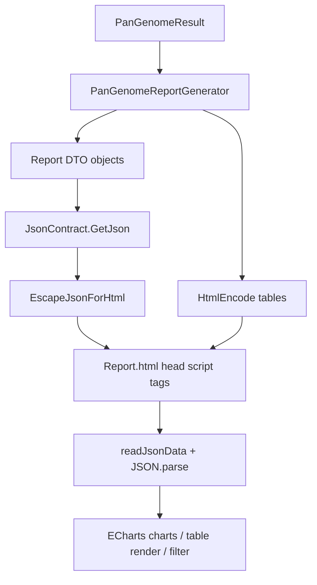

## 产品概述

针对泛基因组分析 HTML 报告（`Report.html` 模板 + `Report/PanGenomeReportGenerator.vb` 生成器）进行稳健性与可读性优化。核心是消除手工拼接 JSON 的语法风险，把数据以标准 JSON 形式内嵌到页面，并增强大基因组规模下的表格、热图与共线性结果的可视化体验。

## 核心功能

- **数据生成改为对象序列化**：先构造具名 CLR 数据对象，再经 JSON 序列化产出数据，取代易出错的字符串拼接；基因组名含引号、斜杠、尖括号等特殊字符时不再破坏页面脚本。
- **数据内嵌到 head**：所有 JSON 以 `<script type="application/json" id="...">` 形式置于 head，脚本通过 `getElementById` 读取并 `JSON.parse`。
- **基因组基本信息统计增强**：表格改为数据驱动前端渲染，容器限高并可滚动、表头吸顶；提供按基因组名称的实时搜索；新增【基因总数】分布直方图（20 个 bin），点击柱子联动筛选表格行，再次点击取消筛选。
- **热图高度自适应**：PAV 热图与遗传距离热图按类别数量自动增高，并设上限封顶，超出部分在容器内滚动。
- **共线性结果可视化**：在共线性章节新增“基因组×基因组共线性矩阵热图”与“Top 共线性区块条形图”，仅基于现有数据，不改变数据模型与归档格式。
- **保持既有视觉风格**：沿用深色主题、渐变标题、卡片与 ECharts 图表的整体观感，新增组件风格一致。

## 技术栈选择

- 语言/运行时：VB.NET，`net10.0`（`PanGenome.vbproj`）。
- JSON 序列化：复用仓库既有 `Microsoft.VisualBasic.Serialization.JSON.JsonContract`（`GetJson(Of T)`，内部为 `DataContractJsonSerializer`，`simpleDict:=True` 时字典序列化为 `{k:v}`）。该模块已在 `interops` 多处使用（如 `LocalBLAST/.../BlastOutput/Views.vb`）。
- 前端：原生 HTML/CSS/JavaScript + ECharts 5.4.3（现有 CDN 引用保持不变），不引入新的前端框架或组件库。
- 模板分发：`DefaultTemplate.resx` 通过 `ResXFileRef` 引用根目录 `Report.html`，构建时自动内嵌，无需改动 resx 与 Designer。

## 实现方案

### 总体策略

1. **新增报告 DTO 层**：新建 `Report/PanGenomeReportData.vb`，为每类图表/表格定义具名 Public 类（不允许匿名类型，因 `DataContractJsonSerializer` 不支持）。所有数值用 `Integer()` / `Double()()`，字典用 `Dictionary(Of String, Integer)` 等。
2. **生成器重构**：`PanGenomeReportGenerator.vb` 中删除所有 `StringBuilder` 拼接 JSON 的 `GenerateXxxData`，改为“构建 DTO → `GetJson(indent:=False)` → 转义 → 填充占位符”。占位符改为对应 `<script type="application/json" id="...">` 内部的数据。
3. **序列化结果安全内嵌**：新增 `EscapeJsonForHtml`，把 `<`→`\u003c`、`>`→`\u003e`、`&`→`\u0026`（这些字符在合法 JSON 中只可能出现在字符串字面量内，`\uXXXX` 在任何位置均合法），避免 `</script>`、`<!--` 破坏 HTML 解析，同时根治引号/斜杠导致的脚本语法错误。
4. **HTML 输出同步转义**：对仍由服务端渲染的表格（`{$COLLINEARITY_STATS}`、`{$GENE_FAMILY_TABLE}`）中的基因组名、染色体名、家族ID、基因名使用 `System.Net.WebUtility.HtmlEncode` 转义，消除注入与渲染破版。
5. **前端统一取数**：模板脚本新增 `readJsonData(id)`，通过 `document.getElementById(id).textContent` + `JSON.parse` 取数；删除原先内联的 `const xxx = {data}` 拼接。
6. **统计表 JSON 驱动渲染**：`{$GENOME_STATS_TABLE}` 占位符不再输出数据行，改为在模板中放静态面板结构（搜索框 + 限高滚动容器 + 表头 + 空 `<tbody>` + 直方图容器），数据集中放数组；由 JS 渲染行、执行搜索与柱子联动筛选。
7. **大矩阵规模防护**：遗传距离为 N×N，上千基因组时数据量与渲染均不可行。引入模块常量（如 `MaxHeatmapGenomes`、`MaxPAVFamilies`、`MaxCollinearityGenomes`）对展示规模做确定性的等距抽样截断，并在页面以 `.table-note` 提示“为保证渲染性能已截断”。截断后仍保证矩阵对称与索引一致。
8. **共线性可视化（方案A）**：仅使用 `CollinearBlock` 的 `Genome1/Genome2/Chr1/Chr2/GenePairCount(LinkCount)`。构建“参与共线性的基因组 × 基因组”共线基因对数对称矩阵（按参与总量排序取 Top-N），并对区块按基因对数降序取 Top-20 生成条形图。`RetainOrthologyLinks=false`（基因组数 > 32）时依然可用。
9. **热图高度自适应**：`height = clamp(类别数 × 每格像素, 下限, 上限1600px)`；PAV 按展示家族行数、遗传距离与共线性矩阵按基因组数计算；外层容器加 `overflow:auto`，内层 ECharts div 设显式像素高度。

### 关键决策与权衡

- **使用 `DataContractJsonSerializer` 而非手工拼接**：彻底消除转义类 bug，代价是必须用具名类且属性名即 JSON 键名（保持与前端读取键一致）；选择在大矩阵上抽样截断以换取可渲染性，常量化便于后续放开。
- **保持公共 API 不变**：`DefaultHtmlTemplate`、`DefaultHtmlReport(result)`、`GenerateReport(result, templateContent)` 签名不变，调用方 `workbench/R#/comparative_toolkit/pangenome.vb` 与 `test/Program.vb` 无需改动；旧归档 `pangenome-result/1.0` 可直接生成报告。
- **不修改 `PanGenomeResult`/归档格式**：满足需求5方案A的约束，风险最小。
- **性能**：统计表复用现有 `CountFamiliesPerGenome`（复杂度 O(家族数 × 该家族出现的基因组数)）而非退化双重循环；共线性矩阵构建为 O(区块数)；直方图分箱与筛选为 O(基因组数)；所有截断在序列化前完成，避免生成超大字符串。

### 架构设计



### 目录结构

```
PanGenome/
├── Report.html                      # [MODIFY] 模板：head 内嵌 JSON；新增统计面板/直方图/共线性图表；热图滚动与自适应；脚本改为取数渲染
├── DefaultTemplate.resx             # [不修改] 通过 ResXFileRef 自动引用 Report.html
└── Report/
    ├── PanGenomeReportGenerator.vb  # [MODIFY] 删除字符串拼接，改用 DTO + GetJson；新增转义与规模上限；修复 PAV 对齐；新增共线性 JSON
    └── PanGenomeReportData.vb       # [NEW] 报告 DTO 定义
```

### 关键数据结构

```
' Report/PanGenomeReportData.vb —— 报告序列化数据模型（具名 Public 类型）
Public Class GenomeStatRow
    Public Property Name As String
    Public Property GeneCount As Integer
    Public Property SpecificCount As Integer
    Public Property CoreRatio As Double
End Class

Public Class CategoryItem            ' 饼图/条形图/SV 通用
    Public Property Name As String
    Public Property Value As Integer
    Public Property Color As String
End Class

Public Class CollinearityData        ' 需求5：共线性可视化数据
    Public Property Genomes As String()      ' 矩阵坐标标签（Top-N）
    Public Property Matrix As Double()()     ' 对称的共线基因对数矩阵
    Public Property Blocks As CollinearBlockItem()  ' Top-20 区块
    Public Property Truncated As Boolean
End Class

Public Class CollinearBlockItem
    Public Property Genome1 As String
    Public Property Genome2 As String
    Public Property Chr1 As String
    Public Property Chr2 As String
    Public Property Pairs As Integer
End Class
```

### 实现注意事项

- DTO 必须为 Public 具名类、属性为 Public 且提供无参构造；仅 Public 属性被序列化（字段不序列化），只读属性会被序列化。
- 序列化后统一调用 `EscapeJsonForHtml`；占位符 `<script>` 之间不保留多余文本，`JSON.parse` 前对 `textContent` 做 `trim()` 判空。
- PAV 数据集修复：`families` 与 `matrix` 行必须一一对应（先过滤出同时存在于 `PAVMatrix` 的家族，再截断，保证长度一致）。
- 统计表筛选需把“搜索词”与“直方图选中区间”合并到一个 `applyGenomeFilter()`，支持点同一柱子取消筛选，并展示“显示/总数”提示。
- 热图容器外层提供 `overflow:auto` 与 `max-height:1600px`；ECharts `resize()` 仍需在 `window.resize` 时对所有图表调用。
- 共线性矩阵对角线与空数据（无区块）需降级为 `no-data` 提示；`DisplayCap` 常量集中定义并加入截断说明。
- 不改动 `PanGenomeResult` 与归档读写逻辑；`GenerateReport` 保持仅依赖 `PanGenomeResult`。

沿用报告既有深色科技风（深蓝黑底 + 翠绿/蓝渐变点缀、卡片式分区、ECharts 交互图表），新增组件与现有版式保持一致，不改变整体视觉语言。

- 新增组件：

1. 基因组统计面板：顶部为带图标搜索输入框（右对齐“显示 x / 共 y”计数），下方为限高（约 480px）滚动容器内嵌数据表，表头 sticky 吸顶；行 hover 高亮，名称列使用等宽字体。
2. 基因总数分布直方图：卡片式 ECharts 柱状图，20 个 bin，柱体渐变填充、hover 高亮；点击柱子在统计表下方与搜索框联动筛选，选中柱子使用强调色描边。
3. 共线性可视化：左侧“基因组×基因组共线性矩阵热图”（深色到青色渐变，带 visualMap），右侧“Top 共线性区块”横向条形图；无数据时显示统一 `no-data` 提示。

- 交互：搜索实时过滤、直方图点选联动、热图鼠标悬浮 tooltip、卡片 hover 上浮微动效、图表容器随窗口自适应；热图高度按类别数自动增长并在 1600px 封顶后内部滚动。
- 响应式：宽屏双列、窄屏单列；`prefers-reduced-motion` 下关闭动画；打印时隐藏背景装饰。

## Agent Extensions

### Skill

- **agent-browser**
- Purpose: 在实施完成后，打开由 `test/Program.vb` 生成的报告 HTML，核对页面是否正常渲染、图表是否加载、控制台是否有报错。
- Expected outcome: 得到可视化渲染结果与无控制台错误的确认，验证统计表搜索/直方图联动、热图自适应、共线性可视化等新功能符合预期。