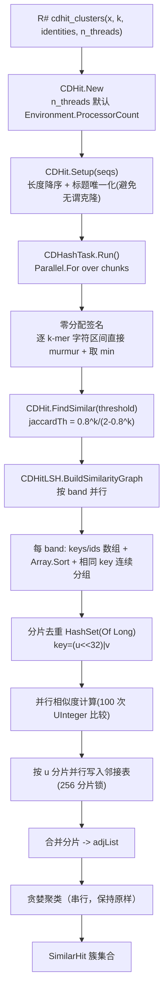

## 产品概述

对 GCModeller 中 CD-HIT 序列聚类（`SequenceAlignment.vbproj`）的计算过程做并行化与分配开销优化，使 404 万条蛋白序列的大数据集（`K:\pangenome\Escherichia_coli`）能够以多核并行方式完成 cd-hit 家族聚类，显著缩短耗时。

## 核心功能（优化目标）

1. **修复线程数缺陷**：`CDHit` 构造函数中 `Me.threads = threads` 为字段自赋值，`n_threads` 参数从未生效，导致 `CDHashTask` 实际只使用 `VectorTask.n_threads = 4` 个线程（机器有 24 逻辑核）。
2. **消除 min-hash 签名的巨量临时分配**：当前每条序列的每个 k-mer 都会分配一个 `Substring` 与一个 `UTF8 byte[]`，大数据集下约 12 亿次 k-mer 出现 → 12 亿次 `Substring` + 12 亿个 `byte[]` + 约 1.2e11 次 MurmurHash 调用。改为直接在字符区间上计算哈希、且不再做 HashSet 去重。
3. **LSH 阶段并行化**：分桶、候选两两枚举、相似度计算、邻接表构建目前全在单线程完成（8080 万次 murmur + 8080 万次字典/List 操作），改为按 band 完全并行。
4. **Setup 阶段开销削减**：避免对全部序列做无谓的 `FastaSeq` 克隆与委托排序；去掉热循环里的进度条回调。
5. **可观测性**：cd-hit 各阶段（setup / min-hash / LSH 分桶 / 相似度 / 贪婪聚类）输出耗时与进程工作集到 console，便于定位热点与验证加速效果。
6. **结果可回归**：除用户已确认接受的「按 band 独立分桶导致极少量 32 位哈希碰撞桶合并行为改变」之外，其余优化必须保持数值结果完全一致（签名逐位相同、阈值/聚类逻辑不变）。

## 边界与约束

- 允许在共享库 `Microsoft.VisualBasic.Core` 的 `MurmurHash` 模块**新增**字符串重载（纯新增、不改变任何现有行为与数值）。
- 默认工作线程数为 `Environment.ProcessorCount`，可被 R# 脚本的 `n_threads` 参数覆盖；不修改全局静态 `VectorTask.n_threads`。
- `CDHit` / `CDHashTask` 的公开签名保持不变；不修改共享的 `LSH.vb` / `MinHash.vb`（其他调用方继续使用原实现）。
- 贪婪聚类阶段必须保持串行。
- 编译配置 `Rsharp_app_release|x64`，测试命令必须在 `G:` 盘工作目录下执行。

## 技术栈

- 语言/框架：Visual Basic .NET，net10.0
- 主改项目：`SMRUCC.genomics.Analysis.SequenceAlignment`（`GCModeller/analysis/SequenceToolkit/SequenceAlignment/SequenceAlignment.vbproj`）
- 共享库新增：`Microsoft.VisualBasic.Core`（`MurmurHash`）
- 并行：`System.Threading.Tasks.Parallel.For` / `ParallelOptions.MaxDegreeOfParallelism`
- 排序分组：`Array.Sort(keys As UInteger(), ids As Integer())`（默认比较器，避免委托开销）
- 诊断：`Microsoft.VisualBasic.ApplicationServices.VBDebugger.debug` 扩展（输出 `debug[{WorkingSet64}, {threads} threads]` + 时间戳）+ `Stopwatch`
- 构建：`dotnet build "G:\GCModeller\src\workbench\packages.NET5.slnx" -c Rsharp_app_release -p:Platform=x64`

## 实施思路

总体策略：**先修线程数、再消分配、最后并行化 LSH**。

### D1. 修复线程数（最大单点收益、几乎零风险）

`CDHit.New` 中 `Me.threads = threads` 是字段自赋值，参数 `n_threads` 被丢弃，实际 `workers = Nothing` → `VectorTask.cpu_count = VectorTask.n_threads = 4`。24 逻辑核只用了 4 个。

```
Sub New(Optional k As Integer = 12, Optional n_threads As Integer? = Nothing)
    Me.k = k
    Me.threads = If(n_threads, Environment.ProcessorCount)
End Sub
```

不修改全局静态 `VectorTask.n_threads`（避免影响其它模块）；R# 侧 `cdhit_clusters(..., n_threads)` 传入的值会真正生效。

### D2. 零分配的 min-hash 签名（消除 12 亿次 Substring + 12 亿个 byte[]）

**正确性前提（必须逐位等价）**：

- 原实现先用 `HashSet(Of String)` 去重 k-mer 再取 min；而「对多重集取 min」与「对集合取 min」结果完全相同 → **可以直接对每个 k-mer 出现位置累加最小值，完全不需要去重**，也就不需要构造 `Substring` 或 `HashSet`。
- 对 ASCII 字符，UTF8 编码即字符本身的值，因此「直接从字符串字符区间计算 MurmurHash」与「先 `GetBytes(Substring)` 再计算」数值逐位相同。

在 `MurmurHash` 模块新增（纯新增）：

```
''' <summary>
''' 直接从字符串的字符区间计算32位 MurmurHash3 值，不产生任何临时字符串或字节数组。
''' </summary>
''' <param name="s">源字符串</param>
''' <param name="start">区间起始下标</param>
''' <param name="length">区间长度</param>
''' <param name="seed">哈希种子</param>
''' <remarks>
''' 要求区间内字符全部为 ASCII（此时 UTF8 编码即字符本身的值），
''' 结果与 MurmurHashCode3_x86_32(Encoding.UTF8.GetBytes(s.Substring(start, length)), seed) 完全一致。
''' 非 ASCII 输入需调用方自行回退到字节数组版本。
''' </remarks>
Public Function MurmurHashCode3_x86_32(s As String, start As Integer, length As Integer, seed As UInteger) As UInteger
```

实现逐行照搬现有字节版本（`c1=&HCC9E2D51UI`、`c2=&H1B873593UI`、`r1=15`、`r2=13`、`m=5UI`、`n=&HE6546B64UI`，小端 4 字节块，尾部 `data(i+2)<<16 | data(i+1)<<8 | data(i)`，最后 `h ^= length` 加三轮雪崩），把 `data(i)` 换成 `CByte(AscW(s(start + i)))`。

`CDHashTask.Solve` 改为：

- 直接写 `Me.minHash(i) = ...`，去掉 `List` + `SyncLock` + `Array.Copy`（各线程写的是互不重叠的下标区间）。
- 每条序列先做一次 O(L) 的 ASCII 预检查：全 ASCII 走新重载；含非 ASCII 则整条序列回退到 `Encoding.UTF8.GetBytes(seq.Substring(i, k))` + 原字节版本（数值完全一致）。
- 签名长度固定 100、初值 `UInteger.MaxValue`（与现有 `CreateSequenceData` 默认 `Num_HashFunctions = 100` 一致）。
- `seq.Length < k` 时不产生任何 k-mer，签名保持全 `UInteger.MaxValue`；`k <= 0` 时与原 `Substring(i, 0)` 语义保持一致。

### D3. 并行 LSH 扫描（按 band 并行，结果可复现）

新增文件 `CDHitLSH.vb`（限定在 SequenceAlignment 项目内），只依赖已确认可用的 `MurmurHash` 新重载与 Math 项目的 `SequenceItem` / `LSHParameterEstimator`；不改共享的 `LSH.vb` / `MinHash.vb`。

```
Friend NotInheritable Class CDHitLSH
    ''' <summary>
    ''' 并行构建序列相似度邻接表（等价于原 LSH.FindSimilarItems + FindSimilar 的邻接表构建）
    ''' </summary>
    Public Shared Function BuildSimilarityGraph(minHash As SequenceItem(),
                                               jaccardThreshold As Double,
                                               workers As Integer,
                                               Optional Num_Bands As Integer = 20,
                                               Optional Rows_Per_Band As Integer = 5) As Dictionary(Of Integer, Dictionary(Of Integer, Double))
End Class
```

算法要点：

1. `Parallel.For(0, Num_Bands, ParallelOptions with MaxDegreeOfParallelism = workers)`，每个 band 独立处理：

- 申请 `keys(N-1) As UInteger` + `ids(N-1) As Integer`（每 band 约 32 MB，用完即释放，避免 20 个 band 中间结构同时驻留）；
- 对每条序列 i：把 `signature(band * Rows_Per_Band + r)`（r = 0..4）的 20 字节写进复用 buffer，`keys(i) = MurmurHash(...)`（seed = bandIndex）、`ids(i) = i`；
- `Array.Sort(keys, ids)`（用 `UInteger` 默认比较器，避免委托调用），线性扫描相同 key 的连续区段；
- 区段内 `count > 1` 时枚举两两组合：`u = Min(id1,id2)`、`v = Max(id1,id2)`；
- **全局分片去重**：`key = (CLng(CUInt(u)) << 32) Or CUInt(v)`，用 256 个分片的 `HashSet(Of Long)` + 每分片一把锁，替代原来的 `HashSet(Of (Integer,Integer))`（ValueTuple 哈希慢且单集合无并发能力）；
- 仅对新增候选对计算相似度（100 次 `UInteger` 相等比较，逻辑与 `LSH.CalculateSimilarity` 相同），`sim >= jaccardThreshold` 时写入邻接表。

2. **邻接表按 u 分片并行写入**：`adjShards(255)`，分片下标 `u Mod 256`（同一 u 的所有边必落在同一分片，天然无冲突）；锁内写 `adjShards(s)(u)(v) = sim` 与 `adjShards(s)(v)(u) = sim`（用赋值而非 `Add`，跨 band 重复写入幂等）。
3. 最后把 256 个分片的**外层字典**合并为一个 `adjList`（每个 u 只属于一个分片，合并是 O(#u) 的外层拼接，无需重哈希内层）。
4. **不再需要** `seqIndex = allSequences.ToDictionary(Function(s) s.ID)`（`SequenceItem.ID` 即下标，直接 `minHash(id).Signature`），省掉一个 4M 条目字典。
5. `CDHit.FindSimilar` 改为调用 `CDHitLSH.BuildSimilarityGraph(...)`，**贪婪聚类阶段保持完全原样串行**（按 0..N-1 顺序遍历，结果与边枚举顺序无关，因此可复现）；`isClustered`/`SimilarHit` 的构造逻辑一字不改。
6. `Num_Bands = 20` / `Rows_Per_Band = 5` 与现有默认值一致；20 × 5 = 100 正好等于签名长度。
7. `SimilarGraph()` 保持原样继续走共享的 `LSH.FindSimilarItems`（`produceUniqueHit:=True` 是另一种语义，且无 R# 调用方），把 blast radius 控制住。

### D4. Setup 阶段与埋点

- 用物化数组 + **稳定**排序替换 `(From seq In seqs Order By seq.Length Descending)`（以原始下标作 tie-breaker，保持与 LINQ `OrderBy` 相同的稳定性），减少委托比较开销。
- `UniqueTitle`（`Bio.Assembly\SequenceModel\FASTA\Extensions.vb`）：仅在唯一化后的标题与原标题**不同**时才 `New FastaSeq(...)`，否则复用原对象（纯优化，不改变语义；注意该函数是共享代码，需先核实全部调用方只读访问）。
- 移除热循环里的 `TqdmWrapper`（4M 次回调开销明显），改为按阶段打点。
- 阶段埋点（沿用 `.debug` 扩展）：`[cdhit] setup`、`[cdhit] min-hash`、`[cdhit] LSH buckets`、`[cdhit] similarity/adjList`（含候选对数量、通过阈值的边数）、`[cdhit] greedy clustering`（含簇数），各输出 elapsed ms 与 WorkingSet64。

### 复杂度与收益

| 阶段 | 现状 | 优化后 |
| --- | --- | --- |
| min-hash 签名 | 12 亿次 Substring + 12 亿个 byte[] + 1.2e11 次 hash，4 线程 | 0 次 Substring/byte[] 分配，hash 次数不变，24 线程 |
| LSH 分桶+配对 | 8080 万次操作，单线程，每桶一个 List 对象 | 按 band 并行（20 路），每 band 一个紧凑键值数组 + 排序分组 |
| 邻接表构建 | 单线程 `Dictionary` 插入 + ValueTuple HashSet | 256 分片锁并行写入 + 分片外键合并 |
| Setup | 404 万次 FastaSeq 克隆 + 委托排序 | 仅对真正重名的序列克隆 |


### 预期效果与风险

- min-hash 从「4 线程 + 巨量分配」变为「24 线程 + 零分配」，预计提速 5~10 倍；LSH 从单线程变为 20 路并行，预计提速 5~10 倍。
- 主要风险：并行度提高后峰值内存上升（签名数组本身约 1.8 GB 不可避免，分片去重集合可能达数百 MB）；需在测试阶段用 `Get-Process` 轮询 `WorkingSet64` 监控。
- `Array.Sort` 非稳定排序不影响分组正确性（相同 key 必然连续），也不影响最终结果（邻接表内容与写入顺序无关）。

## 实施要点（防回归）

- **数值等价优先**：`MurmurHash` 新重载必须与字节数组版本逐位一致；建议在实施时用一个小的对照验证（对若干随机 ASCII 字符串，比较两种重载的结果）。
- **签名语义不变**：只去掉「去重」与「临时对象」，`UInteger.MaxValue` 初值、100 长度、min 语义、`Length < k` 的空签名行为全部保持。
- **公开 API 不变**：`CDHit.New` / `Setup` / `FindSimilar` / `NrSeqs` / `SimilarGraph` / `GetSequencePool`、`CDHashTask.New` 的签名与可见性不变。
- **不改共享热点**：`LSH.vb`、`MinHash.vb` 保持原样；新并行实现放在 SequenceAlignment 项目内。
- **确定性**：并行阶段只做「去重 + 邻接表写入」，两者都与顺序无关；贪婪聚类保持串行按索引遍历，保证多次运行结果一致。
- **日志不落敏感数据**：`.debug` 只输出阶段名、规模计数、耗时与内存，不输出序列内容。
- **测试注意**：`cdhit_family.R` 会把 cd-hit 结果缓存到 `<dir>/cdhit-family.json`，做性能/结果对比前必须先移走该文件，否则不会重新计算。

## 架构设计



## 目录结构

```
g:/GCModeller/src/runtime/sciBASIC#/Microsoft.VisualBasic.Core/src/Data/Repository/
└── MurmurHash.vb                # [MODIFY] 新增 MurmurHashCode3_x86_32(s As String, start, length, seed)
                                 #   纯新增重载，逐行照搬字节版本，把 data(i) 换成 CByte(AscW(s(start+i)))。
                                 #   要求：与字节数组版本对 ASCII 输入逐位一致。

g:/GCModeller/src/GCModeller/analysis/SequenceToolkit/SequenceAlignment/
├── CDHashTask.vb                # [MODIFY] Solve 改为直接按下标写 Me.minHash(i)（去掉 List/SyncLock/Array.Copy）；
│                                #   新增零分配签名函数：每条序列先做 O(L) ASCII 预检查，全 ASCII 走字符串重载、
│                                #   否则整条回退到 UTF8 byte[] 路径；不做 k-mer 去重（min 对集合与多重集等价）；
│                                #   签名长度 100、初值 UInteger.MaxValue、Length<k 时保持全 MaxValue。
├── CDHit.vb                     # [MODIFY] 修复 Sub New 的 Me.threads = threads 字段自赋值 bug，
│                                #   n_threads 默认 Nothing -> Environment.ProcessorCount；
│                                #   Setup 改为物化数组 + 稳定排序（原下标 tie-breaker）；
│                                #   FindSimilar 改为调用 CDHitLSH.BuildSimilarityGraph 得到 adjList，
│                                #   贪婪聚类保持原样串行；移除热循环 TqdmWrapper；加阶段 .debug 埋点。
├── CDHitLSH.vb                  # [NEW] 并行 LSH 扫描与邻接表构建：
│                                #   BuildSimilarityGraph(minHash, jaccardThreshold, workers, Num_Bands=20, Rows_Per_Band=5)；
│                                #   每 band 独立 keys(UInteger)/ids(Integer) 数组 + Array.Sort + 线性分组；
│                                #   256 分片 HashSet(Of Long) 全局去重；100 次 UInteger 比较算相似度；
│                                #   256 分片字典 + 锁并行写入邻接表；最后合并外层字典返回 adjList。
└── SequenceAlignment.vbproj     # [KEEP] 无需改动（已引用 Core.vbproj / Math.NET5.vbproj）

g:/GCModeller/src/GCModeller/core/Bio.Assembly/SequenceModel/FASTA/
└── Extensions.vb                # [MODIFY, 视调用方核实结果而定] UniqueTitle 仅在标题真正改变时才
                                 #   New FastaSeq(...)，否则复用原对象；不改变任何可见语义。
```

## 关键代码结构

```
' Core\src\Data\Repository\MurmurHash.vb —— 新增字符串重载
Public Function MurmurHashCode3_x86_32(s As String, start As Integer, length As Integer, seed As UInteger) As UInteger

' SequenceAlignment\CDHashTask.vb —— 零分配签名（每条序列一次）
Private Shared Function CreateSignature(seq As String, k As Integer) As UInteger()

' SequenceAlignment\CDHitLSH.vb —— 并行 LSH + 邻接表
Public Shared Function BuildSimilarityGraph(minHash As SequenceItem(),
                                            jaccardThreshold As Double,
                                            workers As Integer,
                                            Optional Num_Bands As Integer = 20,
                                            Optional Rows_Per_Band As Integer = 5) As Dictionary(Of Integer, Dictionary(Of Integer, Double))
```

## 验证步骤

1. 编译：`dotnet build "G:\GCModeller\src\workbench\packages.NET5.slnx" -c Rsharp_app_release -p:Platform=x64`，确认 0 error，产物落到 `pkg\assembly\net10.0\`。
2. **哈希重载等价性自检**：对若干随机 ASCII 字符串，比较 `MurmurHashCode3_x86_32(s, 0, len, seed)` 与 `MurmurHashCode3_x86_32(Encoding.UTF8.GetBytes(s.Substring(0, len)), seed)` 是否逐位相等（实施阶段可临时用一个小脚本/测试验证后再删除）。
3. **小数据集 A/B 回归**（`Cryptococcus_neoformans`，约 2.7 万条序列）：

- 先备份 `K:\pangenome\Cryptococcus_neoformans\cdhit-family.json`（旧算法结果）；
- 移走该缓存，在 `G:\` 工作目录下运行
`"G:\GCModeller\src\R-sharp\App\net10.0\R#.exe" G:\GCModeller\src\workbench\pkg\test\pangenome\cdhit_family.R --dir K:\pangenome\Cryptococcus_neoformans --debug=none --attach G:\GCModeller\src\workbench\pkg`
- 对比新旧 `cdhit-family.json` 的簇集合（按「代表序列 → 成员集合」的多重集比较，允许极少量差异），并对比 `pav_matrix.csv` / `sv_table.csv` / `genetic_distance.csv` 内容。

4. **大数据集基准**（`Escherichia_coli`，4,042,313 条序列）：

- 移走已失效的 `K:\pangenome\Escherichia_coli\cdhit-family.json`；
- 后台启动同一条 R# 命令，轮询 `Get-Process R# | Select WorkingSet64, PeakWorkingSet64` 监控内存（脚本本身还会写出约 494 MB 的 `cdhit-family.json`）；
- 从 `.debug` 输出采集各阶段耗时，与改造前量级（min-hash ≈ 15 min、LSH ≈ 11 min，合计 25 min 量级）对比。

## Agent Extensions

### SubAgent

- **code-explorer**
- 用途：在动共享代码前，核实 `MurmurHash.MurmurHashCode3_x86_32`、`FastaSeq.UniqueTitle`、`VectorTask.n_threads` 的全部调用点，确认新增重载与 `UniqueTitle` 优化不会影响其它模块。
- 预期结果：输出一份完整调用点清单与结论（哪些调用方只读、哪些依赖克隆语义）。

### Skill

- **lsp-code-analysis**
- 用途：对 `CDHit.vb` / `CDHashTask.vb` / `SequenceItem` / `SimilarityIndex` / `LSH` 做符号级定位与引用分析，确认成员可见性（结构体无修饰符 `Dim` 成员为 Public）与签名，避免跨程序集访问失败。
- 预期结果：得到精确的符号定义与引用清单，保证新代码可直接编译。

## TodoList

1. `murmur-overload`：在 Core 的 MurmurHash 新增字符串区间重载，并与字节数组版本做逐位等价自检。
2. `minhash-parallel`：重写 CDHashTask 为零分配签名 + 无锁写回，并修复 CDHit 的线程数 bug（默认 ProcessorCount）。
3. `parallel-lsh`：新增 CDHitLSH 并行扫描（按 band 分组 + 分片去重 + 并行相似度 + 分片邻接表）并接入 FindSimilar。
4. `setup-instrument`：优化 Setup 排序与 UniqueTitle 克隆，移除热循环进度条并补齐各阶段 .debug 埋点。
5. `build-small-verify`：以 Rsharp_app_release|x64 编译，用 Cryptococcus 小数据集做 cd-hit 与全链路 A/B 回归。
6. `ecoli-benchmark`：移走失效缓存后运行 E. coli 大数据集，监控内存并采集各阶段耗时与改造前对比。

## Agent Extensions

### SubAgent

- **code-explorer**
- Purpose：在修改共享代码前，全面核实 `MurmurHash.MurmurHashCode3_x86_32(data As Byte(), seed)`、`FastaSeq.UniqueTitle`、`VectorTask.n_threads` 以及 `CDHit` / `CDHitLSH` 相关类型的全部调用点与依赖关系。
- Expected outcome：一份完整的调用点清单与影响面结论（哪些调用方只读访问 FastaSeq、哪些依赖 UniqueTitle 的克隆语义、是否存在其它地方依赖 `VectorTask.n_threads = 4`），确保新增重载与 `UniqueTitle` 优化不会破坏其它模块。

### Skill

- **lsp-code-analysis**
- Purpose：对 `CDHit.vb`、`CDHashTask.vb`、`SequenceItem`、`SimilarityIndex`、`LSHParameterEstimator`、`LSH` 做符号级定位（定义、引用、成员可见性、类型签名），确认跨程序集访问可行、避免编译期错误。
- Expected outcome：精确的符号定义与引用清单（例如确认 `SimilarityIndex` 的无修饰符 `Dim` 成员为 Public、`LSHParameterEstimator.GetThresholdFromIdentity` 的返回类型），保证新增的 `CDHitLSH` 与重写后的 `CDHashTask` 一次编译通过。