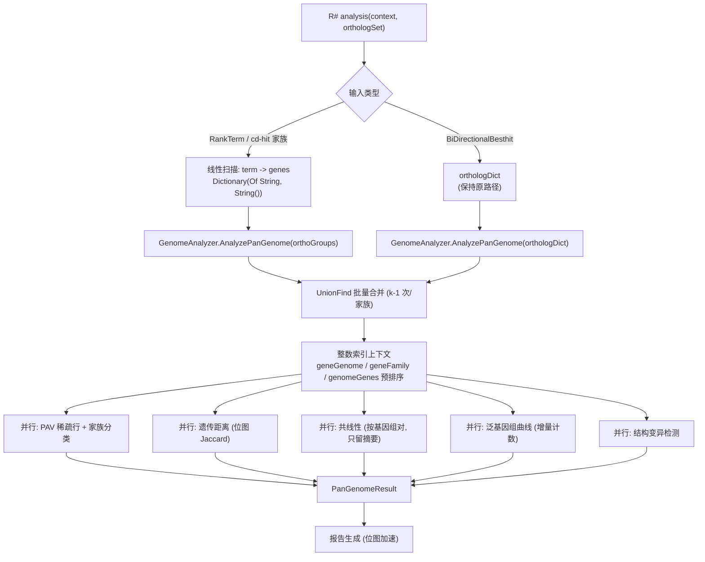

## 产品概述

对 GCModeller R# 程序包中的泛基因组（pan-genome）分析模块进行并行化改造与算法/内存优化，使其能够在有限内存下完成 241 个基因组、122 万基因级别（Escherichia coli）的大数据集分析。

## 核心功能（优化目标）

1. **并行化**：将家族聚类、PAV 与家族分类、泛基因组曲线、遗传距离、共线性、结构变异检测等各阶段改为多核并行执行（机器为 i9-12900 / 16 核 24 线程）。
2. **消除不必要的计算**：

- 移除 cd-hit 家族分组路径中 O(k²) 的两两同源配对物化（`BuildHomologyRelations`），一个含 k 个基因的家族只需 k−1 次 union；
- 共线性分析不再对每个基因组对做全基因表扫描，改为"按基因组预分组 + 预排序"一次构建；
- 泛基因组曲线由 O(迭代数 × 基因组数 × 家族数) 的 LINQ 全扫改为 O(迭代数 × 基因数) 的增量计数。

3. **降低内存占用**：PAV 矩阵只保存非零项；共线性按基因组对流式处理、只保留区块摘要；取消巨量的中间配对对象与 `orthoLookup` 双份索引。
4. **可观测性**：各分析阶段用 `Call "message".debug` 输出耗时与进程工作集（WorkingSet64），便于定位耗时/内存热点。
5. **行为可回归**：小数据集（Cryptococcus neoformans，15 基因组）输出与现有基线结果保持一致。

## 边界与约束

- 分析入口为 R# API `<ExportAPI("analysis")>`（`g:\GCModeller\src\workbench\R#\comparative_toolkit\pangenome.vb`）。
- BBH（`BiDirectionalBesthit`）输入路径保持原有语义不变，仅 cd-hit / RankTerm 正交群路径改走新的分组入口。
- 编译配置：`packages.NET5.slnx` 的 `Rsharp_app_release|x64`；测试命令使用 `--debug=none`（已确认该参数只影响 R# 解释器自身的 echo，不会屏蔽 `.debug` 扩展输出）。

## 技术栈

- 语言/框架：Visual Basic .NET，net10.0，`SMRUCC.genomics.Analysis.PanGenome`（`PanGenome.vbproj`）
- 并行：`System.Threading.Tasks.Parallel.For / ForEach`、`System.Collections.Concurrent.Partitioner`（不使用 `AsParallel` LINQ，避免大对象分配与不可控调度）
- 数值/位运算：`System.Numerics.BitOperations.PopCount`（Jaccard 位图加速）、`System.Diagnostics.Stopwatch`
- 诊断：`Microsoft.VisualBasic.ApplicationServices.VBDebugger.debug` 扩展（`g:\GCModeller\src\runtime\sciBASIC#\Microsoft.VisualBasic.Core\src\ApplicationServices\Debugger.vb` 221-227 行，输出 `debug[{WorkingSet64}, {threads} threads]` + 时间戳）
- 构建：`dotnet build "G:\GCModeller\src\workbench\packages.NET5.slnx" -c Rsharp_app_release -p:Platform=x64`
- 测试宿主：`G:\GCModeller\src\R-sharp\App\net10.0\R#.exe`

## 实现思路

### 总体策略

"先索引化、再去二次化、最后并行化"：把全部字符串键（基因 ID / 基因组名 / 家族 ID）在分析开始前一次性映射为连续整数索引，后续所有热循环只在并行数组（`Integer()`）上进行；然后从算法层面消除三处 O(k²)/O(N²×G)/O(iter×N×F) 的冗余计算；最后对相互独立的计算单元（家族、基因组对、迭代、基因组）做数据并行。

### 关键算法决策

**D1. 整数索引化上下文（GenomeAnalyzer 内部）**

- `geneIds() As String` + `geneIndex As Dictionary(Of String, Integer)`
- `geneGenome() As Integer`、`geneChr() As String`、`geneStart() As Integer`、`geneEnd() As Integer` —— 并行数组，替代热循环里的 `geneAnnotations(id).GenomeName` 字典查找
- `genomeNames() As String`（有序）+ `genomeIndex`、`genomeGenes()() As Integer`（每个基因组按 `(Chromosome, Start)` 预排序一次，替代共线性里每个基因组对的全表扫描）
- 删除 `genomeGeneSets As Dictionary(Of String, HashSet(Of String))`（122 万字符串副本，约 60 MB），改由整数索引重建

**D2. 消除 O(k²) 配对物化（最大收益）**

- `GenomeAnalyzer` 新增 `Public Function AnalyzePanGenome(orthoGroups As Dictionary(Of String, String())) As PanGenomeResult`（家族 ID → 基因 ID 数组），内部对每个组做 k−1 次 `uf.Union`
- `pangenome.vb` 的 `analysis()`：RankTerm（cd-hit）路径**不再调用 `OrthoGroupsHelper.BuildHomologyRelations`**，改为一次线性扫描按 `RankTerm.term`（= `IBlastHit.hitName` = 家族 ID）聚成 `Dictionary(Of String, String())` 后调用新入口
- E. coli 估算：省掉 5000 万~1 亿个 `HomologyPair`/`BiDirectionalBesthit` 对象（约 4~10 GB）
- `UnionFind.Find` 改为**迭代式**路径压缩（避免深链递归爆栈），并加 `Union(referID, geneID)` 的批量重载

**D3. PAV + 家族分类并行 + 稀疏行**

- 按家族并行：直接遍历家族成员，用 `geneGenome` 累加拷贝数到 `Integer(N)` 缓冲，再只把非零项写入 `Dictionary(Of String, Integer)`
- 稀疏行**已验证安全**：`PAVTable.GenomeData` 默认属性、`PanGenomeResult.GetPAVMatrix`（`TryGetValue`）、`GeneratePAVMatrixData` / `GenerateGenomeStatsTable`（`ContainsKey`）、`pav_df`（`a(genome_name)`）对缺失键均按 0 处理。E. coli 下 PAV 内存由 ~280 MB 降到约 1/10
- 已知副作用：`pav_df` 的 `genome_names` 来自 `PAV.Keys` 并集，省略零项后 `pav_table.csv` 的**列顺序**可能变化（内容不变）
- `CategorizeGeneFamilies` 与主家族循环合并为一次并行遍历

**D4. 泛基因组曲线：O(iter×N×F) → O(iter×G)**

- 预建 `genomeFamilies(g) As Integer()`（每基因组去重后的家族索引，总计约 122 万个 int）
- 每次迭代用线程本地 `cnt(F) As Integer`：加入第 i 个基因组时，对 S 中每个家族 f：若 `cnt(f)=0` 则 `panSize+=1`；若 `cnt(f)=i` 则 `x+=1`；`cnt(f)+=1`；遍历完 `coreSize = x`
- 100 次迭代用 `Parallel.For` + 线程本地计数数组，对 241 个曲线点原子累加。总代价 ≈ 100 × 122 万 = 1.2 亿次数组操作（原实现约 10 亿次字典查找）

**D5. 遗传距离：位图 + 并行**

- 每个基因组用 `ULong()` 位图表示家族集合（241 × F/64 ≈ 15 万 long ≈ 1.2 MB）
- 29,040 对并行做 `PopCount(a(i) AND b(i))` 求交集，Jaccard = 1 − |∩| / (|A|+|B|−|∩|)
- 单拷贝路径保留语义并改用整数索引 + 并行；**若 `orthologDict` 为空则回退到 Jaccard 距离**（cd-hit 路径下 `HomologyPair.CreateAlignmentHit` 固定 `forward=reverse=1`，该路径算出的距离恒为 0，属于无效结果）

**D6. 共线性：预分组 + 按基因组对并行 + 只保留摘要**

- 每个基因组预建 `familyToGene As Dictionary(Of Integer, Integer)`（家族 → 该基因组内唯一基因；多拷贝记哨兵 −1）
- 对基因组对 (i,j)：遍历 i 的预排序基因（~5000 个），用 `familyToGene(j)` 查唯一同源基因生成 `OrthologyLink`；保留 `SplitBlockByChromosome` 与 `MinCollinearGenes` 原语义
- **按基因组对并行，处理完立即丢弃中间列表**，只保留区块摘要 → 内存 O(并行度 × 基因组基因数)
- `CollinearBlock` 增加 `LinkCount As Integer`；`GenomeAnalyzer` 增加 `Public Property RetainOrthologyLinks As Boolean`，默认按 `totalGenomes <= 32` 自动决定（Cryptococcus 15 → 保留，与现有输出完全一致；E. coli 241 → 只存摘要，避免约 1 亿个 `OrthologyLink`）

**D7. SV 检测并行 + 消除重复枚举**

- 按家族并行，每线程本地 `List(Of StructuralVariation)`；合并后按确定顺序（家族索引、基因组索引）重排编号，保证 `SV_ID` 可复现
- 每家族的 `presenceCount` / 中位数只从紧凑 `Integer()` 拷贝数向量算一次（原来是三次 LINQ 枚举 + `Median` 排序）

**D8. 报告生成**

- `GenerateGenomeStatsTable` 用预建的家族存在位图替代 O(N × F) 双重循环
- `GenerateCollinearityStats` 改为 `If(b.OrthologyLinks Is Nothing, b.LinkCount, b.OrthologyLinks.Length)`

### 复杂度与收益

| 阶段 | 现状 | 优化后 |
| --- | --- | --- |
| 同源配对（cd-hit 路径） | O(ΣC(k,2)) ≈ 1e8 对象 / GB 级 | O(Σk) = O(G) |
| 共线性 | O(N² × G) ≈ 3.5e10 次比较 + 1e8 link 对象 | O(N² × G/N) = O(N×G) ≈ 1.5e8，只留摘要 |
| 泛基因组曲线 | O(100 × N × F) ≈ 1e9 字典查找 | O(100 × G) ≈ 1.2e8 数组操作 |
| 遗传距离 | O(N² × F) 哈希集 | O(N² × F/64) 位图 |
| PAV 内存 | F × 241 全量行 ≈ 280 MB | 仅非零项 |


## 实施要点（防回归）

- **保持公开 API 兼容**：`PanGenomeResult` 的属性名/类型、`pav_table` / `sv_table` / `pav_matrix` / `curve_data` / `genetic_distance` / `report_html` / `set_ortho_group` / `build_context` 签名不变；`AnalyzePanGenome(orthologDict)` 原重载保留给 BBH 路径
- **逐阶段埋点**：每个阶段 `Stopwatch` + `Call $"[stage] ... elapsed / genes / families".debug`，便于对比优化前后
- **进度条**：热循环里移除 `TqdmWrapper.Wrap`（其回调在大循环上有可观测开销），仅在最外层保留
- **避免并行写共享字典**：PAV / GeneticDistanceMatrix / StructuralVariations 用"每线程本地集合 + 一次性合并"，合并阶段按确定性顺序写入，保证输出可复现
- **线程安全**：`geneAnnotations` 等只读结构在并行期间不得写入；`UnionFind` 的 union 阶段保持单线程（或按家族分片后用锁合并根），避免引入数据竞争
- **字符串驻留**：基因组名统一复用 `genomeNames` 数组中的同一实例，避免 PAV 每行重复分配键字符串
- **日志不落敏感数据**：`.debug` 只输出阶段名、规模计数、耗时与内存，不输出基因序列或全量 ID 列表
- **爆炸半径**：不改动 `PhylumProbabilityGenerator.vb`、`OrthologyLink.vb`、`PAVTable.vb`、`SVTable.vb`、`TableExport.vb` 的对外语义；`OrthoGroupsHelper.BuildHomologyRelations` 保留（其它调用方可能使用），仅在 `analysis()` 的 cd-hit 路径不再调用

## 架构设计



## 目录结构

```
g:/GCModeller/src/interops/localblast/PanGenome/
├── GenomeAnalyzer.vb                      # [MODIFY] 主分析流程重构：整数索引上下文(基因/基因组/家族 -> int)、
│                                          #  新增 AnalyzePanGenome(orthoGroups) 分组入口、PAV 并行+稀疏行、
│                                          #  曲线增量算法、位图 Jaccard 距离、共线性按基因组对并行+摘要、
│                                          #  SV 并行、各阶段 .debug 埋点、RetainOrthologyLinks 开关
├── UnionFind.vb                           # [MODIFY] Find 改为迭代式路径压缩(防深链爆栈)；
│                                          #  新增批量 Union 重载以支撑 O(k) 家族合并；保持 AddElement/Union/GetClusters 签名
├── Output/
│   ├── CollinearBlock.vb                  # [MODIFY] 新增 LinkCount As Integer 与摘要构造函数，
│   │                                      #  使大数据集下 OrthologyLinks 可为 Nothing 而统计信息不丢失
│   └── PanGenomeResult.vb                 # [MODIFY] 仅内部实现调整(PAV 稀疏行后 GetPAVMatrix 逻辑保持不变)，类型不变
├── PanGenomeReportGenerator.vb            # [MODIFY] GenerateCollinearityStats 兼容摘要块；
│                                          #  GenerateGenomeStatsTable 用预建位图替代 O(N x F) 双重循环
└── OrthoGroupsHelper.vb                   # [KEEP] 保留 BuildHomologyRelations 供其它调用方使用，
                                           #  但 pan-genome 的 cd-hit 路径不再调用

g:/GCModeller/src/workbench/R#/comparative_toolkit/
└── pangenome.vb                           # [MODIFY] <ExportAPI("analysis")>：RankTerm(cd-hit)路径
                                           #  改为按 term 聚成 家族->基因 分组并调用新入口，
                                           #  跳过 O(k^2) 的 BuildHomologyRelations；BBH 路径保持不变
```

## 关键代码结构

```
' GenomeAnalyzer.vb —— 新增的直系同源分组入口（避免 O(k^2) 配对物化）
' orthoGroups: Key = 家族/簇 ID (RankTerm.term)，Value = 该家族的基因 ID 数组
Public Function AnalyzePanGenome(orthoGroups As Dictionary(Of String, String())) As PanGenomeResult

' GenomeAnalyzer.vb —— 大数据集下的共线性摘要开关
' 默认 totalGenomes <= 32 时保留逐基因 OrthologyLinks（小数据集输出完全一致）
Public Property RetainOrthologyLinks As Boolean

' Output/CollinearBlock.vb —— 摘要字段（OrthologyLinks 为 Nothing 时用于统计与报告）
Public Property LinkCount As Integer
```

## Agent Extensions

### SubAgent

- **code-explorer**
- 用途：在实施阶段核对 `GenomeAnalyzer.vb` / `pangenome.vb` 中每个被修改函数的全部调用点（尤其 `AnalyzePanGenome`、`UnionFind.GetClusters`、`PAVMatrix`、`CollinearBlocks`），确认没有遗漏的调用方导致编译失败或语义破坏
- 预期结果：输出一份完整的调用点清单，确保改动只影响 pan-genome 分析链路，不波及 localblast 其它模块