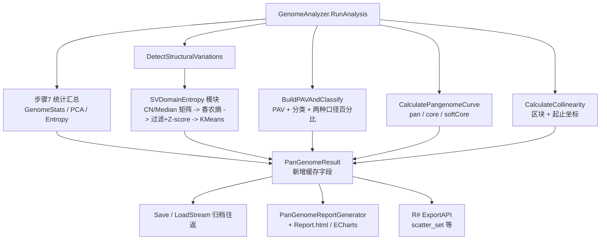

## 产品概述

在既有的泛基因组分析模块中补充新的分析数据与可视化内容：让泛基因组曲线不再只看严格核心基因；用百分比口径还原核心/软核心基因的真实占比；把统计结果前移到分析阶段避免重复计算；补齐共线性区块的坐标信息；并把 SV 结构变异从「一张类型饼图」扩展为矩阵热图、信息熵散点图与聚类结果，从而支撑更深入的进化分析。

## 核心功能

### 1. 软核心基因曲线

泛基因组曲线数据（每个「已加入基因组数量」对应一个数据点）在原有「泛基因组大小 / 核心基因数」之外，新增「软核心基因数」。软核心按分析上下文自身的软核心阈值判定（测试脚本传入 0.8，即某家族在当前已加入的基因组中出现在不低于该比例的基因组里即计入）。报告页面的曲线图新增一条软核心曲线，与泛基因组曲线、核心基因组曲线同图对比、颜色区分、可图例开关，并补充相应的文字说明。

### 2. 基因家族分布比例（百分比）图

原有的「按家族绝对数量」的饼图与条形图保留不动，另新增一组「按比例」的饼图与条形图与之对比。比例有两种统计口径，两种都要产出、都要在报告上展示、都要能后续导出为 CSV 矩阵：

- 口径一（按基因数）：对每个基因组，分别统计核心/软核心/壳/云四类家族在该基因组内的拷贝数之和，除以该基因组的基因总数得到百分比，再对所有基因组取平均；
- 口径二（按家族个数）：对每个基因组，分别统计属于四类的家族个数，除以该基因组内实际出现的家族总数得到百分比，再对所有基因组取平均。
由于四类构成完整划分，口径一、口径二的四类占比加和都应接近 100%。

### 3. 统计结果前移并缓存

基因组基本信息统计、PAV 矩阵的 PCA 降维散点数据、基因组存在/缺失均衡度熵散点数据这三份数据，目前在生成 HTML 报告时算一次、在外部再次调用获取散点数据时又算一次。改为在分析阶段一次性算好并随结果对象一起保存/加载；报告生成与外部调用都优先直接读取，仅在结果对象中这三份数据为空时才重新计算。

### 4. 共线性区块坐标

共线性区块补充记录区块在两个基因组上的起止坐标（各自取区块内基因的最小起始位点与最大终止位点），使区块具备可绘图的空间位置信息；原有的染色体等字段语义保持不变。

### 5. SV 结构变异的矩阵化与信息熵分析

- 在报告的结构变异章节新增两张热图：基因家族 SV CopyNumber 矩阵热图与 SV Median 矩阵热图（行=基因家族、列=基因组，无 SV 事件的格子取 0），并支持与现有热图一致的放大查看；
- 这两个矩阵可分别导出为矩阵对象，便于后续脚本保存为 CSV；矩阵的行只包含「至少有一个 SV 事件」的家族（不含共线性断裂这类没有家族归属的事件），列为全部基因组；
- 对两个矩阵逐行计算香农信息熵：CopyNumber 熵按「各基因组拷贝数占比」的离散分布计算；Median 熵直接以 Median 的精确取值作为离散类别统计频率（本项目 Median 是拷贝数中位数，取值是小整数）；
- 以 CopyNumber 熵为 X 轴、Median 熵为 Y 轴构建散点图，先过滤掉出现频率低于 5% 的家族，再对两个熵做 Z-score 标准化，然后用 KMeans 聚类（簇数默认 4，对应文档中的四类进化模式象限，并可由脚本参数覆盖）；散点图与聚类结果一并保存到结果对象，便于导出为 CSV；
- 报告页面用散点图展示（按簇着色、悬浮显示家族 ID 与两个熵值），并依据 sv_entropy.md 的内容编写图注文本，解释四个象限（僵化/保守型、剂量调谐型、混沌/快速进化型、结构微调型）的生物学含义；
- 上述新增字段必须随结果对象的保存/加载一起往返，保证重新加载后不丢失。

## 验证方式

以 Rsharp_app_release|x64 配置编译解决方案，然后仅针对 K:\pangenome\data\Saccharomyces_cerevisiae 数据集（12,635 个家族 × 10 个基因组）运行既有测试脚本，确认原有导出内容与基线一致、新增内容正确出现且往返不丢数据。

## 技术选型

- 语言/运行时：VB.NET（.NET 10），沿用现有 `PanGenome.vbproj`。该工程已引用全部所需依赖，无需新增引用：
- `DataMining.NET5.vbproj`（提供 `KMeansAlgorithm(Of T)`）
- `dataframework-netcore5.vbproj`（提供 `DataFrame`）
- `ANOVA.vbproj`（提供 `PCA.PrincipalComponentAnalysis`，PCA 数据既有实现已用）
- `Math.NET5.vbproj` / `Core.vbproj`（统计与 `.debug` 扩展）
- `localblast.NET5.vbproj`（`BiDirectionalBesthit` / `RankTerm`）
- 报告前端：沿用既有静态 HTML 模板 `Report.html` + 内嵌 ECharts（服务端占位符替换 + `script type="application/json"` 数据标签）。**已核实 `DefaultTemplate.resx` 通过 `ResXFileRef` 直接引用 `Report.html`（utf-8），因此只需修改 `Report.html`，无需改 resx 与 Designer 文件。**
- R# 绑定层：沿用 `comparative_toolkit/pangenome.vb` 的 `ExportAPI` + `Converts.makeDataframe.addHandler` 机制；矩阵以 `DataFrame` 返回（与现有 `pav_matrix(result)` 完全同构，已在跑通）。
- 聚类：`Microsoft.VisualBasic.DataMining.Clustering.KMeans.KMeansAlgorithm(Of T As EntityBase(Of Double))`，需要自定义实体类。

## 实现方案

### 总体策略

沿用现有分层：`GenomeAnalyzer`（分析内核，整数索引化 + 并行）→ `PanGenomeResult`（结果对象 + 归档）→ `PanGenomeReportGenerator` + `Report.html`（渲染）→ `pangenome.vb`（R# 导出）。所有新数据一律**在分析阶段算好并挂在结果对象上**，下游只读缓存。

### 1. 软核心曲线（增量计数，O(迭代数 × 基因数) 不变）

在 `CalculatePangenomeCurve` 现有线程本地 `cnt(F)` 累加器基础上同步累计软核心：

- 第 `step` 步（0-based，当前已加入 `step+1` 个基因组）前，`cnt(f)` 表示家族 f 在前 `step` 个基因组中出现的次数；遍历当前基因组的家族集合时，`c = cnt(f)`，加一后若 `c + 1 >= CInt(Math.Ceiling(SoftCoreThreshold * (step + 1)))` 则该家族在本步计为软核心（`Math.Min(..., step+1)` 兜底，避免阈值大于 1 时越界）；
- 与 core 一样用 `Interlocked.Add` 累加到 `sumSoft(step)`，最后 `SoftCoreGenes = CInt(sumSoft(i) / iterations)`；
- `SoftCoreThreshold` 取实例属性（`BuildPAVAndClassify` 的分类也用它，口径天然一致）；随机排列仍用固定种子 `New Random(20260101)`，保证可复现。

### 2. 百分比分布（两种口径一次遍历产出）

在 `BuildPAVAndClassify` 的并行家族循环中，每个家族已经有 `counts(N)` 拷贝数向量与分类标志，直接用 `Parallel.For` 的**线程本地重载**（`localInit`/`localFinally`）把 `counts` 累加到线程本地的 4×N 累加器：

- 口径一累加 `Σ拷贝数`；口径二累加 `出现标志(计数大于 0)`；同时累加每个基因组「实际出现的家族总数」作为口径二的分母。
- 采用线程本地累加而非锁，避免 E. coli 规模下（12 万家族 × 241 基因组）的锁竞争；最后串行合并 24 份线程本地结果。
- 复杂度：O(家族数 × 基因组数) 次整数加法，相对 PAV 构建本身可忽略。
- 结果存为「每个基因组 × 4 类 × 2 口径」的百分比表 + 两套 4 元素的平均值，平均值直接驱动饼图/条形图，明细表驱动 CSV 导出。

### 3. 统计缓存

- `PanGenomeResult` 新增 `GenomeStats`（`GenomeStatRow()`）、`PCAData`（`PCAScatterDataset`）、`GenomeEntropyData`（`GenomeEntropyDataset`）三个属性，并配「为空则计算并回填、非空直接返回」的取数方法。
- 在 `RunAnalysis` 末尾（曲线之后）新增「步骤 7：统计汇总」，调用既有的 `PanGenomeStats` 扩展方法一次性算好写入 `result`；此处是同一 assembly 内的直接调用，无需改动 `PanGenomeStats` 的现有算法（仅新增百分比构建函数）。
- `PanGenomeReportGenerator.GenerateReport` 与 R# `scatter_set` 改为走取数方法，重复计算被彻底消除。
- 注意：`PanGenomeResult.vb` 需新增 `Imports SMRUCC.genomics.Analysis.PanGenome.ReportJSON`（VB 不会自动搜索子命名空间，`PanGenomeStats.vb` 已有同样的 Imports）。

### 4. 共线性区块坐标

- `CalculatePairCollinearity` 中 `links` 只存基因 ID 字符串，需要额外维护与 `links` 平行的**基因组 j 侧基因下标列表**（分组路径直接用 `gj`，BBH 路径用命中的 `hit`；两者都已在作用域内，无额外查找开销）。
- 切分子区块时，对子区块内两个方向分别取 `min(geneStart)` / `max(geneEnd)`，写入 `CollinearBlock` 新增的 `Start1/End1/Start2/End2`。
- 两个构造分支（保留明细 / 仅摘要）都要写入坐标，保证大数据集摘要模式下坐标依然可用；`Chr1/Chr2` 语义保持不变以免既有输出回归。

### 5. SV 矩阵、信息熵与聚类

新增模块（建议 `Report/SVDomainEntropy.vb`，与 `PanGenomeStats.vb` 同层）承载：

- **矩阵构建**：以 `StructuralVariations` 中 `FamilyID` 非空且在 `TotalGenesInGenomes` 中的记录为数据源，行 = 有 SV 事件的家族（按名称稳定排序），列 = 全部基因组（按名称排序），无事件填 0。**已核实真实 SV 事件里同一 家族×基因组 至多一条记录**（`PAV_Absence`/`PAV_Presence`/`CNV_Gain|Loss` 三类互斥；650 条 `Collinearity_Break` 无 FamilyID/GenomeName，必须排除）。整体 O(SV 事件数)，无需重扫基因表。
- **香农熵**：CopyNumber 熵用 `p_i = CN_i / ΣCN` 的离散分布；Median 熵按精确取值作类别统计频率。两者都在 `Σ=0`（全 0 行）时短路返回 0，避免 `Log(0)` 产生 NaN 破坏 JSON（沿用 `PanGenomeStats.ShannonEntropy` 的既有做法）。
- **过滤与标准化**：频次 = 该家族有 SV 事件的基因组数 / 基因组总数，过滤掉低于 5% 的行；对两个熵分别做 Z-score 标准化（均值/标准差为 0 时短路，避免除零）。
- **聚类**：自定义实体类继承 `EntityBase(Of Double)`（`entityVector` 为 `{zCopyNumber, zMedian}`，另带家族 ID 与原始熵值），用 `New KMeansAlgorithm(Of 实体类)(n_threads:=Environment.ProcessorCount, auto_parallel:=True).ClusterDataSet(points, k)`；`k` 默认 4，并要求 `k < 点数`（点数不足时跳过聚类、退化为不聚类的散点，保证不抛异常）。
- **可复现性处理**：KMeans 的初始中心来自 `RandomExtensions.seeds`（`ThreadLocal(Of Random)`，按时间播种），每次运行簇编号可能不同。聚类完成后按簇中心（标准化空间中的 `(zCN均值, zMedian均值)`）做确定性排序重新编号 0..k-1，保证同一数据多次运行标签稳定。这一步必须在计划中落实，否则报告与 CSV 的簇编号在重跑后会漂移。
- **规模控制**：报告热图沿用 `SampleEvenly` 对家族行抽样并给出 `truncated` 提示（参照 `BuildPAVMatrixData` 的 `MaxPAVFamilies` 做法）；CSV/DataFrame 导出不做抽样，输出完整矩阵。

### 6. 归档扩展（PanGenomeResult.Save/Load）

沿用现有 TSV + ZipArchive 机制，新增条目：`genome.stats`、`pca`、`entropy`、`category.percent`、`sv.entropy`；`curve` 条目加第 4 列；`collinear` 条目加 4 列坐标。

- **`sv` 矩阵条目不落盘**：它们完全可以由已归档的 `sv` 条目（含 FamilyID / GenomeName / CopyNumber / Median）+ 基因组列表确定性重建。E. coli 规模下若落盘会达到数百 MB 级文本，故改为加载后为空时惰性重建 —— 信息不丢失，且与需求 3 的「为空才重算」模式一致。
- **熵数据集落盘**：它是 KMeans 的产物，落盘可保证报告与 CSV 与本次分析完全一致。
- **版本兼容**：`ArchiveVersion` 升级为 `pangenome-result/2.0`；`LoadStream` 同时接受 `1.0` 与 `2.0`（旧归档缺失条目按空处理，`curve` 仅 3 列时软核心按 0 读入），避免旧结果直接不可读。
- 硬约束：测试脚本是 `writeBin` → `readBin` → 再从反序列化对象导出全部 CSV 与 HTML，因此**每个新增字段都必须完整往返**，否则导出为空。

### 7. 报告渲染

- `PanGenomeReportData.vb` 新增/扩展 JSON 模型（必须具名 Public 类、camelCase 属性，`DataContractJsonSerializer` 不支持匿名类型）：`PangenomeCurveDataset` 加 `softCoreGenes`；新增 `PercentageItem`（`value As Double`，`CategoryItem.value` 是整数不能复用）、`CategoryPercentDataset`、`SVMatrixDataset`、`SVDomainEntropyPoint` / `SVDomainEntropyDataset`。
- `PanGenomeReportGenerator` 新增占位符：`{$CATEGORY_PERCENT_DATA}`、`{$SV_COPY_NUMBER_MATRIX_DATA}`、`{$SV_MEDIAN_MATRIX_DATA}`、`{$SV_ENTROPY_DATA}`；`BuildPangenomeCurve` 补 `softCoreGenes`；原有三处统计构建改走缓存取数。
- `Report.html`：
- 新增 4 个 `script type="application/json"` 数据标签；
- 曲线章节：`initCurveChart` 的 legend 增加一项、series 增加第 3 条（建议软核心用 #22d3ee 与核心的 #10b981、泛基因组的 #3b82f6 区分，同样带 areaStyle 渐变），章节说明补一句软核心定义；
- 基因家族分布章节：在现有饼图/条形图那一行下面新增一行百分比饼图 + 百分比条形图容器（`pieChartPercent` / `barChartPercent`），并加简短口径说明；
- 结构变异章节：新增两个 `heatmap-frame` 容器（`svCopyNumberHeatmap` / `svMedianHeatmap`，配 `data-heatmap` 放大链接）+ 一个散点图容器（`svEntropyScatter`）+ 复用 `.chart-caption` 样式写图注（照抄 `genomeEntropyScatter3D` 那一段的写法）；
- 新增 JS：`initCategoryPercentPie` / `initCategoryPercentBar` / `initSVCopyNumberHeatmap` / `initSVMedianHeatmap` / `initSVEntropyScatter`，热图沿用 `registerHeatmap(id, title, buildOption)` 注册到 `heatmapRegistry` 以复用全屏放大；散点按簇着色并在 tooltip 显示家族 ID 与两个熵值；所有新图都要处理「数据为空 / ECharts 未加载」的兜底（照抄既有函数的 early-return 写法）。

### 8. R# 导出接口

- `scatter_set` 改为读缓存（返回值结构 `slot("stats"/"pca"/"entropy")` 保持不变，**不要破坏现有脚本**）。
- 新增导出：两个 SV 矩阵（返回 `DataFrame`，行=家族、列=基因组，与 `pav_matrix` 同构）、类别百分比明细矩阵（返回 `DataFrame`，行=4 个类别、列=每个基因组 + 一列平均值，用可选参数切换两种口径）、SV 熵散点与聚类结果（返回数据集对象，并为其注册 `as.data.frame` 处理器以便 `write.csv`）。
- 新函数统一放在现有 `scatter_set` / `pav_matrix` 一带，命名与 `<RApiReturn>` 风格保持一致。

## 实施注意事项

- **回归优先**：小数据集全部基线产物已备份，改动后必须逐文件内容比对（`pav_table.csv` 的 FamilyID 标签与行序允许变化，按内容集合比对）。软核心列是新增列，`CoreGenes` / `TotalGenes` 列数值必须与基线逐点一致。
- **不要污染 PAV**：`PanGenomeStats` 的注释已警告 `PrincipalComponentAnalysis` 会原地修改输入数值数组，新建 `DataFrame` 是必须的；新增的 SV 矩阵与百分比计算同样不要复用/改写 `result.GetPAVMatrix()` 的返回值。
- **热路径与内存**：熵/矩阵构建只在分析阶段与惰性重建时各跑一次；百分比累加用线程本地状态避免锁；矩阵用 `Double()()` 而非嵌套字典，避免 E. coli 规模下的字典开销。
- **日志**：沿用 `Call $"[pan-genome] ...".debug` 风格（实测 `--debug=none` 下这些输出仍会打印到 stdout，可被 `Select-String "pan-genome"` 捕获）。新增埋点：统计缓存、百分比统计、SV 矩阵与熵聚类各一条，含耗时与规模；不要打印逐家族明细。
- **异常兜底**：熵聚类对「点数不足 k」「标准差为 0」「全 0 行」等边界都要短路并返回空数据集，不能抛异常 —— 报告生成失败会连带整个导出流程失败。
- **影响面控制**：不改 `DetectStructuralVariations` 的既有判定逻辑与 `SV_ID` 编号规则；不改 `Chr1/Chr2` 语义；不改 `sv_table` / `pav_table` / `pav_matrix` / `genetic_distance` 的现有输出格式。

## 架构设计



## 目录结构

```
src/interops/localblast/PanGenome/
├── GenomeAnalyzer.vb                    # [MODIFY] CalculatePangenomeCurve 增加软核心增量计数；BuildPAVAndClassify 增加两种口径的百分比累加；CalculatePairCollinearity 维护 j 侧基因下标并在切分子区块时算 min(Start)/max(End)；MakeCollinearBlock 两个分支都写入坐标；RunAnalysis 末尾新增「步骤7 统计汇总」把三类统计 + 百分比 + SV 矩阵/熵写入 result（沿用 Stopwatch + .debug 埋点）
├── Output/
│   ├── PangenomeCurveData.vb            # [MODIFY] 新增 SoftCoreGenes As Integer；同步 ToString 与文件头注释摘要
│   ├── CollinearBlock.vb                # [MODIFY] 新增 Start1/End1/Start2/End2 As Integer；两个构造函数都要透传坐标
│   └── PanGenomeResult.vb               # [MODIFY] 新增 GenomeStats/PCAData/GenomeEntropyData/CategoryPercent/SVEntropy 属性与「空则重算」取数方法、SV 矩阵 DataFrame 导出方法、类别百分比 DataFrame 导出方法；新增 Imports ReportJSON；Save/LoadStream 增加 genome.stats、pca、entropy、category.percent、sv.entropy 条目，curve 加第 4 列、collinear 加 4 列坐标；ArchiveVersion 升到 2.0 并兼容读 1.0；SV 矩阵不落盘，加载后惰性由 sv 条目重建
├── Report/
│   ├── PanGenomeStats.vb                # [MODIFY] 新增两种口径的类别百分比构建函数（线程本地累加合并）；把三个既有 Build* 包一层「空则计算并回填」的取数方法；不改动既有熵/PCA 算法
│   ├── SVDomainEntropy.vb               # [NEW] SV CopyNumber / Median 矩阵构建；逐行香农熵（CopyNumber 占比分布 / Median 精确取值分布）；频次小于 5% 过滤；Z-score 标准化；继承 EntityBase(Of Double) 的聚类实体类；KMeansAlgorithm 聚类与按簇中心的确定性标签重排；输出数据集模型；全部边界短路返回空
│   ├── PanGenomeReportData.vb           # [MODIFY] PangenomeCurveDataset 加 softCoreGenes；新增 PercentageItem / CategoryPercentDataset / SVMatrixDataset / SVDomainEntropyPoint / SVDomainEntropyDataset（具名 Public、camelCase）
│   └── PanGenomeReportGenerator.vb      # [MODIFY] BuildPangenomeCurve 补软核心；统计改走缓存；新增数据库构建函数与占位符替换（CATEGORY_PERCENT / SV 两个矩阵 / SV 熵）；SV 热图家族行沿用 SampleEvenly 抽样并标注 truncated
├── Report.html                          # [MODIFY] 新增 4 个 JSON 数据标签；曲线图加软核心 series 与说明；新增百分比饼图+条形图容器与说明；结构变异章节新增两个热图容器与熵散点图容器、复用 .chart-caption 写图注；新增 5 个 init 函数并注册热图到 heatmapRegistry；补齐空数据/无 ECharts 的兜底
└── sv_entropy.md                        # [REFERENCE] 图注文本与四象限生物学含义的来源（只读，不改动）

src/workbench/R#/comparative_toolkit/
└── pangenome.vb                         # [MODIFY] scatter_set 改为读 PanGenomeResult 缓存；新增 SV CopyNumber 矩阵、SV Median 矩阵、类别百分比矩阵、SV 熵散点+聚类结果四个 ExportAPI（矩阵返回 DataFrame，与 pav_matrix 同构）；为熵数据集注册 as.data.frame 处理器
```

## 关键数据结构

```
' ReportJSON 新增（PanGenomeReportData.vb，属性名即前端 JS 键名）
Public Class PercentageItem
    Public Property name As String
    Public Property value As Double          ' 注意：CategoryItem.value 是 Integer，不能复用
    Public Property color As String
End Class

Public Class CategoryPercentDataset
    Public Property categories As String()           ' 固定的四类名称与顺序
    Public Property genomes As String()
    Public Property byGeneCount As Double()          ' 4 个平均百分比（口径一）
    Public Property byFamilyCount As Double()        ' 4 个平均百分比（口径二）
    Public Property genomeByGeneCount As Double()()  ' [类别][基因组]，供 CSV 导出
    Public Property genomeByFamilyCount As Double()()' [类别][基因组]，供 CSV 导出
End Class

Public Class SVDomainEntropyPoint
    Public Property name As String          ' 基因家族 ID
    Public Property hCopyNumber As Double
    Public Property hMedian As Double
    Public Property zCopyNumber As Double
    Public Property zMedian As Double
    Public Property presentGenomes As Integer
    Public Property cluster As Integer      ' 确定性重排后的簇编号
End Class
```

```
' PanGenomeResult 新增缓存字段（空值表示尚未计算，取数时惰性计算并回填）
Public Property GenomeStats As GenomeStatRow()
Public Property PCAData As PCAScatterDataset
Public Property GenomeEntropyData As GenomeEntropyDataset
Public Property CategoryPercent As CategoryPercentDataset
Public Property SVEntropy As SVDomainEntropyDataset
' 注：SV CopyNumber / Median 矩阵不进归档，由已归档的 sv 条目惰性重建后缓存
```

## 设计范围

本次不做整体改版，只在既有深色科技风 HTML 报告模板内**新增与既有图表风格完全一致的五个可视化区块**，并给曲线图补一条折线。所有新图沿用模板现有的 `.chart-container` / `.chart-title` / `.chart-wrapper` / `.heatmap-frame` / `.chart-caption` / `readJsonData(id)` / `registerHeatmap(...)` 机制，保证视觉与交互零违和。

## 视觉风格

延续既有深色数据大屏基调：近黑蓝底（#0b1120 系）+ 半透明卡片 + 细边框 + 柔和辉光；ECharts 图表统一 `tooltip` 深色底（#1a2332 / 边框 #2d3748 / 文字 #f1f5f9）、轴线 #2d3748、标签 #94a3b8、虚线分割线。曲线用平滑折线 + 同色渐变面积，热图用连续色阶，散点按簇用固定色轮着色。

## 新增区块设计

### 板块 A：泛基因组曲线（改造）

在图例中追加「软核心基因组」一项（#22d3ee 青色），曲线为平滑折线 + 渐变面积，符号用 `triangle`，与泛基因组（#3b82f6 圆点）、核心基因组（#10b981 菱形）在色彩与符号上三重区分；`legend.top: '5%'` 容纳三项。章节说明补一句软核心阈值的定义与「曲线不归零」的判读提示。

### 板块 B：基因家族分布比例（新增一组）

紧随现有「分布饼图 / 分布条形图」那一行之下，新增一行 `charts-row`：

- 左侧「基因家族分布比例饼图（按基因数）」：环形图（`radius: ['50%','75%']`），四段沿用既有分类色 核心 #10b981 / 软核心 #3b82f6 / 壳 #f59e0b / 云 #8b5cf6，标签显示名称 + 百分比，中心显示四类均值中的最大值作为视觉锚点。
- 右侧「基因家族分布比例条形图（按家族数）」：横向条形，四根柱按同一配色，柱端标注百分比。
- 两个图共用一段 `.method-note` 说明两种口径的差异（按基因数 / 按家族个数），并明确「与上方绝对数量图对比可看出壳/云基因在数量上被基因组数量放大的现象」。

### 板块 C：SV CopyNumber 矩阵热图（新增）

结构变异章节内新增 `heatmap-frame` 容器：行=基因家族、列=基因组，色阶用青蓝单色渐进（深底→亮青），无事件单元用近底色渲染；下方配「查看完整热图 ↗」链接以复用全屏弹窗；顶部一行 `.table-note` 提示抽样的家族数量与 truncated 状态。

### 板块 D：SV Median 矩阵热图（新增）

与板块 C 并列，保持完全相同的尺寸、坐标轴与交互约定；色阶改用紫蓝渐进以便与 CopyNumber 热图快速区分；同样带放大链接与抽样提示。

### 板块 E：SV 信息熵散点图 + 图注（新增）

- 组合图：X 轴为「CopyNumber 熵」，Y 轴为「Median 熵」，`scatter` 系列按 KMeans 簇拆成 4 个系列（固定 4 色），点大小统一 10、不透明度 0.85；`tooltip` 显示家族 ID、两个原始熵值、标准化值、出现基因组数与簇编号；`legend` 支持按簇开关；容器高度 560px。
- 图注：在散点图下方放一个 `.chart-caption` 区块（照抄 `genomeEntropyScatter3D` 的既有写法），内含标题「如何解读这张散点图」+ 一条 `.formula` 公式行（两个香农熵的定义）+ 四个象限条目：
- 低 Hcn + 低 Hmed —「僵化/保守型」：核心管家基因，剂量与结构双重保守；
- 高 Hcn + 低 Hmed —「剂量调谐型」：由固定模板（TE/串联重复）驱动的拷贝数扩增收缩，如 NLR、P450 家族；
- 高 Hcn + 高 Hmed —「混沌/快速进化型」：附属基因不断试错，多为环境适应相关；
- 低 Hcn + 高 Hmed —「结构微调型」：拷贝数稳定但断裂点各异，指示基因融合/结构域重排。
末尾附一句实施口径说明（过滤出现频率低于 5% 的家族、Z-score 标准化、k 默认 4）。

## 响应式与可达性

沿用模板既有断点规则（窄屏下 `charts-row` 自动堆叠、`.chart-wrapper` 高度自适应、热图横向滚动）；所有新容器在数据为空时显示 `.no-data` 文案而不是空白；新图均须处理 ECharts 未加载的三维/二维渲染兜底，三维相关能力不做改动。

## Agent Extensions

### SubAgent

- **code-explorer**
- Purpose: 在改动 `PangenomeCurveData` / `CollinearBlock` / `PanGenomeStats` / `PanGenomeResult` 这些被多处消费的类型前，全仓检索并确认所有调用点（含 workbench、pkg 下的 R 脚本与其它 assembly），避免遗漏需要同步适配的读取端。
- Expected outcome: 得到一份完整的调用点清单，确认新增属性/条目不会破坏既有消费者，且没有遗漏必须同步修改的文件。

### Skill

- **lsp-code-analysis**
- Purpose: 对 `CollinearBlock.GenePairCount`、`OrthologyLinks`、`PanGenomeResult.GenomeStats` 等成员做引用查找与类型定义跳转，在共线性摘要模式（`OrthologyLinks = Nothing`）与新缓存字段的改造中做影响面分析。
- Expected outcome: 精确列出每个改动成员的全部引用位置与类型签名，确保「摘要模式不 NRE」「缓存取数不回退到重复计算」这两点在编译期即可验证。