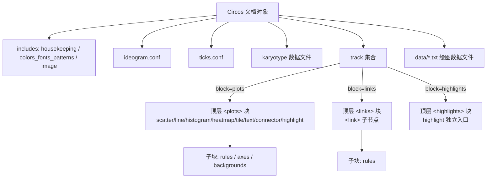

## 产品概述

对 `g:\GCModeller\src\interops\visualize\Circos\Circos`（核心项目 `SMRUCC.genomics.Visualize.Circos.Core`）进行系统性重构。该项目负责用编程方式把生物信息学数据（基因组序列、GC 含量/GC skew、基因注释、blast 比对等）转换为 circos 配置文件（`circos.conf` + `ideogram.conf` + `ticks.conf` + `data/*.txt`），再由本地 `G:\circos-0.69-10` 命令行渲染成 PNG/SVG。重构不改变使用者的大致流程：创建 `Circos` 文档对象 → 用适配器把生信数据转成 track → `Save` 落盘 → 命令行渲染。

## 核心特性

1. **修复运行缺陷**：修掉导致配置非法或崩溃的阻塞问题（link 被错放进 `<plots>`、空值参数被写进配置、保存路径处理不一致、min/max 被覆盖且受区域文化影响、骨架为空时 NRE、link 结构 NRE 等），并建立可持续的构建验证基线。
2. **命名规范化**：核心项目的类型/成员按 circos 官方术语统一命名（`Idata`→`ITrackDataDocument`、`data(Of T)`→`TrackDataDocument(Of T)`、`TracksPlot(Of T)`→`TrackPlot(Of T)`、`HighLight`→`Highlight`、`orientations`→`Orientation`、`Configurations.Ideogram`/`Nodes.Ideogram` 解歧义、`Karyotype.Karyotype`→`KaryotypeEntry`、`Band.bandX/bandY`→`bandName/bandLabel` 等），消除与官方文档的理解偏差；同步修复 `Circos.Extensions` 中仅有的真实编译耦合文件。
3. **补齐绘图数据类型**：新增 scatter / line / tile / link（顶层 `<links>` 块）四类缺失 plot；支持 `<axes>`、`<backgrounds>` 子块；增强 `<rules>`；补齐遗漏参数（heatmap 的 `color_mapping`、connector 的 `connector_dims`、link 的 `ribbon`/`crest`/`bezier_radius_purity` 等）；并支持 circos 允许的顶层 `<highlights>` 独立块写法。
4. **端到端验证**：修复 `Circos\test\test.vbproj` 断裂的项目引用，用**程序化生成的虚构测试数据**跑通完整链路，调用 `G:\circos-0.69-10\bin\circos.exe` 渲染出 PNG，并按图逐个做视觉校验。

## 技术栈

| 层 | 选型 | 说明 |
| --- | --- | --- |
| 语言/框架 | VB.NET，net10.0（SDK 风格项目） | 沿用仓库现状，`Circos.vbproj` TargetFramework 已是 net10.0 |
| 配置序列化 | `Microsoft.VisualBasic.ComponentModel.Settings.SimpleConfig` + `<Circos>` 特性驱动 | 沿用现有「属性即参数」的反射式生成习惯，在其之上加过滤层，不引入新机制 |
| 数据模型 | 现有 `TrackData` 继承体系 + `data(Of T)` 容器 | 保留 `Protected MustOverride Function trackData()` 的文档行生成范式 |
| 渲染器 | 外部进程调用 `G:\circos-0.69-10\bin\circos.exe` | **本机无 perl**（已实测 PATH 与常见路径均无 perl.exe），而 `circos.exe` 是 PAR 自包含包并内置 Perl 5.014002，实测 `-v` 输出 `circos | v 0.69-10 | 25 August 2025 | Perl 5.014002` |
| 构建/验证 | `dotnet build`（SDK 10.0.401 已实测可用） | 每个阶段结束独立编译验证 |


## 实施方案

### 总体策略

采用「**先止血 → 再结构化 → 再补齐 → 再正名 → 再连通**」的四段式推进，每段结束都能独立 `dotnet build` 验证，避免一次性大爆炸重构导致无法定位失败原因。**正名放在功能补齐之后**，因为重命名是横切关注点，放到最后可用最少改动量完成，且此时所有新类型的名字一次到位，不会出现「新建后再改一遍」。

### 关键技术决策与权衡

**决策 1：把单块 `<plots>` 拆成顶层 `<plots>` / `<links>` / `<highlights>` 三块**

- 依据（已实测）：`G:\circos-0.69-10\lib\Circos\Track.pm:67` 的 `our @type_ok = qw(scatter line histogram heatmap highlight tile text connector)` **不含 link**；`lib\Circos\Configuration.pm:392` 的 `my @ok = qw(ideogram colors fonts patterns image plots links highlights)` 明确顶层允许三个独立块。
- 因此当前 `Circos.Build` 把所有 track 无差别塞进 `<plots>` 的写法，一旦包含 link 必然报错。按 `ITrackPlot.block`（新增只读属性，值为 `plots`/`links`/`highlights`）在输出时分组，是最小的结构性修改：调用方 API 不变（`AddTrack` 照旧），只改输出。

**决策 2：给 `SimpleConfig` 加一层「空值跳过」过滤，而不改基础库**

- 依据（已读源码）：`runtime\sciBASIC#\Microsoft.VisualBasic.Core\src\ComponentModel\Settings\SimpleConfig.vb:162` 的默认 formatter 是 `Function(name, value) $"{name}= {value}"`，**不跳过空值**；而 `Circos.vb` 有几十个 `<Circos> Property = null`（`null` 常量在 `CircosAPI.vb:780` 定义为 `""`），会输出 `genome = `、`chromosomes = `、`track_width = ` 等垃圾行。
- 基础库是全仓共用（sciBASIC#），改它有越界风险；因此在核心项目 `Configurations.Extensions` 里新增 `GenerateConfigLines(target, Optional skipEmpty)` 包装方法，仅在本地投影过滤。代价是每处调用需改用包装方法，换来零外部影响。

**决策 3：数值一律走 InvariantCulture**

- `TrackPlots.vb:141-150` 用 `CStr(Double)` 生成 `max`/`min`，中文等非英语环境会产生 `0,5` 这类 circos 无法解析的值。统一用 `value.ToString(CultureInfo.InvariantCulture)` + 定点/有效位控制。同时把「自动推断 min/max」改为**仅在用户未显式设置时**生效，避免吃掉手写配置。

**决策 4：渲染调用从「寻找 perl」改为「直接定位 circos.exe」**

- 现有 `CircosAPI.Shell`（`:713-762`）用 `ProgramPathSearchTool.Which("perl")` 找解释器，`WriteData`（`:616-629`）生成的 `run.bat`/`run.sh` 也写死 `perl ...` —— 本机**必定失败**。
- 新增 `CircosRender`：`Render(confFile, Optional exe$, Optional outDir$)` → `{Success, ExitCode, StdOut, StdErr, PngPath, SvgPath}`；默认可执行文件为 `G:\circos-0.69-10\bin\circos.exe`，允许通过环境变量/参数覆盖；`WriteData` 生成的脚本文本同步改为调用 `.exe`。

**决策 5：路径裁剪不再依赖进程级静态 CWD**

- `Tools.vb:50` 的 `currentDIR` 是模块级 `ReadOnly Property`，在进程启动那一刻求值，`TrimPath` 用它做前缀剥离会导致多次保存/多工作目录时路径错乱。改为把输出根目录作为 `Build(indents, directory)` 已有的参数显式传递（`Build` 签名本来就有 `directory），`TrimPath` 退化为纯相对路径计算。

**决策 6：补齐依据取自本地官方发行版而非网络**

- 已读取 `G:\circos-0.69-10\etc\tracks\{scatter,tile,line,link,heatmap,connector,highlight,highlight.bg,histogram,text,axis}.conf`，以这些官方默认值模板为准补齐参数，保证与本机 0.69-10 严格一致。

### 性能与可靠性

- **数据写出**：`GetDocumentText()` 用单个 `StringBuilder` 顺序拼接，避免逐行 `+=`；对百万级 bin（如 4096 窗口扫全基因组）需预设容量并直接写 `StreamWriter`，不在内存中二次物化字符串。
- **r 值布局**：`ForceAutoLayout` 现为每个新 track 重算全部（`AddTrack` 每加一圈都调一次 → O(n²)，但 n 通常 &lt; 20，可接受）；改为「追加时仅计算新圈并在必要时重排」需改变现有 r0/r1 语义，风险高于收益，**保持现状但加 `numberOfTracks` 缓存避免重复 ToArray**。
- **反射**：`SimpleConfig.GenerateConfigurations(Of T)` 每次 Build 反射全量属性；改为对每个具体 plot 类型的 `PropertyInfo` 数组做 `Static` 缓存，避免每 track 一次 `GetProperties`。
- **子进程**：`CircosRender` 必须同时重定向 stdout/stderr、设 `WorkingDirectory` 为 conf 所在目录、设超时（默认 300s），避免现有 `__STDOUT_Threads` 那种读不到 EOF 就永远 `Sleep(1)` 的空转线程。

## 实施要点（落地细节）

1. **不要动这些**（越界风险）：`Circos.Extensions` 中被 `<Compile Remove>` 排除的 4 个文件、`CLI\` 项目（net4.8，几乎全是注释死代码，且 TL 已不匹配）、sciBASIC# 基础库。
2. **`Circos.Extensions\localblast\DataExtensions.vb` 中有 11 处名为 `idata` 的局部变量**（行 147/157/161/209/219/223/229/272/278/282/289），批量替换 `Idata` 时必须用符号级精确替换，**禁止整词文本替换**，否则误伤。
3. `TrackDatas.link` 是 `Structure` 且内部 `Dim a/b As TrackData` 是私有字段，默认构造后必为 `Nothing`，`ToString()` 会 NRE —— 改用 `Class` 或显式初始化两种情况都要覆盖。
4. 新增 plot 类型必须复写 `GetProperties()`（`SimpleConfig.GenerateConfigurations(Of 具体类型)(Me)`），**不能用基类 `Me`**，否则反射取到的是基类属性集（这是现有代码注释里留下的坑）。
5. `<links>` 下的 `<link>` 不是 `<plot>`：它不用 `r0/r1` 而用 `radius`/`bezier_radius`，不能简单继承 `TrackPlot`。需单独抽象。
6. 每个新 plot 类型的默认参数，直接照抄 `etc\tracks\*.conf` 的值，保证「不显式设置也能出图」。
7. 字体名 `light`、`default` 已在 `etc\fonts.conf` 白名单中（已核），无需修改。
8. demo 数据必须**程序化虚构生成**（原 `mchrTest.vb` 依赖的 `H:\5.14.circos\...` 数据已不可用），且规模要小（总长 &lt; 2 Mb）以便 circos 在秒级出图。

## 架构设计

### 现状与目标结构对比

改造的核心是「文档输出层的分块」：



### 模块划分（保持现有目录语义，不做大搬迁）

- **配置文档层** `ConfFiles\`：`Circos`（根文档，负责分块输出）、`CircosConfig`（include 机制与保存）、`Nodes\`（各配置节点）。
- **Plot 层** `ConfFiles\Nodes\`：`Base\TrackPlot(Of T)`（`<plot> `通用基类）、`Base\Plots.vb`（scatter/line/histogram/heatmap/tile/text/connector）、`Nodes\Links.vb`（`<links> `+ `<link>`）、`Nodes\HighLight.vb`、 `Base\Rule.vb`（增强 rules）、`Line\Nodes.vb`（axes/backgrounds 复用）。
- **数据模型层** `TrackDatas\TrackDatas\`：轨道行数据（`RegionTrackData`/`ValueTrackData`/`StackedTrackData`/`TextTrackData`/`LinkData`）与容器（`TrackDataDocument(Of T)`）。
- **适配器层** `TrackDatas\Adapter\`：生信数据 → 轨道数据的转换，保持现有 adapter 形态。
- **骨架层** `Karyotype\`：karyotype / band / 骨架容器。
- **渲染层**（新增/改造）：`CircosRender` + `CircosAPI.WriteData`，对外暴露「保存+渲染一步到位」。

## 目录结构

以下为本计划将**修改 / 新建**的全部文件（相对 `g:\GCModeller\src\interops\visualize\Circos\`）：

```
Circos\
├── ConfFiles\
│   ├── Circos.vb                                   # [MODIFY] 根文档。改造 Save：统一 base dir 归一化、骨架空值保护、数据文件写入路径修复；改造 Build：按 ITrackPlot.block 分成 <plots>/<links>/<highlights> 三块输出，不再把 link 塞进 <plots>； karyotype/Size 等成员的空值安全
│   ├── Circumflex.vb                               # (无此文件，忽略)
│   ├── CircosAttribute.vb                           # [MODIFY] 保留 <Circos> 别名；可选增加 Control 标记（如是否允许空值输出）
│   ├── Extensions.vb                                # [MODIFY] 新增 GenerateConfigLines(...) 包装：跳过值为空/whitespace 的属性；保留 GenerateCircosDocumentElement
│   ├── Ideogram.vb                                  # [MODIFY] 重命名为 IdeogramInclude（消歧义），内部持有 Nodes.IdeogramBlock
│   ├── Ticks.vb                                     # [MODIFY] 同步 Genfig 配置行过滤；Tick 默认 suffix 改为空串（避免默认输出 " kb"）
│   ├── ComponentModel\
│   │   ├── CircosConfig.vb                          # [MODIFY] GenerateIncludes 传显式 base dir；Save 路径统一；新增 Cache/BlocksColumns 常量
│   │   ├── Interface.vb                             # [MODIFY] ICircosDocNode 增加 ReadOnly Property block As String（plots/links/highlights）
│   │   ├── SystemPrefix.vb                          # [MODIFY] 增 [Optional] 顶层 highlights 块支持所需的 include 条目（如需）
│   │   └── Colors.vb                                # [MODIFY] OverwritesColors 输出改用目标过滤 + 顺序稳定
│   └── Nodes\
│       ├── Base\
│       │   ├── TrackPlots.vb → TrackPlot.vb         # [MODIFY+重命名] TracksPlot(Of T)→TrackPlot(Of T)；min/max 只在未显式设置时推断且用 InvariantCulture；GetProperties 缓存 PropertyInfo；block 属性实现
│       │   ├── Plots.vb                             # [MODIFY] HeatMap 补 color_mapping；Histogram 补 color/thickness/orientation 语义修正；TextLabel 补齐官方 text.conf 参数
│       │   ├── Links.vb                             # [MODIFY] 删除空 Links 壳与错位的 link 继承，改为独立的 LinksBlock（顶层 <links>）与 LinkNode（<link>，含 ribbon/crest/bezier_radius_purity/radius/bezier_radius）
│       │   ├── Rule.vb                              # [MODIFY] ConditionalRule 增强：condition/color/fill_color/stroke_color/stroke_thickness/z/flow/value 等
│       │   └── ITrackPlot.vb                        # [MODIFY] orientations 枚举→Orientation（In/Out）；接口增加 block、glyph 相关通用成员；成员 XML 注释对齐官方文档
│       ├── Connector.vb                             # [MODIFY] 补 connector_dims；类名与文件名同步
│       ├── HighLight.vb → Highlight.vb              # [MODIFY+重命名] HighLight→Highlight；支持挂 <plots> 或顶层 <highlights> 两种宿主
│       ├── Ideogram.vb                              # [MODIFY] Nodes.Ideogram→IdeogramBlock；Spacing 保留
│       ├── Ticks.vb                                 # [MODIFY] 同上重命名链路同步：Tick/Ticks
│       ├── SeperatorCircle.vb                       # [MODIFY] 修正拼写为 SeparatorCircle，继承关系与 Constructors 同步
│       ├── Line\
│       │   ├── Line.vb                              # [MODIFY] 解除整段注释，LinePlot 复活并补齐 max_gap/thickness/color/orientation
│       │   └── Nodes.vb                             # [MODIFY] Axes/Backgrounds 子块节点，供 line/scatter/histogram 挂载
│       ├── Scatter.vb                               # [NEW] ScatterPlot：glyph/glyph_size/color/stroke_color/stroke_thickness/fill_color/max_gap + axes/backgrounds 子块
│       ├── Tile.vb                                  # [NEW] TilePlot：layers/layers_overflow/margin/padding/thickness/color/stroke_*，依据 etc/tracks/tile.conf
│       └── Highlights.vb                            # [NEW] 顶层 <highlights> 块容器，成员复用 Highlight 节点输出
├── TrackDatas\
│   ├── TrackDatas\
│   │   ├── Idata.vb → ITrackDataDocument.vb         # [MODIFY+重命名] Idata→ITrackDataDocument
│   │   ├── data.vb → TrackDataDocument.vb           # [MODIFY+重命名] data(Of T)→TrackDataDocument(Of T)
│   │   ├── Extensions.vb                            # [MODIFY] Distinct 重命名消歧义；Ranges 空序列保护；FromColorMapping 保留语义
│   │   └── TrackData\
│   │       ├── TrackData.vb                         # [MODIFY] 重命名 awkward 成员；ToString 组合 formatting 保持不变
│   │       ├── Tracks.vb                            # [MODIFY] ValueTrackData/TextTrackData/StackedTrackData/RegionTrackData 保持，总数值格式化改 InvariantCulture
│   │       ├── TrackModel.vb                        # [MODIFY] Formatting 结构补 stroke_color/stroke_thickness/z/id；ITrackData 保持
│   │       └── LinkConnector.vb                     # [MODIFY] Structure link→Class LinkData 并做双端空值保护；Connection.from/to 保留但加别名
│   └── Adapter\
│       ├── Connector.vb / DataExtensions.vb         # [MODIFY] 跟随基类改名
│       ├── Highlights\*.vb                          # [MODIFY] 跟随 Highlights 基类改名；GradientMappings 的 where Nothing 保护
│       └── NtProps\*.vb                             # [MODIFY] GC/GCContent/GCSkew/GenomeGCContent 跟随 data(Of T) 改名，数值格式化统一
├── Karyotype\
│   ├── Karyotype.vb                                 # [MODIFY] Karyotype→KaryotypeEntry（消除与命名空间同名）；Band.bandX/bandY→bandName/bandLabel
│   ├── SkeletonInfo.vb                              # [MODIFY] Save 的空值/空集保护；size 计算溢出保护（改用 Long 累加后校验）
│   ├── Chromosome.vb                                # [MODIFY] KaryotypeChromosomes 语义澄清与成员对齐
│   └── Adapters\*.vb                                # [MODIFY] ChromosomeGenerator/PPTMarks/DoorOperon 跟随改名；去掉 Option Strict Off 中的不安全写法
├── CircosRender.vb                                  # [NEW] circos 渲染器：直接 execute G:\circos-0.69-10\bin\circos.exe -conf <conf>，重定向 stdout+stderr、设 WorkingDirectory 与超时，返回 {Success, ExitCode, StdOut, StdErr, PngPath, SvgPath}
├── CircosAPI.vb                                     # [MODIFY] Shell 改为委托 CircosRender；WriteData 生成的 run.bat/run.sh 改为调用 circos.exe；setProperty 找不到属性时不再静默 Return
├── CircosDebugger.vb / DebugGroups.vb               # [MODIFY] 同步重命名与 GetOptions 修正（LockGroup 组合）
├── Tools.vb                                         # [MODIFY] 移除进程级静态 currentDIR 依赖，TrimPath 改为显式 base 参数版本
└── Circos.vbproj                                    # [MODIFY] Compile 条目同步（重命名/新增文件），保持 test\** 排除

Circos.Extensions\
└── localblast\
    ├── BlastMaps.vb                                 # [MODIFY] 跟随 Highlights→新名（原 :55 Inherits Highlights）
    ├── BlastResultExtensions.vb                     # [MODIFY] HighLight→Highlight（原 :93）；r0/r1 用法保持
    ├── Legends.vb                                   # [MODIFY] ITrackPlot/BlastMaps 类型判断跟随改名（原 :86/:126/:129-130）
    └── DataExtensions.vb                            # [MODIFY] KaryotypeChromosomes 改名；11 处名为 idata 的局部变量严格保持不变

test\
├── test.vbproj                                      # [MODIFY] 修正 ProjectReference 相对路径（现误写成 4 级上跳，应从 test 目录解析到 g:\GCModeller\src 需 5 级），保证可构建
├── Program.vb                                       # [MODIFY] 改为 demo 入口：生成虚构数据 → 构建 Circos 文档 → Save → CircosRender 渲染 → 打印产物路径
├── DemoSyntheticData.vb                             # [NEW] 虚构测试数据生成器：多染色体 karyotype（chr1/chr2/chr3，长度可控）、GC/GC-skew 序列 beginning maps、凸 Feature 区间、 handful links、盗窃 COC 着色族
├── DemoGallery.vb                                   # [NEW] 分批演示：①基础圆盘 ②全类型 2D track（scatter/line/histogram/heatmap/tile/text/connector）③顶层 <links> ④顶层 <highlights> ⑤rules/axes/backgrounds
└── mchrTest.vb                                      # [MODIFY] 更新为使用新 API 与虚构数据路径（不再依赖 H:\5.14.circos\*）
```

## 关键代码结构

```
' Circos\ConfFiles\ComponentModel\Interface.vb
Public Interface ICircosDocNode
    ''' plots | links | highlights —— circos 顶层合法块名（Configuration.pm @ok）
    ReadOnly Property block As String
    Function Build$(indents%, directory$)
End Interface

' Circos\CircosRender.vb
Public Class CircosRenderResult
    Public Property Success As Boolean
    Public Property ExitCode As Integer
    Public Property StdOut As String
    Public Property StdErr As String
    Public Property PngPath As String
    Public Property SvgPath As String
End Class

Public Module CircosRender
    Public Const DefaultCircosExe As String = "G:\circos-0.69-10\bin\circos.exe"
    ''' **本机没有 perl**，必须直接调用自包含的 circos.exe（内置 Perl 5.014002）
    Public Function Render(confFile As String,
                           Optional circosExe As String = DefaultCircosExe,
                           Optional workingDirectory As String = Nothing,
                           Optional timeoutMs As Integer = 300000) As CircosRenderResult
End Module
```

```
' Circos\ConfFiles\Nodes\Links.vb —— link 必须独立于 <plot>，不继承 TrackPlot
Public Class LinksBlock : Implements ICircosDocNode   ' 顶层 <links>
Public Class LinkNode : Implements ICircosDocNode     ' <link>：radius / bezier_radius / crest / bezier_radius_purity / ribbon / thickness / color + rules
```

## Agent Extensions

### SubAgent

- **code-explorer**
- 用途：在「重命名」阶段做全仓符号级地毯搜索，枚举所有残留旧名引用（`Idata`、`data(Of T)`、`TracksPlot`、`HighLight`、`orientations`、`Karyotype.Karyotype`、`bandX/bandY`）的确切文件与行号，特别是 `Circos.Extensions\localblast\DataExtensions.vb` 中 11 处名为 `idata` 的局部变量以免误伤。
- 预期产出：一份「旧名 → 文件:行号 → 是否真实类型引用」的完整清单，作为批量替换的白名单，替换后再次调用做零残留核验。

### Skill

- **lsp-code-analysis**
- 用途：对每个待重命名符号执行语义级的 Find References / Preview Refactorings（而非文本 grep），确保 VB.NET 晚绑定、`Dim` 无类型推断、`Imports` 别名（`CircosMain`、`KaryotypeModel`）等特殊引用不被漏掉。
- 预期产出：每个符号的完整引用集合与安全的重命名预览结果，使 `dotnet build` 一次通过率显著提高。