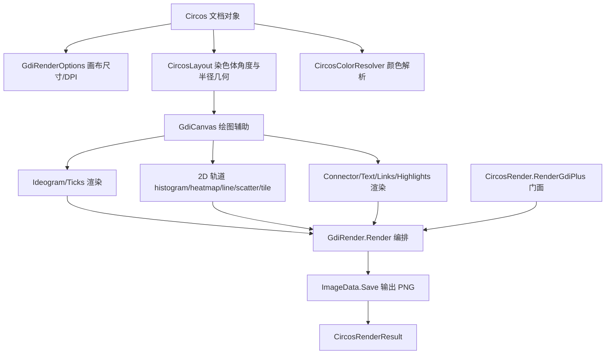

## Product Overview

为 Circos 绘图模块新增一个纯 .NET 的 GDI+ 绘图引擎：直接读取已经构建好的 Circos 文档对象，在内存中完成圆环布局与绘制，输出 PNG 图像，从而在缺失外部 circos 程序的环境下也能得到绘图结果。

## Core Features

- 独立渲染入口：新增 `CircosRender.RenderGdiPlus`（门面）与 `GdiRender.Render`（引擎），与现有命令行调用 circos 的流程完全分离、互不影响。
- 画布参数：提供默认尺寸与 DPI，并支持从文档的图像配置（image 配置块语义）或渲染参数读取，渲染参数优先。
- 骨架圈绘制：按染色体的位置、长度与颜色绘制弧段，支持 band 色带、边框、ideogram 标签，以及染色体间距与缺口。
- 刻度绘制：主/次刻度、刻度标签（数值格式、后缀、倍率）与网格线。
- 2D 轨道绘制：histogram、heatmap、line、scatter、tile，含取值范围映射与向内/向外朝向。
- 连接与标注：connector 折线、text 文本标签、links 贝塞尔连线（含 ribbon 缎带、crest 弧度）。
- 高亮与子块：顶层及 plot 内的 highlight，以及 rules / axes / backgrounds 子块。
- 颜色解析：支持 `(r,g,b)` 直接色值、circos/perl 颜色名、brewer 颜色列表引用（如 `vdgrey`）与 `_aN` 透明度后缀（如 `red_a2`）。
- 输出：生成 PNG 图像文件，并返回与现有渲染一致的结果对象（成功标志、图像路径、错误摘要）。

## Visual Effect

生成的图像为标准的 Circos 圆环图：外圈为带颜色与色带、可显示标签的染色体骨架，其内依次排布刻度与各类数据轨道，轨道之间以高亮、连接线与文本标签点缀；整体布局、相对半径与配色风格与官方 circos 输出保持一致。

## 技术栈选择

- 语言与框架：VB.NET，`net10.0-windows`，直接扩展现有工程 `Circos\Circos.vbproj`（RootNamespace `SMRUCC.genomics.Visualize.Circos`，AssemblyName `SMRUCC.genomics.Visualize.Circos.Core`）。
- 绘图引擎：复用框架现有的 GDI+ 封装层，不新增任何第三方依赖（不引入 SkiaSharp）：
- 通过 `Microsoft.VisualBasic.Imaging.Driver.DriverLoad.CreateGraphicsDevice(size, fill, dpi)` 创建实现了 `IGraphics` 的绘图对象；`DriverLoad.UseGraphicsDevice(Drivers.GDI)` / `DriverLoad.GetData(g, padding)` 用于取回图像数据。
- 绘图方法使用 `Microsoft.VisualBasic.Imaging.IGraphics` 提供的 `DrawArc / FillPie / DrawLine(s) / FillPolygon / DrawPath / FillPath / DrawBezier(s) / DrawString(含旋转重载) / MeasureString / SetClip / TranslateTransform` 等。
- 兼容类型使用 `Microsoft.VisualBasic.Core\src\Drawing\netcore8.0\` 中的 `Pen / Brush / Font / GraphicsPath / Matrix / Region / Image` 模拟对象。
- 图像保存使用 `...\Drivers\Models\ImageData.vb`（默认格式 PNG）的 `Save(path)`。
- 驱动注册：渲染入口确保已执行 `Microsoft.VisualBasic.Imaging.Driver.ImageDriver.Register()`（`#If WINDOWS`，与 `test\Program.vb` 保持一致，做幂等处理）。

## 实现路径

- 纯新增模块化实现，统一放在新命名空间 `SMRUCC.genomics.Visualize.Circos.GdiPlus` 下；现有 `CircosRender.Render`（命令行调用 `G:\circos-0.69-10\bin\circos.exe`）与 `CircosAPI` 的配置生成行为**保持不变**，仅在 `CircosRender` 上新增 `RenderGdiPlus` 门面重载（用户选择"独立 API"），返回同一个 `CircosRenderResult` 类型。
- 渲染流水线：解析文档对象 → 计算几何布局（染色体→角度区间、半径归一化）→ 分层绘制（ideogram/ticks → plots → links → highlights）→ 保存 PNG → 返回结果对象。
- 关键决策与理由：

1. **颜色解析必须独立实现**：现有 `CircosColor.FromKnownColorName` 对 `vdgrey`（其定义为间接引用 `greys-9-seq-7`）与 `red_a2`（alpha 后缀）都会退化为黑色，直接使用会导致配色严重失真，故新增 `CircosColorResolver`，按"`(r,g,b)` → 颜色名（RGBColors）→ brewer 列表引用（读取 `Resources\colors*.txt`）→ `_aN` 透明度 → 已知颜色名 → 灰色兜底并 warning"的顺序解析。
2. **半径/长度解析必须独立实现**：文档中的 `r1/r0/radius`（`"0.75r"`）、`thickness/size`（`"25p"`）、`spacing`（`"1u"`，需结合 `chromosomes_units`）、`radius` 表达式（`dims(ideogram,radius_outer)`）语义不同，需统一换算为画布像素，故新增 `CircosUnits`。
3. **角度映射是核心几何**：需按各染色体长度与 `ideogram.Spacing`（`default`/`break`）分配角度，并处理 `loopHole` 缺口；所有轨道共用同一套"基因组坐标 → 角度"映射，`orientation`（`in`/`out`）决定径向方向。
4. **块归属与文档一致**：按 `ITrackPlot.block` 将元素分为 `plots` / `links` / `highlights` 三组遍历，保证与现有配置生成语义一致（`link` 不属于 `plots`）。
5. **画布尺寸来源**：优先级为"渲染参数 > 文档图像配置 > 默认值"。文档内图像配置以非侵入方式提供（不改变现有 `circos.conf` 的输出内容，避免回归）。

- 性能与可靠性：
- 颜色、字体、Pen/Brush、布局映射在渲染前一次性解析并缓存，避免逐数据点重复解析造成的开销。
- 绘制按染色体分组顺序遍历，复杂度与数据点数量线性相关 O(N)；大轨道逐元素绘制通过复用绘图对象与避免重复 `MeasureString` 降低开销。
- 所有 `IGraphics`/`Pen`/`Brush`/`Font`/`GraphicsPath` 使用 `Using` 释放，防止内存泄漏。
- 解析失败（空值、非法半径/颜色）统一回退默认值并记录 warning，保证渲染不中断。

## 实现注意（执行细节）

- 数值格式化沿用现有 `Configurations.Extensions.Num()`（InvariantCulture），避免非英文 locale 下出现非法小数分隔符。
- 保存流程建议：`Dim device = DriverLoad.UseGraphicsDevice(Drivers.GDI)` → `Using g = device.CreateGraphic(size, background, dpi)` → 绘制 → `DirectCast(device.GetData(g, padding), ImageData).Save(pngPath)`。
- 保持向后兼容：不修改 `CircosRender.Render`、`CircosAPI` 及配置序列化逻辑；GDI+ 为纯新增路径。
- 失败场景（驱动未注册、非法尺寸）应给出可读的 `Message`，复用到 `CircosRenderResult` 的 `Success/Message/PngPath`。
- 日志复用框架既有的 `debug`/`warning` 辅助方法，避免输出大数据量内容。

## 架构设计



## 目录结构

本实现向现有工程新增 GDI+ 渲染模块，并小幅扩展测试工程用于结果对比；不改动既有命令行渲染逻辑。

```
Circos/
├── CircosRender.vb                        # [MODIFY] 新增 RenderGdiPlus 门面重载，委托 GdiRender；既有 Render(confFile/circos) 保持不变
├── GdiPlus/
│   ├── GdiRender.vb                       # [NEW] 渲染入口与编排。提供 Render(circos, outputFile/dir, options/width/height/dpi) 重载，装配各层渲染器，保存 PNG 并返回 CircosRenderResult
│   ├── GdiRenderOptions.vb                # [NEW] 画布参数（Width/Height/Dpi/Background/Padding/显示开关）。实现默认值 + 从文档图像配置与渲染参数读取，明确优先级
│   ├── CircosColorResolver.vb             # [NEW] 颜色解析。支持 (r,g,b)、RGBColors 颜色名、brewer 列表引用、_aN 透明度、已知颜色名、兜底灰；提供缓存
│   ├── CircosUnits.vb                     # [NEW] 尺寸/半径解析。解析 r/p/u 与 dims(...) 表达式，换算为像素；使用 Num() 格式化
│   ├── CircosLayout.vb                    # [NEW] 核心几何。染色体→角度区间（含 Spacing/loopHole）、基因组坐标→角度、半径归一化、orientation 与单位换算
│   ├── GdiCanvas.vb                       # [NEW] IGraphics 封装。提供弧带填充、放射线、旋转文本、裁剪、坐标变换等高层绘图辅助
│   └── Tracks/
│       ├── IdeogramRenderer.vb            # [NEW] 骨架圈：染色体弧段、颜色/bands、stroke、ideogram 标签与间距
│       ├── TicksRenderer.vb               # [NEW] 刻度：主/次刻度、标签(format/suffix/multiplier)、grid，按 TicksBlock 配置绘制
│       ├── HistogramRenderer.vb           # [NEW] histogram：fill/stroke、min-max 映射、extend_bin
│       ├── HeatmapRenderer.vb             # [NEW] heatmap：color 列表、color_mapping、scale_log_base 非线性映射
│       ├── LineRenderer.vb                # [NEW] line：按数据点连线、thickness/color
│       ├── ScatterRenderer.vb             # [NEW] scatter：glyph/glyph_size、按 Formatting 覆盖颜色
│       ├── TileRenderer.vb                # [NEW] tile：区间色块、layers/margin/padding
│       ├── ConnectorRenderer.vb           # [NEW] connector：按 connector_dims 生成五段折线路径
│       ├── TextRenderer.vb                # [NEW] text：标签环向布局与旋转、color/label_size
│       ├── LinkRenderer.vb                # [NEW] links：贝塞尔连线、ribbon/crest/bezier_radius
│       ├── HighlightRenderer.vb           # [NEW] highlights：顶层与 plot 内高亮区间填充
│       └── RuleRenderer.vb                # [NEW] rules/axes/backgrounds 子块通用条件着色与绘制
└── test/
    ├── DemoGallery.vb                     # [MODIFY] 新增 RunAllGdiPlus(root) 场景运行器，保留原有 RunAll（circos 路径）不变
    └── Program.vb                         # [MODIFY] 同时输出 circos 与 GDI+ 两套结果到不同子目录，便于逐场景对比
```

## Agent Extensions

### SubAgent

- **code-explorer**
- Purpose: 在实现与联调阶段，核对 Circos 文档模型（各 plot 类属性、数据模型字段、顶层块归属）与框架 GDI+ 兼容层（`IGraphics` 方法签名、`DriverLoad`/`ImageData` 保存 API、`netcore8.0` 兼容类型）的确切定义，避免凭记忆误用 API。
- Expected outcome: 产出一份经代码核实的关键接口/属性清单（含文件路径与签名），用于修正渲染器实现并消除编译期与运行期的不确定项。