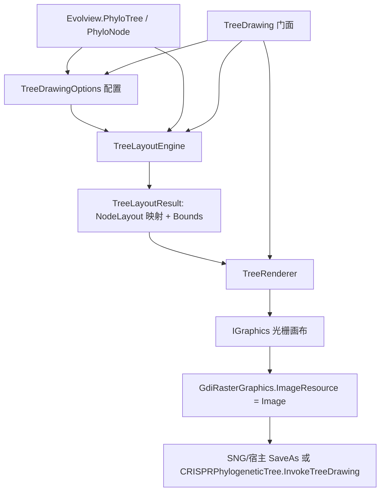

## 产品概述

重构 `Phylip` 项目中 `Evolview` 文件夹的树绘制代码：移除仅依赖单一样式的粗糙实现与整文件被注释的废弃文件，改为基于 GDI+（`Microsoft.VisualBasic.Imaging.IGraphics`，仅依赖已引用的 `Core`）实现一套**可配置、多风格、可自适应画布**的进化树渲染引擎，并从 5 个算法模块产出的 `Evolview.PhyloTree` 直接出图。

## 核心功能

- **8 种布局风格全部支持**（对应现有 `TreePlotMode` 枚举）：
- 矩形分支图 `RECT_CLADOGRAM` / 矩形扇形图 `RECT_PHYLOGRAM`（直角折线，根在左）
- 三种斜线图 `SLANTED_CLADOGRAM_RECT` / `SLANTED_CLADOGRAM_MIDDLE` / `SLANTED_CLADOGRAM_NORMAL`（单段斜直线，NORMAL 类 Dendroscope）
- 圆形图 `CIRCULAR_CLADOGRAM` / `CIRCULAR_PHYLOGRAM`（极坐标，弧段 + 径向线）
- 辐射状 `RADIAL_CLADOGRAM`（极坐标铺满 360°，仅径向直线）
- **完整装饰与标注**：叶标签（矩形模式纵向排布、圆形/辐射模式沿半径旋转并按左右半圆切换对齐）、bootstrap 支持度、分支长度、节点标记、分支/叶/叶背景颜色（`TreeDecoType` 的 BRANCHCOLOR/LEAFCOLOR/LEAFBKCOLOR）、标题与比例尺。
- **画布自适应**：按 padding 自动缩放内容以铺满给定画布，也可由用户显式指定单位像素；不再使用固定 10000×10000 画布。
- **退化情形健壮**：全零分支长度（Cladogram）不得抛异常；单叶/两叶、几何量缺失均安全降级（Phylogram 模式在无分支长度时自动降级为 Cladogram）。
- **向后兼容**：`TreeDrawing.InvokeDrawing(tree) As Image` 签名与语义保留，`Models/CRISPRPhylogeneticTree.InvokeTreeDrawing` 与 `ShellScriptAPI` 继续可用；新增多风格与带配置的绘制入口。
- **视觉表现**：白底（可配置背景色/透明）、细线骨架、圆形节点标记、清晰可读的旋转标签、可选半透明叶背景色块，输出为 GDI+ 位图（PNG）。

## 技术栈

- 语言/框架：VB.NET，`net10.0`（沿用 `Phylip.vbproj`；`RootNamespace=SMRUCC.genomics.Interops.Visualize.Phylip`；`Option Strict Off`，沿用现有风格）。
- 绘图 API（**Core-only**，不新增项目引用）：仅使用 `Microsoft.VisualBasic.Core` 内已有类型 —— `Microsoft.VisualBasic.Imaging.IGraphics`、`DriverLoad.CreateDefaultRasterGraphics`、`DriverLoad.MeasureTextSize`、`GdiRasterGraphics.ImageResource`、`FontFace`、`Font`、`Pen`、`SolidBrush`、`Brushes`/`Pens`、`StringFormat`、`GraphicsPath`、`GraphicsExtensions.SaveAs/GetStreamBuffer`、`GDIColors.TranslateColor`；几何基元用 `System.Drawing` 的 `Color/Point/PointF/Size/SizeF/Rectangle/RectangleF/Padding`。
- 输出：`Microsoft.VisualBasic.Imaging.Image`（PNG 由宿主或测试经 `SaveAs` 落盘）。
- 驱动注册：库内不注册；由宿主启动时调用 `ImageDriver.Register()`（该方法位于未引用的 `imaging.NET5` 程序集）。

## 实现思路

采用「**配置 → 布局 → 渲染 → 门面**」四层单向依赖，把几何计算与绘制彻底解耦：

1. `TreeDrawingOptions`：样式（`TreePlotMode`）+ 画布（尺寸/Padding/DPI/背景）+ 字体（叶标签/分支长度/bootstrap）+ 颜色与线宽 + 显示开关（叶标签/支持度/分支长度/节点标记/标题/比例尺/叶标签对齐）+ 颜色集 ID + 圆形参数（起止角/顺时针/角度跨度）+ 缩放策略（自适应或显式单位像素）。
2. `TreeLayoutEngine`：先以「**单位坐标**」计算全部几何（每垂直层 1 单位、每单位分支长度 1 单位），再统一映射到画布。中间结果 `TreeLayoutResult`（含 `Dictionary(Of PhyloNode, NodeLayout)` 与内容包围盒）与渲染完全解耦，便于单测与自适应。
3. `TreeRenderer`：只消费布局结果，用 `IGraphics` 绘制边、节点标记、叶标签、bootstrap、分支长度、叶背景、标题、比例尺。
4. `TreeDrawing` 门面：创建画布、调用布局+渲染、返回 `Image`；保留旧 `InvokeDrawing(tree)` 兼容重载。

**关键决策与理由**：

- 「单位坐标 + 统一缩放」解决现实现的三个缺陷：固定 10000×10000 画布、`1/(minBranchLength*1000)` 量纲错误、无法自适应；同时让颜色/字体/线宽与缩放解耦（线宽、字号不随几何缩放）。
- Phylogram 依赖 `BranchLengthToRoot`，Cladogram 依赖 `LevelHorizontal`；当 `PhyloTree.HasBranchLength()=False` 时 Phylogram 模式自动降级为 Cladogram，避免现实现中 `AllNodes.Min` 对全零分支长度抛异常。
- 资源集中与缓存：`Font`/`Pen`/`SolidBrush` 在渲染器内创建一次并统一释放；`MeasureString` 按 (text,font) 结果缓存，避免逐节点重复测量。
- 可重入/线程安全：删除模块级可变字段（现 `pxPerBranchLength`/`pxPerHeight`），所有状态经参数/返回值传递。
- **性能**：布局 O(N)、渲染 O(N)（文本测量缓存后近似 O(N)）；无 N+1、无重复遍历；圆形的 `DrawArc` 每边一次、径向线一次。
- **避免技术债**：复用 Core 既有 `IGraphics`/`GDIColors`/`GdiRasterGraphics` 与既有 `TreePlotMode`/`TreeDecoType` 枚举，不新增重复概念、不自造颜色/几何工具。

### 8 种模式的几何（从被删除的 `TreeSkeleton.vb` 权威公式迁移）

统一记号：`cx,cy` 为圆心；`anglePerLevel = angleSpan / max(1, maxVerticalLevel - 1)`。

| 模式 | X / 半径 | Y / 角度 | 边形状 |
| --- | --- | --- | --- |
| RECT_CLADOGRAM | `ux = root.LevelHorizontal - node.LevelHorizontal` | `uy = node.LevelVertical`；`uySlant = LevelVerticalSlanted` | 直角折线 `(px,py)→(px,cy)→(cx,cy)` |
| RECT_PHYLOGRAM | `ux = node.BranchLengthToRoot` | 同上 | 直角折线 |
| SLANTED_CLADOGRAM_RECT | `ux = root.LevelHorizontal - node.LevelHorizontal` | `uy = node.LevelVertical` | 单段直线 |
| SLANTED_CLADOGRAM_MIDDLE | 同 RECT | `uy = node.LevelVerticalSlanted` | 单段直线 |
| SLANTED_CLADOGRAM_NORMAL | 叶统一 `ux = root.LevelHorizontal - 1`；内部 `ux = leafX - (Δy/2)/tan(atan)`，`atan` 为根到首叶的倾角 | `uy = (minLeafVerticalLevel + maxLeafVerticalLevel)/2` | 单段直线 |
| CIRCULAR_CLADOGRAM | `r = root.LevelHorizontal - node.LevelHorizontal` | `θ = angleStart + (LevelVertical-1)*anglePerLevel`（顺时针取负） | 父半径圆弧 `DrawArc` + 径向直线 `DrawLine` |
| CIRCULAR_PHYLOGRAM | `r = node.BranchLengthToRoot` | 同上 | 圆弧 + 径向直线 |
| RADIAL_CLADOGRAM | `r = root.LevelHorizontal - node.LevelHorizontal`，铺满 360° | 同上 | 仅径向直线 |


极坐标变换：`(cx + r*cosθ, cy - r*sinθ)`。

## 实现注意事项

- **依赖边界**：仅使用 Core 内类型；不得 `Imports` `Microsoft.VisualBasic.Imaging.Driver.ImageData/SVGData`、`Microsoft.VisualBasic.Imaging.Drawing2D.*`、`Microsoft.VisualBasic.Imaging.SVG.*`、`Microsoft.VisualBasic.Drawing.*`（均属未引用程序集）。
- **颜色解析**：`PhyloNode.getBranchColorByColorsetID/getLeafColorByColorsetID/getLeafBKColorByColorsetID` 返回 `String`，统一用 `<string>.TranslateColor(throwEx:=False, ByRef success)`（`Microsoft.VisualBasic.Imaging.GDIColors`，Core 内）；解析失败回退默认色（分支/叶文字=黑，叶背景=白）。仅落地 `TreeDecoType.BRANCHCOLOR/LEAFCOLOR/LEAFBKCOLOR`；`PIES/STRIPS/BARS/CHARTS/PROTEINDOMAINS` 属于外部数据管线，本次仅保留枚举语义不实现。
- **旋转文本**：`IGraphics.DrawString(s, font, brush, ByRef x As Single, ByRef y As Single, angle As Single)`；圆形/辐射模式叶标签按 `-θ` 旋转，右半圆（cosθ≥0）左对齐、左半圆右对齐，用 `MeasureString` 手动偏移修正。
- **叶背景扇形**：圆形模式用 `FillPolygon` 构造 4 点环形扇（内/外半径按叶角度跨度）；矩形模式用 `FillRectangle` 覆盖标签区域。
- **退化与容错**：`Descendents` 为空/单叶、`BranchLengthToRoot<=0`、`maxVerticalLevel<=1`、角度跨度 0 等均需安全处理；内容包围盒为空时回退到 padding 内的最小画布。
- **驱动依赖提示**：在 `TreeDrawing` 的 XML 注释中说明宿主需调用 `ImageDriver.Register()`；并在门面入口检查 `DriverLoad.CheckRasterImageLoader`，未注册时抛出可读异常消息，避免晦涩的 `MissingMethodException`。
- **影响面控制**：不改动 `PhyloNode`/`PhyloTree` 的公开 API 语义；`Models/CRISPRPhylogeneticTree.vb`、`ShellScriptAPI.vb`、`CLI`、`Evolution/*` 保持兼容；`test/test.vbproj` 已引用 `imaging.NET5.vbproj`+`Drawing-net4.8.vbproj` 且 `Sub New()` 已调用 `ImageDriver.Register()`，可直接用于验证。
- **清理**：删除 `Evolview/TreeSkeleton.vb`（整文件为注释、无任何引用），删除前用引用检索确认。

## 架构设计



## 目录结构

```
Phylip/
├── Evolview/
│   ├── Drawing/                                  # [NEW] 新的树绘制子模块目录
│   │   ├── TreeDrawingOptions.vb                 # [NEW] 绘制配置：样式(TreePlotMode)、画布尺寸/Padding/DPI/背景、字体、颜色与线宽、显示开关、颜色集ID、圆形角度参数、缩放策略；提供 Default/Clone 与按模式校验。
│   │   ├── TreeLayoutResult.vb                   # [NEW] 布局结果模型：NodeLayout（位置、标签位置/角度/对齐、bootstrap 位置、分支长度位置、叶背景矩形/扇形点集）与 TreeLayoutResult（字典映射、内容包围盒、根位置）。
│   │   ├── TreeLayoutEngine.vb                   # [NEW] 8 种模式的坐标计算：单位坐标计算 + 自适应/显式缩放映射；斜线 NORMAL 的倾角公式、圆形/辐射极坐标映射、直角折线路径点、文本锚点与角度；退化情形（全零分支长度自动降级、单叶/两叶）处理。
│   │   ├── TreeRenderer.vb                       # [NEW] 基于 IGraphics 的渲染：边（折线/直线/圆弧+径向线）、节点标记、叶标签、bootstrap、分支长度、叶背景（矩形/环形扇）、标题、比例尺；资源(Font/Pen/Brush)集中创建与释放、文本测量缓存、颜色解析。
│   │   └── DrawingHelper.vb                      # [NEW] 工具：颜色字符串解析（TranslateColor 封装+回退）、极坐标/角度归一化、包围盒合并、文本尺寸缓存、StringAlignment 计算。
│   ├── TreeDrawing.vb                            # [MODIFY] 门面重构：保留 InvokeDrawing(tree) As Image 兼容重载（默认样式）；新增 InvokeDrawing(tree, options)、RenderTo(g, tree, options)、GetImage(tree, options)；移除模块级可变字段；入口处驱动未注册的友好异常。
│   ├── TreeSkeleton.vb                           # [DELETE] 整文件被注释的废弃 SVG/Java 实现（布局数学已迁移至 TreeLayoutEngine）
│   ├── TreePlotMode.vb                           # [MODIFY] 可选：为 8 个枚举值补充 XML 注释（不改语义）
│   └── TreeDecoType.vb                           # [MODIFY] 可选：为枚举补充 XML 注释并标注本次落地的 3 个值（不改语义）
├── Models/CRISPRPhylogeneticTree.vb              # [MODIFY] 保留既有 invoke.tree_drawing；可选新增按 TreePlotMode 出图的 ExportAPI 入口
└── test/Program.vb                               # [MODIFY] 新增 8 种模式渲染验证：各生成 PNG 并断言文件存在/尺寸；覆盖全零分支长度(Cladogram)与带 bootstrap 值树；结束清理临时文件
```

## 关键代码结构

```
Namespace Evolview.Drawing

    Public Class TreeDrawingOptions
        Public Property Mode As TreePlotMode = TreePlotMode.RECT_PHYLOGRAM
        Public Property CanvasSize As Size = New Size(1200, 900)
        Public Property Padding As Padding = New Padding(60)
        Public Property Dpi As Integer = 100
        Public Property Background As Color = Color.White
        Public Property LeafFont As Font = Nothing          ' 为空则用 FontFace.SegoeUI 默认字号
        Public Property BranchLengthFont As Font = Nothing
        Public Property BootstrapFont As Font = Nothing
        Public Property BranchColor As Color = Color.Black
        Public Property LeafColor As Color = Color.Black
        Public Property NodeColor As Color = Color.Black
        Public Property ActiveColorSetID As String = Nothing  ' 用于 PhyloNode 颜色集的 ID
        Public Property BranchWidth As Single = 1.0F
        Public Property NodeRadius As Single = 1.5F
        Public Property ShowLeafLabels As Boolean = True
        Public Property ShowBootstrap As Boolean = True
        Public Property ShowBranchLength As Boolean = False
        Public Property ShowNodeMarkers As Boolean = True
        Public Property AlignLeafLabels As Boolean = False
        Public Property ShowTitle As Boolean = False
        Public Property Title As String = Nothing
        Public Property ShowScaleBar As Boolean = False
        Public Property AngleSpan As Single = 360.0F
        Public Property AngleStart As Single = 0.0F
        Public Property Clockwise As Boolean = False
        ' 为空则按 CanvasSize 自适应；否则使用显式单位像素
        Public Property UnitSize As SizeF? = Nothing
    End Class

    Public Class NodeLayout
        Public Property Node As PhyloNode
        Public Property Position As PointF
        Public Property LabelPosition As PointF
        Public Property LabelAngle As Single = 0.0F
        Public Property TextAlignment As StringAlignment = StringAlignment.Near
        Public Property BootstrapPosition As PointF
        Public Property BranchLengthPosition As PointF
        Public Property BackgroundRect As RectangleF?
        Public Property BackgroundFan As PointF()
    End Class

    Public Class TreeLayoutResult
        Public Property Nodes As Dictionary(Of PhyloNode, NodeLayout)
        Public ReadOnly Property Bounds As RectangleF
        Public ReadOnly Property RootPosition As PointF
        Public Function GetLayout(node As PhyloNode) As NodeLayout
    End Class

End Namespace
```

## Agent Extensions

### SubAgent

- **code-explorer**
- Purpose: 在动手前精确核对 Core 内可用的绘图 API 面（`IGraphics` 各重载、`DriverLoad.CreateDefaultRasterGraphics`/`CheckRasterImageLoader`、`GdiRasterGraphics.ImageResource`、`FontFace`/`Font`/`Pen`/`SolidBrush`/`StringFormat`/`GraphicsPath`、`GDIColors.TranslateColor`、`GraphicsExtensions.SaveAs`/`GetStreamBuffer`、`ImageFormats`），并确认 `TreePlotMode`/`TreeDecoType` 枚举值与 `PhyloNode`/`PhyloTree` 几何量的精确签名。
- Expected outcome: 产出可直接编译调用的 API 签名清单与最小可用示例片段，避免臆造路径/接口或用错未引用的 `imaging` 程序集类型。

### Skill

- **lsp-code-analysis**
- Purpose: 对 `Evolview/TreeDrawing.vb`、`Evolview/PhyloNode.vb`、`Evolview/PhyloTree.vb` 做定义/引用导航与影响面分析，确认删除 `Evolview/TreeSkeleton.vb` 无引用、保留 `InvokeDrawing(tree) As Image` 不会破坏 `Models/CRISPRPhylogeneticTree.vb` 与外部引用项目（`test`、`PhenoTree`、`GCModeller`）。
- Expected outcome: 明确改动的引用闭包与兼容边界，保证删除与重构后全项目仍可编译。