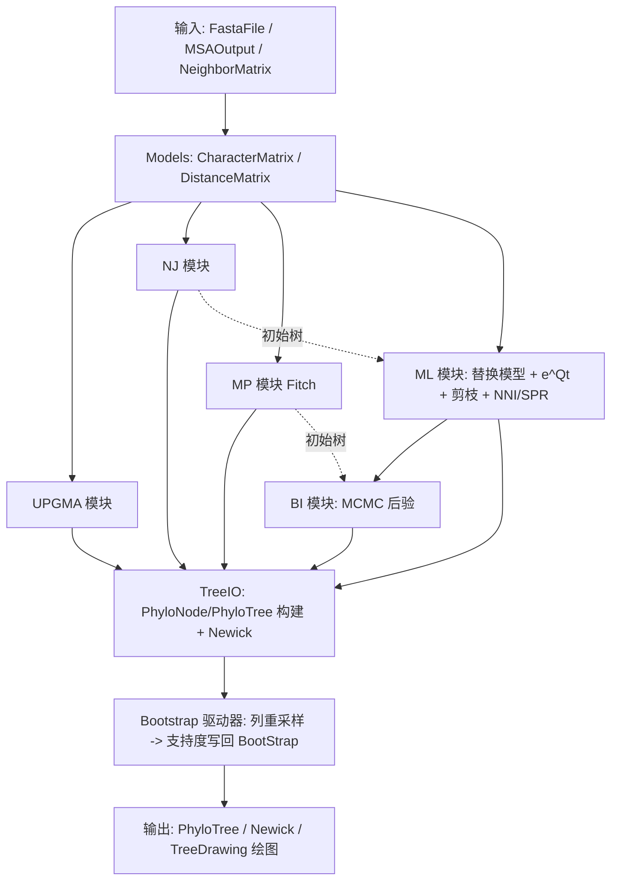

## 产品概述

对 `Phylip.vbproj` 进行重构：在保留现有 PHYLIP 矩阵 I/O、Evolview 树解析/绘制、CLI 互操作等能力的前提下，把当前"依赖外部 phylip.exe 程序"的项目升级为**内置原生进化树构建算法引擎**。按 readme.md 的四大类算法划分，新增 5 个算法模块与 1 套 Bootstrap 评估方法，并让所有算法直接产出项目内现有树模型 `Evolview.PhyloTree` / `PhyloNode`，以支持 Newick 输出与分支支持度标注。

## 核心功能

- **输入层（双入口）**：① 从已比对的多序列（FASTA，或经 MSA 对齐）自动推导"位点矩阵"与"距离矩阵"，串联"比对 → 矩阵 → 建树 → 检验"完整流程；② 直接读取 PHYLIP 距离矩阵（复用 `MatrixFile/NeighborMatrix`）。
- **距离法模块**：
- UPGMA：每轮合并最近簇，按 `D_kl=(n_i·D_ki+n_j·D_kj)/(n_i+n_j)` 更新，输出**有根树**。
- 邻接法 NJ：以 Q 矩阵 `Q(i,j)=(n-2)d(i,j)-Σ_k d(i,k)-Σ_k d(j,k)` 挑最小对合并，按 readme 公式计算分支长度与新距离，输出**无根树**。
- **最大简约法 MP 模块**：仅用信息位点，采用 Fitch 动态规划计算最少替换步数（树长），结合拓扑搜索选出最短树。
- **最大似然法 ML 模块（完整）**：Dayhoff/JTT/WAG/LG 氨基酸替换模型 + 离散 Gamma 速率（含不变位点 I）；Felsenstein 剪枝计算位点似然；以 NJ 树为初始拓扑，用 NNI/SPR 启发式爬山配合分支长度优化搜索最优树。
- **贝叶斯推断 BI 模块**：按 `P(τ,v,θ|D)∝P(D|·)P(·)` 计算后验，用 Metropolis-Hastings MCMC 采样拓扑、分支长度与模型参数；统计内部分支后验概率并输出合一（consensus）树，附带收敛诊断。
- **Bootstrap 评估**：从原始比对中**有放回重抽位点**（保留总位点数），以同一算法重复建树，统计内部分支出现频率作为支持度（≥95% 视为高度可信），并写入内部节点 `PhyloNode.BootStrap`。
- **输出与可视化**：算法结果统一转换为 `PhyloNode`/`PhyloTree`，可输出 Newick；沿用现有 `TreeDrawing.InvokeDrawing` 绘制树形图，Bootstrap/支持度可随内部节点标注展示。

## 复用与修正约束

- 最大化复用已引用的基础库：hctree 的 `AverageLinkageStrategy`/`DefaultClusteringAlgorithm`/`Cluster`（UPGMA）、`Math.NET5` 的 `NumericMatrix`/`EigenvalueDecomposition`/`LBFGSB`、`Bootstraping`/`MersenneTwisterFast`、`MethodOfMoments.Gamma`、Bio.Assembly 的 `FastaFile`/`FastaSeq`/`AminoAcidObjUtility`。
- 实现过程中如发现基础库缺陷（如 `PhyloNode.Clone` 浅拷贝、`MatrixFile` 数值格式化、`PhyloTree` 解析边界等），直接就地修正，不破坏现有公开 API 向后兼容。

## 技术栈

- 语言/框架：VB.NET，`net10.0`（沿用 `Phylip.vbproj` 现状，`RootNamespace=SMRUCC.genomics.Interops.Visualize.Phylip`，启用 `GenerateDocumentationFile`）。
- 复用基础库（已引用）：`hctree.NET5`、`DataMining.NET5`、`Math.NET5`、`stats-netcore5`、`Core`、`biocore-netcore5`、`dataframework-netcore5`。
- 新增引用：`SequenceAlignment/SequenceAlignment.vbproj`（`SMRUCC.genomics.Analysis.SequenceAlignment`），用于 `MSA.MultipleAlignment`/`MSAOutput` 的"未比对 FASTA → 比对"路径；其依赖（Bio.Assembly、Math、Core）均已被 Phylip 引用，增量成本低。
- 输出复用：`Evolview.PhyloTree`/`PhyloNode`（Newick 解析/输出、`BranchLength`、`BootStrap`）。

## 实现思路

采用"共享核心数据模型 + 算法模块 + 统一输出/评估"的分层设计。核心策略：

1. **统一数据模型层（Evolutions/Models）**

- `CharacterMatrix`：已比对位点矩阵，保存 `Names`、序列长度、按列编码的整数状态（20 种氨基酸 + gap + 未知），从 `FastaFile`（要求等长）或 `MSAOutput` 构建；提供按位点取列、过滤 gap 位点、信息位点判定等能力。氨基酸字母表复用 `AminoAcidObjUtility.AminoAcidLetters`/`Polypeptide.ToEnums`。
- `DistanceMatrix`：`names + Double()()` 对称方阵，提供与 `MatrixFile.NeighborMatrix`/`Gendist` 的双向适配（读取时解析 PHYLIP 方阵，输出时可用现有 `NeighborMatrix.GenerateDocument`）。
- 两种入口：`FastaFile → CharacterMatrix →(距离度量)→ DistanceMatrix`；或直接 `NeighborMatrix → DistanceMatrix`。

2. **距离法**

- 距离度量：`SequenceDistance` 实现 p-distance、Poisson 校正（蛋白）与 Jukes-Cantor，输出距离矩阵；通用几何度量复用 `Math.Correlations.DistanceMethods`。
- UPGMA：**直接复用** hctree 的 `DefaultClusteringAlgorithm.performClustering(distances, names, New AverageLinkageStrategy)`（输入完整方阵），得到 `Cluster` 树后转换：每条边 branch length = `parent.DistanceValue - node.DistanceValue`（UPGMA 合并高度差）。
- NJ：自实现 Q 矩阵迭代（库中无 NJ）。维护活动节点集合与距离字典，每轮 O(n²) 计算 Q 并选最小对，按 readme 公式求分支长度并生成内部节点 `u`，更新 `d(u,k)`；终止于 3 个节点时三边收尾，输出无根树。
- 复杂度：UPGMA/NJ 主体 O(n³)（可增量维护行和降到 O(n²) 每轮），对上百至上千序列可用。

3. **MP（Parsimony）**

- 信息位点筛选：列中状态数≥2 且每个状态至少出现 2 次。
- Fitch 算法：后序遍历内部节点，交集非空取交集否则取并集并计一步；树长 = Σ 信息位点步数。
- 树搜索：以 NJ/UPGMA 树为初始拓扑，复用 NNI/SPR 算子做爬山优化；步数相同时可引入一致性/严格合意输出。

4. **ML（Maximum Likelihood）**

- 替换模型：内置 Dayhoff/JTT/WAG/LG 的 20×20 经验速率矩阵与平衡频率 π（常量数据表），构造 `Q`（行和为 0，满足细致平衡），抽象为 `SubstitutionModel`。
- **矩阵指数 e^Qt（关键前置，库中缺失）**：利用氨基酸模型的时间可逆性做对称化——令 `D=diag(π)`，`B=D^{1/2}Q D^{-1/2}` 为对称矩阵，用 `MatrixOps.JacobiEigen(B)`（或 `NumericMatrix.Eigen`）一次性求 `B=UΛUᵀ`，则 `Q=D^{-1/2}UΛUᵀD^{1/2}`、`P(t)=D^{-1/2}U·diag(e^{λt})·UᵀD^{1/2}`。每个模型只需一次特征分解，各分支按 t 快速求 `P(t)`，避免逐分支重复分解。
- 离散 Gamma 速率：用 `MethodOfMoments.Gamma`/`SpecialFunctions` 计算 Γ 分位数，生成 k 个速率类别及其均值（默认 4 类，含 +I 的零速率类）。
- Felsenstein 剪枝：叶向量按观测态置 1；内部节点 `L_u(i)=Π_children[Σ_j P_ij(t)L_child(j)]`；根似然 `L=Σ_i π_i L_root(i)`；全树对数似然为各位点 log 之和。用对数域缩放防下溢。
- 树搜索：NJ 初始树 → 分支长度优化（对每条边做 Brent 一维优化，参考 Bonsai `optTimes`；参数层面可用 `LBFGSB`）→ NNI/SPR 爬山，接受即重新优化受影响分支长度，直至收敛。

5. **BI（Bayesian Inference）**

- 后验 `P(τ,v,θ|D)∝P(D|τ,v,θ)P(τ,v,θ)`，参数：拓扑 τ、分支长度 v、模型参数 θ（如 Gamma 形状 α、可选 π）。
- MCMC：Metropolis-Hastings 提议——拓扑用 NNI/SPR 随机移动；分支长度用乘性缩放提议；θ 用尺度提议；接受率 `α=min(1,[L_new·P_new·q]/[L_old·P_old·q'])`。先验：分支长度指数先验、α 的 Gamma/均匀先验、拓扑均匀先验。
- 输出：弃置 burn-in 后统计各 split 频率，构造多数合意树并把后验概率写入 `PhyloNode.BootStrap`；收敛诊断输出 split 频率标准差与对数似然轨迹（Gelman-Rubin 风格多链比较）。
- 性能：复用 ML 的剪枝似然；对每条链独立运行，可用 `Parallel` 多链并行。这是工作量最大的模块，需保证"可运行的最小闭环"（固定替换模型 + NNI/SPR 拓扑移动 + 分支长度/α 采样 + 支持度统计）。

6. **Bootstrap（算法无关驱动器）**

- 对 `CharacterMatrix` 的位点列做有放回重采样（总位点数不变），可复用 `Bootstraping.Sample` 或基于 `MersenneTwisterFast` 直接抽样列索引；对每个重采样矩阵调用传入的算法委托（`Func(Of CharacterMatrix, PhyloNode)`）建树；统计参考树各内部分支（split）在重采样树中的出现频率，写回参考树对应内部节点 `BootStrap`；支持 `Parallel` 并行与重复次数配置。

7. **输出转换层**

- 算法统一产出内部 `PhyloNode` 图（`AddDescendent` 自动设 Parent，正确设置 `IsRoot`/`IsLeaf`/`BranchLength`/`BootStrap`）。
- 为 `PhyloTree` 增加由节点构建的工厂（在类内新增 `Friend Shared Function FromNodes(name, rootNode)`，复用私有 `reMakeEssentialVariables`/`reCalcDistanceToRoot`/`reCalcMaxDistanceToTip`/`InternalReCalcLevels`）；同时提供 Newick 序列化（可复用 `toTreeString(showBootstrap:=True,...)`）。
- 修复 `PhyloNode.Clone()` 的浅拷贝问题（补齐 `IsRoot`/`IsLeaf`/`Descendents`/`Parent` 深拷贝），供树搜索/BI 的拓扑保存与回滚使用；保持向后兼容（仅补充语义正确的深拷贝，不改变公开签名）。

## 实现注意事项

- **复用优先**：UPGMA 不要重写平均连接逻辑，直接调用 `DefaultClusteringAlgorithm + AverageLinkageStrategy`；距离度量优先复用 `DistanceMethods`；Gamma/随机数/优化复用 Math 库。
- **性能热点**：ML 剪枝为 O(sites·states²·nodes)，需把 `P(t)` 计算缓存/批量；矩阵指数按模型一次特征分解后复用；Bootstrap 与 BI 用并行；NJ 用增量行和避免 O(n³) 全量重算。
- **数值稳定**：似然用对数域与缩放向量；`e^{Qt}` 对称化后特征值应≤0，数值噪声需裁剪；距离矩阵出现 0/负值（相同序列或过度校正）需设最小正值 epsilon 防除零。
- **日志**：沿用现有 `Console.WriteLine` / `.debug` 风格输出进度（迭代轮次、当前似然、接受率），避免在循环中密集打印大矩阵。
- **影响面控制**：新增代码集中在 `Evolution/` 目录；`Evolview`/`MatrixFile` 仅做最小必要修正；不破坏 `ShellScriptAPI`、`CLI`、`TreeDrawing`、`Models` 现有 API。
- **验证**：用 readme 的 NJ 四物种算例（d(A,B)=0.1,d(A,C)=0.3,d(A,D)=0.4,d(B,C)=0.2,d(B,D)=0.3,d(C,D)=0.1，期望第一轮合并 C,D）作为 NJ 单元校验；用已知小树验证 Fitch 步数与剪枝似然。

## 架构设计



## 目录结构

```
Phylip/
├── Phylip.vbproj                              # [MODIFY] 新增 SequenceAlignment 项目引用
├── Evolution/
│   ├── Models/
│   │   ├── CharacterMatrix.vb                 # [NEW] 比对位点矩阵：Names + 整数状态编码；从 FastaFile/MSAOutput 构建；提供位点列访问、信息位点过滤
│   │   ├── CharacterState.vb                  # [NEW] 氨基酸状态编码与字母表映射（复用 AminoAcidObjUtility / Polypeptide.ToEnums）
│   │   └── DistanceMatrix.vb                  # [NEW] 对称距离方阵（names + Double()()）；与 NeighborMatrix/Gendist 互转适配
│   ├── Distance/
│   │   └── SequenceDistance.vb                # [NEW] p-distance / Poisson 校正 / Jukes-Cantor；序列比对矩阵 -> 距离矩阵
│   ├── UPGMA/
│   │   └── UpgmaTree.vb                       # [NEW] 复用 hctree AverageLinkageStrategy + DefaultClusteringAlgorithm；Cluster -> PhyloNode，branch=合并高度差
│   ├── NeighborJoining/
│   │   └── NeighborJoining.vb                 # [NEW] Q 矩阵 + readme 分支长度/新距离公式；输出无根树
│   ├── Parsimony/
│   │   └── MaximumParsimony.vb                # [NEW] 信息位点筛选 + Fitch 动态规划树长 + 拓扑搜索
│   ├── MaximumLikelihood/
│   │   ├── SubstitutionModel.vb               # [NEW] 替换模型抽象（Q/π/P(t)），含时间可逆对称化
│   │   ├── AminoAcidModels.vb                 # [NEW] Dayhoff/JTT/WAG/LG 20x20 速率矩阵与频率常量数据
│   │   ├── MatrixExponential.vb               # [NEW] e^Qt：JacobiEigen 对称化分解 + 逐分支 P(t)
│   │   ├── DiscreteGamma.vb                   # [NEW] 离散 Gamma 速率类别 / 不变位点 I
│   │   ├── FelsensteinPruning.vb              # [NEW] 位点似然剪枝（对数域 + 缩放）
│   │   └── MaximumLikelihoodTree.vb           # [NEW] NJ 初始树 + 分支长度优化 + NNI/SPR 爬山
│   ├── Bayesian/
│   │   └── BayesianInference.vb               # [NEW] Metropolis-Hastings MCMC + 先验 + 后验支持度 + 收敛诊断
│   ├── TreeSearch/
│   │   └── TreeRearrangement.vb               # [NEW] NNI/SPR/TBR 拓扑算子（含保存/回滚），参考 Bonsai PerformNNI/PerformSPR
│   ├── Bootstrap/
│   │   └── BootstrapAnalysis.vb               # [NEW] 算法无关列重采样驱动器 + split 支持度统计写回
│   ├── TreeIO/
│   │   └── PhyloTreeFactory.vb                # [NEW] PhyloNode 图 <-> PhyloTree / Newick 序列化
│   └── EvolutionAPI.vb                        # [NEW] 统一 ExportAPI 入口，串联两种输入与 5 个算法 + Bootstrap
├── Evolview/
│   ├── PhyloTree.vb                           # [MODIFY] 新增 FromNodes 工厂；必要时修正解析边界
│   └── PhyloNode.vb                           # [MODIFY] 修复 Clone 为深拷贝（补齐 IsRoot/IsLeaf/Descendents/Parent）
├── MatrixFile/MatrixFile.vb                   # [MODIFY] 修正数值格式化/边界（如 RoundNumber/__trimData）以适配任意矩阵
├── ShellScriptAPI.vb                          # [MODIFY] 新增算法与 Bootstrap 的导出 API（保持既有 API 不变）
└── test/Program.vb                            # [MODIFY] 端到端验证：NJ 四物种算例、UPGMA、MP 步数、ML 似然、Bootstrap 支持度
```

## 关键代码结构

```
Namespace Evolution.Models
    ' 已比对位点矩阵：整数编码状态（0..19 氨基酸，-1 = gap/未知）
    Public Class CharacterMatrix
        Public ReadOnly Property Names As String()
        Public ReadOnly Property States As Integer()()      ' States(seq)(site)
        Public ReadOnly Property SiteCount As Integer
        Public ReadOnly Property SequenceCount As Integer
        Public Shared Function FromFasta(fa As FastaFile) As CharacterMatrix
        Public Shared Function FromMSA(msa As MSAOutput) As CharacterMatrix
        Public Function IsInformativeSite(site As Integer) As Boolean
        Public Function SubColumns(indices As Integer()) As CharacterMatrix   ' Bootstrap 用
    End Class
End Namespace

Namespace Evolution.Models
    Public Class DistanceMatrix
        Public ReadOnly Property Names As String()
        Default Public ReadOnly Property Item(i As Integer, j As Integer) As Double
        Public Shared Function FromNeighbor(m As MatrixFile.NeighborMatrix) As DistanceMatrix
        Public Function ToNeighbor() As MatrixFile.NeighborMatrix
    End Class
End Namespace

Namespace Evolution.MaximumLikelihood
    Public MustInherit Class SubstitutionModel
        Public ReadOnly Property Pi As Double()             ' 平衡频率
        Public ReadOnly Property RateMatrix As Double()()   ' Q
        Public MustOverride Function TransitionProbability(t As Double) As Double()()   ' P(t)=e^Qt
        Public Shared Function Load(model As AminoAcidModel) As SubstitutionModel
    End Class
    Public Enum AminoAcidModel
        Dayhoff
        JTT
        WAG
        LG
    End Enum
End Namespace
```

## Agent Extensions

### SubAgent

- **code-explorer**
- Purpose: 在实现各算法模块前，精确定位并核对被复用基础库的公开 API（如 hctree `DefaultClusteringAlgorithm`/`AverageLinkageStrategy`/`Cluster`、`NumericMatrix.Eigen`/`MatrixOps.JacobiEigen`、`LBFGSB.IGradFunction`、`Bootstraping`、`MersenneTwisterFast`、`MethodOfMoments.Gamma`、`FastaFile`/`MSAOutput`），确认方法签名与命名空间，避免臆造路径/接口。
- Expected outcome: 产出可编译的调用点与准确签名清单，确保 UPGMA/ML/BI/Bootstrap 直接复用现有代码而非重造轮子，并定位需修正的基础库缺陷。

### Skill

- **lsp-code-analysis**
- Purpose: 对 `Evolview.PhyloTree`/`PhyloNode`、`MatrixFile` 等被修改类型做定义/引用/实现导航与影响面分析，确认 `FromNodes` 工厂、`Clone` 深拷贝修正不会破坏 `TreeDrawing`、`ShellScriptAPI`、`CLI` 等既有调用方。
- Expected outcome: 明确改动影响范围与调用点，保证向后兼容并通过类型级检查。