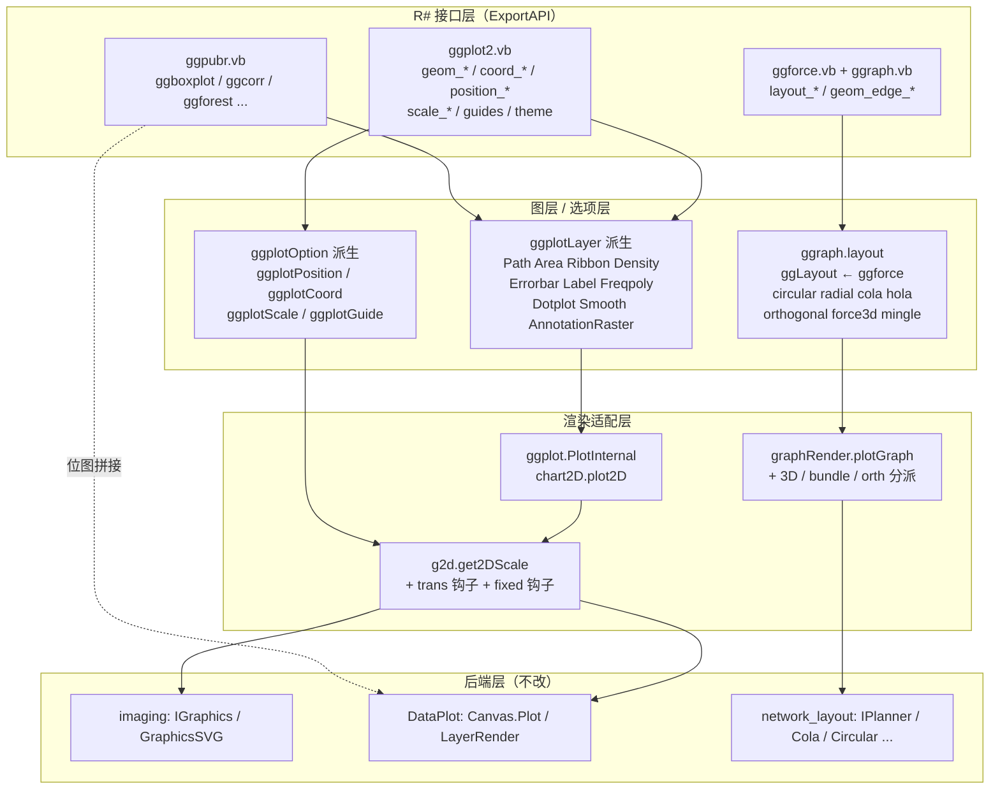

## 产品概述

完善工作区内三个模仿 GNU R 生态的 VB.NET (net10.0) 绘图程序包，使其能够绘制出达到论文插图水准的统计图，并把图网络布局能力从底层库完整暴露到上层 R# 接口。

## 核心功能

### 一、ggplot 程序包：补全 ggplot2 绘图语义

- **修复已暴露但调用即崩的公开接口**：`geom_path`、`annotation_raster`，以及条形图/分组绘图/数据读取/配色映射/显著性检验中的多处未实现分支。
- **新增图层族**：面积图、带状图、密度图、误差棒（横向/纵向）、带背景框的标签图、频数多边形图、点阵图、平滑拟合图。
- **新增位置调整**：`position_dodge`（并排）、`position_stack`（堆叠）、`position_fill`（百分比堆叠）、`position_jitter`（抖动），可作用于条形图、小提琴图、箱线图。
- **新增坐标系**：`coord_cartesian`（指定 x/y 范围并留边距）、`coord_fixed`（等比例）、`coord_polar`（极坐标），与既有 `coord_flip` 并存。
- **补全标度变换**：对数（log10/log2）、平方根、反向、离散轴、日期轴、形状映射、透明度映射、线宽映射，并支持 `guides()` / `guide_legend()` 控制图例的合并、方向、行列数与标题。
- **平滑拟合层**：线性回归、逻辑回归、局部加权（loess）三种方法，可选置信带。

### 二、ggpubr 程序包：新增约 20 个论文级统计图

- **常用组合图**：带显著性标注箱线图、小提琴图、抖动散点图、蜂群排布散点图、带误差棒柱状图（均值±标准误/标准差/置信区间）、配对连线图、点阵图。
- **相关性图**：相关系数矩阵热图、成对相关散点矩阵。
- **Meta/诊断图**：森林图、漏斗图、ROC 曲线（含 AUC 计算与参考线）。
- **多维图**：堆叠/百分比堆叠条形图、宽面条形图、配对矩阵。
- **统计检验增强**：封装多种组间比较方法，自动标注显著性星号与误差棒图层。

### 三、ggraph 程序包：接入底层布局算法

- 显式引入布局库依赖，补齐随机布局与度加权/边加权力导布局。
- 新增环形布局（含交叉最小化）、径向布局、约束力导布局及其三维版本、增量式层次布局、正交布局与正交边路由、三维力导布局。
- 新增边捆绑渲染（平滑曲线束）与正交折线边渲染，恢复被注释的边权重图例。

### 四、构建与验证

以指定配置编译整个解决方案，在 R# 运行时中执行测试脚本，产出图片验证全部新增功能。

## 技术栈

沿用现有栈，不引入任何新包：三个程序包均为 `net10.0` 的 SDK-style VB.NET 项目，`PackageReference` 数量为 0，全部依赖通过 `ProjectReference` 与共享 `.projitems` 接入。

| 层 | 技术 |
| --- | --- |
| 语言/运行时 | VB.NET，TargetFramework `net10.0` |
| 绘图后端 | `Microsoft.VisualBasic.Imaging`（`IGraphics` / `g.GraphicsPlots` / `GraphicsSVG` / `InternalCanvas`） |
| 绘图基类 | `Microsoft.VisualBasic.Data.Plots.Canvas.Plot`（`DataPlot/Canvas/PlotBase.vb:101`），ggplot 覆写 `PlotInternal(ByRef g As IGraphics, canvas As GraphicsRegion)` |
| 统计 | `stats-netcore5`（`Microsoft.VisualBasic.Math.Statistics`）、`Math.NET5`、`ANOVA`、`linear-netcore5`（`LeastSquares.LinearFit` / `NumericTableRegressions`） |
| 图网络 | `network_graph-netcore5`（`NetworkGraph`）、`network_layout`（`IPlanner` 及各算法）、`networkVisualizer`（`CanvasScaler.CalculateNodePositions`） |
| 宿主 | R# runtime（`SMRUCC.Rsharp.Runtime`），导出方式为 `<Package>` + `<ExportAPI>` + `<RApiReturn>` |
| 构建 | `dotnet build ggplot.slnx -c Rsharp_app_release -p:Platform=x64` |
| 运行 | `R#.exe <script>.R --debug=none --attach G:\GCModeller\src\runtime\ggplot` |


## 实现方案

### 总体策略

三条并行的增量演进路线，全部**沿用既有的四层约定**：

1. **R 接口层**：`ggplot2.vb` / `ggpubr.vb` / `ggforce.vb` 中的 `<ExportAPI>` 函数，只做参数校验（R# 语义惯例：非法参数走 `RInternal.debug.stop`）与图层/选项对象的构造，不含绘制逻辑。
2. **图层/选项层**：`Internal/layers/*`（继承 `ggplotLayer` 或 `ggplotGroup`）与 `Internal/options/*`（继承 `ggplotOption`）。
3. **渲染适配层**：`Internal/render/g2d.vb`、`chart2D.vb` 负责把数据映射到画布；新增的坐标系与标度变换挂在这一层。
4. **后端层**：`imaging` 的 `IGraphics`，跨项目复用，无改动。

### 关键技术决策

**决策 1：坐标系与标度采用「后置变换」而非重写渲染管线**

`g2d.get2DScale`（`Internal/render/g2d.vb:77` 与 `:140`）已经把所有图层数据聚合为 `d3js.scale.linear` 的 `DataScaler`。因此：

- `coord_cartesian` 的 `xlim/ylim` 直接写入 `ggplot.args` 的 `range_x` / `range_y` —— 这两个键**已被现有代码读取**（`g2d.vb:89`、`:149`、`:156-157`），零侵入即生效。
- 对数/平方根/日期等标度变换写入 `ggplot.args` 的 `scale_trans_x` / `scale_trans_y`，在 `get2DScale` 聚合完 `domain` 后、`CreateAxisTicks` 前施加单调变换。新增 3 行钩子。
- `coord_fixed` 在 `get2DScale` 之后按 `ratio` 反向调整绘图区 `rect` 的宽高比。
- `coord_polar` 在 `DataScaler` 产出后，对绘图区做一次极坐标重映射（`(r, θ) → (cx + r·cosθ, cy − r·sinθ)`），只对 polygonal/scatter 类图层生效。

**理由**：不改动 `chart2D.plot2D` 的图层遍历逻辑与 `ggplot.PlotInternal` 的控制流，爆炸半径最小；`ggplotTheme` 增加一个 `coord` 字段即可承载。用户已明确排除 facet 分面系统，因此无需面板拆分机制。

**决策 2：位置调整抽象为独立策略对象，而非字符串分支**

现状 `geom_bar` 的 `position` 参数只是字符串透传（`ggplot2.vb:1024-1028` 注释已预留）。新增：

```
Public MustInherit Class ggplotPosition            ' 基类
    Public Overridable Function Adjust(groups As IEnumerable(Of NamedCollection(Of PointF))) _
                                           As IEnumerable(Of NamedCollection(Of PointF))
```

`ggplotPositionDodge` / `ggplotPositionStack` / `ggplotPositionFill` / `ggplotPositionJitter` 四个子类实现 `Adjust`。图层基类 `ggplotLayer` 新增 `positionAdjust As ggplotPosition` 属性，在 `ggplotGroup.getDataGroups` 产出分组点之后、`Plot` 之前应用。

**理由**：条形图、小提琴图、箱线图三类图层共享同一分组点结构，一处策略即可覆盖三类图，避免三份重复的 dodge 逻辑，符合 DRY。

**决策 3：`geom_smooth` 复用 `linear-netcore5`，自实现 loess 与置信带**

`ggplot.NET5.vbproj` 当前**未引用** `linear-netcore5`（ggpubr 引用了），需补一条 `ProjectReference`。拟合分派：

- `"lm"` → 全局命名空间的 `LeastSquares.LinearFit(x, y) As FitResult`（`FitResult.Polynomial` / `GetY` / `SSE` / `SSR` / `RMSE` 已含，够用）。
- 多项式 → `LeastSquares.PolyFit(x, y, degree)`。
- `"glm"` → `Microsoft.VisualBasic.Math.Statistics.NumericTableRegressions.LogisticRegression(table)`。
- `"loess"` → 自实现局部加权三角核回归（`span` 默认 0.75，`degree` 默认 1，局部最小二乘带高斯权重），单组点数上限阈值后降采样，避免 O(n²) 爆炸。

置信带：`se = TRUE` 时按 `RMSE² · t(0.975, n-2) · se_fit` 逐点算上下界，输出为两条 `ggplotPolygon` 带状多边形。

**决策 4：ggpubr 多面板图（ggpairs/ggwidebar/ggally）用位图拼接，不改 ggplot 面板系统**

`ggplot` 无 facet 支持（用户已排除），因此成对矩阵类图采用「子图各自渲染为 `GraphicsData` → `ImageSynthesis.DrawImage` 拼接」的方案，完全复用 DataPlot 已有能力，零侵入 ggplot 渲染管线。`ggcorr` 则走单面板 `ggplotTileLayer` + `ggplotColorMap`，无需拼接。

**决策 5：ggraph 布局抽象从「迭代式」扩展为「通用式」，但保留 `ggforce` 不动**

现有 `ggforce`（`ggraph/Internal/layout/ggforce.vb:70`）的契约是 `MustOverride Function createAlgorithm(g As NetworkGraph) As IPlanner`，只适配迭代式算法。而 `Circular.CircularLayout.LayoutNodes`、`Radial.RadialLayout.LayoutNodes`、`Cola.Layout`、`Mingle.Bundler` 都是**一次性调用**且不实现 `IPlanner`。强行包一层适配器会污染 8 个新算法。

因此新增同级基类，二者同源于 `ggplotOption`：

```
Public MustInherit Class ggLayout : Inherits ggplotOption
    Public Overridable Sub Layout(g As NetworkGraph, canvas As SizeF, env As Environment)
    Public Overridable Function Produces3D() As Boolean = False
End Class

Public MustInherit Class ggforce : Inherits ggLayout   ' 保留 Collide 迭代循环，覆写 Layout
```

现有 4 个布局类（`force_directed` / `spring_embedder` / `spring_force` / `random`）只需把 `ggforce` 的基类声明从 `ggplotOption` 改为 `ggLayout`（`Config` 实现不变），已有 R# 侧调用零影响。`graphRender.plotGraph` 从 `ggplot.args` 取出 `ggLayout` 实例调用 `Layout`。

**决策 6：命名空间陷阱的显式处理**

已核实：`IPlanner`、`SpringEmbedder`、`forceNetwork` 位于**全局命名空间**（`network_layout.vbproj` 的 RootNamespace 是 `...Network.Layouts`，但这三个类型未嵌套其中）；而 `Circular` / `Radial` / `Cola` / `Hola` / `Orthogonal` / `EdgeBundling.Mingle` / `SpringForce` 是该 RootNamespace 下的子命名空间。新增 ggraph 布局文件的 `Imports` 必须同时覆盖这两处。

**决策 7：ggpubr 优先复用 ggplot 图层，避免重复造轮子**

`ggboxplot` / `ggviolin` / `ggdotplot` 均为「组合调用」——内部构造 `ggplotBoxplot` / `ggplotViolin` / `ggplotScatter` + `geom_signif` / `ggplotStatsLayer` 并返回组合后的图层列表，不新建绘图类。只有真正需要新绘制逻辑的（蜂群排布、误差棒、森林、漏斗、ROC、相关矩阵、配对连线）才新建图层类。

### 性能与复杂度

| 位置 | 复杂度 | 瓶颈与对策 |
| --- | --- | --- |
| `g2d.get2DScale` | O(N) 但 N = 全图层数据点总量，且每次渲染调用 2 次 | 已属既有瓶颈。本次新增的变换钩子必须**就地复用已聚合的数组**，禁止再次遍历图层数据；`x/y` 聚合已用 `IteratesALL`，保持不变 |
| `position_stack` / `fill` | O(N) 单遍累加 + O(N) 归一 | 用 `Stack(Of Double)` 累加器，避免 `JoinIterates` 反复分配数组 |
| `ggplotDensity` 核密度 | O(N·K)，K=带宽内样本数 | 单组 N>2000 时按 `bins=512` 直方图分箱后再核估计（`O(N + K·bins)`），保证论文级大数据量可用 |
| `geom_smooth` loess | O(N·span·N) 最坏 O(N²) | 强制 `span` 下限 0.2（N>600 时自动提升到使有效样本 ≤ 600），并对 x 排序后用双指针滑动窗口复用邻域，把邻域检索从 O(N·span·N) 降到 O(N·span) |
| `ggplotBeeswarm` | O(N log N) | 按 x 排序后单遍插入偏移；对完全相同的 x 值批量分配槽位，避免退化为 O(N²) |
| `ggpairs` / `ggwidebar` | O(K²) 子图 | 子图数上限设为 36（6×6），超出时截断并告警，避免误用导致内存爆炸；子图位图按目标尺寸一次性渲染，不做超采样 |
| `Cola.Layout` 约束求解 | 由 Descent 迭代次数决定 | 暴露 `iterations` / `gridSnapIterations` 参数并给保守默认值；对大图（>2000 节点）先跑 `doRandomLayout` 再约束，避免初始全重叠导致不收敛 |
| `Mingle.Bundler` | O(N²) 建近邻图 | `buildNearestNeighborGraph(k)` 的 k 暴露为参数；`bundle()` 的迭代轮数暴露为 `rounds`，默认 4 |
| `Hola` 增量式布局 | 每次 Collide O(affected) | 已在 `ggLayout` 循环中暴露 `iterations`，并保留每 N 步打印进度的 `env.WriteLineHandler` 反馈（沿用 `ggforce.createLayout` 现有日志风格，`iterations/10` 采样一次，避免日志刷屏） |
| 边捆绑渲染 | O(E·rounds·samples) | 折线采样点数按边长自适应（上限 24 点/边），并对超过 5000 条边的图自动降采样 |


### 兼容性、爆炸半径与日志

- **不重命名、不删除、不改变**任何现有公开 API 签名；`geom_path` / `annotation_raster` 由「抛异常」改为「返回图层对象」，是纯粹的行为修复（R 侧从崩溃变为可用）。
- `ggplotLayer` / `ggplotGroup` / `ggforce` 新增的都是**带默认值的属性**与**带默认实现的虚方法**，对既有子类与 R 侧调用零破坏。
- `ggplotTheme` 新增 `coord` / `guide` 字段同样带默认值 `Nothing`，`Config` 内以 `If Not xxx Is Nothing Then` 包裹。
- 日志统一复用 `ggforce.createLayout` 已有的 `env.WriteLineHandler` + `[百分比] ... i/iterations` 格式（`ggforce.vb:79-89`），**沿用其每 `iterations/10` 采样一次的节奏**；长耗时布局额外在开始/结束各打一条。
- 所有新增导出函数遵循既有错误处理惯例：非法参数一律 `Return RInternal.debug.stop(message, env)`（如 `ggplot2.vb:1745`），而非抛 .NET 异常，保证 R# 侧拿到可读的 R 风格错误。
- 论文出图默认走 SVG/PDF 矢量后端（`Drivers.SVG`），验证脚本显式 `ggsave(..., device=...)` 以确认矢量后端无回归。

### 需要在实现中处理的已知缺陷

| 位置 | 问题 |
| --- | --- |
| `ggraph/Internal/render/../graphRender.vb:246-273` | 边权重图例整段被注释，需恢复 |
| `ggpubr/layers/ggplotConfidenceEllipse.vb:110` | `PlotOrdinal` 抛 `NotImplementedException`（注释写 "no used"），顺手修掉 |
| `ggraph/Internal/layout/random.vb:66` | `createAlgorithm` 抛 `NotImplementedException` |
| `ggraph/Internal/layout/force_directed.vb:111` | `degree_weighted` / `edge_weighted` 分支抛 `NotImplementedException`，但 `network_layout` 中 `ForceDirected.DegreeWeightedPlanner` / `EdgeWeightedPlanner` 已存在，可直接补齐 |
| `ggplot2.vb:1193-1198` | `geom_raster` 声明了 `bitmap` 参数但函数体为空，返回 `Nothing`，需实现或明确委托给 `ggplotRaster` |
| `ggplotSignifLayer.vb:81,83` | `wilcox.test` 及其它检验方法未实现 |
| `ggplotStatPvalue.vb:87` | 未识别的 method 兜底缺失 |


## 架构设计



数据流（以 `ggboxplot` 为例）：
R 脚本 → `ggpubr.ggboxplot` 解析参数 → 构造 `ggplotBoxplot` + `ggplotStatPvalue` 图层列表 → `ggplot + layer` 累积到 `ggplot.layers` → `ggplot.PlotInternal` → `ggplotAdapter.getLayers` 逐层取数 → `chart2D.plot2D` → `g2d.get2DScale` 聚合 domain（此处施加 `scale_trans_*` 与 `range_x/y`）→ 各图层 `Plot(g, pipeline)` 用 `DataScaler` 映射坐标 → `Draw2DElements` 绘标题与图例（此处套用 `ggGuide`）→ `Plot.Save(stream, format)` 落盘。

## 目录结构

### 变更概览

ggplot 新增 13 个图层/选项文件并修改 15 处；ggpubr 新增 11 个图层文件并扩展主 API；ggraph 新增 9 个布局与 2 个渲染文件并修改 5 处；新增 3 个 R# 验证脚本。facet 分面系统、`@export/*.d.ts`、`man/` 文档按用户范围**不做改动**。

```
g:/GCModeller/src/runtime/ggplot/
├── src/ggplot/
│   ├── ggplot.NET5.vbproj                          # [MODIFY] 补 ProjectReference: ..\..\..\sciBASIC#\Data_science\Mathematica\Math\DataFittings\linear-netcore5.vbproj（geom_smooth 需要 LeastSquares/NumericTableRegressions）
│   ├── ggplot2.vb                                  # [MODIFY] 主 API。新增 ExportAPI：geom_path(改,补 shape/lineend/linejoin/arrow)、geom_area、geom_ribbon、geom_density、geom_errorbar、geom_errorbarh、geom_label、geom_freqpoly、geom_dotplot、geom_smooth、geom_raster(补实现)、annotation_raster(改为返回图层)；position_dodge/stack/fill/jitter；coord_cartesian/fixed/polar；scale_x/y_log10/log2/sqrt/reverse/discrete/date、scale_shape/scale_shape_manual、scale_alpha/alpha_continuous/alpha_manual、scale_line_size；guides、guide_legend、guide_none。全部沿用 <ExportAPI> + <RApiReturn(GetType(...))> + RInternal.debug.stop 校验惯例
│   ├── Internal/
│   │   ├── ggplot.vb                               # [MODIFY] ggplot 类新增 coord As ggplotCoord 与 guide As ggplotGuide 两个带默认值的属性；DrawLegends(约 L355) 中接入 guide 合并/方向控制；补 DrawMultiple/DrawSingle 对 guide 的参数传递
│   │   ├── ggplotReader.vb                         # [MODIFY] 修复 L198/L200 未识别 data 类型的分支：回退为原样透传并输出一次 MSG_TYPES.WRN 警告，不再抛异常
│   │   ├── colors/ggplotColorMap.vb                # [MODIFY] 修复 L139 未识别 color map 类型的兜底分支，回退到默认 Paper 配色
│   │   ├── render/
│   │   │   ├── g2d.vb                              # [MODIFY] 核心改动点。get2DScale 两个重载中：(1) 读取 ggplot.args 的 scale_trans_x/scale_trans_y，在 domain 聚合完成后、CreateAxisTicks 之前施加单调变换；(2) 读取 range_x/range_y（已有逻辑）之外新增 coord_fixed 的 ratio 反算 rect 宽高；(3) 暴露一个供 coord_polar 复用的极坐标重映射扩展方法
│   │   │   └── chart2D.vb                          # [MODIFY] plot2D 中在拿到 DataScaler 之后调用 ggplot.coord 的应用钩子，使 coord_polar / coord_fixed 生效
│   │   ├── options/
│   │   │   ├── ggplotOption.vb                     # [MODIFY] 仅补充 XML 文档说明新增子类约定，不改逻辑
│   │   │   ├── ggplotTheme.vb                      # [MODIFY] 新增 coord As ggplotCoord、guide As ggGuide 两个默认 Nothing 的属性；Config 中按非空赋值给 ggplot 对应字段（沿用现有 If Not xxx Is Nothing Then 包裹风格）
│   │   │   ├── coord_flip.vb                       # [REFERENCE] 保持不变，作为 coord 系列的既有实现参照
│   │   │   ├── coord/ggplotCoord.vb                # [NEW] 坐标系基类。继承 ggplotOption；定义 TransFrom/TransTo 抽象、Finalize(rect As Rectangle) As Rectangle 虚方法（默认 identity）、以及 ApplyScale(scaler) 钩子。含 coord_cartesian(xlim, ylim, expand) 与 coord_fixed(ratio, xlim, ylim) 的实现类；xlim/ylim 统一写入 ggplot.args("range_x"/"range_y")
│   │   │   ├── coord/ggplotCoordPolar.vb           # [NEW] coord_polar(theta, start, end, direction, clockwise) 实现。Finalize 中把绘图区按 θ 范围裁为扇形或整圆，ApplyScale 中对 datapoint 做 (r,θ)→(x,y) 重映射；仅对 polygonal/scatter/line 类图层生效，条形图类保持原样
│   │   │   ├── scale/ggplotScale.vb                # [NEW] 标度基类。继承 ggplotOption；定义 TransName 属性与 ApplyTransform(values As Double()) As Double() 虚方法（默认 identity）、ApplyTicks(ticks) 虚方法。含 log10/log2/sqrt/reverse 四种内置变换枚举与对应实现类，以及离散标度基类（排序、limits、labels、breaks、drop、expand）
│   │   │   ├── scale/ggplotScaleDiscrete.vb        # [NEW] scale_x_discrete / scale_y_discrete 实现。维护因子水平顺序与标签映射，供 ggplotAxisLabel 与 d3js.scale.ordinal 使用
│   │   │   ├── scale/ggplotScaleDate.vb            # [NEW] scale_x_date / scale_y_date 实现。date_labels（如 "%Y-%m-%d"）、date_breaks（如 "1 year"、"10 day"）解析为数值刻度；复用既有的 DateRange.CreateAxisTicks 或自行实现刻度生成
│   │   │   ├── scale/ggplotShapeScale.vb           # [NEW] scale_shape / scale_shape_manual 实现。维护 序号→MarkerShape 的映射，供 ggplotScatter 的 shape aes 使用
│   │   │   ├── scale/ggplotAlphaScale.vb           # [NEW] scale_alpha / scale_alpha_continuous / scale_alpha_manual 实现。按值域线性映射到 [0,1] 区间并写入图层 alpha
│   │   │   └── ggplotGuide.vb                      # [NEW] guides() / guide_legend() / guide_none() 实现。ggGuide 基类含 Override（是否替换默认图例）、Merge、Direction、Order、NrowNcol、Title、KeyWidth/KeyHeight 属性；ggGuideLegend 与 ggGuideNone 为实现类。供 ggplot.DrawLegends 消费
│   │   └── layers/
│   │       ├── ggplotLayer.vb                      # [MODIFY] 新增 positionAdjust As ggplotPosition（默认 Nothing）属性；新增 ApplyPosition(groups) 便捷方法在分组点产出后统一施加位置调整
│   │       ├── ggplotLine.vb                       # [MODIFY] 抽出可被 geom_path / geom_freqpoly 复用的分组折线绘制核心，供新图层派生而非复制
│   │       ├── ggplotPolygon.vb                    # [MODIFY] 抽出填充多边形基元（points + baseline），供 geom_area / geom_ribbon / 置信带复用
│   │       ├── ggplotTextLabel.vb                  # [MODIFY] 增加可配置的背景矩形填充/描边/圆角开关，供 geom_label 使用；保持 geom_text 现有行为不变（开关默认关闭）
│   │       ├── ggplotRaster.vb                     # [MODIFY] 增加「固定区域、不参与坐标缩放」模式，供 annotation_raster 使用
│   │       ├── ggplotScatter.vb                    # [REFERENCE] 供 ggpubr 蜂群/点阵/配对/ROC 等图层复用的取数与着色逻辑（GetSerialData / IggplotSize）
│   │       ├── groupPlot/ggplotGroup.vb            # [MODIFY] 修复 L162 Plot 基类默认分支：改为抛出带明确消息的 NotSupportedException（说明该分组图层未实现绘制），而非无消息异常；并在分组点产出后调用 ApplyPosition
│   │       ├── groupPlot/geom_bar.vb               # [MODIFY] 修复 L142 getYAxis 与 L154 PlotOrdinal 的非 dataframe 分支；接入 positionAdjust，支持 dodge/stack/fill；扩展 stat 取值聚合逻辑
│   │       ├── groupPlot/ggplotViolin.vb           # [MODIFY] 接入 positionAdjust（dodge 时按组偏移）
│   │       ├── groupPlot/ggplotBoxplot.vb          # [MODIFY] 接入 positionAdjust（dodge 时按组偏移）
│   │       ├── groupPlot/ggplotJitter.vb           # [MODIFY] 保持现有 adjustColor 逻辑，新增与 position_jitter 参数的映射说明
│   │       ├── groupPlot/stats/ggplotStatPvalue.vb # [MODIFY] 修复 L87 未识别 method 兜底：回退到 t 检验并输出警告
│   │       ├── groupPlot/stats/ggplotSignifLayer.vb# [MODIFY] 补 L81/L83 的 wilcox.test 与其余检验方法（t.test / wilcox.test / ANOVA / paired t.test），复用 stats-netcore5 的检验函数；补显著性星号映射表
│   │       ├── groupPlot/ggplotStatsLayer.vb       # [REFERENCE] mean_se / mean_sd / mean_ci 聚合的既有实现，ggpubr 误差棒将复用
│   │       ├── ggplotPath.vb                       # [NEW] geom_path 实现层。继承 ggplotLayer，复用 ggplotLine 的分组折线核心，按 x/y（可选 group）顺序连线，支持 lineend/linejoin/arrow/arrow_fill
│   │       ├── ggplotArea.vb                       # [NEW] geom_area 与 geom_ribbon 共用实现层。继承 ggplotLayer，持 baseline（"zero"/"min"/数值）与 ymin/ymax 两组 aes；填充到基线（area）或 ymin~ymax 带（ribbon），复用 ggplotPolygon 基元；group 内按 x 排序
│   │       ├── ggplotDensity.vb                    # [NEW] geom_density 实现层。核密度估计：Scott 与 Silverman 带宽自动选择（bw 可显式覆盖）、adjust 参数、cut 截断、trim；N>2000 时先按 512 分箱直方图降采样再核估计；输出面积多边形 + 顶部描边
│   │       ├── ggplotErrorbar.vb                   # [NEW] geom_errorbar 与 geom_errorbarh 共用实现层。继承 ggplotLayer，按 aes(ymin/ymax/xmin/xmax) 或 (ymean, ymin, ymax) 绘制主段与两端帽，orientation 区分横向/纵向；复用 IGraphics 的 Stroke 与 lineend
│   │       ├── ggplotLabel.vb                      # [NEW] geom_label 实现层。继承 ggplotTextLabel，启用背景矩形（fill/stroke/圆角/内边距），保持 geom_text 行为不变
│   │       ├── ggplotFreqpoly.vb                   # [NEW] geom_freqpoly 实现层。继承 ggplotLayer，先按 bins/binwidth 分箱统计频数，再复用 ggplotLine 核心按组连线
│   │       ├── ggplotDotplot.vb                    # [NEW] geom_dotplot 实现层。继承 ggplotLayer，Cochran 手臂式点阵堆叠：按 x 分桶、桶内按计数垂直排列并做水平微偏移，binwidth/binaxis/direction/stackdir 参数可控
│   │       ├── ggplotSmooth.vb                     # [NEW] geom_smooth 实现层。继承 ggplotLayer，按 group 分组取 x/y；method 分派 lm（LeastSquares.LinearFit）/ poly（PolyFit）/ glm（NumericTableRegressions.LogisticRegression）/ loess（自实现局部加权，span 默认 0.75，N>600 时自动收紧 span 并用双指针复用邻域）；se=TRUE 时输出上下置信带多边形；geom 参数 line/ribbon/smooth；formula 支持 y~x 与 y~poly(x,d)
│   │       └── ggplotAnnotationRaster.vb           # [NEW] annotation_raster 实现层。继承 ggplotRaster，固定在 [xmin,xmax]×[ymin,ymax] 或相对画布的 width/height 区域绘制，不参与坐标缩放与图例
│   └── Interop/ggplotFunction.vb                    # [MODIFY] 为新增的高频导出（geom_boxplot、geom_violin、geom_area、geom_errorbar、geom_smooth、position_dodge、coord_cartesian）补 DataFrame 便捷重载，沿用现有重载写法
├── src/ggpubr/
│   ├── ggpubr.vb                                    # [MODIFY] 主 API 大幅扩展。新增 ExportAPI：ggboxplot、ggviolin、ggstrip、ggbeeswarm、ggbar、ggpaired、ggdotplot、ggerrorbar、ggsignif、ggcorr、ggpairs、ggforest、funnel、ggroc、ggbar_stacked、ggwidebar、ggally。箱线图/小提琴图/条形图/点阵图等以组合方式返回图层列表（内部构造 ggplotBoxplot / ggplotViolin / geom_bar / ggplotScatter / ggplotStatPvalue），只有需要新绘制逻辑的才返回新图层类型
│   ├── layers/
│   │   ├── ggplotConfidenceEllipse.vb              # [MODIFY] 修复 L110 PlotOrdinal 的 NotImplementedException；复用已有 ChiSquareTest.TranslateLevel + Imaging.Math2D.Ellipse.ConfidenceEllipse 逻辑
│   │   ├── ggplotTextRepelLabel.vb                 # [REFERENCE] 供 geom_text_repel 复用，不改动
│   │   ├── ggplotBeeswarm.vb                       # [NEW] ggbeeswarm/ggstrip 的排布层。继承 ggplotGroup，实现 1D/2D 感知蜂群算法：按 x 排序后单遍插入偏移，对相同 x 值批量分配槽位避免 O(N²)；method 参数支持 "beeswarm"/"swarm"，size 与 cex 映射到 marker 尺寸
│   │   ├── ggplotErrorBarLayer.vb                  # [NEW] 通用误差棒图层。继承 ggplotGroup，按 group 聚合均值与误差量（mean_se / mean_sd / mean_ci / sqrt_n / 自定义函数），绘制均值点 + 误差棒 + 可选 significance 标注
│   │   ├── ggplotFunnel.vb                         # [NEW] 漏斗图图层。继承 ggplotLayer，按纳入人数/效应量绘制逐级收缩的居中条带（等宽或按比例），可叠加 95% 置信区间边界带
│   │   ├── ggplotForest.vb                         # [NEW] 森林图图层。继承 ggplotGroup，左侧绘制点估计 + 水平 CI 线（支持 log 比例尺），右侧绘制数值文本列（效应量、95%CI、权重），含零线/无效线
│   │   ├── ggplotROC.vb                            # [NEW] ROC 曲线图层。继承 ggplotLayer，从预测值与标签计算全套阈值下的 TPR/FPR，多阈值降采样控制点数；填充 AUC 计算（梯形法，可按分组/协变量分层）；绘制对角参考线与 AUC 文本
│   │   ├── ggplotCorrMatrix.vb                     # [NEW] 相关系数矩阵热图层。继承 ggplotGroup，计算 Pearson / Spearman 相关矩阵，按 |r| 映射发散色标（0 居中），单元格内可选标注 r 值，复用 ggplotColorMap 的发散配色
│   │   ├── ggplotPairs.vb                          # [NEW] 成对散点矩阵图层。继承 ggplotGroup，对每一变量对构造子 ggplot 并渲染为 GraphicsData，再用 ImageSynthesis.DrawImage 拼接为网格；对角线放变量直方图，K>6 时告警截断
│   │   ├── ggplotPaired.vb                        # [NEW] 配对连线图层。继承 ggplotGroup，同一 subject 的 before/after 两点连线 + 配对 t 检验 p 值标注；支持连线颜色分组
│   │   └── ggplotSignifStars.vb                   # [NEW] 显著性星号计算与标注辅助。继承 ggplotGroup，把 p 值映射为 ***/**/*/ns，绘制于组上方；封装 t.test / wilcox.test / ANOVA / paired t.test 的调用与结果提取
├── src/ggraph/
│   ├── ggraph.vbproj                                # [MODIFY] 补 <ProjectReference Include="..\..\..\sciBASIC#\gr\network-visualization\network_layout\network_layout.vbproj" />，不再依赖 networkVisualizer 的传递引用
│   ├── ggraph.vb                                  # [MODIFY] Module ggraphPkg 新增 geom_edge_bundle（边捆绑曲线渲染）、geom_edge_orth（正交折线路由渲染）；保留现有 geom_edge_link / geom_node_point / geom_node_text / geom_node_convexHull / map 不变
│   ├── ggforce.vb                                 # [MODIFY] Module ggforcePkg 新增 layout_circular、layout_radial、layout_cola、layout_cola3d、layout_hola、layout_orthogonal、layout_force3d、layout_mingle 的 ExportAPI；修正 layout_random 使其真正生效
│   └── Internal/
│       ├── layout/ggforce.vb                       # [MODIFY] 新增 ggLayout 基类（继承 ggplotOption，含 Layout/Produces3D/CanvasSize 默认实现）；ggforce 改为继承 ggLayout，保留 createAlgorithm 抽象、Collide 迭代循环、iterations/[step] 属性与 Config 实现不变
│       ├── layout/random.vb                        # [MODIFY] 修复 L66 NotImplementedException：覆写 Layout 直接以 doRandomLayout 的结果为终态（跳过 Collide 循环），支持 seed 参数保证可复现
│       ├── layout/force_directed.vb                # [MODIFY] 修复 L111：degree_weighted → ForceDirected.DegreeWeightedPlanner，edge_weighted → ForceDirected.EdgeWeightedPlanner，替换原抛异常分支
│       ├── layout/circular.vb                      # [NEW] layout_circular 实现。调 Circular.CircularLayout.LayoutNodesWithCrossingOptimization（含 maxSwaps 交叉最小化）与 LayoutNodesWithDegreeSort；支持 radius/cx/cy/sortByDegree/maxSwaps 参数
│       ├── layout/radial.vb                        # [NEW] layout_radial 实现。调 Radial.RadialLayout.LayoutNodes 与 LayoutNodes(parameters)；支持 radius/按度数排序
│       ├── layout/cola.vb                           # [NEW] layout_cola 实现。构造 Cola.Layout 并按需设置 nodes/groups/links/constraints，暴露 start 的各阶段迭代次数、avoidOverlaps、handleDisconnected、flowLayout(axis, minSeparation)、powerGraphGroups(f)、centerGraph 等开关；大图先随机初始化
│       ├── layout/cola3d.vb                         # [NEW] layout_cola3d 实现。调 Cola.Layout3D，产出 z 坐标并置 Produces3D=True
│       ├── layout/hola.vb                           # [NEW] layout_hola 实现。构造 Hola.HolaLayouter（HolaOptions 控制对齐/层扫描/扩散松弛强度），以增量方式在 ggLayout.Layout 循环内逐步 Collide，只重绘受影响节点
│       ├── layout/orthogonal.vb                     # [NEW] layout_orthogonal 实现。调 Orthogonal.OrthographicEmbedding 完成平面嵌入，再调 Orthogonal.Router / Cola.GridRouter 生成正交折线；结果交给 orthEdgeRender 渲染
│       ├── layout/force3d.vb                        # [NEW] layout_force3d 实现。构造 SpringForce.ForceDirected3D，走 Calculate(timeStep) 循环，置 Produces3D=True
│       ├── layout/mingle.vb                         # [NEW] layout_mingle 实现。构造 EdgeBundling.Mingle.Bundler，setNodes → buildNearestNeighborGraph(k) → bundle(rounds)，产出每条边的中间控制点序列
│       ├── render/edgeBundleRender.vb                # [NEW] 边捆绑渲染图层。继承 ggplotLayer，把 bundler 产出的中间控制点用 Catmull-Rom/Bezier 插值成平滑曲线；采样点数按边长自适应（上限 24 点/边）；边数超阈值时降采样并告警
│       ├── render/orthEdgeRender.vb                  # [NEW] 正交边渲染图层。继承 ggplotLayer，把 Router 输出的折点序列画为分段直线，含箭头与圆角拐点
│       ├── graphRender.vb                          # [MODIFY] plotGraph 中改为从 ggplot.args 取出 ggLayout 并调用 Layout；按 Produces3D 分派到现有 plot3D 路径或新增的 bundle/orth 边渲染路径；恢复 L246-273 被注释的边权重图例
│       └── graphPipeline.vb                        # [MODIFY] 新增 bundlePaths / orthPaths 字段承载边路径几何；labels 集合扩展为可携带边权重图例所需的元数据
├── assembly/net10.0/                                # [BUILD OUTPUT] dotnet build 产物落地目录（ggplot/ggpubr/ggraph 的 dll 与 xml 文档），不在源码改动范围
└── test/
    ├── test_ggplot_extensions.R                     # [NEW] ggplot 新功能验证脚本。覆盖 geom_path/area/ribbon/density/errorbar/label/freqpoly/dotplot/smooth、position_dodge/stack/fill/jitter、coord_cartesian/fixed/polar、log 与 date 标定、guides 定制；每个用例 ggsave 出 png（部分同时出 svg 以验证矢量后端）
    ├── test_ggpubr.R                               # [NEW] ggpubr 全部新图型验证脚本。覆盖 ggboxplot（带显著性星号）、ggviolin、ggstrip、ggbeeswarm、ggbar 三种误差棒、ggpaired、ggdotplot、ggcorr、ggpairs、ggforest、funnel、ggroc、堆叠/百分比堆叠条形、宽面条形；数据取自 ggplot/data/*.csv 与 test/*.csv
    └── test_ggraph_layouts.R                       # [NEW] ggraph 布局验证脚本。对 chicago-nmmaps.csv 等图数据分别以 layout_random / springembedder / forcedirected 三种权重 / springforce / circular（含交叉最小化）/ radial / cola / cola3d / hola / orthogonal / force3d / mingle 渲染并 ggsave 出图
```

## 关键接口定义

以下三个抽象是三处扩展点的核心契约，需精确实现以保证子类行为一致：

```
' ggplot/Internal/options/coord/ggplotCoord.vb
Namespace ggplot.options
    Public MustInherit Class ggplotCoord : Inherits ggplotOption
        Public Overridable Function Finalize(rect As Rectangle) As Rectangle
            Return rect
        End Function
        Protected Overridable Sub ApplyScale(scaler As DataScaler, rect As Rectangle)
        End Sub
    End Class
End Namespace

' ggplot/Internal/options/scale/ggplotScale.vb
Namespace ggplot.options
    Public MustInherit Class ggplotScale : Inherits ggplotOption
        Public Property transName As String = "identity"
        Public Overridable Function ApplyTransform(values As Double()) As Double()
            Return values
        End Function
    End Class
End Namespace

' ggraph/Internal/layout/ggforce.vb
Namespace ggraph.layout
    Public MustInherit Class ggLayout : Inherits ggplotOption
        Public Property canvasSize As SizeF
        Public Overridable Function Produces3D() As Boolean
            Return False
        End Function
        Public Overridable Sub Layout(g As NetworkGraph, canvas As SizeF, env As Environment)
        End Sub
    End Class

    Public MustInherit Class ggforce : Inherits ggLayout
        Public Property iterations As Integer = 10000 * 2
        Public Property [step] As Double = 0.001
        Protected MustOverride Function createAlgorithm(g As NetworkGraph) As IPlanner
    End Class
End Namespace
```

## Agent Extensions

### SubAgent

- **code-explorer**
- Purpose: 在接入 `network_layout` 的大型算法前，精确定位 `Cola.Layout`、`Cola.Layout3D`、`Hola.HolaLayouter`、`Orthogonal.OrthographicEmbedding`、`Orthogonal.Router`、`EdgeBundling.Mingle.Bundler` 的构造签名、必需参数与典型调用序列；同时定位 `Microsoft.VisualBasic.Math.Statistics` 中各检验函数与 `NumericTableRegressions` 的确切入口签名。
- Expected outcome: 产出可直接照抄的调用参数清单（构造函数参数顺序、命名参数、返回值形态），避免因签名猜测导致的反复编译失败；对无法确认签名的 API 明确标注为需实机验证。