# GNUplot

## Acknowledgement

> The initial project code in this repository was adapted from the original works of @AwokeKnowing: [**Gnuplot.C#**](https://github.com/AwokeKnowing/GnuplotCSharp)

## Overview

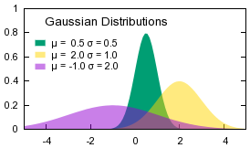 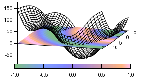

Most scientific publications with graphs use gnuplot.  It is extremely well documented and handles 2D, 3D (surface and pointcloud), heatmap, png, jpg, and much more using simple math syntax as well as simple text-based data.  And it supports many output formats, as well interactive zooming/rotating.

Gnuplot is a portable command-line driven graphing utility for Linux, OS/2, MS Windows, OSX, VMS, and many other platforms. The source code is copyrighted but freely distributed (i.e., you don't have to pay for it). It was originally created to allow scientists and students to visualize mathematical functions and data interactively, but has grown to support many non-interactive uses such as web scripting. It is also used as a plotting engine by third-party applications like Octave. Gnuplot has been supported and under active development since 1986.

It only takes about 10 lines of code to wire up VB.NET to send commands to gnuplot. But as soon as you try to send arrays of data, overlay multiple graphs, and generally work with gnuplot from VB.NET, you'll immediately see that you have to add all kinds of utility functions to not clutter up your code.

Gnuplot provides a nice set of functions to make it easy to use all the power of gnuplot to visualize your data in **.NET**.  Check out the examples of how easy it is to visualize functions and data.

### Installation
Just add project reference to the gnuplot project in your solution, and then Imports the namespace ``GNUplot``. If you have changed the default location of gnuplot, then you should using ``GNUplot.Start`` function to manual starting the gnuplot services.

> Public Function **GNUplot.Start**(_gnuplot_ As String) As Boolean
>
> ###### Summary:
> If you have change the default installed location of the gnuplot, then this function is required for manually starting the gnuplot services. (假若从默认的位置启动程序没有成功的话，会需要使用这个函数从自定义位置启动程序)
>
> ###### Parameters:
> _gnuplot_: The file path of the program file: ``gnuplot.exe``
>
> ###### Returns:
> The gnuplot services start successfully or not?

```vbnet
Public Function GNUplot.Start(String) As Boolean
```

If you haven't installed gnuplot on your system, download it at http://sourceforge.net/projects/gnuplot/files/ or http://www.gnuplot.info

### Inspiration
In 2012, I completed the excellent Machine Learning course by Andrew Ng (Coursera).  We used Octave/Matlab, and Octave uses gnuplot for its graphs. I wanted to recreate all the class projects in **.NET** for practice.  Microsoft has a cloud numerics library, so **.NET** is a good choice for machine learning if you want to for example, train your machine learning algorithm on a large dataset and scale across many computers in the Azure cloud.

I believe this project will be helpful to anyone who wants to visualize data/functions in **.NET**, so I have released it here.

## Examples
To see various demos in action, download the files, open the solution (Visual Studio) and run ``Test`` project (make sure you've installed gnuplot first)

If you are not familiar with gnuplot, I recommend you visit http://www.gnuplot.info and see all the demos there.  Then come back for how to do it all in **.NET**.

### Plot

**Plot a function**
```vbnet
GnuPlot.Plot("sin(x) + 2")
```
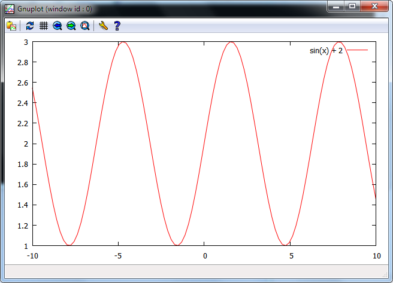
-------

**Plot a function with custom color and line width** (see gnuplot documentation)
```vbnet
GnuPlot.Plot("sin(x) + 2", "lc rgb 'magenta' lw 5")
```
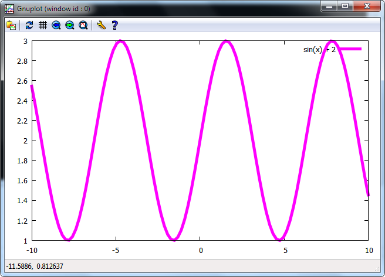
-------

**Plot an array of y values**
```vbnet
Dim Y#() = {-4, 6.5, -2, 3, -8, -5, 11, 4, -5, 10}
GNUplot.Plot(Y)
```
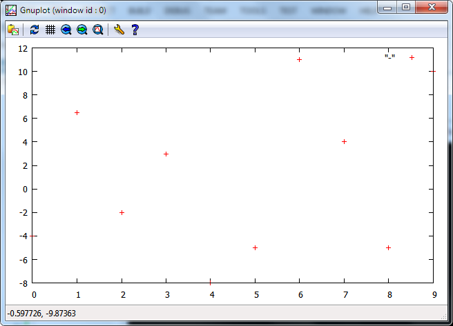
-------

**Plot an array of x and y values**  (notice the x values vs previous graph)
```vbnet
Dim X#() = {-10, -8.5, -2, 1, 6, 9, 10, 14, 15, 19}
Dim Y#() = {-4, 6.5, -2, 3, -8, -5, 11, 4, -5, 10}
GNUplot.Plot(X, Y)
```
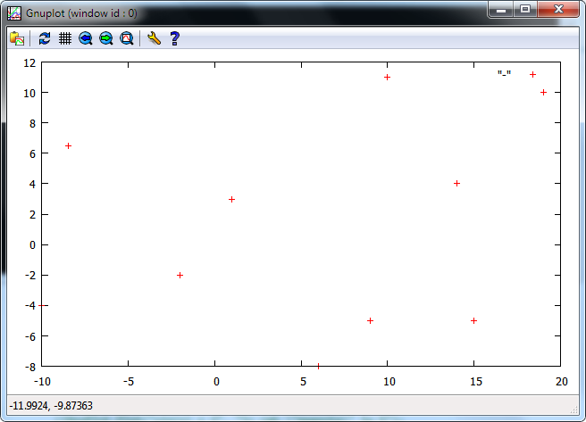
-------

**Overlay multiple graphs**  (HoldOn causes future plots to be overlayed. HoldOff make future plots replace previous.
```vbnet
GnuPlot.HoldOn()
GnuPlot.Plot("cos(x) + x")
GnuPlot.Plot("cos(2*x)", "with points pt 3")
```
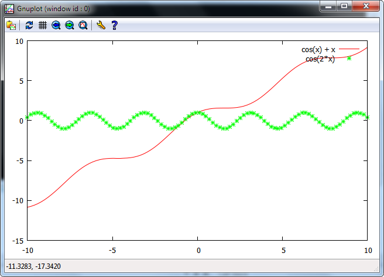
-------

### Splot (3D data)

**plot a 3D function**
```vbnet
GnuPlot.SPlot("1 / (.05*x*x + .05*y*y + 1)")
```
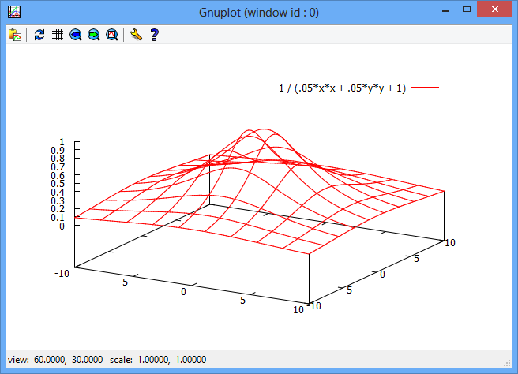
-------

Set the number of lines with **isosamples** to control "detail" (see gnuplot documentation)
```vbnet
GnuPlot.Set("isosamples 30")
GnuPlot.SPlot("1 / (.05*x*x + .05*y*y + 1)")
```
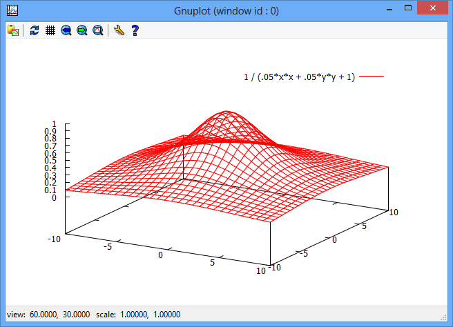
-------

Hide back faces with **hidden3d** to make it "solid" (see gnuplot documentation)
```vbnet
GnuPlot.Set("isosamples 30", "hidden3d")
GnuPlot.SPlot("1 / (.05*x*x + .05*y*y + 1)")
```
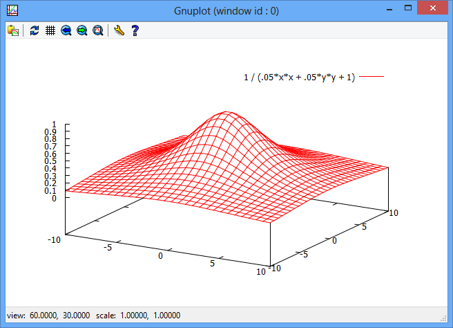
-------

**plot a file with 3D data**
__data.txt__  (this can be in any format accepted by gnuplot.  Here it's x,y,z points for two separate polygons)
```
 -1  -1 -1
 -1   1 -1
-.1  .1  1
-.1 -.1  1
 -1  -1 -1

 .1  .1  1
 .1 -.1  1
  1  -1 -1
  1   1 -1
 .1  .1  1
```

**to plot the above file**
```vbnet
splot ("data.txt")
```
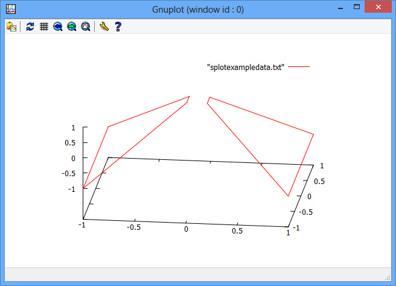
-------

**plot an array of z values** (specify y size to break the array into a square grid)
```vbnet
Dim Z#() = { -4, -2.5, 1, 3,    -3, -2, 3, 4,    -1, 2, 6, 8 }
GnuPlot.Set("pm3d") ' color planes by z value
GnuPlot.SPlot(4, Z) ' split the 12 z values into rows of 4 points
```
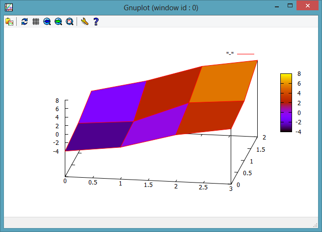
-------

**plot a grid of z values** and use some styling (see gnuplot docs for style commands)
```vbnet
Dim Z#(,) = {{-4, -2.5, 1, 3}, {-3, -2, 3, 4}, {-1, 2, 6, 8}}
GNUplot.Set("pm3d", "palette gray")         ' we'll make monochrome color based on height of the plane
GNUplot.SPlot(Z, "with points pointtype 6") ' we'll try with points at vertexes instead of lines
```
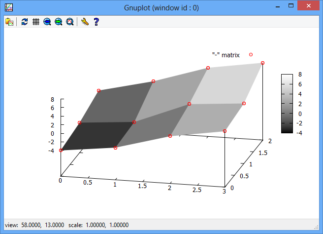
-------

**plot a point cloud of x, y, and z values**
```vbnet
' make some random data points
Dim X#() = New Double(100) {}
Dim Y#() = New Double(100) {}
Dim Z#() = New Double(100) {}
Dim r As New Random()

For i% = 0 To 100
    X(i) = r.Next(30) - 15
    Y(i) = r.Next(50) - 25
    Z(i) = r.Next(20) - 10
Next

' set the range for the x,y,z axis and plot (using pointtype triangle and color blue)
GNUplot.Set("xrange[-30:30]", "yrange[-30:30]", "zrange[-30:30]")
GNUplot.SPlot(X, Y, Z, "with points pointtype 8 lc rgb 'blue'")
```
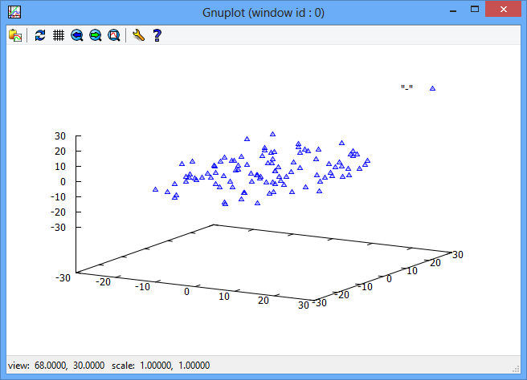
-------

**plot a surface based on random unordered x, y, and z values**
```vbnet
' make 20 random data points
Dim X#() = New Double(20) {}
Dim Y#() = New Double(20) {}
Dim Z#() = New Double(20) {}
Dim r As New Random()

For i% = 0 To 20
    X(i) = r.Next(30) - 15
    Y(i) = r.Next(50) - 25
    Z(i) = r.Next(20) - 10
Next

' fit the points to a surface grid of 40x40 with smoothing level 2
GNUplot.Set("dgrid3d 40,40,2")

' set the range for the x,y,z axis and plot (using pm3d to map height to color)
GNUplot.Set("xrange[-30:30]", "yrange[-30:30]", "zrange[-30:30]")
GNUplot.SPlot(X, Y, Z, "with pm3d")
```
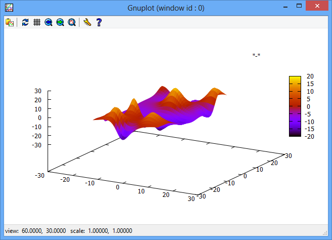
-------

Contour (3D data as "top view" with contour lines)
--------
Contour maps are very useful to make it easier to see the peaks and valleys, and see what areas have the same range of values.  Gnuplot lets you show contour maps, but you can't draw 2d points and lines on them.  The Contour methods generate a 2D contour map, allowing you to plot further data points on it.

```vbnet
GnuPlot.Unset("key")                                                      ' hide the key or legend
GnuPlot.Set("cntrparam levels 20","isosamples 50", "xr[-5:5]","yr[-6:6]") ' notice cntrparam levels (# height levels)
GnuPlot.Contour("sin(x) * cos(y)+x","lc rgb 'blue'")                      ' plot a 3d function (or data)
```
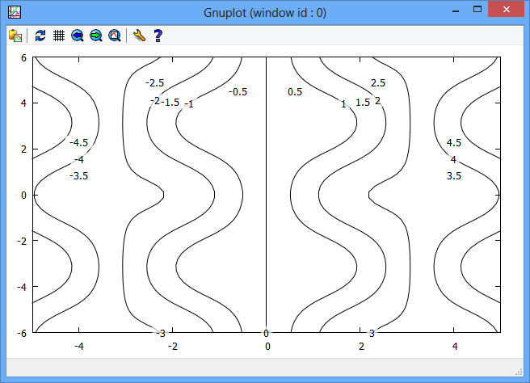
-------

Heatmap  (intensity/z-scale map)
--------

```vbnet
Dim Z#(,) = New Double(,) {
    {0, 0, 0, 1, 2, 2, 1, 0, 0, 0},
    {0, 0, 2, 3, 3, 3, 3, 2, 0, 0},
    {0, 2, 3, 4, 4, 4, 4, 3, 2, 0},
    {2, 3, 4, 5, 5, 5, 5, 4, 3, 2},
    {3, 4, 5, 6, 7, 7, 6, 5, 4, 3},
    {3, 4, 5, 6, 7, 7, 6, 5, 4, 3},
    {2, 3, 4, 5, 5, 5, 5, 4, 3, 2},
    {0, 2, 3, 4, 4, 4, 4, 3, 2, 0},
    {0, 0, 2, 3, 3, 3, 3, 2, 0, 0},
    {0, 0, 0, 1, 2, 2, 1, 0, 0, 0}
}
Call GNUplot.HeatMap(Z)
```
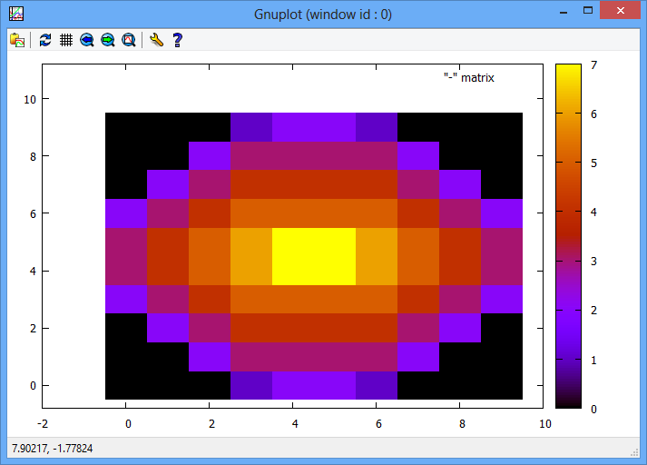
-------

Set and Unset
--------

```vbnet

```

Replot
--------

```vbnet

```

Write and WriteLine
--------

```vbnet

```

SaveData
--------

```vbnet

```

PointStyles
--------

```vbnet

```

StoredPlot
--------

```vbnet


```

API Reference
---
Plot

Splot

Contour

Heatmap

Set

Unset

HoldOn

HoldOff

SaveData

WriteLine

Write

Replot

License
-------
You are free to use this code as you wish.  Please mention you got it on GitHub from James Morris aka AwokeKnowing. Also, email me at james david morris a/t g mail .com (no spaces) and let me know about your project.

Disclaimer
----------
Use this code at your own risk.  The author cannot guarantee that it is free of defects or that it will work as you expect.  It's less than 1000 lines of code, so just look at it, and decide if it works for you.

Happy coding!!