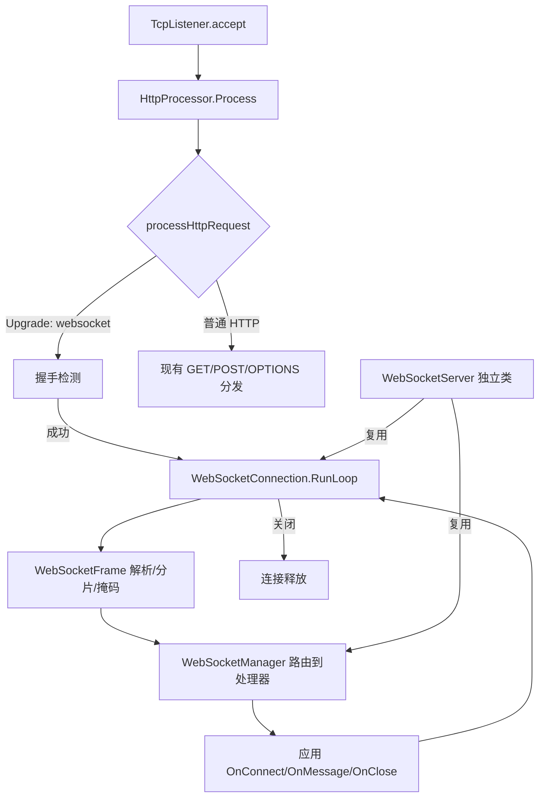

## 用户需求

在 VB.NET 编写的 HTTP 服务器核心模块 `src\Flute` 中增加对 WebSocket 协议（RFC6455）的支持，使现有 HTTP 服务器能够在同一 TCP 端口上处理 WebSocket 升级请求。

## 产品概述

为 `src\Flute` 的自定义 HTTP 服务器（`HttpServer`/`HttpProcessor`/`HttpSocket` 体系）扩展完整的 WebSocket 能力。WebSocket 握手作为 HTTP 升级请求在既有请求解析阶段被识别并接管，握手成功后由独立帧处理循环接管连接。提供两种应用层接入方式：在 `HttpProcessor` 中集成的委托接口（`WebSocketDelegate`），以及可独立运行的 `WebSocketServer` 类。所有活动连接由 `WebSocketManager` 统一托管，支持按 URL 路径路由与群发广播。

## 核心功能

- WebSocket 握手：识别 `Upgrade: websocket` + `Connection: Upgrade` + `Sec-WebSocket-Key`，完成 101 切换协议应答（`Sec-WebSocket-Accept` = Base64(SHA1(key + GUID))），并支持子协议（SubProtocol）协商。
- 帧解析与编码：支持文本(0x1)、二进制(0x2)、延续(0x0)、关闭(0x8)、ping(0x9)、pong(0xA) 帧；服务器发帧不加掩码，客户端发帧强制掩码并严格校验。
- 消息分片重组：按 FIN 标志与 opcode 0x0 跨帧重组完整应用消息。
- 控制帧：自动响应 ping 为 pong；收到 close 帧返回 close 握手并优雅关闭。
- 连接托管：`WebSocketManager` 统一注册/注销连接，提供按路径路由到不同处理器、以及对全部或指定路径连接的广播（broadcast）。
- 应用接口：提供 `WebSocketDelegate`（OnConnect/OnMessage/OnClose）与独立 `WebSocketServer` 类，二者均可接入同一套帧与连接管理实现。
- 配置扩展：在 `Configuration` 中增加 WebSocket 相关可选配置（如是否启用、允许子协议列表）。

## 技术栈选择

- 语言/框架：VB.NET（net10.0），与现有 `Flute` 模块一致；不引入新的 NuGet 依赖，复用已引用的 `Microsoft.VisualBasic.Core`（`SHA1`/`Base64`/`随机数` 工具）。
- 网络层：沿用现有 `TcpListener` + `BufferedStream`/`StreamWriter` 模型；握手应答使用原始 `Stream` 字节写出，避免经由 `StreamWriter` 文本协议。
- 并发：沿用现有 `_connectionSemaphore` 连接限额与 `ThreadPool` 派发；WebSocket 连接循环在既有 `RunTask` 任务内持续读取帧，不额外新增线程池。

## 实现方案

### 总体策略

在 `HttpProcessor.processHttpRequest()` 解析完请求行与头部之后插入 WebSocket 握手检测分支：若判定为 WebSocket 升级请求，则执行握手应答并调用 `WebSocketConnection.RunLoop()` 接管该连接的后半生命周期（读取/解析帧、调用应用回调、写回帧），成功后让 `Process()` 跳过常规的 `outputStream.Flush/Close` 与 `socket.Close`（交由 `WebSocketConnection` 负责释放）。常规 HTTP 请求路径完全不受影响。

### 关键技术决策

1. **握手检测点**：放在 `processHttpRequest()` 内、`If http_method = "GET"` 分支之前。原因：WebSocket 升级固定为 GET 请求，且需复用已解析的 `httpHeaders` 与已建立的 socket 流；在 `HttpProcessor` 内识别可让 `HttpSocket` 与未来其他 `HttpServer` 子类透明受益。
2. **流接管方式**：握手成功后，`WebSocketConnection` 直接复用 `HttpProcessor.socket.GetStream()` 得到的原始 `NetworkStream`（不再使用 `outputStream` 这个 `StreamWriter`）。`Process()` 通过返回布尔或可空标志区分「已接管 WebSocket」与「常规 HTTP 完成」，避免双重关闭。
3. **独立 `WebSocketServer` 类**：与 `HttpServer` 并列（不继承 HTTP 语义），内部仍为 `TcpListener` + 连接信号量，但 `accept` 后直接进入 WebSocket 握手与帧循环。复用 `WebSocketConnection`/`WebSocketManager`/`WebSocketFrame` 实现，保证两套接口行为一致、单一职责。
4. **掩码与分片**：客户端帧强制校验 `MASK=1`，未掩码则按协议关闭；服务器出帧 `MASK=0`。分片重组用 `(FIN, opcode)` 状态机在 `WebSocketConnection` 内缓冲，直至 FIN 完成整条消息再回调 `OnMessage`。
5. **子协议协商**：从请求头 `Sec-WebSocket-Protocol` 取候选列表，与 `Configuration`/`WebSocketServer` 配置的允许列表求交集，取首个命中项写入响应头；无命中则不返回该头（由客户端决定是否接受）。
6. **性能与可靠性**：帧读取采用定长头(2/4/8/14 字节)与负载分块缓冲（复用 4KB 缓冲），避免大消息全量驻留；掩码解码为就地 XOR，O(n) 单次遍历。连接管理器使用 `ConcurrentDictionary` 保证线程安全；`broadcast` 对断开连接做惰性清理。所有异常在帧循环内捕获并记录（`App.LogException` + `_settings.silent`），不影响其他连接。

### 避免技术债务

- 复用现有 `Configuration`、`HttpHeader`、`HttpProcessor` 的流与信号量模型，不新建并行机制。
- 帧编解码与连接管理拆分为独立类，保持 `HttpProcessor` 改动最小化（仅插入分支与接管出口）。
- 头常量集中补充到 `HttpHeader.vb`，避免散落字符串字面量。

## 实现注意事项

- **Process() 流程安全**：握手成功分支必须保证 `outputStream` 不被 Flush/Close、`socket` 不被 `Close`，由 `WebSocketConnection.Dispose` 统一释放；否则会出现流已关闭仍尝试写帧的异常。
- **日志与静默**：握手失败（缺少 key、版本不支持、掩码非法）应写 `HTTP 400` 常规响应并记录，避免静默挂起；复用 `writeFailure` 与现有 `info/debug` 日志约定，禁止打印完整帧负载以免日志膨胀。
- **回退兼容**：非 WebSocket 的 GET/POST/OPTIONS 路径行为完全不变；新增配置项均有默认值（如未配置子协议则协商为空）。
- **版本校验**：仅支持 `Sec-WebSocket-Version: 13`，其他版本返回 426 并带 `Sec-WebSocket-Version: 13` 头。

## 架构设计



## 目录结构

```
src/Flute/
├── Http/
│   ├── HttpProcessor.vb          # [MODIFY] 插入 WebSocket 握手检测分支；Process() 增加「已接管」出口，跳过常规关闭逻辑
│   ├── HttpSocket.vb             # [MODIFY] 暴露 WebSocket 委托/管理器配置可选集成点（保持兼容）
│   └── WebSocket/
│       ├── WebSocketFrame.vb      # [NEW] RFC6455 帧结构：解析(含掩码/分片标记)、编码(服务器出帧不加掩码)、opcode 枚举
│       ├── WebSocketConnection.vb # [NEW] 单连接读写循环：握手应答、帧循环、掩码严格校验、分片重组、ping/pong、close 握手、资源释放
│       ├── WebSocketManager.vb    # [NEW] 连接注册表(ConcurrentDictionary)、按 URL 路径路由、Broadcast、生命周期管理
│       ├── WebSocketDelegate.vb   # [NEW] 应用层事件委托定义：OnConnect/OnMessage/OnClose 及 WebSocketHandler 接口
│       └── WebSocketServer.vb     # [NEW] 独立 WebSocket 服务器类，复用以上实现，与 HttpServer 并列
├── Configuration/
│   └── Configuration.vb           # [MODIFY] 增加 websocket 可选配置（启用开关、允许子协议列表等，带默认值）
└── HttpMessage/Protocol/
    └── HttpHeader.vb              # [MODIFY] 补充 WebSocket 头常量：Upgrade / Sec-WebSocket-Key / Sec-WebSocket-Accept / Sec-WebSocket-Protocol / Sec-WebSocket-Version
```

## 关键代码结构

```
' WebSocketDelegate.vb
Public Delegate Sub OnConnectHandler(conn As WebSocketConnection, path As String)
Public Delegate Sub OnMessageHandler(conn As WebSocketConnection, message As String, isBinary As Boolean, data As Byte())
Public Delegate Sub OnCloseHandler(conn As WebSocketConnection, code As UShort)

Public Interface IWebSocketHandler
    Sub OnConnect(conn As WebSocketConnection, path As String)
    Sub OnMessage(conn As WebSocketConnection, message As String, isBinary As Boolean, data As Byte())
    Sub OnClose(conn As WebSocketConnection, code As UShort)
End Interface

' WebSocketFrame.vb 关键枚举
Public Enum WebSocketOpcode As Byte
    Continuation = &H0
    Text = &H1
    Binary = &H2
    Close = &H8
    Ping = &H9
    Pong = &HA
End Enum
```

## 验证建议

- 在 `test/http_integration_test` 中新增 WebSocket 握手与 echo 测试（可用 `System.Net.WebSockets.ClientWebSocket` 作为客户端）。
- 验证：握手 101、文本/二进制回显、分片消息重组、ping→pong、客户端未掩码被拒、关闭握手、broadcast 到多连接。

## Agent Extensions

### SubAgent

- **code-explorer**
- 用途：在编写具体代码前，深度核对 `HttpProcessor.Process()` 与 `HttpServer.accept()/RunTask()` 的精确控制流，确认 WebSocket 接管出口的最小改动点，并定位 `Microsoft.VisualBasic.Core` 中可用的 SHA1/Base64 API 确切命名空间与签名。
- 预期结果：输出 `HttpProcessor` 改动点清单、SHA1/Base64 调用示例、以及既有测试中可复用的客户端构造方式，确保实现与现有模式严格对齐、无编译歧义。