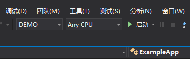

When the project references were configed, switch the profile to ``DEMO``, and then compile the project. The compiled dll and httpd web server application was released to directory: [./bin/](./bin/)

Run the bash script [./start.sh](./start.sh) for start the demo web app, if the demo was running on Windows system, then allow the httpd web server pass through your firewall.

At last, you can navigate to localhost, like http://127.0.0.1/example/test.json for test the demo web app.