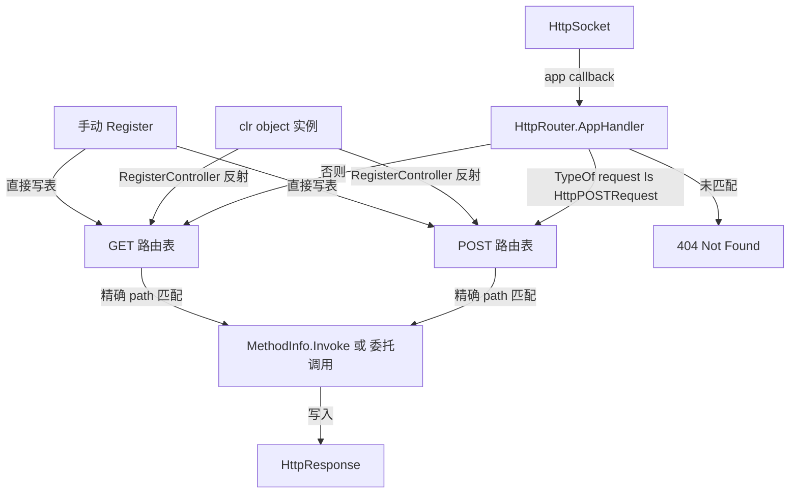

## 用户需求

在 Flute 项目（VB.NET HTTP 服务器）的 Flute 核心代码中新增"请求路由器"功能模块。

## 产品概述

新增一个独立路由器类，实现 `IAppHandler` 接口，作为 `HttpSocket` 的 app 回调直接接入。该路由器通过反射自动解析用户传入的 CLR 对象实例中带有 `HttpGet`/`HttpPost` 自定义属性的公开方法，建立 url -> 处理函数的路由表，并在收到 HTTP 请求时按方法类型与 url 精确匹配并调用对应处理函数；同时支持手动注册路由。

## 核心特性

- 实现 `Flute.Http.Core.IAppHandler` 接口，提供 `AppHandler(request, response)` 入口
- 通过反射解析 clr object 实例的公开方法，筛选函数签名为 `Sub(HttpRequest, HttpResponse)` 且带有 `HttpGet`/`HttpPost` 属性的方法，提取 url 与 http 方法
- 路由表按 http 方法（GET/POST）与 url 精确路径（去掉查询字符串）建立索引
- 在 `AppHandler` 中根据 `request` 实际类型（`HttpPOSTRequest` 或 `HttpRequest`）与 `HTTPMethod`/`URL.path` 精确匹配，调用对应处理函数
- 未匹配到路由时返回 HTTP 404 Not Found 并写入简单提示信息
- 提供手动 `Register`/`AddHandler` 式 API，允许除反射外显式注册处理函数（签名需符合 `AppHandler` 委托）
- 支持以多个 clr object 实例（如 `RegisterController(obj)`）或单个对象构造，兼容现有一行式 `New HttpSocket(router, port)` 用法

## 技术栈

- 语言：VB.NET（.NET，与现有 Flute.NET5.vbproj 一致）
- 现有核心依赖：`Microsoft.VisualBasic.Scripting.MetaData`（提供 `ExportAPIAttribute`）、`Flute.Http.Core.Message`（`HttpRequest`/`HttpPOSTRequest`/`HttpResponse`）
- 反射 API：`System.Reflection`（MethodInfo、CustomAttributeExtensions）
- 无新增第三方依赖

## 实现方案

### 整体策略

新增 `HttpRouter` 类（置于 `Flute.Http.Core` 或 `Flute.Http.Core.Router` 命名空间），实现 `IAppHandler`。其内部维护两张路由表（GET / POST），键为 url 路径字符串，值为 `MethodInfo` + 目标实例（或手动注册委托）。构造或调用 `RegisterController(obj)` 时通过反射遍历 `obj` 的公开方法，筛选满足签名（`Sub(HttpRequest, HttpResponse)`）且带有 `HttpGet`/`HttpPost` 属性的方法入库；手动 `Register(httpMethod, url, handler)` 直接写表。

### 关键决策

1. **请求类型判断**：`IAppHandler.AppHandler` 形参为 `HttpRequest`，但 POST 实际传入 `HttpPOSTRequest`。通过 `TypeOf request Is HttpPOSTRequest` 判断；POST 路由表仅匹配 POST 方法，GET/OTHER 走 GET 表（与现有 `handleGETRequest`/`handleOtherMethod` 均构造基类 `HttpRequest`、POST 构造派生类的事实一致）。
2. **签名校验**：反射时对方法参数判断 `ParameterType` 是否为 `HttpRequest`/`HttpPOSTRequest` 的兼容类型，且返回 void（`Sub`），避免误注册不匹配方法，保证类型安全。
3. **精确路径匹配**：用 `request.URL.path`（即 `URL` 的 path 部分，不含 query）与属性 `Name` 做 `String.Equals(..., Ordinal)` 严格比较，符合用户确认。
4. **反射开销控制**：路由表在 `RegisterController` / 构造阶段一次性构建并缓存 `MethodInfo` 与目标实例，运行时 `AppHandler` 仅做字典查找（O(1)）与 `MethodInfo.Invoke`，避免每次请求重复反射，性能良好。
5. **方法调用**：使用 `method.Invoke(target, {request, response})`，并处理 `TargetInvocationException` 将内部异常记录后返回 500，避免线程崩溃；手动注册委托则直接 `handler(request, response)` 调用。
6. **可扩展性**：路由表采用 `Dictionary(Of String, RouteEntry)`，后续可轻松扩展 PUT/DELETE 或路径参数，不改变核心结构。

### 与现有架构对齐

- 直接复用 `HttpSocket` 现有委托 `AppHandler(request As HttpRequest, response As HttpResponse)` 作为处理函数签名，无需改动 `HttpSocket.vb` 与 `HttpServer.vb`。
- 通过 `New HttpSocket(router, port, ...)` 接入，完全向后兼容现有用法。
- 复用 `HttpResponse` 的写入 API（`WriteHTML` / `writeFailure` 等）返回 404/500。

## 实现注意事项

- **向后兼容**：不修改 `HttpSocket.vb`、`HttpServer.vb`、`HttpMethods.vb`、`HttpRequest/HttpPOSTRequest`；仅新增文件。
- **日志**：复用项目现有 `.info()`/`.debug()` 扩展（如 `HttpServer` 中用法），记录路由注册与未匹配情况，避免在热路径产生日志刷屏；不要在日志中输出请求体或敏感头。
- **URL 规范化**：属性 url 与请求 path 均建议统一 `Trim("/"c)` 后再比较（参考 `HttpSocket.handleOtherMethod` 中对 `ctrl/kill` 的处理），避免 `/user/info` 与 `user/info` 不一致。
- **空处理**：`RegisterController(Nothing)` 或对象无匹配方法时应安全跳过并给出调试日志，不抛异常。

## 架构设计



## 目录结构

```
Flute/
└── Http/
    └── Core/
        └── HttpRouter.vb   # [NEW] 请求路由器模块。实现 IAppHandler 接口；内部维护 GET/POST 两张路由表（Dictionary(Of String, RouteEntry)）；提供 RegisterController(obj) 通过反射解析带 HttpGet/HttpPost 属性的公开方法（签名需为 Sub(HttpRequest, HttpResponse)），提取 url 与方法类型入库；提供手动 Register(method, url, handler) API；AppHandler 中按请求实际类型与 URL.path 精确匹配并调用，未匹配返回 404。命名空间建议 Flute.Http.Core（与 HttpSocket 同级，避免改动现有 import 链）。
```

（SDK 风格 vbproj 通常自动包含新增 .vb 文件；若为非 SDK 风格需将文件加入 Flute.NET5.vbproj 编译项，由实现时确认。）

## 关键代码结构

```
Namespace Flute.Http.Core

    Public Class HttpRouter : Implements IAppHandler

        ' 路由条目：反射解析的方法或手动注册的委托
        Private Structure RouteEntry
            Public target As Object          ' 反射方法的宿主实例，委托注册时为 Nothing
            Public method As Reflection.MethodInfo ' 反射方法，委托注册时为 Nothing
            Public handler As AppHandler      ' 手动注册委托，反射时为 Nothing
        End Structure

        ' GET/POST 路由表：key 为规范化后的 url path
        Private ReadOnly getRoutes As New Dictionary(Of String, RouteEntry)
        Private ReadOnly postRoutes As New Dictionary(Of String, RouteEntry)

        ' 通过反射解析 controller 的公共方法并注册路由
        Public Function RegisterController(controller As Object) As HttpRouter

        ' 手动注册一个处理函数
        Public Function Register(httpMethod As String, url As String, handler As AppHandler) As HttpRouter

        ' IAppHandler 实现：请求分发入口
        Public Sub AppHandler(request As HttpRequest, response As HttpResponse) Implements IAppHandler.AppHandler
    End Class
End Namespace
```