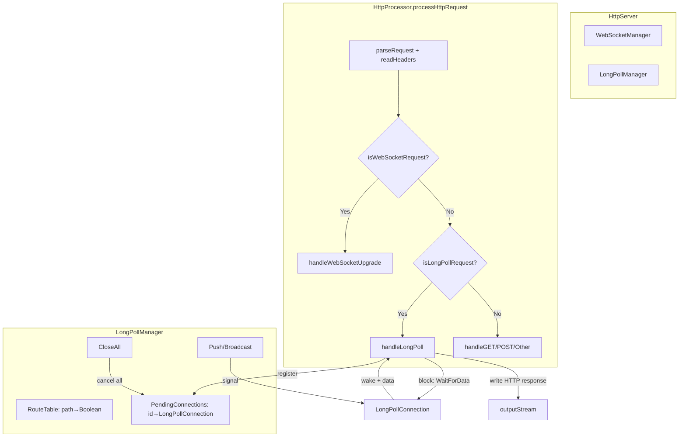

## 用户需求

为 Flute HTTP 服务核心增加 HTTP 长轮询（Long Polling）特性支持。

## 产品概述

Flute 是一个用 VB.NET 编写的轻量级 HTTP 服务器核心库，已具备完整的 HTTP 请求处理和 WebSocket 协议支持。本次优化将在 Flute 核心中新增长轮询模块，使应用程序能够注册长轮询端点，客户端发起请求后服务器阻塞等待直到有数据推送或超时，然后返回 HTTP 响应并关闭连接，客户端收到响应后自动重新发起请求。该机制与现有 WebSocket 模块并行，为不支持 WebSocket 的环境提供服务器推送能力。

## 核心功能

- 长轮询端点路由注册：通过 `LongPollManager.Route(path)` 注册长轮询路径，与 WebSocket 路由模式一致
- 请求阻塞与唤醒：客户端 GET 请求匹配已注册的长轮询路径时，工作线程阻塞等待数据，被 `Push` 操作唤醒后写入标准 HTTP 响应并正常关闭连接
- 跨线程数据推送：提供 `Push(path, data)` / `PushText` / `PushJSON` / `Broadcast` 方法，从任意线程向指定路径的等待连接推送数据
- 超时处理：可配置的轮询超时时间，超时后返回空响应让客户端重连
- 优雅关闭：服务器 Shutdown 时唤醒所有阻塞的长轮询连接并释放资源
- 连接数限制：可配置最大并发长轮询连接数，防止资源耗尽
- 可选的应用层处理器接口：支持 OnPoll（可返回即时数据跳过阻塞）和 OnComplete 事件回调

## 技术栈

- 语言：VB.NET（.NET 10.0，与现有项目 `Flute.NET5.vbproj` 的 `<TargetFrameworks>net10.0</TargetFrameworks>` 一齐）
- 命名空间：`Flute.Http.Core.LongPoll`（与 `Flute.Http.Core.WebSocket` 平行）
- 依赖：`System.Collections.Concurrent`（ConcurrentDictionary）、`System.Threading`（TaskCompletionSource）
- 配置：复用现有 INI 配置体系（`Configuration` 类 + `ClassMapper.LoadIni`）

## 实现方案

### 设计策略

采用与 WebSocket 模块完全一致的设计范式：**路由表 + Manager 挂载在 HttpServer 上 + HttpProcessor 在请求分发前自动检测**。这是对现有架构的最小侵入式扩展，复用已验证的连接管理、路由、广播等模式。

### 核心机制

长轮询的本质是"延迟的 HTTP 响应"。与 WebSocket 不同，长轮询不需要劫持（hijack）TCP 连接或切换协议——它只是在 `processHttpRequest()` 中检测到长轮询请求后，阻塞工作线程等待数据，被唤醒后正常写入 HTTP 响应，然后由 `Process()` 的现有清理逻辑（flush → close → socket.Close）完成连接关闭。

```
Client GET /poll/messages
    → HttpProcessor.processHttpRequest()
    → isLongPollRequest() = true (path matched in LongPollManager)
    → handleLongPoll():
        → 创建 LongPollConnection, 注册到 Manager
        → connection.WaitForData(timeout)  ← 阻塞工作线程
        ← 另一线程调用 LongPollManager.Push("/poll/messages", data)
        → 唤醒, 写入 HTTP 200 响应 + data
        → 从 Manager 注销
    → Process() 正常清理: flush, close, socket.Close
Client 收到响应, 重新发起 GET /poll/messages
```

### 关键技术决策

1. **同步阻塞而非异步化重构**：现有架构是同步的（`ThreadPool.QueueUserWorkItem` + 同步 `Process()`），长轮询的工作线程阻塞占一个连接信号量槽位（与 WebSocket 一致）。异步化重构影响面太大，不符合最小侵入原则。

2. **TaskCompletionSource 作为等待机制**：使用 `TaskCompletionSource(Of LongPollMessage)` 实现阻塞等待，支持超时（`.Task.Wait(timeoutMs)`）和取消（`TrySetCanceled`），比 `ManualResetEventSlim` 更优雅且可组合。

3. **不需要 hijack 标志**：与 WebSocket 的 `m_webSocketHijacked` 不同，长轮询的响应是标准 HTTP 响应，写完后 `Process()` 的正常清理逻辑即可完成连接关闭。只需在 `processHttpRequest()` 中将长轮询检测插入 WebSocket 检测之后、常规处理器分发之前。

4. **LongPollConnection 与 HttpProcessor 解耦**：`LongPollConnection` 是纯数据/同步对象，不持有 `HttpProcessor` 引用。等待和写响应都由 `HttpProcessor.handleLongPoll()` 完成，保持职责分离。

5. **LongPollMessage 封装数据和内容类型**：推送数据携带内容类型信息（如 `application/json`），`handleLongPoll` 根据内容类型写 HTTP 响应头。提供 `PushText` / `PushJSON` / `PushBinary` 便捷方法。

### 性能考量

- **线程占用**：每个阻塞的长轮询连接占用一个线程池槽位（SemaphoreSlim）。通过 `longpoll_max_connections` 配置限制最大并发数，防止线程池耗尽。默认值 1000，超出时立即返回 503。
- **推送效率**：`Push(path, data)` 通过 ConcurrentDictionary 的快照查找匹配的 pending 连接，O(n) 最坏情况（n=该路径的 pending 数）。对于典型场景（少量 topic，每 topic 几十到几百连接），性能足够。
- **死连接清理**：与 WebSocketManager 的惰性清理一致——Push 时如果写入失败（客户端已断开），在 Manager 中注销该连接。
- **无消息队列**：Push 时无 pending 连接则数据丢弃（长轮询的固有特性）。应用层如需消息缓冲可自行实现。

## 实现注意事项

- **socket.ReceiveTimeout 不影响阻塞**：`Process()` 设置 `socket.ReceiveTimeout = _settings.request_timeout`（30s），但长轮询阻塞期间不读取 socket，所以不影响。客户端断开时 `WaitForData` 仍在等待，被 Push 唤醒后写入会抛异常，由 `Process()` 的 try-catch 捕获，连接正常注销。
- **Shutdown 顺序**：在 `HttpServer.Shutdown()` 中，`LongPoll.CloseAll()` 应在 WebSocket.CloseAll() 之后调用，确保所有阻塞连接被唤醒。
- **NormalizePath 复制**：`LongPollManager.NormalizePath` 复制 `WebSocketManager.NormalizePath` 的逻辑（去 query、去尾斜杠、补前导斜杠），避免跨模块耦合。
- **日志**：复用现有 `App.LogException` 和 `.info(silent)` 模式，不引入新日志框架。
- **向后兼容**：`longpoll_enabled` 默认 True 但无注册路由时不影响任何现有行为。所有修改对现有代码透明。

## 架构设计



## 目录结构

```
Flute/
├── Http/
│   ├── LongPoll/                        # [NEW] 长轮询模块目录
│   │   ├── LongPollManager.vb           # [NEW] 长轮询管理器。路由表注册、pending连接注册表、Push/PushText/PushJSON/Broadcast推送、CloseAll优雅关闭、GetPendingCount统计。参照 WebSocketManager 的 ConcurrentDictionary 模式和 NormalizePath 逻辑。
│   │   ├── LongPollConnection.vb        # [NEW] 单个长轮询连接状态。持有 Id/Path/Url/Headers/Remote/Session/Timestamp 元数据，内部用 TaskCompletionSource(Of LongPollMessage) 实现阻塞等待。提供 WaitForData(timeoutMs) 方法供 HttpProcessor 调用，Complete(message) 供 Manager 的 Push 调用，Cancel() 供 CloseAll 调用。
│   │   └── LongPollDelegate.vb          # [NEW] 处理器接口与消息体。定义 ILongPollHandler 接口(OnPoll返回即时数据或Nothing表示阻塞, OnComplete回调)、委托式 LongPollHandler 类、LongPollMessage 类(Data+ContentType)。
│   ├── HttpProcessor.vb                 # [MODIFY] 增加 isLongPollRequest() 检测和 handleLongPoll() 处理。在 processHttpRequest() 中 WebSocket 检测之后、常规方法分发之前插入长轮询检测分支。handleLongPoll 创建连接→注册→阻塞等待→写响应→注销。连接数超限时返回 503。
│   └── HttpServer.vb                    # [MODIFY] 增加 Public ReadOnly Property LongPoll As New LongPollManager。在 Shutdown() 中调用 LongPoll.CloseAll()（在 WebSocket.CloseAll() 之后），唤醒所有阻塞连接。
├── Configuration/
│   └── Configuration.vb                 # [MODIFY] 增加 longpoll_enabled(Boolean,默认True)、longpoll_timeout(Integer,默认30000ms)、longpoll_max_connections(Integer,默认1000) 三个配置项，使用 <Description(...)> 标注。
└── ...

HTTP_SERVER/
└── Program.vb                           # [MODIFY] 在 listen 函数中注册长轮询路由 localhost.LongPoll.Route("/poll/messages")，并在 WebFileSystemListener 的 WebHandler 中增加 /push 端点处理（调用 LongPollManager.PushText 推送消息）。
```

## 关键代码结构

```
' LongPollDelegate.vb - 消息体与处理器接口

''' <summary>
''' 一个待推送的长轮询消息，包含数据字节和HTTP内容类型
''' </summary>
Public Class LongPollMessage
    Public ReadOnly Property Data As Byte()
    Public ReadOnly Property ContentType As String

    Sub New(data As Byte(), Optional contentType As String = "application/json")
        Me._Data = If(data, New Byte() {})
        Me._ContentType = If(contentType.StringEmpty, "application/json", contentType)
    End Sub

    Public Shared Function Text(text As String) As LongPollMessage
        Return New LongPollMessage(Encoding.UTF8.GetBytes(If(text, "")), "text/plain")
    End Function

    Public Shared Function JSON(json As String) As LongPollMessage
        Return New LongPollMessage(Encoding.UTF8.GetBytes(If(json, "")), "application/json")
    End Function
End Class

''' <summary>
''' 应用层长轮询处理器接口
''' </summary>
Public Interface ILongPollHandler
    ''' <summary>新轮询请求到达时调用。返回非空消息则立即响应不阻塞，返回Nothing则阻塞等待推送</summary>
    Function OnPoll(connection As LongPollConnection) As LongPollMessage
    ''' <summary>轮询结束时调用（推送唤醒或超时）</summary>
    Sub OnComplete(connection As LongPollConnection, message As LongPollMessage, timedOut As Boolean)
End Interface
```

```
' LongPollConnection.vb - 核心等待机制

Public Class LongPollConnection
    Public ReadOnly Property Id As String
    Public ReadOnly Property Path As String
    Public ReadOnly Property Url As String
    Public ReadOnly Property Headers As Dictionary(Of String, String)
    Public ReadOnly Property Remote As EndPoint
    Public ReadOnly Property Session As New Dictionary(Of String, Object)
    Public ReadOnly Property Timestamp As DateTime = DateTime.UtcNow

    Private ReadOnly m_tcs As New TaskCompletionSource(Of LongPollMessage)()

    ''' <summary>阻塞当前线程等待数据，返回推送的消息或在超时时返回Nothing</summary>
    Public Function WaitForData(timeoutMs As Integer) As LongPollMessage
        Try
            If m_tcs.Task.Wait(timeoutMs) Then
                Return m_tcs.Task.Result
            Else
                Return Nothing  ' 超时
            End If
        Catch ex As Exception
            Return Nothing  ' 被取消或异常
        End Try
    End Function

    ''' <summary>由Manager.Push调用，唤醒等待的连接</summary>
    Public Function Complete(message As LongPollMessage) As Boolean
        Return m_tcs.TrySetResult(message)
    End Function

    ''' <summary>由Manager.CloseAll调用，取消等待</summary>
    Public Sub Cancel()
        m_tcs.TrySetCanceled()
    End Sub
End Class
```