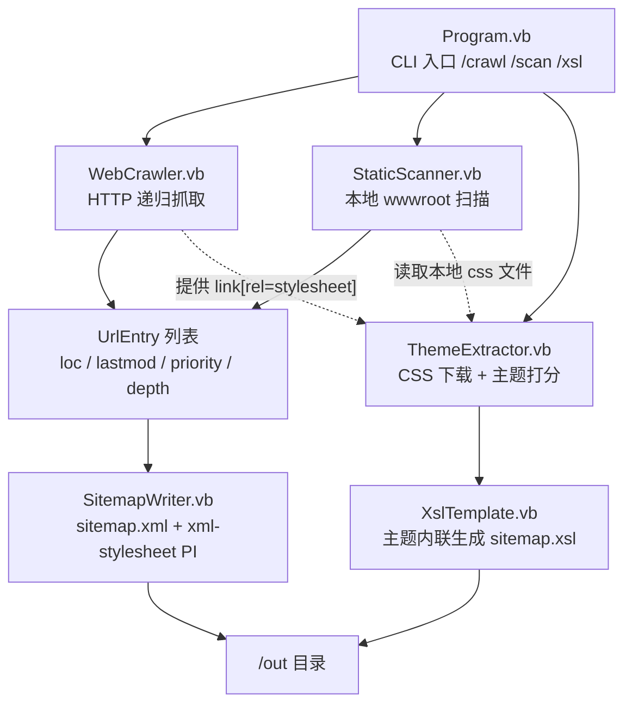

## 产品概述

在 `Sitemap\Sitemap.vbproj` 中实现一个命令行模式的网站地图制作工具（`Sitemap.exe`）。它抓取目标站点静态页面中的站内 URL，生成标准 `sitemap.xml`，并同时生成配套的 `sitemap.xsl` 样式文件；XSL 的配色、字体、圆角等样式信息自动从站点自身的 CSS 主题中分析提取，从而让浏览器直接打开 `sitemap.xml` 时呈现与站点风格一致的地图页面。

## 核心功能

- **两种抓取来源（二选一传入）**
- `/crawl`：给定线上站点入口 URL，通过 HTTP 递归抓取站内静态页面，逐页解析其中的站内链接，按广度优先遍历直到达到深度/页数上限。
- `/scan`：给定本地静态站点目录（wwwroot）与站点基址 host，读取目录中的 `.html/.htm` 等静态页面文件，提取其中的站内链接并映射为站点 URL。
- **站内 URL 规范化与过滤**：相对路径/绝对路径解析为绝对 URL、去除锚点与会话参数、URL 去重、剔除 `mailto:`/`javascript:`/`#` 与非 http(s) 协议链接、支持排除规则，只保留同主机（可配置子域）的静态页面。
- **sitemap.xml 生成**：按 sitemaps.org 0.9 规范输出 `urlset`，每条 `url` 含 `loc`、`lastmod`、`changefreq`、`priority`；优先级按站点层级递减（首页最高，层级越深越低），支持参数覆盖默认更新频率与优先级。文件头部携带 `<?xml-stylesheet type="text/xsl" href="sitemap.xsl"?>` 处理指令以关联样式。
- **站点主题自动分析**：下载并解析站点 `<link rel="stylesheet">` 引用的 CSS 与内联 `<style>`，统计 `background-color`、`color`、`font-family`、`border-radius` 等属性，结合 `body`、`:root`、`.navbar`、`.btn`、`.btn-primary`、`a`/`a:hover` 等选择器加权，推断背景色、主色、文本色、链接色、字体栈与圆角，并依据亮度自动判定明暗主题。
- **主题参数覆盖**：`--primary`、`--bg`、`--text`、`--link`、`--font`、`--radius` 等命令行参数可覆盖自动分析出的任意主题项，未指定时用分析结果，分析失败时回退内置默认主题。
- **sitemap.xsl 生成**：生成 XSLT 1.0 样式表，把 `urlset` 渲染为可读的站点地图页面（站点标题、生成时间、URL 总数、序号/地址/更新时间/更新频率/优先级表格、斑马纹与悬停高亮），所有视觉样式由上述主题变量驱动。
- **输出控制**：`sitemap.xml` 与 `sitemap.xsl` 由 `/out` 指定输出目录，默认写入当前工作目录（可指向站点 wwwroot）。

## 视觉效果

浏览器打开生成的 `sitemap.xml` 时，经 `sitemap.xsl` 转换后呈现一个与源站主题同源的地图页面：页面底色/卡片底色取自站点背景与主色，标题与正文采用站点字体栈，链接与表头强调色取自站点链接色/主色，圆角与分隔线沿用站点风格；暗色站点自动产出暗色地图页。整体为简洁的卡片式表格布局，带序号列、斑马纹与行悬停效果，并展示 URL 总数与生成时间统计信息。

## 技术栈

- 语言/框架：VB.NET，`net10.0`，控制台应用（Exe）
- 复用本地框架（均已在仓库内、已核实 API 可用）：
- `Microsoft.VisualBasic.Runtime`（Core）— CLI 解释器、HTTP GET、sitemap 领域模型、URL 解析、集合/字符串扩展
- `Microsoft.VisualBasic.MIME.Html` — HTML 文档解析 + CSS 解析
- XML/XSL 生成：`System.Xml.Linq`（`XDocument`/`XElement`/`XProcessingInstruction`）
- 并发：爬虫为 IO 密集型，采用**单线程 BFS + 串行请求**（内置请求间隔），保证简单可控、对站点友好；不做并发以免引入限流与状态同步复杂度

## 实现方案

### 总体策略

以「采集 → 规范化 → 主题分析 → 双文件输出」四段式管道实现。两种数据来源（`WebCrawler`、`StaticScanner`）产出统一的 `UrlEntry` 列表，随后由同一套下游逻辑生成 XML 与 XSL，保证两条路径行为一致、可复用。

### 关键技术决策

1. **CLI 框架沿用仓库既有做法**：`GetType(Program).RunCLI(args)` + `<ExportAPI>` / `<Usage>` / `<Argument>` 特性，与 `FluteBuild` 完全一致，用户上手成本为零。
2. **HTML 解析复用 `HtmlDocument.LoadDocument`**：本地模式传文件路径，在线模式传入已下载的文本（该 API 对 URL 也会内部 GET，但在线模式我们需要自己控制 UA 与超时，因此自行下载后传文本）。用 `getElementsByTagName("a")` 递归取链接，`Element("href").Value` 取值。
3. **CSS 主题分析基于 `CssParser.GetTagWithCSS`**：将 CSS 文本解析为 `CSSFile`，遍历 `Selectors.Values` 收集候选，用「选择器权重 × 出现频次」打分选取主色/背景色/文本色/链接色/字体/圆角；颜色需归一化（`#abc` → `#aabbcc`、`rgb()` → hex、跳过 `transparent`/`inherit`/`currentColor`/`var()`）。
4. **XML 自行用 `XDocument` 输出而非复用 `sitemap.Save`**：框架自带的 `sitemap.Save` 走 XmlSerializer 且用正则替换 `urlset` 标签，**无法插入 `<?xml-stylesheet?>` 处理指令**，而这是绑定 XSL 的必需项。数据模型仍可沿用 `Microsoft.VisualBasic.Net.Http.sitemap` / `sitemap.url` 与 `changefreqs` 枚举，仅输出环节自研。
5. **XSL 采用 XSLT 1.0**：浏览器原生支持 `<xsl:stylesheet version="1.0">`，输出 HTML 文档，样式通过生成时把主题变量直接内联进 `<style>` 块（避免 XSLT 变量与 CSS 变量混用的兼容问题）。

### 性能与可靠性

- 复杂度：设页面数 `P`、平均出链数 `E`，链接提取为 `O(P × 节点数)`（一次性解析），BFS 去重用 `HashSet` 为 `O(1)` 均摊；总耗时瓶颈在网络 IO，而非解析。
- 控制手段：`/depth`（默认 3）、`/max_urls`（默认 500，且总条目截断在 50000 以内以符合 sitemap 规范）、请求间隔（默认 200ms）、单页超时、CSS 最多抓取 5 个且单文件上限 512KB，避免大站点拖垮工具。
- 容错：任一页面/CSS 下载或解析失败仅记录告警并跳过，主题分析整体失败回退内置默认主题，工具不因单点异常崩溃。
- 资源：所有 `Stream`/`StreamReader` 用 `Using` 释放；HTTP 复用框架共享 `HttpClient`。

## 架构设计



**模块职责**

- `Program.vb`：命令声明、参数解析、流程编排、控制台进度与结果输出
- `WebCrawler.vb`：BFS 队列、站内判定、URL 规范化、去重、深度/页数控制、请求节流
- `StaticScanner.vb`：本地目录枚举静态页与 CSS 文件、本地相对路径 → 站点 URL 映射
- `ThemeExtractor.vb`：CSS 收集、颜色/字体/圆角统计打分、明暗判定、参数覆盖合并、默认主题回退
- `SitemapWriter.vb`：`sitemap` 模型构建与 `XDocument` 序列化（含 xsl 处理指令、priority 计算）
- `XslTemplate.vb`：XSLT 1.0 模板生成，主题值内联

## 目录结构

```
g:\GCModeller\src\runtime\httpd\src\Sitemap\
├── Sitemap.vbproj          # [MODIFY] 增加两个 ProjectReference；补 AssemblyTitle、Version、OutputPath=../../tools、
│                           #          AppendTargetFrameworkToOutputPath=false、GenerateDocumentationFile=True、
│                           #          各 Configuration×Platform 段的 RemoveIntegerChecks/DebugType（对齐 FluteBuild）
├── Program.vb              # [MODIFY] 替换 Hello World。实现 Main -> GetType(Program).RunCLI(args)，
│                           #          声明 /crawl、/scan、/xsl 三个 ExportAPI 命令，参数解析与流程编排、
│                           #          主题覆盖参数合并、控制台进度/告警输出
├── UrlEntry.vb             # [NEW] 统一 URL 条目模型（Loc/LastMod/ChangeFreq/Priority/Depth/Title），
│                           #      与 Microsoft.VisualBasic.Net.Http.sitemap.url 互转
├── WebCrawler.vb           # [NEW] 在线爬取：BFS 队列、WebServiceUtils.GetRequest 下载、
│                           #      HtmlDocument 解析 a[href]/link[rel=stylesheet]、
│                           #      URL 规范化/去重/站内判定、depth/max_urls/interval 节流
├── StaticScanner.vb        # [NEW] 本地目录扫描：枚举 *.html/*.htm 与其引用/同目录 CSS，
│                           #      文件路径 -> 站点 URL 映射（基于 /host 基址），产出 UrlEntry 与 CSS 文本集合
├── ThemeExtractor.vb       # [NEW] 主题提取：CssParser.GetTagWithCSS 解析 CSS、颜色归一化与频次加权打分、
│                           #      选取 bg/primary/text/link/font/radius、亮度判定明暗、参数覆盖、默认主题回退。
│                           #      输出 SiteTheme 模型
├── SitemapWriter.vb        # [NEW] sitemap.xml 生成：构建 Microsoft.VisualBasic.Net.Http.sitemap 模型，
│                           #      按层级计算 priority，用 XDocument 输出并插入
│                           #      <?xml-stylesheet type="text/xsl" href="sitemap.xsl"?>
└── XslTemplate.vb          # [NEW] sitemap.xsl 生成：XSLT 1.0 模板，把 SiteTheme 内联进输出的 <style>，
                            #      渲染标题/统计/URL 表格（序号、loc、lastmod、changefreq、priority）
```

依赖的既有工程（只读引用，不修改）：

- `g:\GCModeller\src\runtime\sciBASIC#\Microsoft.VisualBasic.Core\src\Core.vbproj`
- `g:\GCModeller\src\runtime\sciBASIC#\mime\text%html\html_netcore5.vbproj`

## 关键代码结构

```
' ThemeExtractor.vb —— 主题模型（被 SitemapWriter/XslTemplate/Program 共同依赖）
Public Class SiteTheme
    Public Property Background As String   ' #RRGGBB，页面底色
    Public Property Surface As String      ' #RRGGBB，卡片/表头底色
    Public Property Primary As String      ' #RRGGBB，主色（强调、表头）
    Public Property TextColor As String    ' #RRGGBB，正文色
    Public Property MutedText As String    ' #RRGGBB，次要文字
    Public Property LinkColor As String    ' #RRGGBB，链接色
    Public Property BorderColor As String  ' #RRGGBB，分隔/边框
    Public Property FontFamily As String   ' 字体栈，如 "Segoe UI", Helvetica, sans-serif
    Public Property Radius As String       ' 圆角，如 6px
    Public Property IsDark As Boolean      ' 明暗主题判定结果

    Public Shared Function DefaultTheme() As SiteTheme
    Public Shared Function Extract(cssTexts As IEnumerable(Of String),
                                   Optional override As ThemeOverride = Nothing) As SiteTheme
End Class

' ThemeOverride：来自命令行的主题覆盖项，Nothing 表示沿用自动分析结果
Public Class ThemeOverride
    Public Property Primary As String
    Public Property Background As String
    Public Property TextColor As String
    Public Property LinkColor As String
    Public Property FontFamily As String
    Public Property Radius As String
End Class

' UrlEntry.vb —— 两种采集来源统一产出的条目
Public Class UrlEntry
    Public Property Loc As String          ' 规范化后的绝对 URL
    Public Property LastMod As String      ' yyyy-MM-dd
    Public Property ChangeFreq As String
    Public Property Priority As Double
    Public Property Depth As Integer       ' 抓取层级，用于计算 priority 与排序
    Public Property Title As String        ' 页面 <title>，可选展示
End Class
```

## 实施注意事项（防回归）

- **不修改 sciBASIC# 下任何源码**，仅新增/改写 Sitemap 项目内文件；`Sitemap.slnx` 无需改动（已含 `*|x64` → `x64` 映射）。
- **ProjectReference 路径**必须写为 `..\..\..\sciBASIC#\Microsoft.VisualBasic.Core\src\Core.vbproj` 与 `..\..\..\sciBASIC#\mime\text%html\html_netcore5.vbproj`（相对 `Sitemap\Sitemap.vbproj`，已核实存在且 TargetFramework 均为 net10.0）。
- **命名空间**：HTML 为 `Microsoft.VisualBasic.MIME.Html.Document`；CSS 为 `Microsoft.VisualBasic.MIME.Html.Language.CSS`；CLI 特性为 `Microsoft.VisualBasic.CommandLine.Reflection`；`RunCLI` 扩展在 `Microsoft.VisualBasic.ApplicationServices`；`CommandLine` 类型在 `Microsoft.VisualBasic.CommandLine`。
- **HTTP 调用**使用 `url.GetRequest(userAgent:=...)`（`Microsoft.VisualBasic.WebServiceUtils` 扩展方法，VB 项目默认已 Import 根命名空间），不要自行 new `HttpClient`。
- **CSS 值读取**：`Selector` 继承自 `Property(Of String)`，通过 `selector.Properties.TryGetValue("background-color")` 取值（属性名已由解析器统一转小写）；若默认索引器行为不确定，统一走 `Properties` 字典，避免编译期歧义。
- **XSL 输出为纯文本模板**：XSLT 中 `{}` 是属性值模板，生成主题 CSS 时若用 VB 字符串插值会与 XSLT 的花括号冲突，需在模板中把 CSS 花括号写成 `{{`/`}}` 或改用拼接，务必在冒烟阶段用浏览器/简单 XML 转换验证渲染无异常。
- **XML 转义**：`loc` 必须做 `&` → `&amp;` 等 XML 转义（用 `XElement` 赋值会自动处理），不要手工拼接 XML 字符串。
- **日志与进度**：沿用仓库风格，用 `Console.WriteLine` 输出进度与计数，异常用 `.warning` / `App.LogException`；不打印整页 HTML 内容以免日志爆炸。
- **冒烟验证**：`dotnet build Sitemap\Sitemap.vbproj -c Release`（必要时 `-p:Platform=x64`），随后用 `--help` 验证命令注册，并用一个本地目录做 `/scan` 端到端冒烟，检查生成的 `sitemap.xml` 可被 XML 解析、头部含 xsl 处理指令、`sitemap.xsl` 为合法 XSLT。

## Agent Extensions

### SubAgent

- **code-explorer**
- Purpose：实施阶段若需进一步核对 sciBASIC# 中 `DynamicPropertyBase(Of T)` 的默认索引器签名、`CommandLine` 参数读取 API 或 `WebServiceUtils.GetRequest` 的确切重载，用其做跨目录精确检索，避免凭记忆写错 API。
- Expected outcome：返回带文件路径与签名原文的结论，确保首次编译即可通过、不出现 API 误用导致的返工。

### Skill

- **lsp-code-analysis**
- Purpose：对新写的 VB 文件做符号级检查（跳转到定义、查引用、预览重构），核对 `SiteTheme`、`UrlEntry`、`SiteMapWriter` 等新类型在各文件中的引用一致性，以及 XSLT 模板字符串与 VB 插值冲突点。
- Expected outcome：编译前发现未定义符号、签名不匹配与重复定义，降低编译失败轮次。