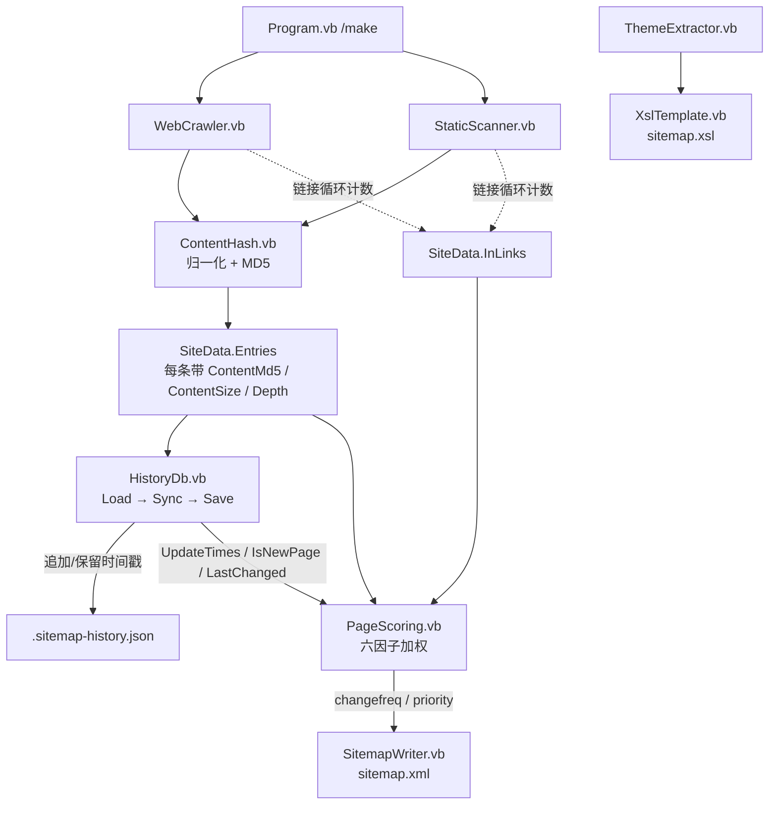

## 产品概述

为 `Sitemap\Sitemap.vbproj` 的 `/make` 命令增加一套基于 JSON 的页面历史数据库。工具在每次构建 sitemap 时对每个页面内容计算 MD5，连同扫描时刻的 Unix 时间戳写入 `.sitemap-history.json`；下次构建通过比对 MD5 识别页面变更并把新时间戳追加进该 URL 的时间队列，进而由时间队列推导出真实的更新频率，并综合更新频率、访问深度、入链数、内容新鲜度、页面角色、内容体量六项因子计算出页面权重（priority），取代原先仅由深度线性递减的固定算法，最终输出信息量更真实、区分度更高的 `sitemap.xml`。

## 核心功能

- **页面内容指纹**：对每个页面计算 MD5。默认先做归一化（剔除 `<script>`、`<style>`、`<noscript>`、HTML 注释并折叠空白）再计算，避免脚本时间戳、计数器等无关变动造成"假更新"；提供 `--raw-md5` 开关切回原始 HTML 全文计算。
- **JSON 历史库**：结构严格为 `{ url: { md5, timestamp[] } }`。首次发现某 URL 写入 `{md5, timestamp:[now]}`；后续构建 MD5 不一致（内容变更）则追加 `now`，一致则保持不变；时间戳队列只保留最近 N 次（默认 32，可用 `--history` 调整）；本次扫描未出现的 URL 仍保留在库中不删除，便于站点改版后恢复统计。文件存放于 `--out` 目录，文件名为 `.sitemap-history.json`（小数点起始，Linux 下隐藏），采用"临时文件 + 原子替换"写入。
- **更新频率推导**：由该 URL 时间队列中相邻时间戳的平均间隔映射为 sitemap 协议的 changefreq（≤1h→hourly、≤1d→daily、≤7d→weekly、≤30d→monthly、≤365d→yearly，否则 never），并换算为连续的频率得分参与加权。
- **六因子综合权重**：depth（访问深度）0.30、freq（更新频率）0.22、in-links（站内入链数）0.22、recency（内容新鲜度）0.12、role（页面角色：首页/目录索引页/一级页）0.09、size（内容体量）0.05。入链数与体量在站内做对数相对归一化，频率与新鲜度做对数/指数衰减映射，最终 priority 按站内最高分锚定归一化到 [0.1, 1.0]（站内最优页为 1.0，与原有"首页=1.0"行为保持一致）。
- **新旧页面分流**：有历史数据（时间戳 ≥2）的页面使用计算得出的 changefreq 与 priority；无历史的新页面 changefreq 回退到 `--changefreq` 参数，priority 仍用完整模型但频率取中性值 0.6、新鲜度取 1.0，即退化为"深度 + 入链 + 角色 + 体量"的加权。
- **构建报告**：`/make` 结束后额外输出本次新增页面数、内容变更页面数、未变更页面数、库中累计 URL 数以及各 changefreq 档位的分布统计。

## 视觉效果

本需求为纯逻辑层增强，不涉及新增或改版 UI。用户可见的变化是 `sitemap.xml` 中 `<changefreq>` 与 `<priority>` 取值由真实历史数据驱动、区分度显著提升；由 `sitemap.xsl` 渲染的地图页中"Frequency"列与优先级进度条将呈现多档位、非均匀的分布，而非原先全站清一色的 `weekly`。

## 技术栈

- 语言/框架：VB.NET，`net10.0`，控制台应用（沿用现有 `Sitemap.vbproj` 配置，不新增任何 ProjectReference）
- JSON 序列化：**`System.Text.Json`**（属于 `Microsoft.NETCore.App` 共享框架，无需 PackageReference）。不引入 sciBASIC# 的 `Microsoft.VisualBasic.MIME.application.json` 独立工程，避免为一条依赖新增 ProjectReference 与随之而来的传递依赖
- MD5：`System.Security.Cryptography.MD5.HashData(Encoding.UTF8.GetBytes(text))`（net10.0 静态方法，无静态实例、无资源泄漏）
- 时间戳：`DateTimeOffset.UtcNow.ToUnixTimeSeconds()`
- 归一化：复用 `System.Text.RegularExpressions.Regex`（注意：局部变量不得命名为 `regex`，否则会遮蔽该类型）

## 实现方案

### 总体策略

在现有「采集 → 规范化 → 主题分析 → 双文件输出」管道中插入两个新阶段，形成「采集（同时采集哈希与入链）→ 历史库同步 → 综合评分 → 输出 XML/XSL → 落盘历史库」五段式流程。评分逻辑与历史库读写各自独立成模块，采集器只负责"填数据"不负责"算分"，保证 HTTP 爬取与本地扫描两条路径行为完全一致。

### 关键技术决策

1. **MD5 在采集器内即时计算、不驻留 HTML**：采集器读完/下载完页面后立刻算出 MD5 与内容长度，随即丢弃 HTML 字符串。避免 1900+ 个页面的全文常驻内存（站点约 50MB 文本），内存占用维持 O(1) 增量。
2. **入链数在链接过滤循环内统计**：在两个采集器遍历 `HtmlHelper.GetLinks` 的循环中，对"已通过站内判定 + 静态页判定 + 排除规则"的 URL 计数，且计数发生在 `visited.Add` 之前——同一页面被多处引用应重复计数，这是 PageRank 思路中最有效的信号。
3. **归一化优先于原文**：真实静态站点的 HTML 常含构建时间戳、随机 token、脚本片段，直接对原文算 MD5 会导致全站每次构建都"已更新"，历史库完全失效。故默认归一化，同时保留 `--raw-md5` 开关满足原始需求描述。
4. **priority 按站内最高分锚定而非 min-max**：`priority = clamp(0.1, 1.0, 0.1 + 0.9 * raw / maxRaw)`。若用 min-max 归一化，1900 个低价值 vignettes 文档页会被铺满 [0.1, 1.0]，大量无关页面获得 0.9+ 的高优先级，对搜索引擎是错误信号；按最高分锚定则既保证站内最优页为 1.0（延续原有行为），又让低分页面落到合理低位。
5. **原子化写入历史库**：先写 `.sitemap-history.json.tmp` 再 `File.Move(..., overwrite:=True)` 替换，避免写入中断产生半截 JSON 导致历史全丢；反序列化失败时输出告警并以空库继续，不中断整个构建流程。
6. **确定性输出**：写入前按 URL 字典序排序键，保证同一份数据每次生成的 JSON 文件字节一致，便于版本库 diff 与人工排查。

### 实现细节（执行要点）

- **MD5 归一化管线**：依次移除 HTML 注释 `<!--...-->`、`<script>...</script>`、`<style>...</style>`、`<noscript>...</noscript>`，再把连续空白折叠为单个空格并 Trim，最后对 UTF-8 字节算 MD5，输出 32 位小写十六进制。
- **评分子分映射**（均归一到 [0,1]）：
- depth：`1/(1+0.6*depth)`
- freq：由平均间隔 Δ(天) 得 `(2.863 - log10(Δ))/4.261` 并截断；无间隔数据（仅 1 个时间戳）取中性值 0.6
- in-links：`log(1+x)/log(1+maxInLinks)`，`maxInLinks` 为站内最大值（下限取 1 防除零）
- recency：`exp(-距上次变更天数/180)`；新页面取 1.0
- role：首页 1.0、非首页的目录 index 页 0.6、根级普通页 0.3、其余 0
- size：`log(1+bytes)/log(1+maxBytes)`
- **首页/目录页识别**：URL 路径为 `/`、`/index.html`、`/index.htm`、`/default.html` 且位于站点根即首页；文件名属于索引名集合且深度 > 0 即目录索引页；深度 0 的非首页即根级页。
- **风险点——VB 属性数量**：`/make` 当前已有 15 个特性（ExportAPI/Description/Usage + 12 个 Argument），本次新增 `--history`、`--raw-md5` 两个后为 17 个。此前堆到 23 个时 VB 编译器会把 `<Argument(` 误判为 XML 字面量（BC31151/BC30636）。**新增后必须立刻编译验证**；若再次触发，则把两个新开关合并进现有 `--theme` 那种"一个 Argument 描述多个开关"的写法。
- **风险点——VB 大小写不敏感**：新增代码中的局部变量/参数不得命名为 `file`、`path`、`regex`、`md5`（`md5` 会遮蔽 MD5 类型名）；`System.IO.Path`/`System.IO.File` 一律全限定调用。
- **性能**：1926 个页面的归一化正则 + MD5 预计在 1 秒内完成，仍远低于原有 I/O 耗时；评分阶段为 O(n) 两趟扫描（先求站内最大值，再算分），无 N+1 与重复遍历；json 库约 1926 条记录、单文件数百 KB，读写开销可忽略。
- **兼容性**：`UrlEntry.PriorityOf(depth)` 保留不删，作为文档化的兜底算法；`SitemapWriter` 无需改动（本就读取 `ChangeFreq`/`Priority`）；`/xsl`、`/theme` 命令不接入历史库，行为不变。
- **回归边界**：不修改 sciBASIC# 下任何源码，改动全部限定在 `Sitemap\` 目录内。

## 架构设计



**模块职责**

- `ContentHash.vb`：HTML 归一化与 MD5 指纹计算
- `HistoryDb.vb`：`.sitemap-history.json` 的加载、MD5 比对与时间戳同步、原子化落盘、统计信息
- `PageScoring.vb`：六因子归一化与加权，输出 changefreq 与 priority
- `UrlEntry.vb` / `SiteData.vb`：承载新增的指纹、入链、时间等数据
- `WebCrawler.vb` / `StaticScanner.vb`：在采集过程中填充哈希、体量与入链计数
- `Program.vb`：编排"历史库同步 → 评分 → 输出"，新增 CLI 开关与构建报告

## 目录结构

```
g:\GCModeller\src\runtime\httpd\src\Sitemap\
├── ContentHash.vb        # [NEW] 页面内容指纹模块。
│                         #   Normalize(html)：依次剔除 HTML 注释、<script>、<style>、<noscript>，
│                         #   折叠连续空白并 Trim。
│                         #   Compute(html, rawMd5)：rawMd5=False 时先归一化再算；
│                         #   返回 32 位小写十六进制 MD5。
│                         #   使用 MD5.HashData(Encoding.UTF8.GetBytes(...))，无静态实例。
├── HistoryDb.vb          # [NEW] JSON 历史数据库。
│                         #   PageRecord：md5 As String（<JsonPropertyName("md5")>）、
│                         #   timestamp As Long()（<JsonPropertyName("timestamp")>）。
│                         #   HistoryDb：Pages As Dictionary(Of String, PageRecord)。
│                         #   Load(path)：文件不存在返回空库；反序列化失败输出告警返回空库。
│                         #   Sync(entries, now, maxTimestamps)：逐条比对 md5，变更则追加时间戳、
│                         #   新 URL 则建记录，队列超限时保留最近 maxTimestamps 项；
│                         #   回写 UrlEntry.UpdateTimes / IsNewPage / LastChanged，返回统计对象。
│                         #   Save(path)：键按 Ordinal 排序后缩进写入，
│                         #   先写 .tmp 再 File.Move 原子替换。
│                         #   序列化选项：WriteIndented=True、
│                         #   Encoder=JavaScriptEncoder.UnsafeRelaxedJsonEscaping（避免 URL 中 / & 被转义）。
├── PageScoring.vb        # [NEW] 综合评分引擎。
│                         #   ScoreWeights：depth 0.30 / freq 0.22 / inLinks 0.22 /
│                         #   recency 0.12 / role 0.09 / size 0.05。
│                         #   Apply(data, defaultChangeFreq)：两趟扫描——
│                         #   第一趟求站内 maxInLinks / maxSize 与每页子分，
│                         #   第二趟按站内最高分锚定归一化 priority 到 [0.1,1.0]，
│                         #   并按平均间隔映射 changefreq；无历史的新页面
│                         #   changefreq 取 defaultChangeFreq、freq 取 0.6、recency 取 1.0。
│                         #   RoleOf(loc, baseUrl, depth)：首页 1.0 / 目录索引 0.6 /
│                         #   根级页 0.3 / 其余 0。
├── UrlEntry.vb           # [MODIFY] 新增属性：ContentMd5（页面指纹）、ContentSize（HTML 字节数）、
│                         #   InLinks（站内入链数）、Role（页面角色分）、
│                         #   UpdateTimes（Long()，来自历史库的时间戳队列）、
│                         #   LastChanged（最近一次变更的 Unix 时间戳）、
│                         #   IsNewPage（历史库中是否首次出现）。
│                         #   保留既有 PriorityOf / DepthOf / LastModOf 不动。
├── SiteData.vb           # [MODIFY] 新增 InLinks As Dictionary(Of String, Integer) 用于跨采集器
│                         #   累计入链数；新增 InLinkCountOf(loc) 读取辅助函数。
├── WebCrawler.vb         # [MODIFY] 在 Crawl 内：下载 html 后调用 ContentHash.Compute 写入
│                         #   .ContentMd5 与 .ContentSize；在链接遍历循环中，对通过
│                         #   IsInSite / IsStaticPage / IsExcluded 校验的 url 先
│                         #   result.InLinks(url) += 1 再做 visited.Add，使重复引用计入。
├── StaticScanner.vb      # [MODIFY] 同样改造主扫描循环；并把孤立页补录循环中的
│                         #   ReadText 结果复用于 ContentHash.Compute（避免重复读文件）。
│                         #   注意把 siteUrl 的计算提前到 visited.Add 之前以便计入入链。
├── Program.vb            # [MODIFY] /make 流程中，在 LoadSite 之后、SitemapWriter.Build 之前插入
│                         #   HistoryDb.Load(dbPath) → Sync → PageScoring.Apply，
│                         #   在写出 xml/xsl 之后执行 db.Save(dbPath)。
│                         #   新增两个 Argument：--history（时间戳队列上限，默认 32）、
│                         #   --raw-md5（布尔开关，使用原始 HTML 计算指纹）；
│                         #   常量 HistoryDbName = ".sitemap-history.json"。
│                         #   结束后输出新增/变更/未变更/库内总数与 changefreq 分布。
└── SitemapWriter.vb      # [不改动] 已读取 UrlEntry.ChangeFreq 与 Priority，评分结果自动生效。
```

## 关键代码结构

```
' HistoryDb.vb —— JSON 历史库的记录模型与文件结构
' 磁盘形态严格为：{ "url": { "md5": "...", "timestamp": [1756540800, ...] } }
Public Class PageRecord
    <JsonPropertyName("md5")> Public Property Md5 As String
    <JsonPropertyName("timestamp")> Public Property Timestamp As Long()
End Class

Public Class HistoryDb
    Public Property Pages As Dictionary(Of String, PageRecord)

    Public Shared Function Load(path As String) As HistoryDb
    ''' 比对 md5：变更则追加时间戳，新 URL 则建记录；队列保留最近 maxTimestamps 项；
    ''' 同时把时间戳队列、最近变更时间、是否新页面回写到 UrlEntry 上
    Public Function Sync(entries As IEnumerable(Of UrlEntry),
                         now As Long,
                         maxTimestamps As Integer) As HistoryStats
    Public Function Save(path As String) As Boolean   ' 临时文件 + 原子替换
End Class

' PageScoring.vb —— 综合评分输入/输出约定
Public Class ScoreWeights
    Public Property Depth As Double = 0.30
    Public Property Freq As Double = 0.22
    Public Property InLinks As Double = 0.22
    Public Property Recency As Double = 0.12
    Public Property Role As Double = 0.09
    Public Property Size As Double = 0.05
End Class

' UrlEntry.vb —— 本次新增的评分输入字段
Public Class UrlEntry
    ' ... 既有 Loc / LastMod / ChangeFreq / Priority / Depth / Title / LocalFile 保留 ...
    Public Property ContentMd5 As String      ' 页面内容指纹（归一化或原文）
    Public Property ContentSize As Integer    ' 页面 HTML 字节数
    Public Property InLinks As Integer        ' 站内入链数
    Public Property Role As Double            ' 页面角色分 [0,1]
    Public Property UpdateTimes As Long()     ' 来自历史库的变更时间戳队列
    Public Property LastChanged As Long       ' 最近一次内容变更的 Unix 时间戳
    Public Property IsNewPage As Boolean      ' 历史库中首次出现
End Class
```

## Agent Extensions

### Skill

- **lsp-code-analysis**
- Purpose：改造 `UrlEntry`/`SiteData` 模型与两个采集器后，用其做符号级检查（查找定义、查引用、调用层级），核对 `ContentMd5`、`InLinks`、`UpdateTimes` 等新增属性在 `ContentHash.vb`、`HistoryDb.vb`、`PageScoring.vb`、`WebCrawler.vb`、`StaticScanner.vb`、`Program.vb` 中的引用一致性，确认没有在 `StaticScanner` 孤立页循环等路径上漏填字段
- Expected outcome：编译前定位未定义符号、签名不匹配与漏改的赋值点，避免为排查引用遗漏反复编译