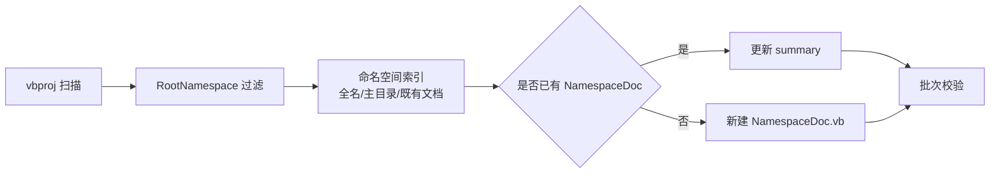

## 需求概述

扫描 `sciBASIC#` 工作区下全部 `.vbproj` 项目，筛选出 `RootNamespace` 以 `Microsoft.VisualBasic` 为前缀的 95 个项目；针对这些项目，依据其源码内容，为其中每一个独立命名空间新增或更新 `NamespaceDoc.vb` 文件，并在名为 `NamespaceDoc` 的类型上补充 `''' <summary>` XML 注释，用于概括该命名空间内代码的功能。

## 核心功能

- 项目筛选：递归扫描工作区 211 个 `.vbproj`，按 `RootNamespace` 前缀过滤，得到 95 个目标项目。
- 命名空间枚举：以源码中实际的 `Namespace X` 声明为准（叠加项目 `RootNamespace` 得到全名），覆盖根命名空间与所有子命名空间；无声明的源码文件归属根命名空间。
- 文件定位与新增：命名空间缺少文档时，在其主文件夹下创建 `NamespaceDoc.vb`（子命名空间用 `Namespace X` 块 + `Module NamespaceDoc`；根命名空间用无 `Namespace` 块的 `Friend Class NamespaceDoc`）。
- 既有文件更新：`NamespaceDoc.vb` 已存在时，仅补充/改写 `<summary>` 文本；若已存在 `NamespaceDoc` 类型则更新其注释，若文件内容为工具类则在同一命名空间块内追加 `NamespaceDoc` 类型。
- 注释内容：依据该命名空间下的类型、成员、既有 XML 注释以及项目 `Title`/`Description` 元数据，撰写简洁的英文总结描述。
- 保真约束：既有文件头部的自动生成统计区块（`#Region` 版权与统计）原样保留；新建文件不含该区块。

## 交付方式与边界

- 按顶层目录分批交付，由小到大推进，先以小批次确定模板风格再批量推广。
- 排除 `bin`、`obj`、`My Project` 目录，以及嵌套的非匹配项目源码。
- 不修改任何代码逻辑，仅新增/补充 XML 文档注释。

## 技术栈

- 目标代码库：VB.NET（SDK 风格 `.vbproj`，`GenerateDocumentationFile=True`），沿用既有 XML 文档注释约定与 NDoc 式 `NamespaceDoc` 约定。
- 源码分析：PowerShell（`Select-String` 正则）做项目与命名空间索引；语义结构分析优先使用 LSP 能力，失败时回退到正则扫描。
- 文件产出：纯文本 `.vb` 文件写入，新建文件使用 UTF-8；不引入任何新依赖、不改动构建配置。
- 无需编译/打包；仅在确有必要时用 `Select-String` 做校验。

## 实现方案

1. **建立索引**：遍历 95 个匹配项目，读取 `<RootNamespace>`、`<Title>`、`<Description>`；对每个项目枚举其源码文件（排除 `bin/obj/My Project` 及其他嵌套项目目录），提取 `Namespace X` 声明，构建「全名命名空间 → 主文件夹 → 是否已有 NamespaceDoc 类型」的映射清单。
2. **命名空间归一化**：完整命名空间 = `RootNamespace` + "." + 声明的 `Namespace`（无声明即根命名空间）。注意文件夹名与命名空间段并非总是一致（如 `ApplicationServices/VBDev/XmlDoc/Serialization` 实为 `ApplicationServices.Development.XmlDoc.Serialization`），因此**必须以声明的命名空间段为准**，文件夹仅用于确定放置位置。
3. **放置规则**：选择该命名空间下文件数量最多的目录作为 `NamespaceDoc.vb` 的目标目录；根命名空间放在项目根目录。
4. **生成策略**：若目标位置无 `NamespaceDoc.vb` 则新建（模板见「关键代码结构」）；若已存在且含 `NamespaceDoc` 类型，则仅改写其 `<summary>`；若已存在但无 `NamespaceDoc` 类型（工具类），在不破坏原有代码的前提下，于同一 `Namespace` 块内追加 `NamespaceDoc` 类型。
5. **描述文本生成**：汇总该命名空间范围内类型的名称、公开成员名与既有 XML 注释，并参考项目 `Title`/`Description`，产出 1-3 句英文功能概述。
6. **校验**：每批次完成后，用 `Select-String` 检查目标命名空间是否均已存在 `NamespaceDoc` 类型，且文件可正常解析（无重复类型名）。

## 关键技术决策

- **以声明而非目录推导命名空间**：避免 `VBDev`→`Development` 之类的路径/命名空间错配导致文档挂到错误命名空间。
- **追加而非覆盖既有文件**：`NamespaceDoc.vb` 文件名不可靠（存在 `NamespaceDocExtensions` 工具类），整文件覆盖会破坏功能代码。
- **保留既有头部区块**：头部为外部工具生成的统计信息，重新生成既无意义也可能引入不一致。
- **按目录分批**：单批可验证、可回滚，降低数百文件规模的 blast radius。

## 性能与可靠性

- 索引阶段按项目目录递归扫描（`Select-String` 单次遍历），复杂度约 O(文件数)；全仓库约 5380 个 `.vb` 文件，可接受。
- 每批次独立完成，批次之间无共享状态，异常可局部重做。

## 架构设计



## 目录结构（影响范围）

说明：本次不新增模块，改动分布在 95 个项目目录内，主要为新增/修改名为 `NamespaceDoc.vb` 的文件。代表性清单如下：

sciBASIC#/
├── nlp/, www/, cuda/                      # [MODIFY] 批次一：为各匹配项目新增/更新 NamespaceDoc.vb
├── mime/                                  # [MODIFY] 批次三：10 个 MIME 项目的各命名空间文档
├── vs_solutions/                          # [MODIFY] 批次二：VisualStudio / vs_PDB 项目文档
├── Data/                                  # [MODIFY] 批次四：BinaryData、DataFrame、GraphQuery、Trinity 等 13 个项目
├── gr/                                    # [MODIFY] 批次五：Imaging、network-visualization、physics 等 10 个项目
├── Microsoft.VisualBasic.Core/src/        # [MODIFY] 批次六：约 141 个命名空间文档（体量最大）
│   ├── NamespaceDoc.vb                    # [MODIFY] 根命名空间 summary
│   └── <子目录>/NamespaceDoc.vb            # [NEW/MODIFY] 各子命名空间文档
└── Data_science/                          # [MODIFY] 批次七：DataMining、MachineLearning、Mathematica、Visualization 等 53 个项目

## 关键代码结构

新建文件模板（子命名空间）：

```
Namespace X.Y

    ''' <summary>
    ''' <English summary describing the functionality of the code in this namespace>
    ''' </summary>
    Module NamespaceDoc
    End Module
End Namespace
```

新建文件模板（项目根命名空间）：

```
''' <summary>
''' <English summary describing the functionality of this namespace>
''' </summary>
Friend Class NamespaceDoc
End Class
```

## 实施注意事项

- 既有 `NamespaceDoc.vb` 的 `#Region "Microsoft.VisualBasic::<hash>..."` 区块一律原样保留，只允许改动 `''' <summary>` 内容。
- `Microsoft.VisualBasic.Core/src/ApplicationServices/VBDev/XmlDoc/Serialization/NamespaceDoc.vb` 为工具类（`NamespaceDocExtensions`），只能追加 `NamespaceDoc` 类型，禁止覆盖。
- 同一命名空间内只允许存在一个名为 `NamespaceDoc` 的类型，避免 summary 被合并或类型重名冲突。
- `Namespace X` 声明为「相对 RootNamespace」写法，切勿写成完整命名空间，否则会重复前缀。
- 排除 `bin/obj/My Project` 与非匹配项目的源码，避免把不相关命名空间纳入统计。
- 每批次完成后做一次校验；如发现描述不准确，仅调整 summary 文本，不影响其他文件。

## Agent Extensions

### SubAgent

- **code-explorer**
- Purpose: 在单个批次内跨目录/跨模式快速定位目标项目的源码分布与命名空间构成。
- Expected outcome: 产出每批次的「命名空间 → 主目录 → 既有 NamespaceDoc」清单，作为生成文档的可靠输入。

### Skill

- **lsp-code-analysis**
- Purpose: 借助 LSP 获取文件/符号结构（类型、成员、概要），用于撰写准确的命名空间 summary。
- Expected outcome: 为各命名空间输出可读的类型与成员摘要；若 LSP 不支持 VB.NET，则回退到源码正则与既有 XML 注释分析。