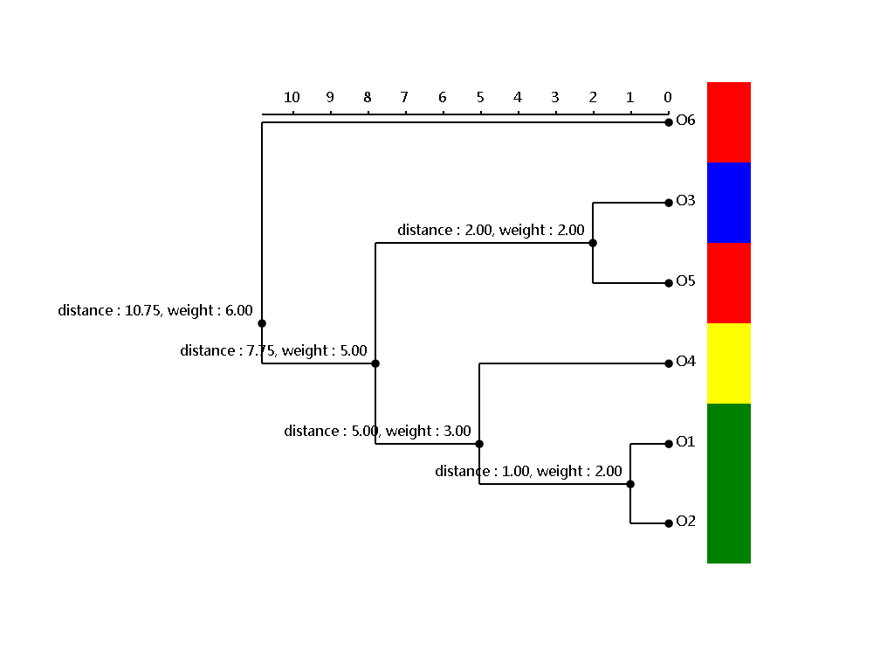

Hierarchical Clustering
=======================

> Imports from https://github.com/lbehnke/hierarchical-clustering-java

Implementation of an agglomerative hierarchical clustering algorithm in Java. Different linkage approaches are supported:
* Average Linkage
* Single Linkage
* Complete Linkage

OTU classification approaches
hierarchical clustering algorithms (HCA): uclust & cd-hit & ESPRIT

What you put in
---------------

Pass a distance matrix and a cluster name array along with a linkage strategy to the clustering algorithm:

```vbnet
Dim distances = {
    { 0,  1, 9,  7, 11, 14},
    { 1,  0, 4,  3,  8, 10},
    { 9,  4, 0,  9,  2,  8},
    { 7,  3, 9,  0,  6, 13},
    {11,  8, 2,  6,  0, 10},
    {14, 10, 8, 13, 10,  0}
}
Dim names$() = {"O1", "O2", "O3", "O4", "O5", "O6"}
Dim alg As ClusteringAlgorithm = New DefaultClusteringAlgorithm
Dim cluster As Cluster = alg.performClustering(
    distances.RowIterator.ToArray,
    names,
    New AverageLinkageStrategy)

Call cluster.Print
```

Alternatively, you can pass a [pdist](http://www.mathworks.com/help/stats/pdist.html)-like matrix containing one row:

```vbnet
Dim names$() = { "O1", "O2", "O3", "O4", "O5", "O6" }
Dim pdist = {
    {1, 9, 7, 11 ,14 ,4 ,3 ,8 ,10 ,9 ,2 ,8 ,6 ,13 ,10}
}
Dim alg As ClusteringAlgorithm = New PDistClusteringAlgorithm()
Dim cluster = alg.performClustering(pdist, names, New AverageLinkageStrategy())
```

What you get out
----------------

The algorithm creates a **Cluster** instance representing an hierachy of cluster nodes based on their distances.
You may want to visualize the result using the gdi+ component ``DendrogramPanel``:

```vbnet
Dim cluster As Cluster = createSampleCluster()
Dim dp As New DendrogramPanel With {
    .LineColor = Color.Black,
    .ScaleValueDecimals = 0,
    .ScaleValueInterval = 1,
    .Model = cluster
}

Dim g As Graphics2D = New Size(1024, 768).CreateGDIDevice(filled:=Color.White)
Call dp.paint(g)
Call g.Save("../../../test.png", ImageFormats.Png)
```

###### Example output

