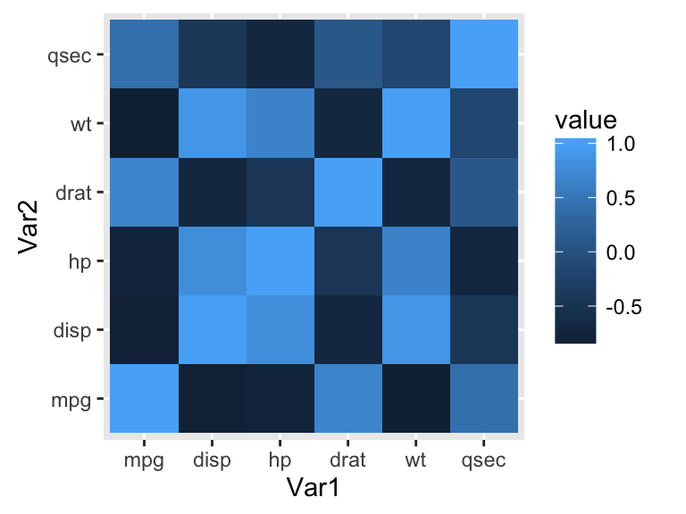
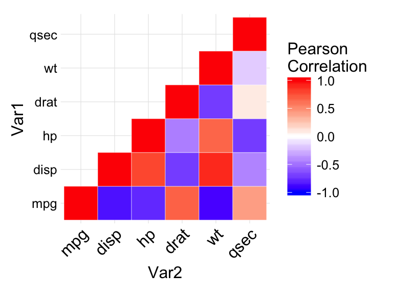
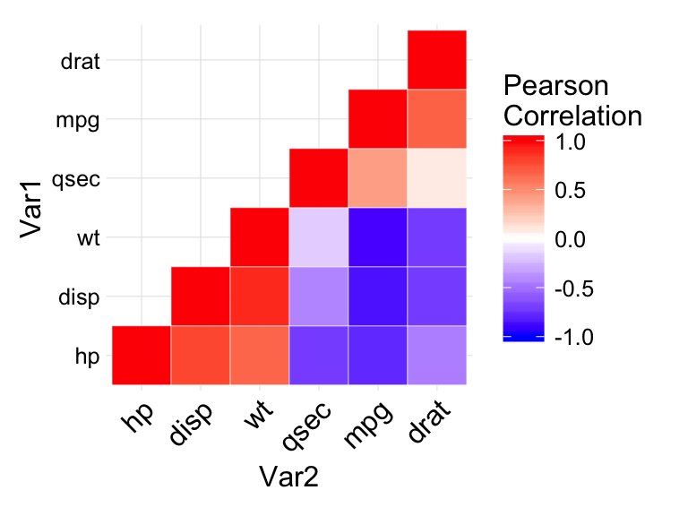

# ggplot2 : Quick correlation matrix heatmap - R software and data visualization

This R tutorial describes how to compute and visualize a correlation matrix using R software and ggplot2 package.

> http://www.sthda.com/english/wiki/print.php?id=191

## Prepare the data

``mtcars`` data are used :

```R
mydata <- mtcars[, c(1,3,4,5,6,7)]
head(mydata)
##                    mpg disp  hp drat    wt  qsec
## Mazda RX4         21.0  160 110 3.90 2.620 16.46
## Mazda RX4 Wag     21.0  160 110 3.90 2.875 17.02
## Datsun 710        22.8  108  93 3.85 2.320 18.61
## Hornet 4 Drive    21.4  258 110 3.08 3.215 19.44
## Hornet Sportabout 18.7  360 175 3.15 3.440 17.02
## Valiant           18.1  225 105 2.76 3.460 20.22
```

## Compute the correlation matrix

Correlation matrix can be created using the R function cor() :

```R
cormat <- round(cor(mydata),2)
head(cormat)
##        mpg  disp    hp  drat    wt  qsec
## mpg   1.00 -0.85 -0.78  0.68 -0.87  0.42
## disp -0.85  1.00  0.79 -0.71  0.89 -0.43
## hp   -0.78  0.79  1.00 -0.45  0.66 -0.71
## drat  0.68 -0.71 -0.45  1.00 -0.71  0.09
## wt   -0.87  0.89  0.66 -0.71  1.00 -0.17
## qsec  0.42 -0.43 -0.71  0.09 -0.17  1.00
```

Read more about correlation matrix data visualization : [correlation data visualization in R](http://www.sthda.com/english/wiki/correlation-matrix-a-quick-start-guide-to-analyze-format-and-visualize-a-correlation-matrix-using-r-software)

## Create the correlation heatmap with ggplot2

The package reshape is required to melt the correlation matrix :

```R
library(reshape2)
melted_cormat <- melt(cormat)
head(melted_cormat)
##   Var1 Var2 value
## 1  mpg  mpg  1.00
## 2 disp  mpg -0.85
## 3   hp  mpg -0.78
## 4 drat  mpg  0.68
## 5   wt  mpg -0.87
## 6 qsec  mpg  0.42
```

The function geom_tile()[ggplot2 package] is used to visualize the correlation matrix :

```R
library(ggplot2)
ggplot(data = melted_cormat, aes(x=Var1, y=Var2, fill=value)) +
  geom_tile()
```



The default plot is very ugly. We’ll see in the next sections, how to change the appearance of the heatmap.
Note that, if you have lot of data, it’s preferred to use the function geom_raster() which can be much faster.

## Get the lower and upper triangles of the correlation matrix

Note that, a correlation matrix has redundant information. We’ll use the functions below to set half of it to NA.

Helper functions :

```R
# Get lower triangle of the correlation matrix
  get_lower_tri<-function(cormat){
    cormat[upper.tri(cormat)] <- NA
    return(cormat)
  }

  # Get upper triangle of the correlation matrix
  get_upper_tri <- function(cormat){
    cormat[lower.tri(cormat)]<- NA
    return(cormat)
  }
```

Usage :

```R
upper_tri <- get_upper_tri(cormat)
upper_tri
##      mpg  disp    hp  drat    wt  qsec
## mpg    1 -0.85 -0.78  0.68 -0.87  0.42
## disp  NA  1.00  0.79 -0.71  0.89 -0.43
## hp    NA    NA  1.00 -0.45  0.66 -0.71
## drat  NA    NA    NA  1.00 -0.71  0.09
## wt    NA    NA    NA    NA  1.00 -0.17
## qsec  NA    NA    NA    NA    NA  1.00
```

## Finished correlation matrix heatmap

Melt the correlation data and drop the rows with NA values :

```R
# Melt the correlation matrix
library(reshape2)
melted_cormat <- melt(upper_tri, na.rm = TRUE)

# Heatmap
library(ggplot2)
ggplot(data = melted_cormat, aes(Var2, Var1, fill = value))+
 geom_tile(color = "white")+
 scale_fill_gradient2(low = "blue", high = "red", mid = "white", 
   midpoint = 0, limit = c(-1,1), space = "Lab", 
   name="Pearson\nCorrelation") +
  theme_minimal()+ 
 theme(axis.text.x = element_text(angle = 45, vjust = 1, 
    size = 12, hjust = 1))+
 coord_fixed()
```



In the figure above :

+ **negative correlations** are in blue color and positive correlations in red. The function ``scale_fill_gradient2`` is used with the argument ``limit = c(-1,1)`` as correlation coefficients range from -1 to 1.
+ ``coord_fixed()`` : this function ensures that one unit on the x-axis is the same length as one unit on the y-axis.

## Reorder the correlation matrix

This section describes how to reorder the correlation matrix according to the correlation coefficient. This is useful to identify the hidden pattern in the matrix. hclust for hierarchical clustering order is used in the example below.

Helper function to reorder the correlation matrix :

```R
reorder_cormat <- function(cormat){
# Use correlation between variables as distance
dd <- as.dist((1-cormat)/2)
hc <- hclust(dd)
cormat <-cormat[hc$order, hc$order]
}
```

Reordered correlation data visualization :

```R
# Reorder the correlation matrix
cormat <- reorder_cormat(cormat)
upper_tri <- get_upper_tri(cormat)

# Melt the correlation matrix
melted_cormat <- melt(upper_tri, na.rm = TRUE)

# Create a ggheatmap
ggheatmap <- ggplot(melted_cormat, aes(Var2, Var1, fill = value))+
 geom_tile(color = "white")+
 scale_fill_gradient2(low = "blue", high = "red", mid = "white", 
   midpoint = 0, limit = c(-1,1), space = "Lab", 
    name="Pearson\nCorrelation") +
  theme_minimal()+ # minimal theme
 theme(axis.text.x = element_text(angle = 45, vjust = 1, 
    size = 12, hjust = 1))+
 coord_fixed()

# Print the heatmap
print(ggheatmap)
```



## Add correlation coefficients on the heatmap

+ Use geom_text() to add the correlation coefficients on the graph
+ Use a blank theme (remove axis labels, panel grids and background, and axis ticks)
+ Use guides() to change the position of the legend title

```R
ggheatmap +
geom_text(aes(Var2, Var1, label = value), color = "black", size = 4) +
theme(
  axis.title.x = element_blank(),
  axis.title.y = element_blank(),
  panel.grid.major = element_blank(),
  panel.border = element_blank(),
  panel.background = element_blank(),
  axis.ticks = element_blank(),
  legend.justification = c(1, 0),
  legend.position = c(0.6, 0.7),
  legend.direction = "horizontal")+
  guides(fill = guide_colorbar(barwidth = 7, barheight = 1,
                title.position = "top", title.hjust = 0.5))
```


Read more about correlation matrix data visualization : [correlation data visualization in R](http://www.sthda.com/english/wiki/correlation-matrix-a-quick-start-guide-to-analyze-format-and-visualize-a-correlation-matrix-using-r-software)

## Infos

This analysis has been performed using R software (ver. 3.2.1) and ggplot2 (ver. 1.0.1)
