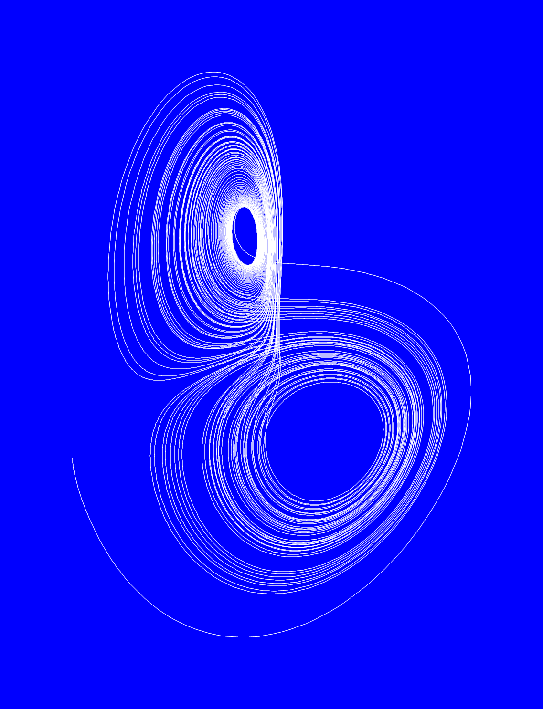

I would like to introducing how to solving an ODEs dynamics system in VisualBasic

## Code Usage

### Create VisualBasic Variable

```vbnet
Dim x, y, z As var
```

```vbnet
''' <summary>
''' Create VisualBasic variables
''' </summary>
''' <param name="list"></param>
''' <returns></returns>
<Extension> Public Function Let$(list As Expression(Of Func(Of var())))
    Dim unaryExpression As NewArrayExpression = DirectCast(list.Body, NewArrayExpression)
    Dim arrayData = unaryExpression _
        .Expressions _
        .Select(Function(b) DirectCast(b, BinaryExpression)) _
        .ToArray
    Dim var As New Dictionary(Of String, Double)

    For Each expr As BinaryExpression In arrayData
        Dim member = DirectCast(expr.Left, MemberExpression)
        Dim name As String = member.Member.Name.Replace("$VB$Local_", "")
        Dim field As FieldInfo = DirectCast(member.Member, FieldInfo)
        Dim value As Object = DirectCast(expr.Right, ConstantExpression).Value
        Dim obj = DirectCast(member.Expression, ConstantExpression).Value

        Call field.SetValue(obj, New var(name, CDbl(value)))
    Next

    Return var.GetJson
End Function
```


### ODEs solver

## DEMO: Solving Lorenz_system

In VisualBasic, that you can using the ODEs script for solving the dynamics system simulation problem, example for the ``Lorenz_system``:

```vbnet
Dim x, y, z As var
Dim sigma# = 10
Dim rho# = 28
Dim beta# = 8 / 3
Dim t = (a:=0, b:=120, dt:=0.005)

Call Let$(list:=Function() {x = 1, y = 1, z = 1})
Call {
    x = Function() sigma * (y - x),
    y = Function() x * (rho - z) - y,
    z = Function() x * y - beta * z
}.Solve(dt:=t) _
 .DataFrame _
 .Save($"{App.HOME}/Lorenz_system.csv")
```

And then plot this result in 3D, that we can get such image output:

