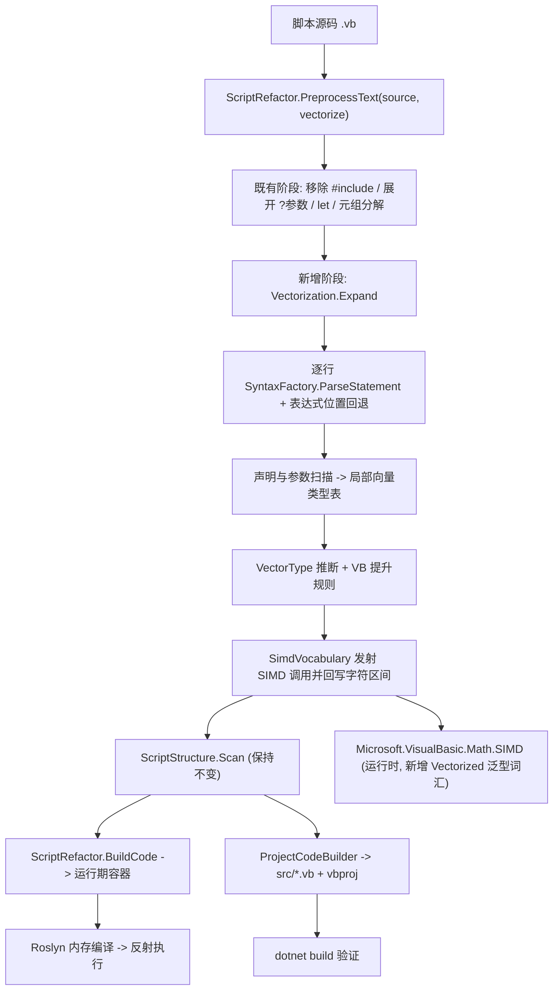

## Product Overview

为 `VBS` 的 VB.NET 脚本宿主引擎引入「向量化计算」能力：脚本中声明的数值向量（如 `Integer()`/`Double()`/`Single()`）参与数学运算时，引擎在代码重构阶段自动把标量形式的表达式改写为等价的逐元素（向量化）调用，使脚本无需手写循环即可得到可编译、可执行的向量运算代码。改写结果同时作用于「直接运行脚本」与「转换为正式工程」两条输出路径。

## Core Features

- **数值向量识别**：从变量声明中判定数值向量，覆盖显式类型（`Dim x As Integer()`、`Dim x As Double(4) {}`）与数组字面量推断（`Dim x = {1, 2, 3, 4, 5}`）；顶层函数/方法的数组参数同样纳入识别。
- **向量算术表达式改写**：`x + 5`、`(x * y + 6) / (x + y)` 这类表达式被整体改写为等价的逐元素运算，且整棵表达式树一次性改写，无需脚本作者拆分临时变量。
- **类型持续传播**：改写产生的向量结果变量会被登记，后续语句继续参与向量化（如 `Dim z = (x * y + 6) / (x + y)` 之后 `z * 2` 同样被改写）。
- **完整运算覆盖**：二元算术（`+ - * / \ ^ Mod`）、一元取负、逐元素数学函数（平方根、指数、对数、绝对值、三角函数等）、聚合归约（求和、均值、最大/最小、乘积、计数）。
- **运行语义与标量 VB 完全一致**：逐元素运算遵循 VB 的类型提升规则，例如整数向量之间的 `/` 与 `^` 得到浮点结果，`\` 保持整型结果，`+ - * Mod` 取两者的公共数值类型，标量与向量混算时标量自动广播。
- **自动生效且可控**：默认对检测到的向量表达式自动改写；脚本头部可用 `#no-vectorize` 指令关闭，命令行可用 `--no-vectorize` 关闭，关闭后脚本保持原有语义与代码形态。
- **可观测**：调试模式下可输出改写前后的代码与改写点数量，便于脚本作者确认与排查。

## Visual / Interaction Effect

无图形界面。可见的差异是：调试模式控制台打印的「重构后代码」中，向量算术表达式由标量写法（原本无法编译）变为一行等价的逐元素调用；执行输出与手工书写循环的版本一致。

## 技术栈

- 宿主引擎：VB.NET / `net10.0`（`VBS/VBS.vbproj`，`RootNamespace=VBScriptHost`，`LangVersion=16`）——沿用现有工程，不引入新框架。
- 语法解析：`Microsoft.CodeAnalysis.VisualBasic` `5.9.0`（工程已有引用，直接复用 Roslyn 做语句/表达式解析，避免手写表达式解析器）。
- 向量化后端：`Microsoft.VisualBasic.Runtime` 程序集（工程已有的 `ProjectReference ..\..\Microsoft.VisualBasic.Core\src\Core.vbproj`）中的 `Microsoft.VisualBasic.Math.SIMD`（`SimdExtensions` / `SimdEngine` / `SimdMath` / `SimdReduce` / `SimdParallel`，底层 `System.Numerics.Vector` + AVX/FMA）。
- 文本工具：复用 `ScriptStructure.SplitTopLevel`、`TupleDestructuring.SplitLine/IndexOfComment` 等既有工具与 `__tupleN` 式的临时命名风格。

## 实现思路

### 总体策略

把向量化做成 `ScriptRefactor.PreprocessText` 中的一个**新预处理阶段**，位置在 `let` 展开与元组分解之后。因为 `PreprocessedCode` 是运行期（`ScriptRefactor.BuildCode`）与工程期（`ProjectCodeBuilder`）共用的中间产物，所以一处接入即可让 `vbs run.vb` 与 `vbs make-project` 自动保持一致，无需改动四阶段流水线的其余环节。

改写本身是「逐行 + Roslyn 表达式级」：对每一物理行用 `SyntaxFactory.ParseStatement` 取到语句语法树（失败则回退到有限的表达式位置提取），先登记本行声明的向量变量，再自底向上推断表达式类型，最后对**最外层向量表达式**发射等价的 SIMD 调用文本并按字符区间替换回原行。整个改写是纯文本变换，与既有预处理阶段同构。

### 关键决策与理由

1. **后端选用运行时既有 SIMD 能力（用户确认）**：改写目标为 `SimdAdd/SimdMultiply/SimdAddScalar/SimdDivide/...` 这类调用，直接走 `System.Numerics.Vector`，性能优于 LINQ 与手写 `For` 循环，并可自动享受 `SimdParallel` 在大规模数据（≥65536）上的分块并行。备选的 LINQ 方案会改变结果类型为 `IEnumerable(Of T)`，显式 `For` 方案无 SIMD 加速，均不采用。
2. **不修改 `SimdExtensions.vb`，改为新增一个泛型词汇模块**：现有 `SimdExtensions` 仅覆盖 `Double`（部分 `Single/Integer/Long/Short`），缺口包括 `Single` 的减法、全部整数的 `/`、全部类型的 `\`、`Mod`、`^`、标量版 `+ - *`、多数一元函数与整数归约。与其补 ~25 个具体重载，不如在 `Microsoft.VisualBasic.Core/src/Math/SIMD/Vectorized.vb` 新增 `Public Module Vectorized`，以**泛型**成员一次性覆盖全部数值类型，并在内部转调既有的 `SimdEngine`（真 SIMD，泛型 `Add/Subtract/Multiply/Divide/AddScalar/SubtractScalar/ScalarSubtract/MultiplyScalar`）与 `SimdMath`（`Abs/Negate/Square` 泛型）；`Mod`、`^`、三角函数、`Product` 等无内核可用的运算则退化为标量循环（与运行时既有 `Modulo`/`Exponent` 门面的实现水平一致），命名与语义统一。
这样做的收益：既有文件零改动（回归风险最低）、类型覆盖完整、改写器只需一套词汇表。
3. **改写器统一发射显式泛型实参（默认 `Double` 走短名）**：形如 `SimdAdd(Of Integer)(x, y)`。显式类型实参会让重载解析只保留泛型候选，从而彻底规避「新增泛型重载与既有 `Double` 具体重载产生二义性」的风险；仅在元素类型为 `Double` 时省略类型实参以保持可读性（VB 规范中非泛型候选优先于泛型候选）。这一决策列入验证清单。
4. **元素类型不一致时插入显式转换**：VB 对数组不存在隐式/显式的逐元素转换（`Short()` 不能赋给 `Integer()` 形参），因此新增 `SimdConvert(Of TIn, TOut)`，在提升类型与结果类型不同的一侧包一层转换，保证生成代码可编译且类型与 VB 语义一致。
5. **严格遵循 VB 逐元素语义（用户确认）**，由独立的类型提升模块表达：`+ - * Mod` 取公共数值类型（`Double > Single > Long > Integer > Short`）；`/` 与 `^` 一律提升为 `Double`；`\` 保持整型（`Integer`/`Long`）。该规则同时决定 `SimdConvert` 的插入位置。
6. **保守推断，宁可漏改不可改错**：不做完整语义分析（不解析 `#include` 程序集、不建 `SemanticModel`），只维护脚本自身声明的浅层类型表（变量声明 + 函数/方法参数）。任何一次推断不确定（未知标识符、下标访问 `x(0)`、成员访问、长度不匹配的字面量）都直接放弃改写该表达式。放弃改写等于保持原有行为（原本就编译不过），因此**不存在行为回归**。

### 表达式位置覆盖

主路径为整行 `ParseStatement`（覆盖 `Dim` 赋值、赋值语句、调用语句、`Return` 等）。对常见「表达式嵌在块关键字里」的行补一条有限回退：`If/ElseIf <expr> Then`、`While/Do While/Do Until <expr>`、`Select Case <expr>` —— 提取其中的表达式区域后走同一套表达式改写。其余情况（跨物理行的表达式续行、括号不配平的行）跳过并在 verbose 模式下列出，作为文档化的已知局限。

### 性能

- 改写发生在解析期，每行一次轻量 Roslyn 语句解析，整体 O(行数)，对启动耗时影响可忽略；`make-project` 路径同样只在生成源码时执行一次。
- 生成代码的运行期开销与脚本作者手写循环同级或更优：向量-向量运算走真 SIMD；`Mod`/`^`/三角等退化为标量循环；长度 ≥65536 时由 `SimdParallel` 自动分块并行。
- 已知代价：嵌套调用形式会为每个中间结果分配一个数组。运行时的 `SimdEngine.AddInPlace/SubtractInPlace/MultiplyInPlace` 已具备「就地计算、表达式融合」的扩展点，本次不改动，作为后续可选优化路径记录在文档中。

### 避免技术债

- 完全沿用既有预处理阶段的形态（一个模块、一个 `Expand` 入口）与命名约定，不引入新架构模式。
- `PreprocessText` 仅追加一个带默认值的可选参数，所有既有调用点行为不变。
- 运行时的改动为**纯新增**（新文件 + 新成员），不改动既有方法签名；被改写脚本对运行时的依赖仍是已经存在的 `Microsoft.VisualBasic.Runtime.dll` 引用，`make-project` 产出的工程文件不需要新增任何 `<Reference>`。

## 实施要点

- **导入注入**：在 `ScriptRefactor.DefaultImports()` 追加 `Imports Microsoft.VisualBasic.Math.SIMD`。`ProjectCodeBuilder.BuildProgram` 复用同一份 `DefaultImports()`，因此运行期与工程期两条路径自动一致（`BuildMagics` 有独立头部，不受影响）。
- **指令处理**：`#no-vectorize`/`#vectorize` 由向量化阶段自行识别并从文本中剔除；即使残留，`ScriptStructure.Scanner.HandleTopLevel` 对 `#` 开头行也会直接跳过，不会进入生成代码。
- **开关传递**：`Program.vb` 与 `MakeProject.Run` 各读取 `--no-vectorize`（`CommandLine.BuildFromArguments` 统一解析），向下传给 `VBScript.ParseScript`；该标志存入 `ScriptParseResult`，使 `ProjectCodeBuilder.BuildIncludedSources`（会再次调用 `PreprocessText` 处理被 `#include` 的脚本）能沿用同一开关，避免两条路径结论不一致。
- **声明行兼容性**：改写会为无 `As` 子句的向量声明注入显式类型（如 `Dim z As Double() = ...`）。需确认 `ProjectCodeBuilder` 的 `DeclLinePattern`/`DeclaratorPattern` 与 `ScriptStructure.DeclaredNamesOf` 对 `name As T() = expr` 仍然可正确取出变量名（已核对：`DeclaredNamesOf` 只取首个标识符，`DeclaratorPattern` 的 `typename` 组可容纳 `Double()`）。
- **日志与报告**：沿用现有 `--verbose` 通道（`ParseScript` 已在该模式下打印 `----- generated code -----`），向量化阶段额外输出「改写点数量」与「跳过行清单」，不打印脚本全文，避免日志膨胀。
- **爆炸半径控制**：不改动 `SimdExtensions.vb`、不改动 `DynamicDll.CompileScript`、不改动 `ScriptLoadContext`；被 `#include` 引入的脚本也会被同一阶段处理，但由于其被限制为仅含 `Imports` 与类型定义，实际命中面很小。

## 架构设计



## 目录结构

```
e:/codebuddy/GCModeller/src/runtime/sciBASIC#/
├── Microsoft.VisualBasic.Core/src/Math/SIMD/
│   └── Vectorized.vb                         # [NEW] 向量化运算的统一泛型词汇表(Public Module Vectorized)。
│                                             #   新增: 二元算术 SimdAdd/SimdSubtract/SimdMultiply/SimdDivide(Of T As Structure)、
│                                             #   标量版 SimdAddScalar/SimdSubtractScalar/SimdScalarSubtract/SimdMultiplyScalar(Of T)、
│                                             #   整除 SimdIntegerDivide、取余 SimdModulo/SimdModuloScalar/SimdScalarModulo、
│                                             #   幂 SimdPower/SimdPowerScalar、一元 SimdNegate/SimdAbs/SimdSquare、
│                                             #   任意函数逐元素 SimdMap(Of T)(v, Func(Of T,T)) 与 SimdZip(Of T)、
│                                             #   类型提升 SimdConvert(Of TIn, TOut)、
│                                             #   归约 SimdSum/SimdMean/SimdMin/SimdMax/SimdProduct/SimdCount(Of T)。
│                                             #   实现要求: 优先转调既有 SimdEngine 泛型内核与 SimdMath(真 SIMD)；
│                                             #   无内核可用的运算(Mod/^/三角/Product)用标量循环；全部命名与既有 Simd* 保持一致；
│                                             #   不修改 SimdExtensions.vb，不改动 SimdEngine/SimdMath/SimdReduce 既有签名。
└── vs_solutions/VBS/
    ├── Program.vb                            # [MODIFY] 读取 --no-vectorize 并传入 ParseScript；更新 PrintUsage 文本。
    ├── src/
    │   ├── MakeProject.vb                    # [MODIFY] 读取 --no-vectorize、传入 ParseScript、补 usage 说明。
    │   └── VBScript/
    │       ├── VBScript.vb                   # [MODIFY] ParseScript 增加 vectorize 参数并下传 PreprocessText；
    │       │                                 #   verbose 时输出向量化改写点统计与跳过行。
    │       ├── ScriptParseResult.vb          # [MODIFY] 新增 VectorizeEnabled 属性，供工程期透传开关。
    │       ├── ProjectCodeBuilder.vb         # [MODIFY] BuildIncludedSources 调用 PreprocessText 时传入同一开关。
    │       └── Syntax/
    │           ├── ScriptRefactor.vb         # [MODIFY] PreprocessText 增加 Optional vectorize As Boolean = True
    │           │                             #   并插入 Vectorization.Expand 阶段；DefaultImports() 追加
    │           │                             #   "Imports Microsoft.VisualBasic.Math.SIMD"。
    │           └── Vectorization/
    │               ├── Vectorization.vb      # [NEW] 向量化入口模块。职责: 识别并剔除 #no-vectorize/#vectorize 指令、
    │               │                         #   逐行驱动(含 If/While/Select Case 表达式位置回退)、维护局部向量类型表、
    │               │                         #   汇总改写报告；对外只暴露 Expand(source, enabled, report)。
    │               ├── VectorType.vb         # [NEW] 类型模型与 VB 逐元素提升规则。职责: VectorType(元素类型+是否向量)、
    │               │                         #   Promote(a,b) 用于 + - * Mod、DivideResult/PowerResult 恒为 Double、
    │               │                         #   IntegerDivideResult 给出 Integer/Long；同时定义数组字面量与
    │               │                         #   New T(n) {} / As T() 的元素类型解析。
    │               ├── SimdVocabulary.vb     # [NEW] 运算到 SIMD 调用的映射与发射。职责: 按(运算符, 元素类型, 向量/标量形态)
    │               │                         #   生成 Simd* 调用文本；Double 去类型实参、其余发射显式泛型实参；
    │               │                         #   在类型不一致处插入 SimdConvert；将归约方法名(Sum/Average/Mean/Max/Min/
    │               │                         #   Product/Count)与数学函数名(Sqrt/Exp/Log/Abs/Sin...)映射到对应 SIMD 或 SimdMap。
    │               └── VectorExpressionRewriter.vb  # [NEW] 表达式改写核心。职责: Roslyn 语句/表达式解析、
    │                                           #   自底向上类型推断(InferType)、识别最外层向量表达式、
    │                                           #   按字符区间从右向左替换回原行；识别声明并登记向量变量；
    │                                           #   保守策略: 任何不确定的情形返回原文并记入跳过清单。
    ├── test/
    │   ├── test_vectorize_basic.vb            # [NEW] 需求中的两个示例(x+5 与 (x*y+6)/(x+y))，打印结果与类型。
    │   ├── test_vectorize_ops.vb              # [NEW] + - * / \ ^ Mod、标量在左/右、一元负号、整数语义验证
    │   │                                      #   (整数 / 得浮点、\ 得整型、Mod 与 + - * 保持公共类型)。
    │   ├── test_vectorize_math.vb             # [NEW] 逐元素数学函数(绝对值/平方根/指数/对数/三角函数)。
    │   ├── test_vectorize_reduce.vb           # [NEW] 聚合归约(求和/均值/最大最小/乘积/计数/点积)。
    │   └── test_vectorize_off.vb              # [NEW] #no-vectorize 关闭场景: 代码保持原样(用标量写法，可编译可运行)。
    └── README.md                              # [MODIFY] 新增「10. 向量化计算」章节(识别规则、算子到 SIMD 的映射表、
                                               #   VB 语义说明、关闭方式、逐行局限与跳过策略)；更新「快速上手」用法、
                                               #   「项目源码结构」文件职责表；注明运行时新增的 Vectorized 模块。
```

## 关键代码结构

仅列出跨模块依赖、需要精确约定的两处接口（改写器与运行时词汇表的契约）：

```
' 运行时新增词汇表（Microsoft.VisualBasic.Core/src/Math/SIMD/Vectorized.vb）
Namespace Math.SIMD
    ''' <summary>向量化运算的统一泛型词汇，覆盖全部数值元素类型</summary>
    Public Module Vectorized
        ' 二元算术（元素类型必须一致，不一致由改写器插入 SimdConvert 后再调用）
        Public Function SimdAdd(Of T As Structure)(v1 As T(), v2 As T()) As T()
        Public Function SimdDivide(Of T As Structure)(v1 As T(), v2 As T()) As T()   ' 整型即整除(VB 的 \)
        ' 标量广播
        Public Function SimdAddScalar(Of T As Structure)(v As T(), scalar As T) As T()
        Public Function SimdScalarSubtract(Of T As Structure)(scalar As T, v As T()) As T()
        ' 无 SIMD 内核、按标量循环实现
        Public Function SimdModulo(Of T As Structure)(v1 As T(), v2 As T()) As T()
        Public Function SimdPower(Of T As Structure)(v1 As T(), v2 As T()) As Double()
        ' 任意函数的逐元素化（Sin/Cos/用户函数等）
        Public Function SimdMap(Of T As Structure)(v As T(), f As Func(Of T, T)) As T()
        ' 类型提升（VB 的数组之间不存在逐元素转换，必须显式调用）
        Public Function SimdConvert(Of TIn As Structure, TOut As Structure)(v As TIn()) As TOut()
    End Module
End Namespace
```

```
' 改写器入口（VBS/src/VBScript/Syntax/Vectorization/Vectorization.vb）
Public Module Vectorization
    ''' <summary>向量化改写报告：改写点数量与因不确定而跳过的行</summary>
    Public Class Report
        Public Property Rewritten As Integer
        Public ReadOnly Property Skipped As New List(Of String)
    End Class

    ''' <summary>对已展开 let/元组分解的脚本代码做向量化改写</summary>
    ''' <param name="enabled">命令行开关(--no-vectorize)给出的默认开关；脚本头部的 #no-vectorize/#vectorize 优先</param>
    Public Function Expand(source As String, Optional enabled As Boolean = True,
                           Optional report As Report = Nothing) As String
End Module
```

## Agent Extensions

### SubAgent

- **code-explorer**
- Purpose: 在实施阶段做两轮只读核查：一是复核新增的 `Simd*` 生成符号在 `Microsoft.VisualBasic.Runtime` 中确实存在且签名与改写器发射的调用完全匹配（含泛型约束与返回类型）；二是复核 `PreprocessText`、`DefaultImports`、`ParseScript`、`ScriptParseResult`、`ProjectCodeBuilder` 的全部调用点，确保新增参数与属性不会遗漏或破坏既有调用。
- Expected outcome: 产出一份「发射符号 ↔ 运行时实现」的逐条对照结论与「改动文件 ↔ 调用点」清单，使编译期二义性、签名不匹配、调用点遗漏等问题在提交前被消除。