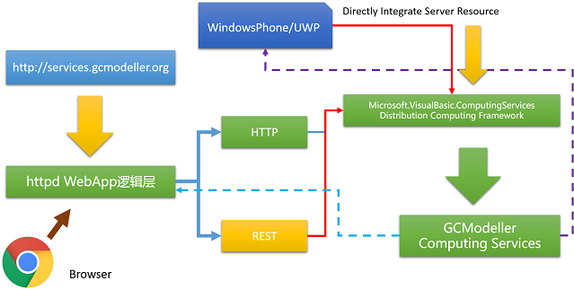
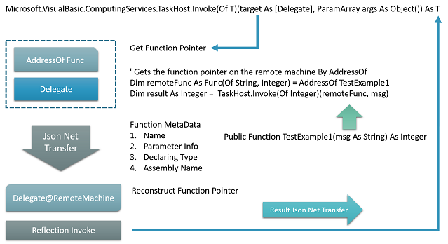
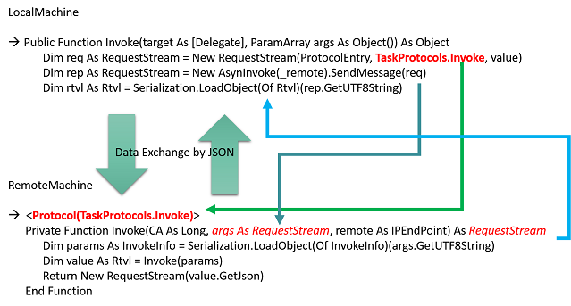
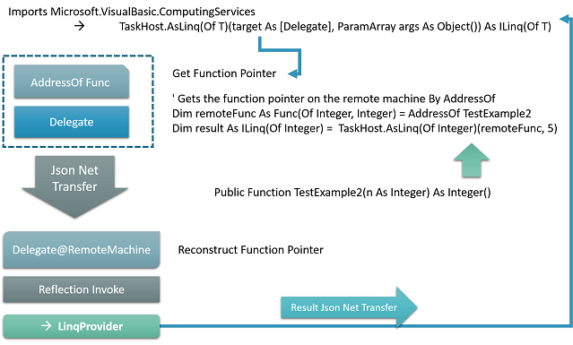
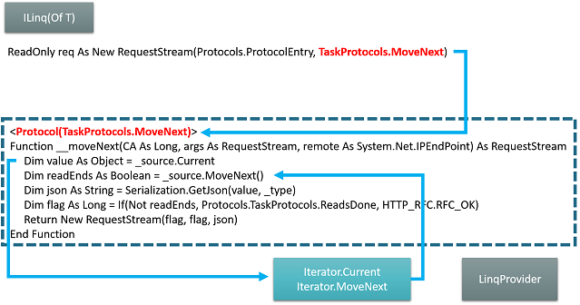
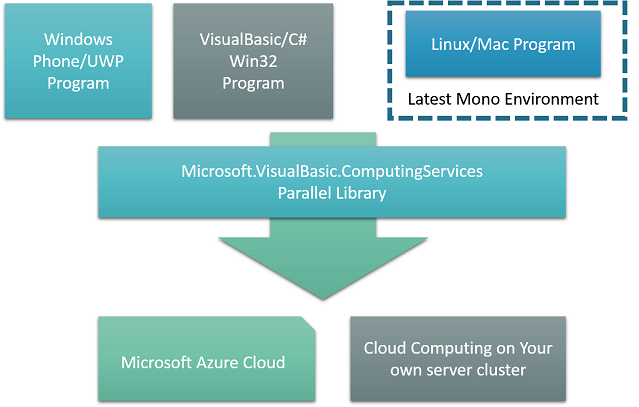

# Easy Distribution Computing in VisualBasic

> + Get latest source code on github:
>    + https://github.com/xieguigang/sciBASIC.ComputingServices
>
> + Required of **sciBASIC#** framework runtime core
>    + https://github.com/xieguigang/sciBASIC
> + Required of **SMRUCC WebCloud** web runtime
>    + https://github.com/SMRUCC/SMRUCC.WebCloud

## Introduction & Background
Recently I was working on two job:

1. The code reconstruct of the online trading system at http://mipaimai.com/ and, 
2. Building the systems biology online annotation system for http://services.gcmodeller.org/ (GCModeller Virtual Cell System).

Both these two project required of a parallel library for the distribution computing framework for processing the large amount of the data.


> Distribution computing in GCModeller online services

> **Note:**
> Each of the http or rest GET/POST request from the browser or PC client, means a task is in queue for invoke the GCModeller data analysis. Due to the reason of most of these computing task is individual to each other, so that a library is required to move these computing task onto the cluster machine in the LAN from the main server to provides a more effective hardware resource utilization and online services quality.

The http server technique of http://services.gcmodeller.org was using my own http server program which was written in VisualBasic and code details was described in previous article: 《Simple HTTP Server in VisualBasic》http://www.codeproject.com/Articles/1068466/Simple-HTTP-Server-in-VisualBasic ,

latest source code of the httpd library can be download from github:

https://github.com/xieguigang/Reference_SharedLib/tree/master/HTTPServer

## Using the code

Sometimes the hardware resource on your own local machine probably is not powerful to running a data analysis program, so that allocate the analysis parts to a more powerful machine is necessary; Or the data analysis task process a lots of small parts, then you can using the distribution computing utilities all of your hardware resource in your local network.


> Clound computing in movie **"The Martian (2015)"**

> **Note:**
> Generally in order to using the remote computing in System.Runtime.Remoting, There are 6 steps to coding by using System.Runtime.Remoting:
>
1. Design your own remote object: RemoteObject.
2. Register your remote object on server by RemotingConfiguration.RegisterWellKnownServiceType as a WellKnownServiceTypeEntry instance object
3. Register your server by TcpServerChannel into ChannelService
4. Register your client TcpClientChannel into ChannelService
5. Gets remote object by Activator from a URL
6. Using the remote object in your client

Probably you would like to write you program like this way, coding the data analysis program just like a local client code, and reused your previous code running in a distribution computing cluster without any modifications:

```vbnet
Module API

    ' This is the code that i've written in the previous project, but running in a local program
    ' and now i want to running this code in the cloud but the function its caller is running on 
    ' a local machine

    Public Function Anlysis(file As FileStream) As dataOut()

        ' Long time data analysis for the large dataset probably size up to 1TB or more
        ' blablabla

    End Function
End Module
```

but as mention at previous, if you needs to running this code on the cloud by using System.Runtime.Remoting, a lot of your client code and even the previous analysis code project will be modified too.

For directly integrated the server cluster hardware resource in my program, a remote computing library was developed. By using Microsoft.VisualBasic.ComputingServices instead of System.Runtime.Remoting, no needs for modified your previous code anymore. Now I can calling this analysis function on the remote machine in this way in my local machine application:

```vbnet
Dim in As FileStream = New FileStream(DbFile)
' Gets the function pointer from your local machine
Dim Analysis As Func(Of FileStream, dataOut()) = AddressOf API.Analysis
' Gets linq source
Dim Result As ILinq(Of dataOut) = remoteMachine.AsLinq(Of dataOut)(Analysis, {in})
' Or just invoke function
Dim Result As dataOut() = remoteMachine.Invoke(Of dataOut())(Analysis, {in})
Dim downstreamAnalysis = (From x in Result Where (blablabla) Select Project(x))

' blablabla
```

Just throw the function pointer to the remote machine and then execute it!

How to using this computing framework? summary into 5 steps:

1. write your data processing program just as usual
2. If a data process step can be decomposing into parts for parallel, then just gets the analysis function delegate pointer, and running the function on the remote server
3. If a data process step can not be processing on local machine, then just gets the analysis function delegate pointer, and then running the function on a more powerful machine.
4. Compile your program and then published (or upload) to the server(Due to the cluster is in a local network, so that a simple powershell script is enough for this upload job to updates all of your machine)
5. Run your server and start analysis job

There are 2 parts of the code in this article to introduce the simply enough distribution computing in VisualBasic:

1. Remote Function Pointer Invoke
2. Remote Linq

First of All, imports the computing services library

```vbnet
Imports Microsoft.VisualBasic.ComputingServices
Imports Microsoft.VisualBasic.ComputingServices.TaskHost
```

### How to invoke a function in VisualBasic?
Reflection parts of the invokes can be reviewed at Shoal language article: http://www.codeproject.com/Articles/820854/Powerful-ShellScript-for-bioinformatics-researcher

Generally the steps of the reflection way to invoke a method in VisualBasic can be summary as:

+ Get function pointer by using AddressOf operator or lambda expression
+ Gets the MethodInfo from the delegate
+ Using MethodInfo.Invoke to invoke the target function.

```vbnet
Public Function CreateObject(func As [Delegate], args As Object()) As InvokeInfo
    Dim type As Type = func.Method.DeclaringType
    Dim assm As Assembly = type.Assembly
    Dim name As String = func.Method.Name
    Dim callsType As Type() = func.Method.GetParameters.ToArray(Function(x) x.ParameterType)
    Dim params As String() = args.ToArray(
        Function(x, idx) Serialization.JsonContract.GetJson(x, callsType(idx)))

    Return New InvokeInfo With {
        .Assembly = FileIO.FileSystem.GetFileInfo(assm.Location).Name,
        .Name = name,
        .Parameters = params,
        .Type = type.FullName
    }
End Function
```

A tool function code for how to parsing these Reflection information from a Delegate function pointer.

For knowing a function location you needs 3 basically requirements:

+ TypeInfo (System.Reflection.Assembly and System.Type)
+ Method Name (MethodInfo.Name)
+ Method Parameters (MethodInfo.GetParameters)

And if the target method have several overloads edition, then the parameter is required for get the corrects edition of your method.

### Remote Function


> Schema diagram of the Microsoft.VisualBasic.ComputingServices Parallel library.

#### Serialization of the Function Pointer

As described how to invoke a function in visualBasic, a function pointer should be serialized in to json string first,  then the program transfer the pointer to the remote server possible. So based on the information in a delegate object can provides, a InvokeInfo object was defined for the remote invocation.

```vbnet
''' <summary>
''' 分布式计算框架之中的远程调用的参数信息
''' </summary>
Public Class InvokeInfo

    ''' <summary>
    ''' 模块文件
    ''' </summary>
    ''' <returns></returns>
    Public Property Assembly As String
    ''' <summary>
    ''' 源
    ''' </summary>
    ''' <returns></returns>
    Public Property Type As String
    ''' <summary>
    ''' 函数名
    ''' </summary>
    ''' <returns></returns>
    Public Property Name As String
    ''' <summary>
    ''' json value.(函数参数)
    ''' </summary>
    ''' <returns></returns>
    Public Property Parameters As String()
End Class
```

#### Invoke on the remote machine

When we gets the information on the server side program, we must restored the delegate function pointer information to the object that Reflection operation can recognized:

```vbnet
''' <summary>
''' A common function of invoke the method on the remote machine
''' </summary>
''' <param name="params">远程主机上面的函数指针</param>
''' <param name="value">value's <see cref="system.type"/></param>
''' <returns></returns>
Private Shared Function __invoke(params As InvokeInfo, ByRef value As Type) As Object
    Dim func As MethodInfo = params.GetMethod
    Dim paramsValue As Object() = InvokeInfo.GetParameters(func, params.Parameters)
    Dim x As Object = func.Invoke(Nothing, paramsValue)

    value = func.ReturnType

    Return x
End Function
```

First, based on the assembly name we load assembly file which we published(or uploaded) on the server

```vbnet
Public Function LoadAssembly() As Assembly
     Dim path As String = App.HOME & "/" & Assembly
     Dim assm As Assembly = System.Reflection.Assembly.LoadFile(path)
     Return assm
End Function
```

Then, we can get the declaring type of the function pointer

```vbnet
Public Overloads Function [GetType]() As Type
     Dim assm As Assembly = LoadAssembly()
     Dim type As Type = assm.GetType(Me.Type)
     Return type
End Function
```

And at last get the function target for the invoke

```vbnet
Public Function GetMethod() As MethodInfo
     Dim type As Type = [GetType]()
     Dim func As MethodInfo = type.GetMethod(Name, BindingFlags.Public Or BindingFlags.Static)
     Return func
End Function
```

Finally we can gets the parameter value for the function by using json deserialization

```vbnet
''' <summary>
'''
''' </summary>
''' <param name="method"></param>
''' <param name="args">json</param>
''' <returns></returns>
Public Shared Function GetParameters(method As MethodInfo, args As String()) As Object()
     Dim params As Type() = method.GetParameters.ToArray(Function(x) x.ParameterType)
     Dim values As Object() = args.ToArray(Function(x, idx) Serialization.LoadObject(x, params(idx)))
     Return values
End Function
```

#### Remote Invoke Protocol

```vbnet
''' <summary>
''' 本地服务器通过这个方法调用远程主机上面的函数
''' </summary>
''' <param name="target"></param>
''' <param name="args"></param>
''' <returns></returns>
Public Function Invoke(target As [Delegate], ParamArray args As Object()) As Object
     Dim params As InvokeInfo = InvokeInfo.CreateObject(target, args)
     Dim value As String = Serialization.GetJson(params)
     Dim req As RequestStream = New RequestStream(ProtocolEntry, TaskProtocols.Invoke, value)
     Dim rep As RequestStream = New AsynInvoke(_remote).SendMessage(req)
     Dim rtvl As Rtvl = Serialization.LoadObject(Of Rtvl)(rep.GetUTF8String)
     Dim obj As Object = rtvl.GetValue(target)
     Return obj
End Function
```


> Net data transfer by protocol handler in the namespace Microsoft.VisualBasic.Net.Protocol

```vbnet
<Protocol(TaskProtocols.Invoke)>
Private Function Invoke(CA As Long, args As RequestStream, remote As System.Net.IPEndPoint) As RequestStream
    Dim params As InvokeInfo = Serialization.LoadObject(Of InvokeInfo)(args.GetUTF8String)
    Dim value As Rtvl = Invoke(params)

    Return New RequestStream(value.GetJson)
End Function

''' <summary>
''' Invoke the function on the remote server.(远程服务器上面通过这个方法执行函数调用)
''' </summary>
''' <param name="params"></param>
''' <returns></returns>
Public Shared Function Invoke(params As InvokeInfo) As Rtvl
    Dim rtvl As Rtvl

    Try
        Dim rtvlType As Type = Nothing
        Dim value As Object = __invoke(params, rtvlType)

        rtvl = New Rtvl(value, rtvlType)

    Catch ex As Exception
        ex = New Exception(params.GetJson, ex)
        rtvl = New Rtvl(ex)

    End Try

    Return rtvl
End Function
```

### Remote Linq

The linq expression is much useful in the VisualBasic programming.



#### Remote source

###### Generic iterator

For implements a LINQ source an iterator is required:

```vbnet
Imports System.Threading
Imports System.Threading.Thread

Namespace ComponentModel.DataSourceModel

    ''' <summary>
    ''' Implements for the IEnumerable(Of T), Supports a simple iteration over a non-generic collection.
    ''' </summary>
    Public Class Iterator : Implements IEnumerator
        Implements IDisposable

        ReadOnly _source As IEnumerable

        Sub New(source As IEnumerable)
            _source = source
            Reset()
        End Sub

        ''' <summary>
        ''' Gets the current element in the collection.
        ''' </summary>
        ''' <returns></returns>
        Public ReadOnly Property Current As Object Implements IEnumerator.Current
        Public ReadOnly Property ReadDone As Boolean

        Dim receiveDone As New ManualResetEvent(False)

        Private Sub __moveNext()
            _ReadDone = False

            ' Single thread safely
            For Each x As Object In _source ' 单线程安全
                _Current = x

                Call receiveDone.WaitOne()
                Call receiveDone.Reset()
            Next

            _ReadDone = True
        End Sub

        ''' <summary>
        ''' Returns current and then automatically move to next position
        ''' </summary>
        ''' <returns></returns>
        Public Function Read() As Object
            Dim x As Object = Current
            Call MoveNext()
            Return x
        End Function

        Dim _forEach As Thread

        ''' <summary>
        ''' Sets the enumerator to its initial position, which is before the first element in the collection.
        ''' </summary>
        Public Sub Reset() Implements IEnumerator.Reset
            If Not _forEach Is Nothing Then  ' 终止这条线程然后再新建
                Call _forEach.Abort()
            End If

            _forEach = New Thread(AddressOf __moveNext)
            _forEach.Start()
        End Sub

        ''' <summary>
        ''' Advances the enumerator to the next element of the collection.
        ''' </summary>
        ''' <returns>
        ''' true if the enumerator was successfully advanced to the next element; false if the enumerator has passed the end of the collection.
        ''' </returns>
        Public Function MoveNext() As Boolean Implements IEnumerator.MoveNext
            Call receiveDone.Set()
            Return Not ReadDone
        End Function
   End Class
End Namespace
```

Due to the reason of the remote linq is usually using for processing the large size data set, so that one element execution may takes time, the single thread move next function in this iterator using the for each statement to gets the element in the remote function.

###### Linq source provider works as a remote iterator



#### Remote Linq Provider

The LinqProvider object work as a remote iterator in this framework, there are two important parts in this class object for implements the IEnumerator interface:

A move next function for gets the current value in the iterator and then move to next location automatically, a Reset function to resets the iterator state in the remote

```vbnet
<Protocol(TaskProtocols.MoveNext)>
Private Function __moveNext(CA As Long, args As RequestStream, remote As System.Net.IPEndPoint) As RequestStream
     Dim value As Object = _source.Current
     Dim readEnds As Boolean = _source.MoveNext()
     Dim json As String = Serialization.GetJson(value, _type)
     Dim flag As Long = If(Not readEnds, Protocols.TaskProtocols.ReadsDone, HTTP_RFC.RFC_OK)
     Return New RequestStream(flag, flag, json)
End Function

<Protocol(TaskProtocols.Reset)>
Private Function __reset(CA As Long, args As RequestStream, remote As System.Net.IPEndPoint) As RequestStream
     Call _source.Reset()
     Return NetResponse.RFC_OK
End Function
```

#### Linq local reader

```vbnet
''' <summary>
''' Remote LINQ source reader
''' </summary>
''' <typeparam name="T"></typeparam>
Public Class ILinq(Of T) : Implements IEnumerable(Of T)
    Implements IDisposable

    ''' <summary>
    ''' Element type in the source collection.
    ''' </summary>
    ''' <returns></returns>
    Public ReadOnly Property Type As Type = GetType(T)
    ''' <summary>
    ''' Remote entry point
    ''' </summary>
    ''' <returns></returns>
    Public ReadOnly Property Portal As IPEndPoint

    ReadOnly invoke As AsynInvoke
    ReadOnly req As New RequestStream(Protocols.ProtocolEntry, TaskProtocols.MoveNext)

    ''' <summary>
    ''' Creates a linq source reader from the remote entry point
    ''' </summary>
    ''' <param name="portal"></param>
    Sub New(portal As IPEndPoint)
        Me.Portal = portal
        Me.invoke = New AsynInvoke(portal)
    End Sub

    Public Overrides Function ToString() As String
        Return $"{Type.FullName}@{Portal.ToString}"
    End Function

#Region "Implements IEnumerable(Of T)"
 
    Public Iterator Function AsQuerable() As IEnumerator(Of T) Implements IEnumerable(Of T).GetEnumerator
        Call invoke.SendMessage(Protocols.LinqReset)  ' resets the remote linq source read position

        Do While True
            Dim rep As RequestStream = invoke.SendMessage(req)
            Dim json As String = rep.GetUTF8String
            Dim value As Object = Serialization.LoadObject(json, Type)
            Dim x As T = DirectCast(value, T)

            If rep.ProtocolCategory = TaskProtocols.ReadsDone Then
                Exit Do
            Else
                Yield x
            End If
        Loop
    End Function

    Private Iterator Function IEnumerable_GetEnumerator() As IEnumerator Implements IEnumerable.GetEnumerator
        Yield AsQuerable()
    End Function

#End Region

    ''' <summary>
    ''' Automatically free the remote resource.(释放远程主机上面的资源)
    ''' </summary>
    Private Sub __free()
        Dim uid As String = Portal.ToString
        Dim req As New RequestStream(ProtocolEntry, TaskProtocols.Free, uid)
        Call invoke.SendMessage(req)
    End Sub
```

### Additional: Network data transfer in VisualBasic

#### Object Json Serialization

###### Object Serialize as Json string

```vbnet
Imports Microsoft.VisualBasic.Serialization

Dim json As String = <Your Object>.GetJson
```

###### Deserialize the json string as .NET object

```vbnet
Dim params As InvokeInfo = 
    Microsoft.VisualBasic.Serialization.LoadObject(Of InvokeInfo)(args.GetUTF8String)
```

An alternative solution of the Json serialization in the .NET programming is NewtonSoft Json library.

#### SendMessage

```vbnet
' Remote machine network portal
Dim remote As IPEndPoint

' Protocol request
Dim req As RequestStream = New RequestStream(ProtocolEntry, TaskProtocols.Invoke, ProtocolParameter)

' Send Protocol to invoke on the remote machine
Dim rep As RequestStream = New AsynInvoke(remote).SendMessage(req)

' Gets the remote returns json value
Dim rtvl As Rtvl = Serialization.LoadObject(Of Rtvl)(rep.GetUTF8String)
```

#### Protocol Handler

On the remote server machine

```vbnet
Imports Microsoft.VisualBasic.Net
Imports Microsoft.VisualBasic.Net.Protocol
Imports Microsoft.VisualBasic.Net.Protocol.Reflection

Dim Responsehandler = AddressOf New ProtocolHandler(Me).HandleRequest
```

The Microsoft.VisualBasic.Net.Protocol.Reflection.Protocol attribute is required of building a protocols flexible and high performance multiple threading server side program.

#### Services Socket

```vbnet
Dim Server As New TcpSynchronizationServicesSocket(listenPort)

' Binding the protocol to your server socket
Server.Responsehandler = AddressOf New ProtocolHandler(Me).HandleRequest

' Then the current thread will be bloked at Server.Run statement
' until the socket is disposed at other place
Call Server.Run

' Or using the thread to run the socket
Call Microsoft.VisualBasic.Parallel.Run(AddressOf Server.Run)
```

## Points of Interest

#### Build Your Own Cloud Computing platform



Base on the Parallel library in this article, then you can try build your own cloud computing platform like Microsoft Azure, you can programming to fully access the remote server resource just like running on the local machine.

One example of the mobile cloud computing is the Microsoft bioinformatics scientific project .NET Bio(Previous used name on codeplex is Microsoft Bioinformatics Foundation, MBF), a mobile library was developed that the developer can integrated their WindowsPhone/Android/IOS App with the NCBI cloud computing BLAST services to analysis the biological sequence data size up to 10GB or 100GB.

By using the cloud computing, this can integrated your server machine resource into the Windows Phone or UWP program directly, then this makes using your Windows Phone processing very large data set possible.