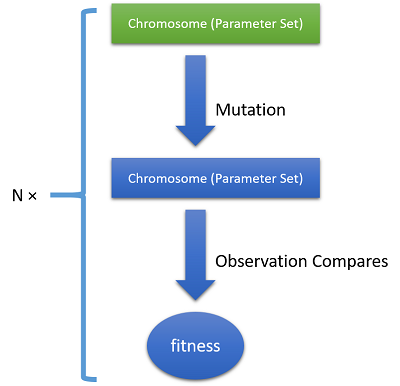

## Distribute Computing Demo: Genetics Algorithm

### The speed limitation step in GA estimates

One of the speed limitation step in GA eastimates is the fitness sorts for selects the best population that can evolved. For calculate the fitness of a parameter set, ODEs will be computed and the Euclidean distance will be calculated between the estimates function and observation data. This calculation operation will takes a long time to run if the data resolution is very high and population is very large.

For a GA estimation that running on a single machine, the only way to boost this operation is using parallel linq, but a single machine is too power limited, so that a server cluster will required for solving this large scale data analysis problem. For solving a system parameter estimates problem using GA, in a server cluster, then we needs distribute computing. 

For running GA on a single machine, makes it run on a server cluster, we just needs devide its population into sevral parts, and then push the fitness calculation task onto each single machine in our server cluster, then we can makes this GA analysis running in distribute method.


> A basic calculation in GA

### Distribute Linq &amp; Parallel Linq

Here is a example of Parallel Linq:
```vbnet
Dim LQuery = From x As <type> In source.AsParallel Select <.ctor>
```

And here is a example of Distribute Linq, its usage is very similar to parallel linq:
```vbnet
Dim LQuery = From x As <type2> In source.AsDistribute(task) Select <.ctor>
```

##### How it works?


### Using Distribute Linq in GA

### VirtualBox demo

### Config Server
This demo was running on a latest Ubuntu server, after complete the installation of the Ubuntu server, then you should install the mono first by using:

```bash
sudo apt-get install mono-complete
```

And then deploy the server side runtime of this distribute environment just by upload the program to a directory and then start by command
```bash
mono ./dlinq.d /start
```

Here I using the virtual machine clone in the VirtualBox to simulate a local server cluster for this demo test:

Running the demo in host,

```bash
./dga_demo
```
