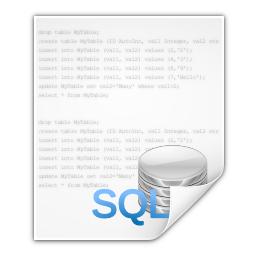

# VisualBasic.DBI
Database interface wrapper for VisualBasic

This project includes:

+ a mysql data mapping tools and a cli tools for convert the sql table into the VisualBasic class source code.
+ a sqlite data mapping tools

##### Runtime

Require of VisualBasic server CLI runtime

> PM> Install-Package sciBASIC

Or reference to source code project:

> https://github.com/xieguigang/sciBASIC

### ORM

1. Generates source code for VisualBasic
2. Generates source code for PHP